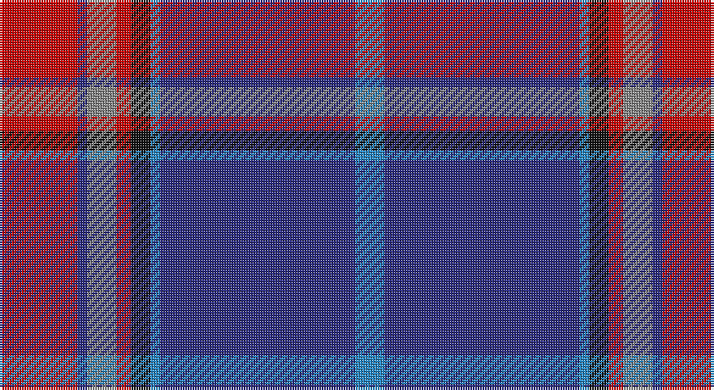

This page is one **sett** — a single exact thread-count. It belongs to the [tartan](/setts/r16db2o6r3k4t2db40t6/)
(the same proportion at any scale), whose colour order is pattern [BBBKRRBR](/stripes/bbbkrrbr/).

Part of the [St. Leonards](/tartans/st-leonards/) tartan — the named design grouping this sett with its other cloths.

Sourced from tartans-authority.  It is a [8 stripe tartan](/stripes/stripes8/).

Original link http://www.tartansauthority.com/tartan-ferret/display/4075/

## Register references

External register numbers recorded for this tartan.

- Scottish Tartans Authority (ITI): 4075

## Thread count
R/32 DB4 N12 R6 K8 B4 DB80 B/12

One full sett is **272 threads**.

## Palette

Palette: <strong>Tartan Register</strong>
<table><thead><tr><th>Colour</th><th>Threads</th><th>Shade</th><th>Base</th><th>OKLCh</th></tr></thead><tbody><tr><td>R/</td><td style="text-align:right;font-variant-numeric:tabular-nums">32</td><td><code style="background-color:#C80000;">#C80000</code> <small style="color:#888">#C80000</small></td><td>R <code style="background-color:#CC0000;">#CC0000</code></td><td><small style="color:#888">oklch(52.3% 0.215 29.2)</small></td></tr><tr><td>DB</td><td style="text-align:right;font-variant-numeric:tabular-nums">4</td><td><code style="background-color:#2C2C80;">#2C2C80</code> <small style="color:#888">#2C2C80</small></td><td>B <code style="background-color:#2A418A;">#2A418A</code></td><td><small style="color:#888">oklch(35.0% 0.138 276.6)</small></td></tr><tr><td>N</td><td style="text-align:right;font-variant-numeric:tabular-nums">12</td><td><code style="background-color:#888888;">#888888</code> <small style="color:#888">#888888</small></td><td>R <code style="background-color:#CC0000;">#CC0000</code></td><td><small style="color:#888">oklch(62.7% 0.000 89.9)</small></td></tr><tr><td>R</td><td style="text-align:right;font-variant-numeric:tabular-nums">6</td><td><code style="background-color:#C80000;">#C80000</code> <small style="color:#888">#C80000</small></td><td>R <code style="background-color:#CC0000;">#CC0000</code></td><td><small style="color:#888">oklch(52.3% 0.215 29.2)</small></td></tr><tr><td>K</td><td style="text-align:right;font-variant-numeric:tabular-nums">8</td><td><code style="background-color:#101010;">#101010</code> <small style="color:#888">#101010</small></td><td>K <code style="background-color:#000000;">#000000</code></td><td><small style="color:#888">oklch(17.3% 0.000 89.9)</small></td></tr><tr><td>B</td><td style="text-align:right;font-variant-numeric:tabular-nums">4</td><td><code style="background-color:#2888C4;">#2888C4</code> <small style="color:#888">#2888C4</small></td><td>B <code style="background-color:#2A418A;">#2A418A</code></td><td><small style="color:#888">oklch(60.1% 0.125 241.5)</small></td></tr><tr><td>DB</td><td style="text-align:right;font-variant-numeric:tabular-nums">80</td><td><code style="background-color:#2C2C80;">#2C2C80</code> <small style="color:#888">#2C2C80</small></td><td>B <code style="background-color:#2A418A;">#2A418A</code></td><td><small style="color:#888">oklch(35.0% 0.138 276.6)</small></td></tr><tr><td>B/</td><td style="text-align:right;font-variant-numeric:tabular-nums">12</td><td><code style="background-color:#2888C4;">#2888C4</code> <small style="color:#888">#2888C4</small></td><td>B <code style="background-color:#2A418A;">#2A418A</code></td><td><small style="color:#888">oklch(60.1% 0.125 241.5)</small></td></tr></tbody></table>

# Sample pattern

## Compared to the master

This cloth is one sett of its design; the master sett (the exemplar the design is anchored on) is below for comparison.

<figure style="margin:0"><figcaption style="color:#888;font-size:smaller">this sett</figcaption></figure>
<figure style="margin:0"><figcaption style="color:#888;font-size:smaller"><a href="/setts/db40t2k4r3o6db2r16db2o6r3k4t2db40t6/">master sett →</a></figcaption></figure>

## Nearest tartans

The nearest existing variants by ΔTartan distance, with this tartan at the top so the swatches line up against it.

ΔTartan

Tartan

Sett

—

<a href="/ttd/edit/#slug=r16db2o6r3k4t2db40t6~x2">St. Leonards (Corporate)</a> <a class="nn-out" href="/variants/s8/r16db2o6r3k4t2db40t6~x2/" title="open its dictionary page">↗</a>

0.84

<a href="/ttd/edit/#slug=w4dp40g2dp2g2dp2g2dp3g16db15m3~x2&amp;base=r16db2o6r3k4t2db40t6~x2">Solway Spirit (District)</a> <a class="nn-out" href="/variants/s11/w4dp40g2dp2g2dp2g2dp3g16db15m3~x2/" title="open its dictionary page">↗</a>

1.09

<a href="/ttd/edit/#slug=db1lo1db13loi3y3loi3r1loi1~x4&amp;base=r16db2o6r3k4t2db40t6~x2">Glen Moray</a> <a class="nn-out" href="/variants/s8/db1lo1db13loi3y3loi3r1loi1~x4/" title="open its dictionary page">↗</a>

1.12

<a href="/ttd/edit/#slug=lb12dg16k12dg24dp75lo4&amp;base=r16db2o6r3k4t2db40t6~x2">Widows Sons Scotland Dress</a> <a class="nn-out" href="/variants/s6/lb12dg16k12dg24dp75lo4/" title="open its dictionary page">↗</a>

1.20

<a href="/ttd/edit/#slug=r30db5r3db33g8k3db8w2~x2&amp;base=r16db2o6r3k4t2db40t6~x2">St. Margaret Youth Group (Corporate)</a> <a class="nn-out" href="/variants/s8/r30db5r3db33g8k3db8w2~x2/" title="open its dictionary page">↗</a>

1.23

<a href="/ttd/edit/#slug=w2r3dbi12db3dbi3db28r3db3ly2~x2&amp;base=r16db2o6r3k4t2db40t6~x2">Royal Scottish Corporation</a> <a class="nn-out" href="/variants/s9/w2r3dbi12db3dbi3db28r3db3ly2~x2/" title="open its dictionary page">↗</a>

1.27

<a href="/ttd/edit/#slug=m5ly2m35g6m2g6db38w4~x2&amp;base=r16db2o6r3k4t2db40t6~x2">Scotland 2000</a> <a class="nn-out" href="/variants/s8/m5ly2m35g6m2g6db38w4~x2/" title="open its dictionary page">↗</a>

1.29

<a href="/ttd/edit/#slug=lb12g12k12g24dp75ly4&amp;base=r16db2o6r3k4t2db40t6~x2">Widows Sons Scotland Dress</a> <a class="nn-out" href="/variants/s6/lb12g12k12g24dp75ly4/" title="open its dictionary page">↗</a>

1.30

<a href="/ttd/edit/#slug=dg4t2db18r2k4r6t1w1~x4&amp;base=r16db2o6r3k4t2db40t6~x2">Glenn</a> <a class="nn-out" href="/variants/s8/dg4t2db18r2k4r6t1w1~x4/" title="open its dictionary page">↗</a>

1.31

<a href="/ttd/edit/#slug=db37w2db2ly2r17w2db2g17ly2db2~x2&amp;base=r16db2o6r3k4t2db40t6~x2">MDF (Personal)</a> <a class="nn-out" href="/variants/s10/db37w2db2ly2r17w2db2g17ly2db2~x2/" title="open its dictionary page">↗</a>

1.31

<a href="/ttd/edit/#slug=lb9k16dg10k22dp67lo4&amp;base=r16db2o6r3k4t2db40t6~x2">Widows Sons Scotland (MRA)</a> <a class="nn-out" href="/variants/s6/lb9k16dg10k22dp67lo4/" title="open its dictionary page">↗</a>

## Neighbour map

Every grey dot is one of 14360 variants placed by the first two principal components of the ΔTartan feature space (44% of its variance). Red is this tartan; blue dots are its nearest — click one to open its page.

<svg viewBox="0 0 640 380" role="img" style="max-width:100%;height:auto;border:1px solid #e0e0e0;border-radius:4px;display:block" xmlns="http://www.w3.org/2000/svg"><image href="/nn/cloud.v1.png" width="640" height="380"/><a href="/variants/s11/w4dp40g2dp2g2dp2g2dp3g16db15m3~x2/"><circle cx="308.5" cy="117.6" r="4" fill="#3465a4"><title>Solway Spirit (District)</title></circle></a><a href="/variants/s8/db1lo1db13loi3y3loi3r1loi1~x4/"><circle cx="306.1" cy="157.9" r="4" fill="#3465a4"><title>Glen Moray</title></circle></a><a href="/variants/s6/lb12dg16k12dg24dp75lo4/"><circle cx="291.7" cy="162.4" r="4" fill="#3465a4"><title>Widows Sons Scotland Dress</title></circle></a><a href="/variants/s8/r30db5r3db33g8k3db8w2~x2/"><circle cx="321.4" cy="171.0" r="4" fill="#3465a4"><title>St. Margaret Youth Group (Corporate)</title></circle></a><a href="/variants/s9/w2r3dbi12db3dbi3db28r3db3ly2~x2/"><circle cx="341.2" cy="156.7" r="4" fill="#3465a4"><title>Royal Scottish Corporation</title></circle></a><a href="/variants/s8/m5ly2m35g6m2g6db38w4~x2/"><circle cx="286.9" cy="148.9" r="4" fill="#3465a4"><title>Scotland 2000</title></circle></a><a href="/variants/s6/lb12g12k12g24dp75ly4/"><circle cx="297.8" cy="150.4" r="4" fill="#3465a4"><title>Widows Sons Scotland Dress</title></circle></a><a href="/variants/s8/dg4t2db18r2k4r6t1w1~x4/"><circle cx="237.0" cy="128.4" r="4" fill="#3465a4"><title>Glenn</title></circle></a><a href="/variants/s10/db37w2db2ly2r17w2db2g17ly2db2~x2/"><circle cx="275.4" cy="114.6" r="4" fill="#3465a4"><title>MDF (Personal)</title></circle></a><a href="/variants/s6/lb9k16dg10k22dp67lo4/"><circle cx="292.1" cy="166.9" r="4" fill="#3465a4"><title>Widows Sons Scotland (MRA)</title></circle></a><circle cx="318.2" cy="137.0" r="5" fill="#c00000"/></svg>

ID: /variants/s8/r16db2o6r3k4t2db40t6~x2/
