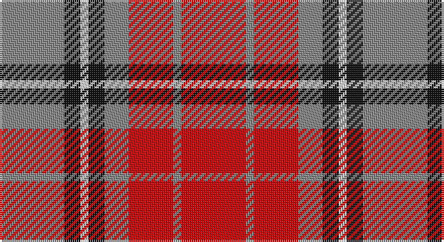

This page is one **sett** — a single exact thread-count. It belongs to the [tartan](/setts/r16o2r11o6k4w2k4o16/)
(the same proportion at any scale), whose colour order is pattern [RKWKRRRR](/stripes/rkwkrrrr/).

Sourced from house-of-tartan.  It is a [8 stripe tartan](/stripes/stripes8/).

Original link http://www.house-of-tartan.scotland.net/house/TartanViewjs.asp?colr=Def&tnam=1291

## Provenance

Earliest known date: 1986 The Falkirk Tartan. An ornamental twill weave check of natural light and dark wool was discovered at Falkirk in the neck of a jar containing Roman coins. The find is thought to have been buried about 260 A.D. The black and white check is woven today as the Shepherd tartan.

## Thread count
N/32 K8 LN4 K8 N12 R22 N4 R/32

One full sett is **180 threads**.

## Palette

Palette: <strong>Tartan Register</strong>
<table><thead><tr><th>Colour</th><th>Threads</th><th>Shade</th><th>Base</th><th>OKLCh</th></tr></thead><tbody><tr><td>N/</td><td style="text-align:right;font-variant-numeric:tabular-nums">32</td><td><code style="background-color:#888888;">#888888</code> <small style="color:#888">#888888</small></td><td>R <code style="background-color:#CC0000;">#CC0000</code></td><td><small style="color:#888">oklch(62.7% 0.000 89.9)</small></td></tr><tr><td>K</td><td style="text-align:right;font-variant-numeric:tabular-nums">8</td><td><code style="background-color:#101010;">#101010</code> <small style="color:#888">#101010</small></td><td>K <code style="background-color:#000000;">#000000</code></td><td><small style="color:#888">oklch(17.3% 0.000 89.9)</small></td></tr><tr><td>LN</td><td style="text-align:right;font-variant-numeric:tabular-nums">4</td><td><code style="background-color:#E0E0E0;">#E0E0E0</code> <small style="color:#888">#E0E0E0</small></td><td>W <code style="background-color:#F7F7F7;">#F7F7F7</code></td><td><small style="color:#888">oklch(90.7% 0.000 89.9)</small></td></tr><tr><td>K</td><td style="text-align:right;font-variant-numeric:tabular-nums">8</td><td><code style="background-color:#101010;">#101010</code> <small style="color:#888">#101010</small></td><td>K <code style="background-color:#000000;">#000000</code></td><td><small style="color:#888">oklch(17.3% 0.000 89.9)</small></td></tr><tr><td>N</td><td style="text-align:right;font-variant-numeric:tabular-nums">12</td><td><code style="background-color:#888888;">#888888</code> <small style="color:#888">#888888</small></td><td>R <code style="background-color:#CC0000;">#CC0000</code></td><td><small style="color:#888">oklch(62.7% 0.000 89.9)</small></td></tr><tr><td>R</td><td style="text-align:right;font-variant-numeric:tabular-nums">22</td><td><code style="background-color:#C80000;">#C80000</code> <small style="color:#888">#C80000</small></td><td>R <code style="background-color:#CC0000;">#CC0000</code></td><td><small style="color:#888">oklch(52.3% 0.215 29.2)</small></td></tr><tr><td>N</td><td style="text-align:right;font-variant-numeric:tabular-nums">4</td><td><code style="background-color:#888888;">#888888</code> <small style="color:#888">#888888</small></td><td>R <code style="background-color:#CC0000;">#CC0000</code></td><td><small style="color:#888">oklch(62.7% 0.000 89.9)</small></td></tr><tr><td>R/</td><td style="text-align:right;font-variant-numeric:tabular-nums">32</td><td><code style="background-color:#C80000;">#C80000</code> <small style="color:#888">#C80000</small></td><td>R <code style="background-color:#CC0000;">#CC0000</code></td><td><small style="color:#888">oklch(52.3% 0.215 29.2)</small></td></tr></tbody></table>

# Sample pattern

## Nearest tartans

The nearest existing variants by ΔTartan distance, with this tartan at the top so the swatches line up against it.

ΔTartan

Tartan

Sett

—

<a href="/ttd/edit/#slug=r16o2r11o6k4w2k4o16~x2">Sidney (Nova Scotia) Canadian Tartan</a> <a class="nn-out" href="/variants/s8/r16o2r11o6k4w2k4o16~x2/" title="open its dictionary page">↗</a>

0.73

<a href="/ttd/edit/#slug=oi6ly3oi20o20oi3o3lb6~x2&amp;base=r16o2r11o6k4w2k4o16~x2">Banff</a> <a class="nn-out" href="/variants/s7/oi6ly3oi20o20oi3o3lb6~x2/" title="open its dictionary page">↗</a>

0.76

<a href="/ttd/edit/#slug=dp2r4g12r3dp6r10w2~x2&amp;base=r16o2r11o6k4w2k4o16~x2">MacKintosh-Geddes (Personal?)</a> <a class="nn-out" href="/variants/s7/dp2r4g12r3dp6r10w2~x2/" title="open its dictionary page">↗</a>

0.85

<a href="/ttd/edit/#slug=y28k3r22k8w3k8r22k3y28k3~x2&amp;base=r16o2r11o6k4w2k4o16~x2">Henkel</a> <a class="nn-out" href="/variants/s10/y28k3r22k8w3k8r22k3y28k3~x2/" title="open its dictionary page">↗</a>

0.91

<a href="/ttd/edit/#slug=o16oi2o11oi6k4w2k4oi16~x2&amp;base=r16o2r11o6k4w2k4o16~x2">Sydney (Nova Scotia) (District)</a> <a class="nn-out" href="/variants/s8/o16oi2o11oi6k4w2k4oi16~x2/" title="open its dictionary page">↗</a>

0.93

<a href="/ttd/edit/#slug=dy11db1dy11w10db1r11db1r11~x2&amp;base=r16o2r11o6k4w2k4o16~x2">St. Andrews (Queens University) (Cor</a> <a class="nn-out" href="/variants/s8/dy11db1dy11w10db1r11db1r11~x2/" title="open its dictionary page">↗</a>

0.95

<a href="/ttd/edit/#slug=r11db1r11db1w10o11db1o11~x2&amp;base=r16o2r11o6k4w2k4o16~x2">St Andrews</a> <a class="nn-out" href="/variants/s8/r11db1r11db1w10o11db1o11~x2/" title="open its dictionary page">↗</a>

0.99

<a href="/ttd/edit/#slug=g3r9t1g9r1g1r9db9r1~x4&amp;base=r16o2r11o6k4w2k4o16~x2">Convention of the Baronage (Corp)</a> <a class="nn-out" href="/variants/s9/g3r9t1g9r1g1r9db9r1~x4/" title="open its dictionary page">↗</a>

1.02

<a href="/ttd/edit/#slug=k2r12db6r3dg12r4db1~x2&amp;base=r16o2r11o6k4w2k4o16~x2">MacBean/MacElvain</a> <a class="nn-out" href="/variants/s7/k2r12db6r3dg12r4db1~x2/" title="open its dictionary page">↗</a>

1.04

<a href="/ttd/edit/#slug=o72dr30o18lr62y10dr7lr32&amp;base=r16o2r11o6k4w2k4o16~x2">Manhattan Ethnic</a> <a class="nn-out" href="/variants/s7/o72dr30o18lr62y10dr7lr32/" title="open its dictionary page">↗</a>

1.08

<a href="/ttd/edit/#slug=y3dr18y4dr3y4r13y3y18dr2lo3~x2&amp;base=r16o2r11o6k4w2k4o16~x2">Leitrim</a> <a class="nn-out" href="/variants/s10/y3dr18y4dr3y4r13y3y18dr2lo3~x2/" title="open its dictionary page">↗</a>

## Neighbour map

Every grey dot is one of 14360 variants placed by the first two principal components of the ΔTartan feature space (44% of its variance). Red is this tartan; blue dots are its nearest — click one to open its page.

<svg viewBox="0 0 640 380" role="img" style="max-width:100%;height:auto;border:1px solid #e0e0e0;border-radius:4px;display:block" xmlns="http://www.w3.org/2000/svg"><image href="/nn/cloud.v1.png" width="640" height="380"/><a href="/variants/s7/oi6ly3oi20o20oi3o3lb6~x2/"><circle cx="247.2" cy="200.1" r="4" fill="#3465a4"><title>Banff</title></circle></a><a href="/variants/s7/dp2r4g12r3dp6r10w2~x2/"><circle cx="200.6" cy="223.5" r="4" fill="#3465a4"><title>MacKintosh-Geddes (Personal?)</title></circle></a><a href="/variants/s10/y28k3r22k8w3k8r22k3y28k3~x2/"><circle cx="225.6" cy="181.5" r="4" fill="#3465a4"><title>Henkel</title></circle></a><a href="/variants/s8/o16oi2o11oi6k4w2k4oi16~x2/"><circle cx="243.6" cy="214.0" r="4" fill="#3465a4"><title>Sydney (Nova Scotia) (District)</title></circle></a><a href="/variants/s8/dy11db1dy11w10db1r11db1r11~x2/"><circle cx="199.7" cy="191.1" r="4" fill="#3465a4"><title>St. Andrews (Queens University) (Cor</title></circle></a><a href="/variants/s8/r11db1r11db1w10o11db1o11~x2/"><circle cx="216.9" cy="199.0" r="4" fill="#3465a4"><title>St Andrews</title></circle></a><a href="/variants/s9/g3r9t1g9r1g1r9db9r1~x4/"><circle cx="251.2" cy="198.0" r="4" fill="#3465a4"><title>Convention of the Baronage (Corp)</title></circle></a><a href="/variants/s7/k2r12db6r3dg12r4db1~x2/"><circle cx="259.2" cy="199.0" r="4" fill="#3465a4"><title>MacBean/MacElvain</title></circle></a><a href="/variants/s7/o72dr30o18lr62y10dr7lr32/"><circle cx="226.3" cy="204.7" r="4" fill="#3465a4"><title>Manhattan Ethnic</title></circle></a><a href="/variants/s10/y3dr18y4dr3y4r13y3y18dr2lo3~x2/"><circle cx="247.1" cy="186.3" r="4" fill="#3465a4"><title>Leitrim</title></circle></a><circle cx="235.6" cy="203.4" r="5" fill="#c00000"/></svg>

ID: /variants/s8/r16o2r11o6k4w2k4o16~x2/
