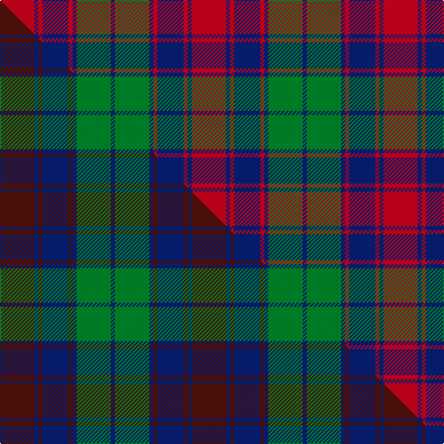

This page is one **sett** — a single exact thread-count. It belongs to the [tartan](/setts/r17db2r2db13r2db2g17db2/)
(the same proportion at any scale), whose colour order is pattern [BGBRBRBR](/stripes/bgbrbrbr/).

Part of the [Red Remony](/tartans/red-remony/) tartan — the named design grouping this sett with its other cloths.

Sourced from weddslist.  It is a [8 stripe tartan](/stripes/stripes8/).

Original link http://www.weddslist.com/cgi-bin/tartans/pg.pl?source=sts

## Provenance

Earliest known date: 1971 Red Remony

2 attestations — the source records this cloth was collapsed from (oldest owns this page)

<ul>
<li>undated — Red Remony (weddslist, <a href="http://www.weddslist.com/cgi-bin/tartans/pg.pl?source=sts">record</a>) </li>
<li>undated — Red Remony Trade Tartan (house-of-tartan, <a href="http://www.house-of-tartan.scotland.net/house/TartanViewjs.asp?colr=Def&tnam=2235">record</a>) </li>
</ul>

## Thread count
R/34 DB4 R4 DB26 R4 DB4 G34 DB/4

One full sett is **190 threads**.

## Palette
<table><thead><tr><th>Colour</th><th>Shade</th><th>OKLCh</th></tr></thead><tbody><tr><td>DB</td><td><code style="background-color:#082077;">#082077</code> <small style="color:#888">#082077</small></td><td><small style="color:#888">oklch(30.0% 0.149 265.1)</small></td></tr><tr><td>G</td><td><code style="background-color:#008B2A;">#008B2A</code> <small style="color:#888">#008B2A</small></td><td><small style="color:#888">oklch(55.4% 0.170 145.9)</small></td></tr><tr><td>R</td><td><code style="background-color:#D60020;">#D60020</code> <small style="color:#888">#D60020</small></td><td><small style="color:#888">oklch(55.2% 0.224 25.5)</small></td></tr></tbody></table>

# Sample pattern

## Compared to the master

This cloth is one sett of its design; the master sett (the exemplar the design is anchored on) is below for comparison.

Its **ΔTartan distance** from the master is **0.16** — the same measure the nearest-tartans table ranks by (0 is identical; a re-scale of the same cloth is near 0, a recolour or a different proportion further).

<figure class="master-compare" style="margin:0">

this sett
master sett ★

<figcaption style="color:#888;font-size:smaller">One weave of this sett against the <a href="/setts/dr17db2dr2db13dr2db2g17db2/">master sett ★</a>, split on the diagonal: a shared proportion runs seamlessly across it with only the shades shifting; a different proportion breaks on it.</figcaption>
</figure>

## Nearest tartan variants

The nearest existing variants by ΔTartan distance, with this cloth at the top so the swatches line up against it.

ΔTartan

Threads

Variant

Sett

—

190

<a href="/variants/s8/r17db2r2db13r2db2g17db2~x2/">Red Remony</a>

<a href="/ttd/edit/#slug=db3dbi1g5db3r9db1r1db2~x4~db0906265-dbi1208266&amp;base=r17db2r2db13r2db2g17db2~x2" title="compare in the TTD">1.74</a>

180

<a href="/variants/s8/db3dbi1g5db3r9db1r1db2~x4~db0906265-dbi1208266/">Unidentified #61</a>

<a href="/ttd/edit/#slug=r3db1r1db11g10r2db2~x4&amp;base=r17db2r2db13r2db2g17db2~x2" title="compare in the TTD">1.82</a>

220

<a href="/variants/s7/r3db1r1db11g10r2db2~x4/">Robertson of Struan 1816</a>

<a href="/ttd/edit/#slug=db3g26db3r3db20r3db3r26g5w3~x2&amp;base=r17db2r2db13r2db2g17db2~x2" title="compare in the TTD">1.92</a>

368

<a href="/variants/s10/db3g26db3r3db20r3db3r26g5w3~x2/">Roxburgh Red</a>

<a href="/ttd/edit/#slug=db3dg26db3r3db20r3db3r26dg5w3~x2&amp;base=r17db2r2db13r2db2g17db2~x2" title="compare in the TTD">1.92</a>

368

<a href="/variants/s10/db3dg26db3r3db20r3db3r26dg5w3~x2/">Roxburgh, Red</a>

<a href="/ttd/edit/#slug=g18db3g3db3g2db8r23db2r4g2~x2&amp;base=r17db2r2db13r2db2g17db2~x2" title="compare in the TTD">2.11</a>

232

<a href="/variants/s10/g18db3g3db3g2db8r23db2r4g2~x2/">McGlynn</a>

<a href="/ttd/edit/#slug=db20r2db2r2g19r18g2r18g19db19r2db2~x2&amp;base=r17db2r2db13r2db2g17db2~x2" title="compare in the TTD">2.18</a>

456

<a href="/variants/s12/db20r2db2r2g19r18g2r18g19db19r2db2~x2/">Fraser of Stratherrick</a>

<a href="/ttd/edit/#slug=db28r3db3r3g20r30g4r30g20db22r3db3~x2&amp;base=r17db2r2db13r2db2g17db2~x2" title="compare in the TTD">2.29</a>

614

<a href="/variants/s12/db28r3db3r3g20r30g4r30g20db22r3db3~x2/">Fraser Stewart of Athol</a>

<a href="/ttd/edit/#slug=dg24db3dg3db3dg3db9r24dg3r4~x2&amp;base=r17db2r2db13r2db2g17db2~x2" title="compare in the TTD">2.39</a>

248

<a href="/variants/s9/dg24db3dg3db3dg3db9r24dg3r4~x2/">Lindsay (Chisholm Red)</a>

<a href="/ttd/edit/#slug=db9r3db1r3g9r3db1~x2&amp;base=r17db2r2db13r2db2g17db2~x2" title="compare in the TTD">2.41</a>

96

<a href="/variants/s7/db9r3db1r3g9r3db1~x2/">Skene</a>

<a href="/ttd/edit/#slug=dp3r14g2dp10r2g14dp3~x2&amp;base=r17db2r2db13r2db2g17db2~x2" title="compare in the TTD">2.45</a>

180

<a href="/variants/s7/dp3r14g2dp10r2g14dp3~x2/">Scottish Netball (1986) (Corporate)</a>

## Neighbour map

Every grey dot is one of 13620 variants placed by the first two principal components of the ΔTartan feature space (42% of its variance). Red is this tartan; blue dots are its nearest — click one to open its page.

<svg viewBox="0 0 640 380" role="img" style="max-width:100%;height:auto;border:1px solid #e0e0e0;border-radius:4px;display:block" xmlns="http://www.w3.org/2000/svg"><image href="/nn/cloud.v1.png" width="640" height="380"/><a href="/variants/s8/db3dbi1g5db3r9db1r1db2~x4~db0906265-dbi1208266/"><circle cx="210.4" cy="202.2" r="4" fill="#3465a4"><title>Unidentified #61</title></circle></a><a href="/variants/s7/r3db1r1db11g10r2db2~x4/"><circle cx="283.7" cy="211.8" r="4" fill="#3465a4"><title>Robertson of Struan 1816</title></circle></a><a href="/variants/s10/db3g26db3r3db20r3db3r26g5w3~x2/"><circle cx="193.5" cy="185.7" r="4" fill="#3465a4"><title>Roxburgh Red</title></circle></a><a href="/variants/s10/db3dg26db3r3db20r3db3r26dg5w3~x2/"><circle cx="205.6" cy="186.3" r="4" fill="#3465a4"><title>Roxburgh, Red</title></circle></a><a href="/variants/s10/g18db3g3db3g2db8r23db2r4g2~x2/"><circle cx="259.6" cy="186.3" r="4" fill="#3465a4"><title>McGlynn</title></circle></a><a href="/variants/s12/db20r2db2r2g19r18g2r18g19db19r2db2~x2/"><circle cx="210.9" cy="203.5" r="4" fill="#3465a4"><title>Fraser of Stratherrick</title></circle></a><a href="/variants/s12/db28r3db3r3g20r30g4r30g20db22r3db3~x2/"><circle cx="235.2" cy="199.9" r="4" fill="#3465a4"><title>Fraser Stewart of Athol</title></circle></a><a href="/variants/s9/dg24db3dg3db3dg3db9r24dg3r4~x2/"><circle cx="281.7" cy="208.2" r="4" fill="#3465a4"><title>Lindsay (Chisholm Red)</title></circle></a><a href="/variants/s7/db9r3db1r3g9r3db1~x2/"><circle cx="228.3" cy="231.4" r="4" fill="#3465a4"><title>Skene</title></circle></a><a href="/variants/s7/dp3r14g2dp10r2g14dp3~x2/"><circle cx="221.5" cy="243.5" r="4" fill="#3465a4"><title>Scottish Netball (1986) (Corporate)</title></circle></a><circle cx="236.4" cy="214.9" r="5" fill="#c00000"/><text x="320" y="376" text-anchor="middle" font-size="11" fill="#999">ground</text><text x="11" y="190" text-anchor="middle" font-size="11" fill="#999" transform="rotate(-90 11 190)">complexity</text></svg>

ID: /variants/s8/r17db2r2db13r2db2g17db2~x2/
