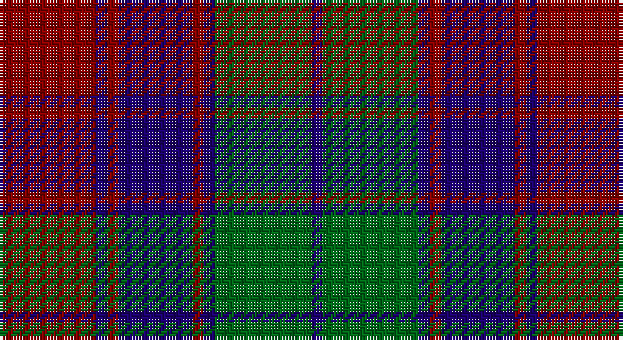

This page is one **sett** — a single exact thread-count. It belongs to the [tartan](/setts/r17db2r2db13r2db2g17db2/)
(the same proportion at any scale), whose colour order is pattern [BGBRBRBR](/stripes/bgbrbrbr/).

Sourced from register-of-tartans.  It is a [8 stripe tartan](/stripes/stripes8/).

Original link https://www.tartanregister.gov.uk/tartanDetails.aspx?ref=3497

## Provenance

Earliest known date: 1971 Red Remony

## Also known as

This cloth is also recorded under:

- Remony

4 attestations — the source records this cloth was collapsed from (oldest owns this page)

<ul>
<li>01/07/1995 — Remony (Red) (register-of-tartans, <a href="https://www.tartanregister.gov.uk/tartanDetails.aspx?ref=3497">record</a>)</li>
<li>Oct. 1995 — Red Remony (Fashion) (tartans-authority, <a href="http://www.tartansauthority.com/tartan-ferret/display/2235/">record</a>)</li>
<li>undated — Red Remony (weddslist, <a href="http://www.weddslist.com/cgi-bin/tartans/pg.pl?source=sts">record</a>)</li>
<li>undated — Red Remony Trade Tartan (house-of-tartan, <a href="http://www.house-of-tartan.scotland.net/house/TartanViewjs.asp?colr=Def&tnam=2235">record</a>)</li>
</ul>

## Register references

External register numbers recorded for this tartan.

- Scottish Register of Tartans: [3497](https://www.tartanregister.gov.uk/tartanDetails.aspx?ref=3497)
- Scottish Tartans Authority (ITI): 2235
- Scottish Tartans World Register: 2235

## Thread count
DR/34 DB4 DR4 DB26 DR4 DB4 G34 DB/4

One full sett is **190 threads**.

## Palette

Palette: <strong>Tartan Register</strong>
<table><thead><tr><th>Colour</th><th>Threads</th><th>Shade</th><th>Base</th><th>OKLCh</th></tr></thead><tbody><tr><td>DR/</td><td style="text-align:right;font-variant-numeric:tabular-nums">34</td><td><code style="background-color:#880000;">#880000</code> <small style="color:#888">#880000</small></td><td>R <code style="background-color:#CC0000;">#CC0000</code></td><td><small style="color:#888">oklch(39.4% 0.162 29.2)</small></td></tr><tr><td>DB</td><td style="text-align:right;font-variant-numeric:tabular-nums">4</td><td><code style="background-color:#1C0070;">#1C0070</code> <small style="color:#888">#1C0070</small></td><td>B <code style="background-color:#2A418A;">#2A418A</code></td><td><small style="color:#888">oklch(26.3% 0.162 277.1)</small></td></tr><tr><td>DR</td><td style="text-align:right;font-variant-numeric:tabular-nums">4</td><td><code style="background-color:#880000;">#880000</code> <small style="color:#888">#880000</small></td><td>R <code style="background-color:#CC0000;">#CC0000</code></td><td><small style="color:#888">oklch(39.4% 0.162 29.2)</small></td></tr><tr><td>DB</td><td style="text-align:right;font-variant-numeric:tabular-nums">26</td><td><code style="background-color:#1C0070;">#1C0070</code> <small style="color:#888">#1C0070</small></td><td>B <code style="background-color:#2A418A;">#2A418A</code></td><td><small style="color:#888">oklch(26.3% 0.162 277.1)</small></td></tr><tr><td>DR</td><td style="text-align:right;font-variant-numeric:tabular-nums">4</td><td><code style="background-color:#880000;">#880000</code> <small style="color:#888">#880000</small></td><td>R <code style="background-color:#CC0000;">#CC0000</code></td><td><small style="color:#888">oklch(39.4% 0.162 29.2)</small></td></tr><tr><td>DB</td><td style="text-align:right;font-variant-numeric:tabular-nums">4</td><td><code style="background-color:#1C0070;">#1C0070</code> <small style="color:#888">#1C0070</small></td><td>B <code style="background-color:#2A418A;">#2A418A</code></td><td><small style="color:#888">oklch(26.3% 0.162 277.1)</small></td></tr><tr><td>G</td><td style="text-align:right;font-variant-numeric:tabular-nums">34</td><td><code style="background-color:#006818;">#006818</code> <small style="color:#888">#006818</small></td><td>G <code style="background-color:#006100;">#006100</code></td><td><small style="color:#888">oklch(45.0% 0.142 145.0)</small></td></tr><tr><td>DB/</td><td style="text-align:right;font-variant-numeric:tabular-nums">4</td><td><code style="background-color:#1C0070;">#1C0070</code> <small style="color:#888">#1C0070</small></td><td>B <code style="background-color:#2A418A;">#2A418A</code></td><td><small style="color:#888">oklch(26.3% 0.162 277.1)</small></td></tr></tbody></table>

# Sample pattern

## Nearest tartans

The nearest existing variants by ΔTartan distance, with this tartan at the top so the swatches line up against it.

ΔTartan

Tartan

Sett

—

<a href="/ttd/edit/#slug=r17db2r2db13r2db2g17db2~x2">Remony (Red)</a> <a class="nn-out" href="/variants/s8/r17db2r2db13r2db2g17db2~x2/" title="open its dictionary page">↗</a>

0.97

<a href="/ttd/edit/#slug=r6db2r2db21dg20r4dg4~x2&amp;base=r17db2r2db13r2db2g17db2~x2">Robertson of Struan</a> <a class="nn-out" href="/variants/s7/r6db2r2db21dg20r4dg4~x2/" title="open its dictionary page">↗</a>

1.02

<a href="/ttd/edit/#slug=g18db3g3db3g2db8m23db2m4g2~x2&amp;base=r17db2r2db13r2db2g17db2~x2">McGlynn</a> <a class="nn-out" href="/variants/s10/g18db3g3db3g2db8m23db2m4g2~x2/" title="open its dictionary page">↗</a>

1.07

<a href="/ttd/edit/#slug=r3db1r1db11g10r2db2~x4&amp;base=r17db2r2db13r2db2g17db2~x2">Robertson of Struan 1816</a> <a class="nn-out" href="/variants/s7/r3db1r1db11g10r2db2~x4/" title="open its dictionary page">↗</a>

1.09

<a href="/ttd/edit/#slug=db9r3db1g9r3db1~x2&amp;base=r17db2r2db13r2db2g17db2~x2">Logan #5</a> <a class="nn-out" href="/variants/s6/db9r3db1g9r3db1~x2/" title="open its dictionary page">↗</a>

1.10

<a href="/ttd/edit/#slug=db9r3db1r3dg9r3db1~x2&amp;base=r17db2r2db13r2db2g17db2~x2">Skene</a> <a class="nn-out" href="/variants/s7/db9r3db1r3dg9r3db1~x2/" title="open its dictionary page">↗</a>

1.12

<a href="/ttd/edit/#slug=dbi3db1g5dbi3r9dbi1r1dbi2~x4&amp;base=r17db2r2db13r2db2g17db2~x2">Unidentified #61</a> <a class="nn-out" href="/variants/s8/dbi3db1g5dbi3r9dbi1r1dbi2~x4/" title="open its dictionary page">↗</a>

1.16

<a href="/ttd/edit/#slug=db8r3db1r3dg14r3db1~x4&amp;base=r17db2r2db13r2db2g17db2~x2">Logan</a> <a class="nn-out" href="/variants/s7/db8r3db1r3dg14r3db1~x4/" title="open its dictionary page">↗</a>

1.21

<a href="/ttd/edit/#slug=db9r3db1r3g9r3db1~x2&amp;base=r17db2r2db13r2db2g17db2~x2">Logan, or Skene</a> <a class="nn-out" href="/variants/s7/db9r3db1r3g9r3db1~x2/" title="open its dictionary page">↗</a>

1.23

<a href="/ttd/edit/#slug=db20r2db2r2g19r18g2r18g19db19r2db2~x2&amp;base=r17db2r2db13r2db2g17db2~x2">Fraser of Stratherrick</a> <a class="nn-out" href="/variants/s12/db20r2db2r2g19r18g2r18g19db19r2db2~x2/" title="open its dictionary page">↗</a>

1.26

<a href="/ttd/edit/#slug=r3k12g4db12r1k2r1~x4&amp;base=r17db2r2db13r2db2g17db2~x2">Sandberg</a> <a class="nn-out" href="/variants/s7/r3k12g4db12r1k2r1~x4/" title="open its dictionary page">↗</a>

## Neighbour map

Every grey dot is one of 14360 variants placed by the first two principal components of the ΔTartan feature space (44% of its variance). Red is this tartan; blue dots are its nearest — click one to open its page.

<svg viewBox="0 0 640 380" role="img" style="max-width:100%;height:auto;border:1px solid #e0e0e0;border-radius:4px;display:block" xmlns="http://www.w3.org/2000/svg"><image href="/nn/cloud.v1.png" width="640" height="380"/><a href="/variants/s7/r6db2r2db21dg20r4dg4~x2/"><circle cx="284.4" cy="229.6" r="4" fill="#3465a4"><title>Robertson of Struan</title></circle></a><a href="/variants/s10/g18db3g3db3g2db8m23db2m4g2~x2/"><circle cx="287.9" cy="198.5" r="4" fill="#3465a4"><title>McGlynn</title></circle></a><a href="/variants/s7/r3db1r1db11g10r2db2~x4/"><circle cx="295.1" cy="220.1" r="4" fill="#3465a4"><title>Robertson of Struan 1816</title></circle></a><a href="/variants/s6/db9r3db1g9r3db1~x2/"><circle cx="260.4" cy="243.6" r="4" fill="#3465a4"><title>Logan #5</title></circle></a><a href="/variants/s7/db9r3db1r3dg9r3db1~x2/"><circle cx="218.7" cy="229.7" r="4" fill="#3465a4"><title>Skene</title></circle></a><a href="/variants/s8/dbi3db1g5dbi3r9dbi1r1dbi2~x4/"><circle cx="217.6" cy="209.0" r="4" fill="#3465a4"><title>Unidentified #61</title></circle></a><a href="/variants/s7/db8r3db1r3dg14r3db1~x4/"><circle cx="288.6" cy="210.5" r="4" fill="#3465a4"><title>Logan</title></circle></a><a href="/variants/s7/db9r3db1r3g9r3db1~x2/"><circle cx="235.4" cy="233.9" r="4" fill="#3465a4"><title>Logan, or Skene</title></circle></a><a href="/variants/s12/db20r2db2r2g19r18g2r18g19db19r2db2~x2/"><circle cx="219.0" cy="201.9" r="4" fill="#3465a4"><title>Fraser of Stratherrick</title></circle></a><a href="/variants/s7/r3k12g4db12r1k2r1~x4/"><circle cx="243.6" cy="207.3" r="4" fill="#3465a4"><title>Sandberg</title></circle></a><circle cx="248.0" cy="223.1" r="5" fill="#c00000"/></svg>

ID: /variants/s8/r17db2r2db13r2db2g17db2~x2/
