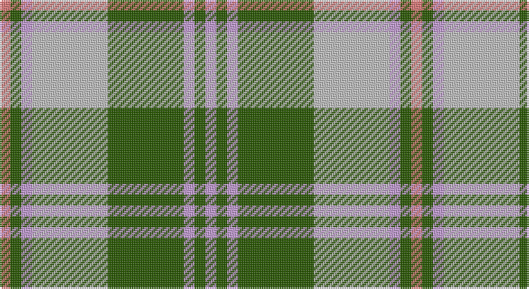

This page is one **sett** — a single exact thread-count. It belongs to the [tartan](/setts/r1dg1lp1lb7dg7lp1dg1lp1/)
(the same proportion at any scale), whose colour order is pattern [RGWWGWGW](/stripes/rgwwgwgw/).

Part of the [Beck-McSorley](/tartans/beck-mcsorley/) tartan — the named design grouping this sett with its other cloths.

Sourced from tartans-authority.  It is a [8 stripe tartan](/stripes/stripes8/).

Original link http://www.tartansauthority.com/tartan-ferret/display/11167/

## Register references

External register numbers recorded for this tartan.

- Scottish Register of Tartans: [11167](https://www.tartanregister.gov.uk/tartanDetails?ref=11167)
- Scottish Tartans Authority (ITI): 11167

## Thread count
LR/6 G6 LP6 N42 G42 LP6 G6 LP/6

One full sett is **228 threads**.

## Palette

Palette: <strong>Tartan Register</strong>
<table><thead><tr><th>Colour</th><th>Threads</th><th>Shade</th><th>Base</th><th>OKLCh</th></tr></thead><tbody><tr><td>LR/</td><td style="text-align:right;font-variant-numeric:tabular-nums">6</td><td><code style="background-color:#E87878;">#E87878</code> <small style="color:#888">#E87878</small></td><td>R <code style="background-color:#CC0000;">#CC0000</code></td><td><small style="color:#888">oklch(70.0% 0.139 21.2)</small></td></tr><tr><td>G</td><td style="text-align:right;font-variant-numeric:tabular-nums">6</td><td><code style="background-color:#285800;">#285800</code> <small style="color:#888">#285800</small></td><td>G <code style="background-color:#006100;">#006100</code></td><td><small style="color:#888">oklch(41.0% 0.122 135.8)</small></td></tr><tr><td>LP</td><td style="text-align:right;font-variant-numeric:tabular-nums">6</td><td><code style="background-color:#C49CD8;">#C49CD8</code> <small style="color:#888">#C49CD8</small></td><td>W <code style="background-color:#F7F7F7;">#F7F7F7</code></td><td><small style="color:#888">oklch(75.0% 0.095 314.2)</small></td></tr><tr><td>N</td><td style="text-align:right;font-variant-numeric:tabular-nums">42</td><td><code style="background-color:#C0C0C0;">#C0C0C0</code> <small style="color:#888">#C0C0C0</small></td><td>W <code style="background-color:#F7F7F7;">#F7F7F7</code></td><td><small style="color:#888">oklch(80.8% 0.000 89.9)</small></td></tr><tr><td>G</td><td style="text-align:right;font-variant-numeric:tabular-nums">42</td><td><code style="background-color:#285800;">#285800</code> <small style="color:#888">#285800</small></td><td>G <code style="background-color:#006100;">#006100</code></td><td><small style="color:#888">oklch(41.0% 0.122 135.8)</small></td></tr><tr><td>LP</td><td style="text-align:right;font-variant-numeric:tabular-nums">6</td><td><code style="background-color:#C49CD8;">#C49CD8</code> <small style="color:#888">#C49CD8</small></td><td>W <code style="background-color:#F7F7F7;">#F7F7F7</code></td><td><small style="color:#888">oklch(75.0% 0.095 314.2)</small></td></tr><tr><td>G</td><td style="text-align:right;font-variant-numeric:tabular-nums">6</td><td><code style="background-color:#285800;">#285800</code> <small style="color:#888">#285800</small></td><td>G <code style="background-color:#006100;">#006100</code></td><td><small style="color:#888">oklch(41.0% 0.122 135.8)</small></td></tr><tr><td>LP/</td><td style="text-align:right;font-variant-numeric:tabular-nums">6</td><td><code style="background-color:#C49CD8;">#C49CD8</code> <small style="color:#888">#C49CD8</small></td><td>W <code style="background-color:#F7F7F7;">#F7F7F7</code></td><td><small style="color:#888">oklch(75.0% 0.095 314.2)</small></td></tr></tbody></table>

# Sample pattern

## Compared to the master

This cloth is one sett of its design; the master sett (the exemplar the design is anchored on) is below for comparison.

<figure style="margin:0"><figcaption style="color:#888;font-size:smaller">this sett</figcaption></figure>
<figure style="margin:0"><figcaption style="color:#888;font-size:smaller"><a href="/setts/r1o1m1o7dg7m1dg1m1/">master sett →</a></figcaption></figure>

## Nearest tartans

The nearest existing variants by ΔTartan distance, with this tartan at the top so the swatches line up against it.

ΔTartan

Tartan

Sett

—

<a href="/ttd/edit/#slug=r1dg1lp1lb7dg7lp1dg1lp1~x6">Beck-McSorley</a> <a class="nn-out" href="/variants/s8/r1dg1lp1lb7dg7lp1dg1lp1~x6/" title="open its dictionary page">↗</a>

1.21

<a href="/ttd/edit/#slug=o19k2w4k2n5k2n5~x2&amp;base=r1dg1lp1lb7dg7lp1dg1lp1~x6">Kyle Tartan</a> <a class="nn-out" href="/variants/s7/o19k2w4k2n5k2n5~x2/" title="open its dictionary page">↗</a>

1.22

<a href="/ttd/edit/#slug=db3o14g2o2g2o3g6w18db3o2db2o2~x2&amp;base=r1dg1lp1lb7dg7lp1dg1lp1~x6">Raibert, Check</a> <a class="nn-out" href="/variants/s12/db3o14g2o2g2o3g6w18db3o2db2o2~x2/" title="open its dictionary page">↗</a>

1.25

<a href="/ttd/edit/#slug=k3w25g16w3n25w3~x2&amp;base=r1dg1lp1lb7dg7lp1dg1lp1~x6">Birnham, Blue (Dance)</a> <a class="nn-out" href="/variants/s6/k3w25g16w3n25w3~x2/" title="open its dictionary page">↗</a>

1.28

<a href="/ttd/edit/#slug=r2ly1b8r1g7ly1r2~x6&amp;base=r1dg1lp1lb7dg7lp1dg1lp1~x6">Cercle de Fermieres de St-Elie . . .</a> <a class="nn-out" href="/variants/s7/r2ly1b8r1g7ly1r2~x6/" title="open its dictionary page">↗</a>

1.28

<a href="/ttd/edit/#slug=r1g8db1g5db11ly2r1ly1~x4&amp;base=r1dg1lp1lb7dg7lp1dg1lp1~x6">New Mexico, State of (Fashion)</a> <a class="nn-out" href="/variants/s8/r1g8db1g5db11ly2r1ly1~x4/" title="open its dictionary page">↗</a>

1.28

<a href="/ttd/edit/#slug=k1t1k1t7y7k1y1lb1~x6&amp;base=r1dg1lp1lb7dg7lp1dg1lp1~x6">Auld Lang Syne (Philip King Tailoring)</a> <a class="nn-out" href="/variants/s8/k1t1k1t7y7k1y1lb1~x6/" title="open its dictionary page">↗</a>

1.29

<a href="/ttd/edit/#slug=b6k3b37ly41w3ly6w3~x2&amp;base=r1dg1lp1lb7dg7lp1dg1lp1~x6">Tilburg Hunting (District)</a> <a class="nn-out" href="/variants/s7/b6k3b37ly41w3ly6w3~x2/" title="open its dictionary page">↗</a>

1.32

<a href="/ttd/edit/#slug=g3r10lb2gii3lb13gi2lb2gi3~x2&amp;base=r1dg1lp1lb7dg7lp1dg1lp1~x6">Manitoba Dress (Dance)</a> <a class="nn-out" href="/variants/s8/g3r10lb2gii3lb13gi2lb2gi3~x2/" title="open its dictionary page">↗</a>

1.34

<a href="/ttd/edit/#slug=p26g6k8g3k8g30w3g3~x2&amp;base=r1dg1lp1lb7dg7lp1dg1lp1~x6">Riley (Personal)</a> <a class="nn-out" href="/variants/s8/p26g6k8g3k8g30w3g3~x2/" title="open its dictionary page">↗</a>

1.34

<a href="/ttd/edit/#slug=g33n4g4n4g4n12w33n3w6~x2&amp;base=r1dg1lp1lb7dg7lp1dg1lp1~x6">Lindsay Dress, Green (Dance)</a> <a class="nn-out" href="/variants/s9/g33n4g4n4g4n12w33n3w6~x2/" title="open its dictionary page">↗</a>

## Neighbour map

Every grey dot is one of 14360 variants placed by the first two principal components of the ΔTartan feature space (44% of its variance). Red is this tartan; blue dots are its nearest — click one to open its page.

<svg viewBox="0 0 640 380" role="img" style="max-width:100%;height:auto;border:1px solid #e0e0e0;border-radius:4px;display:block" xmlns="http://www.w3.org/2000/svg"><image href="/nn/cloud.v1.png" width="640" height="380"/><a href="/variants/s7/o19k2w4k2n5k2n5~x2/"><circle cx="255.1" cy="189.1" r="4" fill="#3465a4"><title>Kyle Tartan</title></circle></a><a href="/variants/s12/db3o14g2o2g2o3g6w18db3o2db2o2~x2/"><circle cx="182.6" cy="155.0" r="4" fill="#3465a4"><title>Raibert, Check</title></circle></a><a href="/variants/s6/k3w25g16w3n25w3~x2/"><circle cx="179.9" cy="200.3" r="4" fill="#3465a4"><title>Birnham, Blue (Dance)</title></circle></a><a href="/variants/s7/r2ly1b8r1g7ly1r2~x6/"><circle cx="184.9" cy="204.3" r="4" fill="#3465a4"><title>Cercle de Fermieres de St-Elie . . .</title></circle></a><a href="/variants/s8/r1g8db1g5db11ly2r1ly1~x4/"><circle cx="225.0" cy="179.1" r="4" fill="#3465a4"><title>New Mexico, State of (Fashion)</title></circle></a><a href="/variants/s8/k1t1k1t7y7k1y1lb1~x6/"><circle cx="234.0" cy="203.4" r="4" fill="#3465a4"><title>Auld Lang Syne (Philip King Tailoring)</title></circle></a><a href="/variants/s7/b6k3b37ly41w3ly6w3~x2/"><circle cx="287.2" cy="161.8" r="4" fill="#3465a4"><title>Tilburg Hunting (District)</title></circle></a><a href="/variants/s8/g3r10lb2gii3lb13gi2lb2gi3~x2/"><circle cx="172.9" cy="181.8" r="4" fill="#3465a4"><title>Manitoba Dress (Dance)</title></circle></a><a href="/variants/s8/p26g6k8g3k8g30w3g3~x2/"><circle cx="223.2" cy="179.6" r="4" fill="#3465a4"><title>Riley (Personal)</title></circle></a><a href="/variants/s9/g33n4g4n4g4n12w33n3w6~x2/"><circle cx="223.1" cy="177.1" r="4" fill="#3465a4"><title>Lindsay Dress, Green (Dance)</title></circle></a><circle cx="223.5" cy="185.5" r="5" fill="#c00000"/></svg>

ID: /variants/s8/r1dg1lp1lb7dg7lp1dg1lp1~x6/
