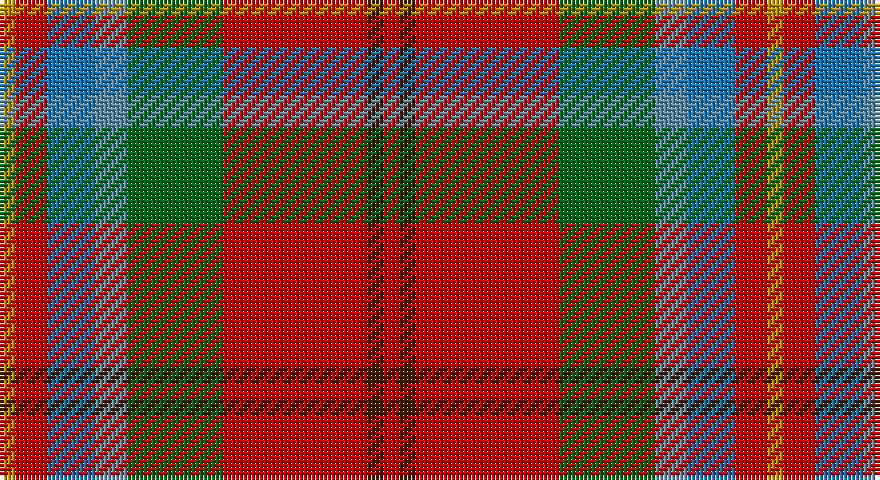

This page is one **sett** — a single exact thread-count. It belongs to the [tartan](/setts/r1do1r9g6t2b3r2lo1/)
(the same proportion at any scale), whose colour order is pattern [RBRGBBRY](/stripes/rbrgbbry/).

Part of the [Battle of Bannockburn, The](/tartans/battle-of-bannockburn-the/) tartan — the named design grouping this sett with its other cloths.

Sourced from tartans-authority.  It is a [8 stripe tartan](/stripes/stripes8/).

Original link http://www.tartansauthority.com/tartan-ferret/display/10788/

## Register references

External register numbers recorded for this tartan.

- Scottish Register of Tartans: [10788](https://www.tartanregister.gov.uk/tartanDetails?ref=10788)
- Scottish Tartans Authority (ITI): 10788

## Thread count
DY/4 R8 Ba12 B8 G24 R36 DR4 R/4

One full sett is **192 threads**.

## Palette

Palette: <strong>Tartan Register</strong>
<table><thead><tr><th>Colour</th><th>Threads</th><th>Shade</th><th>Base</th><th>OKLCh</th></tr></thead><tbody><tr><td>DY/</td><td style="text-align:right;font-variant-numeric:tabular-nums">4</td><td><code style="background-color:#BC8C00;">#BC8C00</code> <small style="color:#888">#BC8C00</small></td><td>Y <code style="background-color:#F2BF00;">#F2BF00</code></td><td><small style="color:#888">oklch(66.8% 0.137 84.1)</small></td></tr><tr><td>R</td><td style="text-align:right;font-variant-numeric:tabular-nums">8</td><td><code style="background-color:#C80000;">#C80000</code> <small style="color:#888">#C80000</small></td><td>R <code style="background-color:#CC0000;">#CC0000</code></td><td><small style="color:#888">oklch(52.3% 0.215 29.2)</small></td></tr><tr><td>Ba</td><td style="text-align:right;font-variant-numeric:tabular-nums">12</td><td><code style="background-color:#1474B4;">#1474B4</code> <small style="color:#888">#1474B4</small></td><td>B <code style="background-color:#2A418A;">#2A418A</code></td><td><small style="color:#888">oklch(54.0% 0.129 245.1)</small></td></tr><tr><td>B</td><td style="text-align:right;font-variant-numeric:tabular-nums">8</td><td><code style="background-color:#5C8CA8;">#5C8CA8</code> <small style="color:#888">#5C8CA8</small></td><td>B <code style="background-color:#2A418A;">#2A418A</code></td><td><small style="color:#888">oklch(61.7% 0.067 235.0)</small></td></tr><tr><td>G</td><td style="text-align:right;font-variant-numeric:tabular-nums">24</td><td><code style="background-color:#006818;">#006818</code> <small style="color:#888">#006818</small></td><td>G <code style="background-color:#006100;">#006100</code></td><td><small style="color:#888">oklch(45.0% 0.142 145.0)</small></td></tr><tr><td>R</td><td style="text-align:right;font-variant-numeric:tabular-nums">36</td><td><code style="background-color:#C80000;">#C80000</code> <small style="color:#888">#C80000</small></td><td>R <code style="background-color:#CC0000;">#CC0000</code></td><td><small style="color:#888">oklch(52.3% 0.215 29.2)</small></td></tr><tr><td>DR</td><td style="text-align:right;font-variant-numeric:tabular-nums">4</td><td><code style="background-color:#441800;">#441800</code> <small style="color:#888">#441800</small></td><td>B <code style="background-color:#2A418A;">#2A418A</code></td><td><small style="color:#888">oklch(27.3% 0.076 46.3)</small></td></tr><tr><td>R/</td><td style="text-align:right;font-variant-numeric:tabular-nums">4</td><td><code style="background-color:#C80000;">#C80000</code> <small style="color:#888">#C80000</small></td><td>R <code style="background-color:#CC0000;">#CC0000</code></td><td><small style="color:#888">oklch(52.3% 0.215 29.2)</small></td></tr></tbody></table>

# Sample pattern

## Compared to the master

This cloth is one sett of its design; the master sett (the exemplar the design is anchored on) is below for comparison.

<figure style="margin:0"><figcaption style="color:#888;font-size:smaller">this sett</figcaption></figure>
<figure style="margin:0"><figcaption style="color:#888;font-size:smaller"><a href="/setts/r1dy1r9y6lg2t3r2ly1/">master sett →</a></figcaption></figure>

## Nearest tartans

The nearest existing variants by ΔTartan distance, with this tartan at the top so the swatches line up against it.

ΔTartan

Tartan

Sett

—

<a href="/ttd/edit/#slug=r1do1r9g6t2b3r2lo1~x4">Battle of Bannockburn, The</a> <a class="nn-out" href="/variants/s8/r1do1r9g6t2b3r2lo1~x4/" title="open its dictionary page">↗</a>

0.67

<a href="/ttd/edit/#slug=w3o4dg2o22dt5oi16ly3~x2&amp;base=r1do1r9g6t2b3r2lo1~x4">Pubcrawlers, The</a> <a class="nn-out" href="/variants/s7/w3o4dg2o22dt5oi16ly3~x2/" title="open its dictionary page">↗</a>

0.91

<a href="/ttd/edit/#slug=r1dy1r9y6lg2t3r2ly1~x4&amp;base=r1do1r9g6t2b3r2lo1~x4">Battle of Bannockburn, The</a> <a class="nn-out" href="/variants/s8/r1dy1r9y6lg2t3r2ly1~x4/" title="open its dictionary page">↗</a>

1.02

<a href="/ttd/edit/#slug=lr11r4y2k4y2r4y12r20t2~x2&amp;base=r1do1r9g6t2b3r2lo1~x4">Australia Dress</a> <a class="nn-out" href="/variants/s9/lr11r4y2k4y2r4y12r20t2~x2/" title="open its dictionary page">↗</a>

1.18

<a href="/ttd/edit/#slug=lr6o5k2y18r28w2~x2&amp;base=r1do1r9g6t2b3r2lo1~x4">Dundhuin</a> <a class="nn-out" href="/variants/s6/lr6o5k2y18r28w2~x2/" title="open its dictionary page">↗</a>

1.21

<a href="/ttd/edit/#slug=o4do2o21db11w2oi20r3~x2&amp;base=r1do1r9g6t2b3r2lo1~x4">Barbour Dress</a> <a class="nn-out" href="/variants/s7/o4do2o21db11w2oi20r3~x2/" title="open its dictionary page">↗</a>

1.23

<a href="/ttd/edit/#slug=ri10lbi1ri2n1ri1n1lo1n4lb2r1lb2lo1~x8&amp;base=r1do1r9g6t2b3r2lo1~x4">Rathmore</a> <a class="nn-out" href="/variants/s12/ri10lbi1ri2n1ri1n1lo1n4lb2r1lb2lo1~x8/" title="open its dictionary page">↗</a>

1.23

<a href="/ttd/edit/#slug=r6w1r6db2r6g12ly1db8t4r4~x2&amp;base=r1do1r9g6t2b3r2lo1~x4">Unnamed No 57</a> <a class="nn-out" href="/variants/s10/r6w1r6db2r6g12ly1db8t4r4~x2/" title="open its dictionary page">↗</a>

1.25

<a href="/ttd/edit/#slug=db3t1k1ri12r1g9ri1t1db3~x4&amp;base=r1do1r9g6t2b3r2lo1~x4">Moray of Abercairney</a> <a class="nn-out" href="/variants/s9/db3t1k1ri12r1g9ri1t1db3~x4/" title="open its dictionary page">↗</a>

1.26

<a href="/ttd/edit/#slug=dp2r11t9dp11ly2g13r21w2~x2&amp;base=r1do1r9g6t2b3r2lo1~x4">Wilson's, No 2</a> <a class="nn-out" href="/variants/s8/dp2r11t9dp11ly2g13r21w2~x2/" title="open its dictionary page">↗</a>

1.28

<a href="/ttd/edit/#slug=r48b16lo5g17w8dy3~x2&amp;base=r1do1r9g6t2b3r2lo1~x4">Scottish American Soc. of Michigan</a> <a class="nn-out" href="/variants/s6/r48b16lo5g17w8dy3~x2/" title="open its dictionary page">↗</a>

## Neighbour map

Every grey dot is one of 14360 variants placed by the first two principal components of the ΔTartan feature space (44% of its variance). Red is this tartan; blue dots are its nearest — click one to open its page.

<svg viewBox="0 0 640 380" role="img" style="max-width:100%;height:auto;border:1px solid #e0e0e0;border-radius:4px;display:block" xmlns="http://www.w3.org/2000/svg"><image href="/nn/cloud.v1.png" width="640" height="380"/><a href="/variants/s7/w3o4dg2o22dt5oi16ly3~x2/"><circle cx="237.3" cy="165.1" r="4" fill="#3465a4"><title>Pubcrawlers, The</title></circle></a><a href="/variants/s8/r1dy1r9y6lg2t3r2ly1~x4/"><circle cx="223.6" cy="159.7" r="4" fill="#3465a4"><title>Battle of Bannockburn, The</title></circle></a><a href="/variants/s9/lr11r4y2k4y2r4y12r20t2~x2/"><circle cx="231.9" cy="167.7" r="4" fill="#3465a4"><title>Australia Dress</title></circle></a><a href="/variants/s6/lr6o5k2y18r28w2~x2/"><circle cx="257.2" cy="163.5" r="4" fill="#3465a4"><title>Dundhuin</title></circle></a><a href="/variants/s7/o4do2o21db11w2oi20r3~x2/"><circle cx="189.2" cy="168.1" r="4" fill="#3465a4"><title>Barbour Dress</title></circle></a><a href="/variants/s12/ri10lbi1ri2n1ri1n1lo1n4lb2r1lb2lo1~x8/"><circle cx="229.9" cy="122.9" r="4" fill="#3465a4"><title>Rathmore</title></circle></a><a href="/variants/s10/r6w1r6db2r6g12ly1db8t4r4~x2/"><circle cx="176.6" cy="163.0" r="4" fill="#3465a4"><title>Unnamed No 57</title></circle></a><a href="/variants/s9/db3t1k1ri12r1g9ri1t1db3~x4/"><circle cx="196.0" cy="131.6" r="4" fill="#3465a4"><title>Moray of Abercairney</title></circle></a><a href="/variants/s8/dp2r11t9dp11ly2g13r21w2~x2/"><circle cx="170.0" cy="160.4" r="4" fill="#3465a4"><title>Wilson's, No 2</title></circle></a><a href="/variants/s6/r48b16lo5g17w8dy3~x2/"><circle cx="242.6" cy="140.8" r="4" fill="#3465a4"><title>Scottish American Soc. of Michigan</title></circle></a><circle cx="222.2" cy="166.5" r="5" fill="#c00000"/></svg>

ID: /variants/s8/r1do1r9g6t2b3r2lo1~x4/
