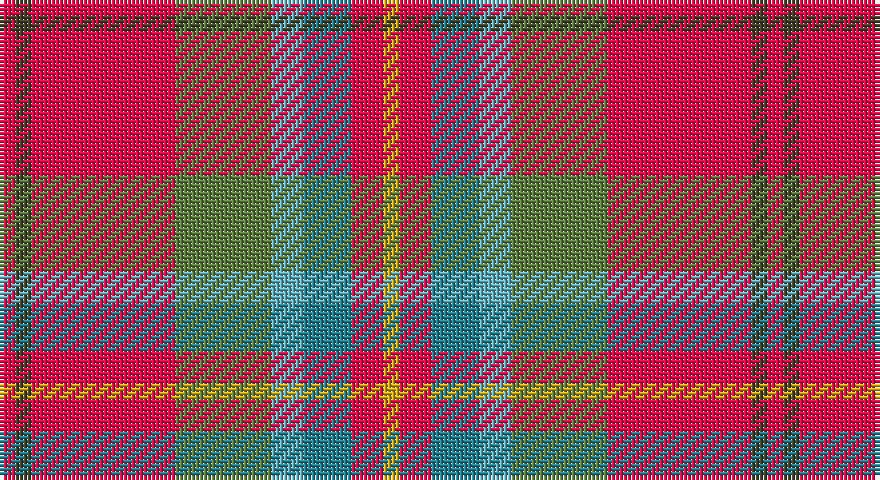

This page is one **sett** — a single exact thread-count. It belongs to the [tartan](/setts/r1dy1r9y6lg2t3r2ly1/)
(the same proportion at any scale), whose colour order is pattern [RGRGYBRY](/stripes/rgrgybry/).

Part of the [Battle of Bannockburn, The](/tartans/battle-of-bannockburn-the/) tartan — the named design grouping this sett with its other cloths.

Sourced from register-of-tartans.  It is a [8 stripe tartan](/stripes/stripes8/).

Original link https://www.tartanregister.gov.uk/tartanDetails.aspx?ref=10788

## Register references

External register numbers recorded for this tartan.

- Scottish Register of Tartans: [10788](https://www.tartanregister.gov.uk/tartanDetails.aspx?ref=10788)

## Thread count
R/4 T4 R36 G24 B8 Ba12 R8 Y/4

One full sett is **192 threads**.

## Palette

Palette: <strong>custom</strong>
<table><thead><tr><th>Colour</th><th>Threads</th><th>Shade</th><th>Base</th><th>OKLCh</th></tr></thead><tbody><tr><td>R/</td><td style="text-align:right;font-variant-numeric:tabular-nums">4</td><td><code style="background-color:#F00C4C;">#F00C4C</code> <small style="color:#888">#F00C4C</small></td><td>R <code style="background-color:#CC0000;">#CC0000</code></td><td><small style="color:#888">oklch(60.8% 0.240 16.9)</small></td></tr><tr><td>T</td><td style="text-align:right;font-variant-numeric:tabular-nums">4</td><td><code style="background-color:#413F28;">#413F28</code> <small style="color:#888">#413F28</small></td><td>G <code style="background-color:#006100;">#006100</code></td><td><small style="color:#888">oklch(36.3% 0.037 103.8)</small></td></tr><tr><td>R</td><td style="text-align:right;font-variant-numeric:tabular-nums">36</td><td><code style="background-color:#F00C4C;">#F00C4C</code> <small style="color:#888">#F00C4C</small></td><td>R <code style="background-color:#CC0000;">#CC0000</code></td><td><small style="color:#888">oklch(60.8% 0.240 16.9)</small></td></tr><tr><td>G</td><td style="text-align:right;font-variant-numeric:tabular-nums">24</td><td><code style="background-color:#5D7F40;">#5D7F40</code> <small style="color:#888">#5D7F40</small></td><td>G <code style="background-color:#006100;">#006100</code></td><td><small style="color:#888">oklch(55.5% 0.098 132.1)</small></td></tr><tr><td>B</td><td style="text-align:right;font-variant-numeric:tabular-nums">8</td><td><code style="background-color:#62B0BE;">#62B0BE</code> <small style="color:#888">#62B0BE</small></td><td>Y <code style="background-color:#F2BF00;">#F2BF00</code></td><td><small style="color:#888">oklch(71.2% 0.079 210.4)</small></td></tr><tr><td>Ba</td><td style="text-align:right;font-variant-numeric:tabular-nums">12</td><td><code style="background-color:#248192;">#248192</code> <small style="color:#888">#248192</small></td><td>B <code style="background-color:#2A418A;">#2A418A</code></td><td><small style="color:#888">oklch(55.8% 0.087 212.7)</small></td></tr><tr><td>R</td><td style="text-align:right;font-variant-numeric:tabular-nums">8</td><td><code style="background-color:#F00C4C;">#F00C4C</code> <small style="color:#888">#F00C4C</small></td><td>R <code style="background-color:#CC0000;">#CC0000</code></td><td><small style="color:#888">oklch(60.8% 0.240 16.9)</small></td></tr><tr><td>Y/</td><td style="text-align:right;font-variant-numeric:tabular-nums">4</td><td><code style="background-color:#D3A916;">#D3A916</code> <small style="color:#888">#D3A916</small></td><td>Y <code style="background-color:#F2BF00;">#F2BF00</code></td><td><small style="color:#888">oklch(75.2% 0.150 90.1)</small></td></tr></tbody></table>

# Sample pattern

## Nearest tartans

The nearest existing variants by ΔTartan distance, with this tartan at the top so the swatches line up against it.

ΔTartan

Tartan

Sett

—

<a href="/ttd/edit/#slug=r1dy1r9y6lg2t3r2ly1~x4">Battle of Bannockburn, The</a> <a class="nn-out" href="/variants/s8/r1dy1r9y6lg2t3r2ly1~x4/" title="open its dictionary page">↗</a>

0.91

<a href="/ttd/edit/#slug=r1do1r9g6t2b3r2lo1~x4&amp;base=r1dy1r9y6lg2t3r2ly1~x4">Battle of Bannockburn, The</a> <a class="nn-out" href="/variants/s8/r1do1r9g6t2b3r2lo1~x4/" title="open its dictionary page">↗</a>

1.15

<a href="/ttd/edit/#slug=lr11r4y2k4y2r4y12r20t2~x2&amp;base=r1dy1r9y6lg2t3r2ly1~x4">Australia Dress</a> <a class="nn-out" href="/variants/s9/lr11r4y2k4y2r4y12r20t2~x2/" title="open its dictionary page">↗</a>

1.19

<a href="/ttd/edit/#slug=w6r25o2g3o30k3o2r30ly6~x2&amp;base=r1dy1r9y6lg2t3r2ly1~x4">Virginia Military Institute, New Market</a> <a class="nn-out" href="/variants/s9/w6r25o2g3o30k3o2r30ly6~x2/" title="open its dictionary page">↗</a>

1.26

<a href="/ttd/edit/#slug=lr6o5k2y18r28w2~x2&amp;base=r1dy1r9y6lg2t3r2ly1~x4">Dundhuin</a> <a class="nn-out" href="/variants/s6/lr6o5k2y18r28w2~x2/" title="open its dictionary page">↗</a>

1.27

<a href="/ttd/edit/#slug=w6r25y2g3y30k3y2r30ly6~x2&amp;base=r1dy1r9y6lg2t3r2ly1~x4">Virginia Military Institute, New Market</a> <a class="nn-out" href="/variants/s9/w6r25y2g3y30k3y2r30ly6~x2/" title="open its dictionary page">↗</a>

1.31

<a href="/ttd/edit/#slug=ri10lbi1ri2n1ri1n1lo1n4lb2r1lb2lo1~x8&amp;base=r1dy1r9y6lg2t3r2ly1~x4">Rathmore</a> <a class="nn-out" href="/variants/s12/ri10lbi1ri2n1ri1n1lo1n4lb2r1lb2lo1~x8/" title="open its dictionary page">↗</a>

1.33

<a href="/ttd/edit/#slug=r2do2r20y13lg3db5r2r4o2~x2&amp;base=r1dy1r9y6lg2t3r2ly1~x4">Flowers of the Forest, The</a> <a class="nn-out" href="/variants/s9/r2do2r20y13lg3db5r2r4o2~x2/" title="open its dictionary page">↗</a>

1.34

<a href="/ttd/edit/#slug=w5r25t18g4k2ly5~x2&amp;base=r1dy1r9y6lg2t3r2ly1~x4">Christie (London) (Personal)</a> <a class="nn-out" href="/variants/s6/w5r25t18g4k2ly5~x2/" title="open its dictionary page">↗</a>

1.36

<a href="/ttd/edit/#slug=r48b16lo5g17w8dy3~x2&amp;base=r1dy1r9y6lg2t3r2ly1~x4">Scottish American Soc. of Michigan</a> <a class="nn-out" href="/variants/s6/r48b16lo5g17w8dy3~x2/" title="open its dictionary page">↗</a>

1.39

<a href="/ttd/edit/#slug=w3o4dg2o22dt5oi16ly3~x2&amp;base=r1dy1r9y6lg2t3r2ly1~x4">Pubcrawlers, The</a> <a class="nn-out" href="/variants/s7/w3o4dg2o22dt5oi16ly3~x2/" title="open its dictionary page">↗</a>

## Neighbour map

Every grey dot is one of 14360 variants placed by the first two principal components of the ΔTartan feature space (44% of its variance). Red is this tartan; blue dots are its nearest — click one to open its page.

<svg viewBox="0 0 640 380" role="img" style="max-width:100%;height:auto;border:1px solid #e0e0e0;border-radius:4px;display:block" xmlns="http://www.w3.org/2000/svg"><image href="/nn/cloud.v1.png" width="640" height="380"/><a href="/variants/s8/r1do1r9g6t2b3r2lo1~x4/"><circle cx="222.2" cy="166.5" r="4" fill="#3465a4"><title>Battle of Bannockburn, The</title></circle></a><a href="/variants/s9/lr11r4y2k4y2r4y12r20t2~x2/"><circle cx="231.9" cy="167.7" r="4" fill="#3465a4"><title>Australia Dress</title></circle></a><a href="/variants/s9/w6r25o2g3o30k3o2r30ly6~x2/"><circle cx="281.0" cy="125.6" r="4" fill="#3465a4"><title>Virginia Military Institute, New Market</title></circle></a><a href="/variants/s6/lr6o5k2y18r28w2~x2/"><circle cx="257.2" cy="163.5" r="4" fill="#3465a4"><title>Dundhuin</title></circle></a><a href="/variants/s9/w6r25y2g3y30k3y2r30ly6~x2/"><circle cx="273.1" cy="123.1" r="4" fill="#3465a4"><title>Virginia Military Institute, New Market</title></circle></a><a href="/variants/s12/ri10lbi1ri2n1ri1n1lo1n4lb2r1lb2lo1~x8/"><circle cx="229.9" cy="122.9" r="4" fill="#3465a4"><title>Rathmore</title></circle></a><a href="/variants/s9/r2do2r20y13lg3db5r2r4o2~x2/"><circle cx="290.2" cy="154.2" r="4" fill="#3465a4"><title>Flowers of the Forest, The</title></circle></a><a href="/variants/s6/w5r25t18g4k2ly5~x2/"><circle cx="188.7" cy="148.9" r="4" fill="#3465a4"><title>Christie (London) (Personal)</title></circle></a><a href="/variants/s6/r48b16lo5g17w8dy3~x2/"><circle cx="242.6" cy="140.8" r="4" fill="#3465a4"><title>Scottish American Soc. of Michigan</title></circle></a><a href="/variants/s7/w3o4dg2o22dt5oi16ly3~x2/"><circle cx="237.3" cy="165.1" r="4" fill="#3465a4"><title>Pubcrawlers, The</title></circle></a><circle cx="223.6" cy="159.7" r="5" fill="#c00000"/></svg>

ID: /variants/s8/r1dy1r9y6lg2t3r2ly1~x4/
