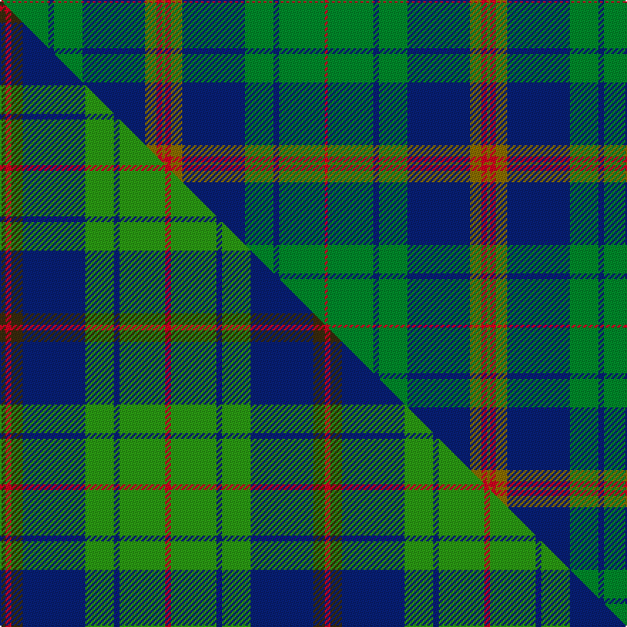

This is one **variant** — a specific cloth: this exact thread count and colourway, with its own
provenance below. It is one weaving of the [sett](/tartans/n/ne/new-mexico-2/) (the scale-free proportion — the
same cloth at any scale or shade), whose colour order is pattern [GRGBGBGR](/stripes/grgbgbgr/).

Part of the [New Mexico](/tartans/n/ne/new-mexico-2/) tartan — the named design grouping this sett with its other cloths.

Sourced from weddslist.  It is a [8 stripe tartan](/stripes/stripes8/).

Original link [http://www.weddslist.com/cgi-bin/tartans/pg.pl?source=sts](http://www.weddslist.com/cgi-bin/tartans/pg.pl?source=sts)

Dataset <small>— provenance for this record, inherited from the source manifest</small>

<dl class="dataset-prov">
<dt>source</dt><dd><a href="/sources/weddslist/">Weddslist</a></dd>
<dt>data captured from</dt><dd><a href="https://github.com/thetartan/tartan-database/blob/master/data/weddslist/data.csv">https://github.com/thetartan/tartan-database/blob/master/data/weddslist/data.csv</a></dd>
<dt>data date</dt><dd>2016-11-17 <small>(dataset default)</small></dd>
<dt>licence</dt><dd><a href="https://creativecommons.org/licenses/by-nc-nd/4.0/">CC BY-NC-ND 4.0</a></dd>
</dl>

Capture chain <small>— the hands this data passed through, oldest first; each capture carries its own licence</small>

<ol class="capture-chain">
<li><a href="https://www.weddslist.com/tartans/">Weddslist</a> <small>the living privately compiled reference</small></li>
<li><a href="https://github.com/thetartan/tartan-database">thetartan/tartan-database</a> <small>2016-2017</small> · <a href="https://creativecommons.org/licenses/by-nc-nd/4.0/">CC BY-NC-ND 4.0</a> <small>Levko Kravets's frozen compilation — the capture we vendored, and where its CC licence text came from</small></li>
<li>this dictionary <small>captured 2026-06-10 · commit 5bf86c7566</small> <small>each re-capture is a git commit to data/sources</small></li>
</ol>

## Thread count
R/2 G32 DB4 G20 DB44 Y8 R4 Y/2

One full sett is **228 threads**.

## Palette
<table><thead><tr><th>Colour</th><th>Shade</th><th>OKLCh</th></tr></thead><tbody><tr><td>DB</td><td><code style="background-color:#082077;">#082077</code> <small style="color:#888">#082077</small></td><td><small style="color:#888">oklch(30.0% 0.149 265.1)</small></td></tr><tr><td>G</td><td><code style="background-color:#008B2A;">#008B2A</code> <small style="color:#888">#008B2A</small></td><td><small style="color:#888">oklch(55.4% 0.170 145.9)</small></td></tr><tr><td>R</td><td><code style="background-color:#D60020;">#D60020</code> <small style="color:#888">#D60020</small></td><td><small style="color:#888">oklch(55.2% 0.224 25.5)</small></td></tr><tr><td>Y</td><td><code style="background-color:#8B6E00;">#8B6E00</code> <small style="color:#888">#8B6E00</small></td><td><small style="color:#888">oklch(55.1% 0.113 90.4)</small></td></tr></tbody></table>

# Sample pattern

## Compared to the master

This cloth is one sett of its design; the master sett (the exemplar the design is anchored on) is below for comparison.

Its **ΔTartan distance** from the master is **0.54** — the same measure the nearest-tartans table ranks by (0 is identical; a re-scale of the same cloth is near 0, a recolour or a different proportion further).

<figure class="master-compare" style="margin:0">

this sett
master sett ★

<figcaption style="color:#888;font-size:smaller">One weave of this sett against the <a href="/setts/dy1r1dy2db11g5db1g8r1g8db1g5db11dy2r1/">master sett ★</a>, split on the diagonal: a shared proportion runs seamlessly across it with only the shades shifting; a different proportion breaks on it.</figcaption>
</figure>

## Nearest tartan variants

The nearest existing variants by ΔTartan distance, with this cloth at the top so the swatches line up against it.

ΔTartan

Threads

Variant

Sett

—

228

<a href="/variants/s8/r1g16db2g10db22y4r2y1~x2/">New Mexico</a>

<a href="/ttd/edit/#slug=dy1r1dy2db11g5db1g8r1~x4&amp;base=r1g16db2g10db22y4r2y1~x2" title="compare in the TTD">0.51</a>

232

<a href="/variants/s8/dy1r1dy2db11g5db1g8r1~x4/">New Mexico, State of (Fashion)</a>

<a href="/ttd/edit/#slug=dy1r1dy2db11g5db1g8r1~x4~g6019141&amp;base=r1g16db2g10db22y4r2y1~x2" title="compare in the TTD">0.53</a>

232

<a href="/variants/s8/dy1r1dy2db11g5db1g8r1~x4~g6019141/">New Mexico, State of</a>

<a href="/ttd/edit/#slug=r2db32g14db5g16w2~x2~g5215144&amp;base=r1g16db2g10db22y4r2y1~x2" title="compare in the TTD">1.44</a>

276

<a href="/variants/s6/r2db32g14db5g16w2~x2~g5215144/">Connacht Irish District Tartan</a>

<a href="/ttd/edit/#slug=db3g4db20g24k2lr3r1~x2&amp;base=r1g16db2g10db22y4r2y1~x2" title="compare in the TTD">1.53</a>

220

<a href="/variants/s7/db3g4db20g24k2lr3r1~x2/">Nowell/Noel (Name)</a>

<a href="/ttd/edit/#slug=r6db2r1db8r3db16g28w2g4~x2&amp;base=r1g16db2g10db22y4r2y1~x2" title="compare in the TTD">1.88</a>

260

<a href="/variants/s9/r6db2r1db8r3db16g28w2g4~x2/">George (Personal)</a>

<a href="/ttd/edit/#slug=r6db2r1db16r3db16g28w2g4~x2&amp;base=r1g16db2g10db22y4r2y1~x2" title="compare in the TTD">1.90</a>

292

<a href="/variants/s9/r6db2r1db16r3db16g28w2g4~x2/">George (Personal)</a>

<a href="/ttd/edit/#slug=db4r11g11db22y1g4~x2&amp;base=r1g16db2g10db22y4r2y1~x2" title="compare in the TTD">2.10</a>

196

<a href="/variants/s6/db4r11g11db22y1g4~x2/">Harvey</a>

<a href="/ttd/edit/#slug=g38w2g6db24o6db2o3db2~x2&amp;base=r1g16db2g10db22y4r2y1~x2" title="compare in the TTD">2.13</a>

252

<a href="/variants/s8/g38w2g6db24o6db2o3db2~x2/">MacAuliffe/McAucliffe</a>

<a href="/ttd/edit/#slug=g28r12g4db20y2db3y2db3g7~x2&amp;base=r1g16db2g10db22y4r2y1~x2" title="compare in the TTD">2.15</a>

254

<a href="/variants/s9/g28r12g4db20y2db3y2db3g7~x2/">Cork</a>

<a href="/ttd/edit/#slug=db26g4db3g3y2g24r2~x2&amp;base=r1g16db2g10db22y4r2y1~x2" title="compare in the TTD">2.16</a>

200

<a href="/variants/s7/db26g4db3g3y2g24r2~x2/">St Andrews Links</a>

## Neighbour map

Every grey dot is one of 13662 variants placed by the first two principal components of the ΔTartan feature space (42% of its variance). Red is this tartan; blue dots are its nearest — click one to open its page. The map is a flat projection of a many-dimensional space — [how to read it](/posts/neighbourhood-maps/).

<svg viewBox="0 0 640 380" role="img" style="max-width:100%;height:auto;border:1px solid #e0e0e0;border-radius:4px;display:block" xmlns="http://www.w3.org/2000/svg"><image href="/nn/cloud.v1.png" width="640" height="380"/><a href="/variants/s8/dy1r1dy2db11g5db1g8r1~x4/"><circle cx="263.9" cy="198.9" r="4" fill="#3465a4"><title>New Mexico, State of (Fashion)</title></circle></a><a href="/variants/s8/dy1r1dy2db11g5db1g8r1~x4~g6019141/"><circle cx="246.5" cy="193.6" r="4" fill="#3465a4"><title>New Mexico, State of</title></circle></a><a href="/variants/s6/r2db32g14db5g16w2~x2~g5215144/"><circle cx="332.2" cy="200.5" r="4" fill="#3465a4"><title>Connacht Irish District Tartan</title></circle></a><a href="/variants/s7/db3g4db20g24k2lr3r1~x2/"><circle cx="274.9" cy="134.3" r="4" fill="#3465a4"><title>Nowell/Noel (Name)</title></circle></a><a href="/variants/s9/r6db2r1db8r3db16g28w2g4~x2/"><circle cx="288.5" cy="146.1" r="4" fill="#3465a4"><title>George (Personal)</title></circle></a><a href="/variants/s9/r6db2r1db16r3db16g28w2g4~x2/"><circle cx="281.7" cy="150.9" r="4" fill="#3465a4"><title>George (Personal)</title></circle></a><a href="/variants/s6/db4r11g11db22y1g4~x2/"><circle cx="289.7" cy="189.8" r="4" fill="#3465a4"><title>Harvey</title></circle></a><a href="/variants/s8/g38w2g6db24o6db2o3db2~x2/"><circle cx="335.4" cy="163.9" r="4" fill="#3465a4"><title>MacAuliffe/McAucliffe</title></circle></a><a href="/variants/s9/g28r12g4db20y2db3y2db3g7~x2/"><circle cx="277.8" cy="181.8" r="4" fill="#3465a4"><title>Cork</title></circle></a><a href="/variants/s7/db26g4db3g3y2g24r2~x2/"><circle cx="320.8" cy="189.0" r="4" fill="#3465a4"><title>St Andrews Links</title></circle></a><circle cx="300.0" cy="169.8" r="5" fill="#c00000"/><text x="320" y="376" text-anchor="middle" font-size="11" fill="#999">ground</text><text x="11" y="190" text-anchor="middle" font-size="11" fill="#999" transform="rotate(-90 11 190)">complexity</text></svg>

ID: /variants/s8/r1g16db2g10db22y4r2y1~x2/
