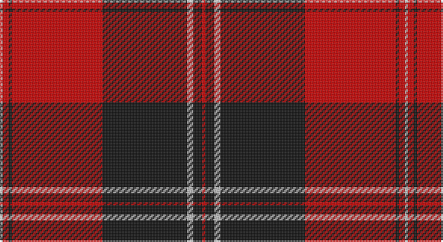

This page is one **sett** — a single exact thread-count. It belongs to the [tartan](/setts/r1k3lb2k28r30k1r2lb1/)
(the same proportion at any scale), whose colour order is pattern [RKWKRKRW](/stripes/rkwkrkrw/).

Sourced from register-of-tartans.  It is a [8 stripe tartan](/stripes/stripes8/).

Original link https://www.tartanregister.gov.uk/tartanDetails.aspx?ref=2054

2 attestations — the source records this cloth was collapsed from (oldest owns this page)

<ul>
<li>01/01/2006 — Las Vegas Fire Fighters (register-of-tartans, <a href="https://www.tartanregister.gov.uk/tartanDetails.aspx?ref=2054">record</a>)</li>
<li>pre 2006 — Las Vegas Fire Fighters (Corporate) (tartans-authority, <a href="http://www.tartansauthority.com/tartan-ferret/display/7052/">record</a>)</li>
</ul>

## Register references

External register numbers recorded for this tartan.

- Scottish Register of Tartans: [2054](https://www.tartanregister.gov.uk/tartanDetails.aspx?ref=2054)
- Scottish Tartans Authority (ITI): 7052

## Thread count
N/2 R4 K2 R60 K56 N4 K6 R/2

One full sett is **268 threads**.

## Palette

Palette: <strong>Tartan Register</strong>
<table><thead><tr><th>Colour</th><th>Threads</th><th>Shade</th><th>Base</th><th>OKLCh</th></tr></thead><tbody><tr><td>N/</td><td style="text-align:right;font-variant-numeric:tabular-nums">2</td><td><code style="background-color:#C0C0C0;">#C0C0C0</code> <small style="color:#888">#C0C0C0</small></td><td>W <code style="background-color:#F7F7F7;">#F7F7F7</code></td><td><small style="color:#888">oklch(80.8% 0.000 89.9)</small></td></tr><tr><td>R</td><td style="text-align:right;font-variant-numeric:tabular-nums">4</td><td><code style="background-color:#C80000;">#C80000</code> <small style="color:#888">#C80000</small></td><td>R <code style="background-color:#CC0000;">#CC0000</code></td><td><small style="color:#888">oklch(52.3% 0.215 29.2)</small></td></tr><tr><td>K</td><td style="text-align:right;font-variant-numeric:tabular-nums">2</td><td><code style="background-color:#101010;">#101010</code> <small style="color:#888">#101010</small></td><td>K <code style="background-color:#000000;">#000000</code></td><td><small style="color:#888">oklch(17.3% 0.000 89.9)</small></td></tr><tr><td>R</td><td style="text-align:right;font-variant-numeric:tabular-nums">60</td><td><code style="background-color:#C80000;">#C80000</code> <small style="color:#888">#C80000</small></td><td>R <code style="background-color:#CC0000;">#CC0000</code></td><td><small style="color:#888">oklch(52.3% 0.215 29.2)</small></td></tr><tr><td>K</td><td style="text-align:right;font-variant-numeric:tabular-nums">56</td><td><code style="background-color:#101010;">#101010</code> <small style="color:#888">#101010</small></td><td>K <code style="background-color:#000000;">#000000</code></td><td><small style="color:#888">oklch(17.3% 0.000 89.9)</small></td></tr><tr><td>N</td><td style="text-align:right;font-variant-numeric:tabular-nums">4</td><td><code style="background-color:#C0C0C0;">#C0C0C0</code> <small style="color:#888">#C0C0C0</small></td><td>W <code style="background-color:#F7F7F7;">#F7F7F7</code></td><td><small style="color:#888">oklch(80.8% 0.000 89.9)</small></td></tr><tr><td>K</td><td style="text-align:right;font-variant-numeric:tabular-nums">6</td><td><code style="background-color:#101010;">#101010</code> <small style="color:#888">#101010</small></td><td>K <code style="background-color:#000000;">#000000</code></td><td><small style="color:#888">oklch(17.3% 0.000 89.9)</small></td></tr><tr><td>R/</td><td style="text-align:right;font-variant-numeric:tabular-nums">2</td><td><code style="background-color:#C80000;">#C80000</code> <small style="color:#888">#C80000</small></td><td>R <code style="background-color:#CC0000;">#CC0000</code></td><td><small style="color:#888">oklch(52.3% 0.215 29.2)</small></td></tr></tbody></table>

# Sample pattern

## Nearest tartans

The nearest existing variants by ΔTartan distance, with this tartan at the top so the swatches line up against it.

ΔTartan

Tartan

Sett

—

<a href="/ttd/edit/#slug=r1k3lb2k28r30k1r2lb1~x2">Las Vegas Fire Fighters</a> <a class="nn-out" href="/variants/s8/r1k3lb2k28r30k1r2lb1~x2/" title="open its dictionary page">↗</a>

0.52

<a href="/ttd/edit/#slug=k3r1k30r28k1r1w3~x2&amp;base=r1k3lb2k28r30k1r2lb1~x2">Cunningham</a> <a class="nn-out" href="/variants/s7/k3r1k30r28k1r1w3~x2/" title="open its dictionary page">↗</a>

0.83

<a href="/ttd/edit/#slug=w6k2w2k31r41k2r2k4~x2&amp;base=r1k3lb2k28r30k1r2lb1~x2">University of Nebraska Alumni Association</a> <a class="nn-out" href="/variants/s8/w6k2w2k31r41k2r2k4~x2/" title="open its dictionary page">↗</a>

0.92

<a href="/ttd/edit/#slug=k6r31k1r6k1w2k1r4k6r2k31r6~x2&amp;base=r1k3lb2k28r30k1r2lb1~x2">University of Georgia (Corporate)</a> <a class="nn-out" href="/variants/s12/k6r31k1r6k1w2k1r4k6r2k31r6~x2/" title="open its dictionary page">↗</a>

0.94

<a href="/ttd/edit/#slug=k4w2k28r30k1r3~x2&amp;base=r1k3lb2k28r30k1r2lb1~x2">Ramsay of Dalhousie</a> <a class="nn-out" href="/variants/s6/k4w2k28r30k1r3~x2/" title="open its dictionary page">↗</a>

0.98

<a href="/ttd/edit/#slug=k3r1k30r28db1r1w3~x2&amp;base=r1k3lb2k28r30k1r2lb1~x2">Cunningham #3</a> <a class="nn-out" href="/variants/s7/k3r1k30r28db1r1w3~x2/" title="open its dictionary page">↗</a>

1.15

<a href="/ttd/edit/#slug=k6r4lb3r44k32r3k3lo3k2r3~x2&amp;base=r1k3lb2k28r30k1r2lb1~x2">Smeaton 1985 (Name)</a> <a class="nn-out" href="/variants/s10/k6r4lb3r44k32r3k3lo3k2r3~x2/" title="open its dictionary page">↗</a>

1.18

<a href="/ttd/edit/#slug=k3r2k30r28k2r2w3~x2&amp;base=r1k3lb2k28r30k1r2lb1~x2">Cunningham #2</a> <a class="nn-out" href="/variants/s7/k3r2k30r28k2r2w3~x2/" title="open its dictionary page">↗</a>

1.20

<a href="/ttd/edit/#slug=k4w1k28r30dp1r3~x2&amp;base=r1k3lb2k28r30k1r2lb1~x2">Ramsay (Red)</a> <a class="nn-out" href="/variants/s6/k4w1k28r30dp1r3~x2/" title="open its dictionary page">↗</a>

1.20

<a href="/ttd/edit/#slug=r4k4r3k8w3r3k20r40w2r4&amp;base=r1k3lb2k28r30k1r2lb1~x2">University of South Carolina (Corp)</a> <a class="nn-out" href="/variants/s10/r4k4r3k8w3r3k20r40w2r4/" title="open its dictionary page">↗</a>

1.22

<a href="/ttd/edit/#slug=k3r1k30r28k1r1lb3~x2&amp;base=r1k3lb2k28r30k1r2lb1~x2">Cunningham D</a> <a class="nn-out" href="/variants/s7/k3r1k30r28k1r1lb3~x2/" title="open its dictionary page">↗</a>

## Neighbour map

Every grey dot is one of 14360 variants placed by the first two principal components of the ΔTartan feature space (44% of its variance). Red is this tartan; blue dots are its nearest — click one to open its page.

<svg viewBox="0 0 640 380" role="img" style="max-width:100%;height:auto;border:1px solid #e0e0e0;border-radius:4px;display:block" xmlns="http://www.w3.org/2000/svg"><image href="/nn/cloud.v1.png" width="640" height="380"/><a href="/variants/s7/k3r1k30r28k1r1w3~x2/"><circle cx="375.9" cy="133.9" r="4" fill="#3465a4"><title>Cunningham</title></circle></a><a href="/variants/s8/w6k2w2k31r41k2r2k4~x2/"><circle cx="334.7" cy="138.2" r="4" fill="#3465a4"><title>University of Nebraska Alumni Association</title></circle></a><a href="/variants/s12/k6r31k1r6k1w2k1r4k6r2k31r6~x2/"><circle cx="380.3" cy="112.2" r="4" fill="#3465a4"><title>University of Georgia (Corporate)</title></circle></a><a href="/variants/s6/k4w2k28r30k1r3~x2/"><circle cx="369.6" cy="151.3" r="4" fill="#3465a4"><title>Ramsay of Dalhousie</title></circle></a><a href="/variants/s7/k3r1k30r28db1r1w3~x2/"><circle cx="348.9" cy="118.2" r="4" fill="#3465a4"><title>Cunningham #3</title></circle></a><a href="/variants/s10/k6r4lb3r44k32r3k3lo3k2r3~x2/"><circle cx="358.3" cy="113.0" r="4" fill="#3465a4"><title>Smeaton 1985 (Name)</title></circle></a><a href="/variants/s7/k3r2k30r28k2r2w3~x2/"><circle cx="349.9" cy="167.6" r="4" fill="#3465a4"><title>Cunningham #2</title></circle></a><a href="/variants/s6/k4w1k28r30dp1r3~x2/"><circle cx="366.7" cy="141.2" r="4" fill="#3465a4"><title>Ramsay (Red)</title></circle></a><a href="/variants/s10/r4k4r3k8w3r3k20r40w2r4/"><circle cx="401.6" cy="141.9" r="4" fill="#3465a4"><title>University of South Carolina (Corp)</title></circle></a><a href="/variants/s7/k3r1k30r28k1r1lb3~x2/"><circle cx="366.9" cy="135.8" r="4" fill="#3465a4"><title>Cunningham D</title></circle></a><circle cx="381.5" cy="127.9" r="5" fill="#c00000"/></svg>

ID: /variants/s8/r1k3lb2k28r30k1r2lb1~x2/
