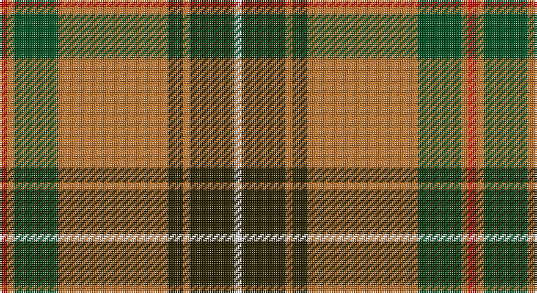

This page is one **sett** — a single exact thread-count. It belongs to the [tartan](/setts/r1o1dg6o15dy2o1dy6w1/)
(the same proportion at any scale), whose colour order is pattern [RRGRGRGW](/stripes/rrgrgrgw/).

Part of the [Connacht](/tartans/connacht/) tartan — the named design grouping this sett with its other cloths.

Sourced from register-of-tartans.  It is a [8 stripe tartan](/stripes/stripes8/).

Original link https://www.tartanregister.gov.uk/tartanDetails.aspx?ref=5878

## Also known as

This cloth is also recorded under:

- Connacht #2

## Register references

External register numbers recorded for this tartan.

- Scottish Register of Tartans: [5878](https://www.tartanregister.gov.uk/tartanDetails.aspx?ref=5878)
- Scottish Tartans World Register: 3164

## Thread count
R/4 DO4 G24 DO60 K8 DO4 K24 LN/4

One full sett is **256 threads**.

## Palette

Palette: <strong>Tartan Register</strong> <small style="color:#888">(4 of 5 colours)</small>
<table><thead><tr><th>Colour</th><th>Threads</th><th>Shade</th><th>Base</th><th>OKLCh</th></tr></thead><tbody><tr><td>R/</td><td style="text-align:right;font-variant-numeric:tabular-nums">4</td><td><code style="background-color:#DC0000;">#DC0000</code> <small style="color:#888">#DC0000</small></td><td>R <code style="background-color:#CC0000;">#CC0000</code></td><td><small style="color:#888">oklch(56.2% 0.230 29.2)</small></td></tr><tr><td>DO</td><td style="text-align:right;font-variant-numeric:tabular-nums">4</td><td><code style="background-color:#BE7832;">#BE7832</code> <small style="color:#888">#BE7832</small></td><td>R <code style="background-color:#CC0000;">#CC0000</code></td><td><small style="color:#888">oklch(63.5% 0.121 62.2)</small></td></tr><tr><td>G</td><td style="text-align:right;font-variant-numeric:tabular-nums">24</td><td><code style="background-color:#005020;">#005020</code> <small style="color:#888">#005020</small></td><td>G <code style="background-color:#006100;">#006100</code></td><td><small style="color:#888">oklch(37.7% 0.105 149.6)</small></td></tr><tr><td>DO</td><td style="text-align:right;font-variant-numeric:tabular-nums">60</td><td><code style="background-color:#BE7832;">#BE7832</code> <small style="color:#888">#BE7832</small></td><td>R <code style="background-color:#CC0000;">#CC0000</code></td><td><small style="color:#888">oklch(63.5% 0.121 62.2)</small></td></tr><tr><td>K</td><td style="text-align:right;font-variant-numeric:tabular-nums">8</td><td><code style="background-color:#2A2303;">#2A2303</code> <small style="color:#888">#2A2303</small></td><td>G <code style="background-color:#006100;">#006100</code></td><td><small style="color:#888">oklch(25.7% 0.049 96.8)</small></td></tr><tr><td>DO</td><td style="text-align:right;font-variant-numeric:tabular-nums">4</td><td><code style="background-color:#BE7832;">#BE7832</code> <small style="color:#888">#BE7832</small></td><td>R <code style="background-color:#CC0000;">#CC0000</code></td><td><small style="color:#888">oklch(63.5% 0.121 62.2)</small></td></tr><tr><td>K</td><td style="text-align:right;font-variant-numeric:tabular-nums">24</td><td><code style="background-color:#2A2303;">#2A2303</code> <small style="color:#888">#2A2303</small></td><td>G <code style="background-color:#006100;">#006100</code></td><td><small style="color:#888">oklch(25.7% 0.049 96.8)</small></td></tr><tr><td>LN/</td><td style="text-align:right;font-variant-numeric:tabular-nums">4</td><td><code style="background-color:#E0E0E0;">#E0E0E0</code> <small style="color:#888">#E0E0E0</small></td><td>W <code style="background-color:#F7F7F7;">#F7F7F7</code></td><td><small style="color:#888">oklch(90.7% 0.000 89.9)</small></td></tr></tbody></table>

# Sample pattern

## Compared to the master

This cloth is one sett of its design; the master sett (the exemplar the design is anchored on) is below for comparison.

<figure style="margin:0"><figcaption style="color:#888;font-size:smaller">this sett</figcaption></figure>
<figure style="margin:0"><figcaption style="color:#888;font-size:smaller"><a href="/setts/o64dg4dyi1dg4dyi1dg4dyi64dy2dyi2dy8/">master sett →</a></figcaption></figure>

## Nearest tartans

The nearest existing variants by ΔTartan distance, with this tartan at the top so the swatches line up against it.

ΔTartan

Tartan

Sett

—

<a href="/ttd/edit/#slug=r1o1dg6o15dy2o1dy6w1~x4">Connacht #2</a> <a class="nn-out" href="/variants/s8/r1o1dg6o15dy2o1dy6w1~x4/" title="open its dictionary page">↗</a>

0.88

<a href="/ttd/edit/#slug=g71k4r4dp9r4dp4r36dp4w4&amp;base=r1o1dg6o15dy2o1dy6w1~x4">Rattray</a> <a class="nn-out" href="/variants/s9/g71k4r4dp9r4dp4r36dp4w4/" title="open its dictionary page">↗</a>

0.92

<a href="/ttd/edit/#slug=t2g1t1g12r2g1m6ly2~x2&amp;base=r1o1dg6o15dy2o1dy6w1~x4">Manitoba District Tartan</a> <a class="nn-out" href="/variants/s8/t2g1t1g12r2g1m6ly2~x2/" title="open its dictionary page">↗</a>

0.94

<a href="/ttd/edit/#slug=r3ri4g3p3ri11g30ri3p7g3r2ri4w2~x2&amp;base=r1o1dg6o15dy2o1dy6w1~x4">MacKinnon 1</a> <a class="nn-out" href="/variants/s12/r3ri4g3p3ri11g30ri3p7g3r2ri4w2~x2/" title="open its dictionary page">↗</a>

0.96

<a href="/ttd/edit/#slug=t2dg1t1dg12r2dg1ri6ly2~x2&amp;base=r1o1dg6o15dy2o1dy6w1~x4">Manitoba Red</a> <a class="nn-out" href="/variants/s8/t2dg1t1dg12r2dg1ri6ly2~x2/" title="open its dictionary page">↗</a>

1.05

<a href="/ttd/edit/#slug=g71k4r4db9r4db4r36db4w4&amp;base=r1o1dg6o15dy2o1dy6w1~x4">Rattray</a> <a class="nn-out" href="/variants/s9/g71k4r4db9r4db4r36db4w4/" title="open its dictionary page">↗</a>

1.06

<a href="/ttd/edit/#slug=g18lb3ly1r2ly1r3ly1r10~x4&amp;base=r1o1dg6o15dy2o1dy6w1~x4">Brisbane (Artefact)</a> <a class="nn-out" href="/variants/s8/g18lb3ly1r2ly1r3ly1r10~x4/" title="open its dictionary page">↗</a>

1.09

<a href="/ttd/edit/#slug=t2g1t1g12r2g1ri6ly2~x2&amp;base=r1o1dg6o15dy2o1dy6w1~x4">Manitoba</a> <a class="nn-out" href="/variants/s8/t2g1t1g12r2g1ri6ly2~x2/" title="open its dictionary page">↗</a>

1.18

<a href="/ttd/edit/#slug=r5k2dg1k2r5k2dg18lo3~x2&amp;base=r1o1dg6o15dy2o1dy6w1~x4">Midpac Tissue (non woven)</a> <a class="nn-out" href="/variants/s8/r5k2dg1k2r5k2dg18lo3~x2/" title="open its dictionary page">↗</a>

1.20

<a href="/ttd/edit/#slug=r96db16dg34g48r18k6r9&amp;base=r1o1dg6o15dy2o1dy6w1~x4">MacDuff</a> <a class="nn-out" href="/variants/s7/r96db16dg34g48r18k6r9/" title="open its dictionary page">↗</a>

1.21

<a href="/ttd/edit/#slug=k2r1g8r3g3r14ly1r1w2~x2&amp;base=r1o1dg6o15dy2o1dy6w1~x4">Melieres, Michel (Personal)</a> <a class="nn-out" href="/variants/s9/k2r1g8r3g3r14ly1r1w2~x2/" title="open its dictionary page">↗</a>

## Neighbour map

Every grey dot is one of 14360 variants placed by the first two principal components of the ΔTartan feature space (44% of its variance). Red is this tartan; blue dots are its nearest — click one to open its page.

<svg viewBox="0 0 640 380" role="img" style="max-width:100%;height:auto;border:1px solid #e0e0e0;border-radius:4px;display:block" xmlns="http://www.w3.org/2000/svg"><image href="/nn/cloud.v1.png" width="640" height="380"/><a href="/variants/s9/g71k4r4dp9r4dp4r36dp4w4/"><circle cx="306.2" cy="118.5" r="4" fill="#3465a4"><title>Rattray</title></circle></a><a href="/variants/s8/t2g1t1g12r2g1m6ly2~x2/"><circle cx="273.7" cy="163.8" r="4" fill="#3465a4"><title>Manitoba District Tartan</title></circle></a><a href="/variants/s12/r3ri4g3p3ri11g30ri3p7g3r2ri4w2~x2/"><circle cx="265.2" cy="121.0" r="4" fill="#3465a4"><title>MacKinnon 1</title></circle></a><a href="/variants/s8/t2dg1t1dg12r2dg1ri6ly2~x2/"><circle cx="273.5" cy="164.5" r="4" fill="#3465a4"><title>Manitoba Red</title></circle></a><a href="/variants/s9/g71k4r4db9r4db4r36db4w4/"><circle cx="297.0" cy="118.6" r="4" fill="#3465a4"><title>Rattray</title></circle></a><a href="/variants/s8/g18lb3ly1r2ly1r3ly1r10~x4/"><circle cx="296.9" cy="146.6" r="4" fill="#3465a4"><title>Brisbane (Artefact)</title></circle></a><a href="/variants/s8/t2g1t1g12r2g1ri6ly2~x2/"><circle cx="268.2" cy="162.1" r="4" fill="#3465a4"><title>Manitoba</title></circle></a><a href="/variants/s8/r5k2dg1k2r5k2dg18lo3~x2/"><circle cx="308.5" cy="164.4" r="4" fill="#3465a4"><title>Midpac Tissue (non woven)</title></circle></a><a href="/variants/s7/r96db16dg34g48r18k6r9/"><circle cx="292.7" cy="160.0" r="4" fill="#3465a4"><title>MacDuff</title></circle></a><a href="/variants/s9/k2r1g8r3g3r14ly1r1w2~x2/"><circle cx="298.9" cy="135.6" r="4" fill="#3465a4"><title>Melieres, Michel (Personal)</title></circle></a><circle cx="283.6" cy="143.8" r="5" fill="#c00000"/></svg>

ID: /variants/s8/r1o1dg6o15dy2o1dy6w1~x4/
