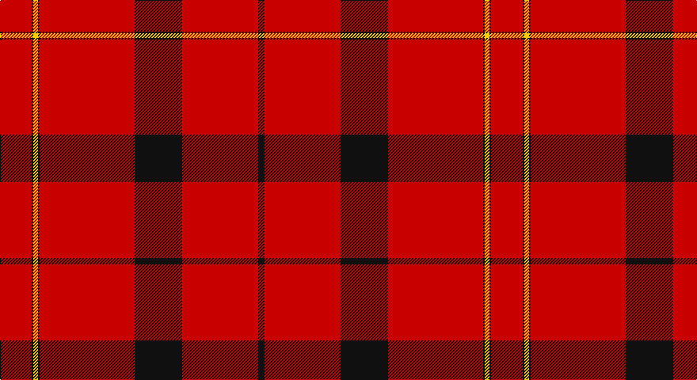

This page is one **sett** — a single exact thread-count. It belongs to the [tartan](/setts/r20k1ly3k1r60k30r48k4/)
(the same proportion at any scale), whose colour order is pattern [KRKRKYKR](/stripes/krkrkykr/).

Sourced from register-of-tartans.  It is a [8 stripe tartan](/stripes/stripes8/).

Original link https://www.tartanregister.gov.uk/tartanDetails.aspx?ref=217

2 attestations — the source records this cloth was collapsed from (oldest owns this page)

<ul>
<li>01/11/1982 — Barkwell (Personal) (register-of-tartans, <a href="https://www.tartanregister.gov.uk/tartanDetails.aspx?ref=217">record</a>)</li>
<li>pre 2002 — Barkwell (Personal) (tartans-authority, <a href="http://www.tartansauthority.com/tartan-ferret/display/2044/">record</a>)</li>
</ul>

## Register references

External register numbers recorded for this tartan.

- Scottish Register of Tartans: [217](https://www.tartanregister.gov.uk/tartanDetails.aspx?ref=217)
- Scottish Tartans Authority (ITI): 2044
- Scottish Tartans World Register: 2044

## Thread count
R/40 K2 Y6 K2 R120 K60 R96 K/8

One full sett is **620 threads**.

## Palette

Palette: <strong>Tartan Register</strong>
<table><thead><tr><th>Colour</th><th>Threads</th><th>Shade</th><th>Base</th><th>OKLCh</th></tr></thead><tbody><tr><td>R/</td><td style="text-align:right;font-variant-numeric:tabular-nums">40</td><td><code style="background-color:#C80000;">#C80000</code> <small style="color:#888">#C80000</small></td><td>R <code style="background-color:#CC0000;">#CC0000</code></td><td><small style="color:#888">oklch(52.3% 0.215 29.2)</small></td></tr><tr><td>K</td><td style="text-align:right;font-variant-numeric:tabular-nums">2</td><td><code style="background-color:#101010;">#101010</code> <small style="color:#888">#101010</small></td><td>K <code style="background-color:#000000;">#000000</code></td><td><small style="color:#888">oklch(17.3% 0.000 89.9)</small></td></tr><tr><td>Y</td><td style="text-align:right;font-variant-numeric:tabular-nums">6</td><td><code style="background-color:#FCCC00;">#FCCC00</code> <small style="color:#888">#FCCC00</small></td><td>Y <code style="background-color:#F2BF00;">#F2BF00</code></td><td><small style="color:#888">oklch(86.2% 0.176 91.5)</small></td></tr><tr><td>K</td><td style="text-align:right;font-variant-numeric:tabular-nums">2</td><td><code style="background-color:#101010;">#101010</code> <small style="color:#888">#101010</small></td><td>K <code style="background-color:#000000;">#000000</code></td><td><small style="color:#888">oklch(17.3% 0.000 89.9)</small></td></tr><tr><td>R</td><td style="text-align:right;font-variant-numeric:tabular-nums">120</td><td><code style="background-color:#C80000;">#C80000</code> <small style="color:#888">#C80000</small></td><td>R <code style="background-color:#CC0000;">#CC0000</code></td><td><small style="color:#888">oklch(52.3% 0.215 29.2)</small></td></tr><tr><td>K</td><td style="text-align:right;font-variant-numeric:tabular-nums">60</td><td><code style="background-color:#101010;">#101010</code> <small style="color:#888">#101010</small></td><td>K <code style="background-color:#000000;">#000000</code></td><td><small style="color:#888">oklch(17.3% 0.000 89.9)</small></td></tr><tr><td>R</td><td style="text-align:right;font-variant-numeric:tabular-nums">96</td><td><code style="background-color:#C80000;">#C80000</code> <small style="color:#888">#C80000</small></td><td>R <code style="background-color:#CC0000;">#CC0000</code></td><td><small style="color:#888">oklch(52.3% 0.215 29.2)</small></td></tr><tr><td>K/</td><td style="text-align:right;font-variant-numeric:tabular-nums">8</td><td><code style="background-color:#101010;">#101010</code> <small style="color:#888">#101010</small></td><td>K <code style="background-color:#000000;">#000000</code></td><td><small style="color:#888">oklch(17.3% 0.000 89.9)</small></td></tr></tbody></table>

# Sample pattern

## Nearest tartans

The nearest existing variants by ΔTartan distance, with this tartan at the top so the swatches line up against it.

ΔTartan

Tartan

Sett

—

<a href="/ttd/edit/#slug=r20k1ly3k1r60k30r48k4~x2">Barkwell (Personal)</a> <a class="nn-out" href="/variants/s8/r20k1ly3k1r60k30r48k4~x2/" title="open its dictionary page">↗</a>

1.12

<a href="/ttd/edit/#slug=ly4k1r30k15r24k2r4k1~x4&amp;base=r20k1ly3k1r60k30r48k4~x2">Oilmens (Corporate)</a> <a class="nn-out" href="/variants/s8/ly4k1r30k15r24k2r4k1~x4/" title="open its dictionary page">↗</a>

1.44

<a href="/ttd/edit/#slug=r4k2r24k15r30k1ly4k1r30k15r24k2r4k1~x4&amp;base=r20k1ly3k1r60k30r48k4~x2">Oilmens</a> <a class="nn-out" href="/variants/s14/r4k2r24k15r30k1ly4k1r30k15r24k2r4k1~x4/" title="open its dictionary page">↗</a>

1.46

<a href="/ttd/edit/#slug=g4r16k5r50g4w1~x4&amp;base=r20k1ly3k1r60k30r48k4~x2">Chalet</a> <a class="nn-out" href="/variants/s6/g4r16k5r50g4w1~x4/" title="open its dictionary page">↗</a>

1.57

<a href="/ttd/edit/#slug=r65w1r6k8g8r6k3r11~x2&amp;base=r20k1ly3k1r60k30r48k4~x2">Gudbrandsdalen, Rondastakken #2</a> <a class="nn-out" href="/variants/s8/r65w1r6k8g8r6k3r11~x2/" title="open its dictionary page">↗</a>

1.66

<a href="/ttd/edit/#slug=r90k6r6k6r90g6r6g45r6k4r3&amp;base=r20k1ly3k1r60k30r48k4~x2">MacPherson-Grant</a> <a class="nn-out" href="/variants/s11/r90k6r6k6r90g6r6g45r6k4r3/" title="open its dictionary page">↗</a>

1.68

<a href="/ttd/edit/#slug=r72k8r4g16r7o2~x2&amp;base=r20k1ly3k1r60k30r48k4~x2">MacAndrew Dress (Name)</a> <a class="nn-out" href="/variants/s6/r72k8r4g16r7o2~x2/" title="open its dictionary page">↗</a>

1.73

<a href="/ttd/edit/#slug=r51o2r6k10r2k4o3k3~x2&amp;base=r20k1ly3k1r60k30r48k4~x2">Virgin</a> <a class="nn-out" href="/variants/s8/r51o2r6k10r2k4o3k3~x2/" title="open its dictionary page">↗</a>

1.74

<a href="/variants/s8/k22w1k12r43w1~x2/">Knights Templar Hunting</a>

1.80

<a href="/ttd/edit/#slug=r40w1r1dt8r1w1r6w1r1dt8~x2&amp;base=r20k1ly3k1r60k30r48k4~x2">Miyuki #2</a> <a class="nn-out" href="/variants/s10/r40w1r1dt8r1w1r6w1r1dt8~x2/" title="open its dictionary page">↗</a>

1.83

<a href="/ttd/edit/#slug=k5r40k4w2k4r10w4r5w1~x2&amp;base=r20k1ly3k1r60k30r48k4~x2">Southern Illinois University (Corp.)</a> <a class="nn-out" href="/variants/s9/k5r40k4w2k4r10w4r5w1~x2/" title="open its dictionary page">↗</a>

## Neighbour map

Every grey dot is one of 14360 variants placed by the first two principal components of the ΔTartan feature space (44% of its variance). Red is this tartan; blue dots are its nearest — click one to open its page.

<svg viewBox="0 0 640 380" role="img" style="max-width:100%;height:auto;border:1px solid #e0e0e0;border-radius:4px;display:block" xmlns="http://www.w3.org/2000/svg"><image href="/nn/cloud.v1.png" width="640" height="380"/><a href="/variants/s8/ly4k1r30k15r24k2r4k1~x4/"><circle cx="491.9" cy="144.2" r="4" fill="#3465a4"><title>Oilmens (Corporate)</title></circle></a><a href="/variants/s14/r4k2r24k15r30k1ly4k1r30k15r24k2r4k1~x4/"><circle cx="500.5" cy="129.4" r="4" fill="#3465a4"><title>Oilmens</title></circle></a><a href="/variants/s6/g4r16k5r50g4w1~x4/"><circle cx="603.9" cy="114.5" r="4" fill="#3465a4"><title>Chalet</title></circle></a><a href="/variants/s8/r65w1r6k8g8r6k3r11~x2/"><circle cx="614.9" cy="101.1" r="4" fill="#3465a4"><title>Gudbrandsdalen, Rondastakken #2</title></circle></a><a href="/variants/s11/r90k6r6k6r90g6r6g45r6k4r3/"><circle cx="553.6" cy="129.5" r="4" fill="#3465a4"><title>MacPherson-Grant</title></circle></a><a href="/variants/s6/r72k8r4g16r7o2~x2/"><circle cx="561.8" cy="132.8" r="4" fill="#3465a4"><title>MacAndrew Dress (Name)</title></circle></a><a href="/variants/s8/r51o2r6k10r2k4o3k3~x2/"><circle cx="516.5" cy="117.3" r="4" fill="#3465a4"><title>Virgin</title></circle></a><a href="/variants/s8/k22w1k12r43w1~x2/"><circle cx="448.6" cy="136.8" r="4" fill="#3465a4"><title>Knights Templar Hunting</title></circle></a><a href="/variants/s10/r40w1r1dt8r1w1r6w1r1dt8~x2/"><circle cx="545.0" cy="99.7" r="4" fill="#3465a4"><title>Miyuki #2</title></circle></a><a href="/variants/s9/k5r40k4w2k4r10w4r5w1~x2/"><circle cx="524.1" cy="119.4" r="4" fill="#3465a4"><title>Southern Illinois University (Corp.)</title></circle></a><circle cx="559.2" cy="132.6" r="5" fill="#c00000"/></svg>

ID: /variants/s8/r20k1ly3k1r60k30r48k4~x2/
