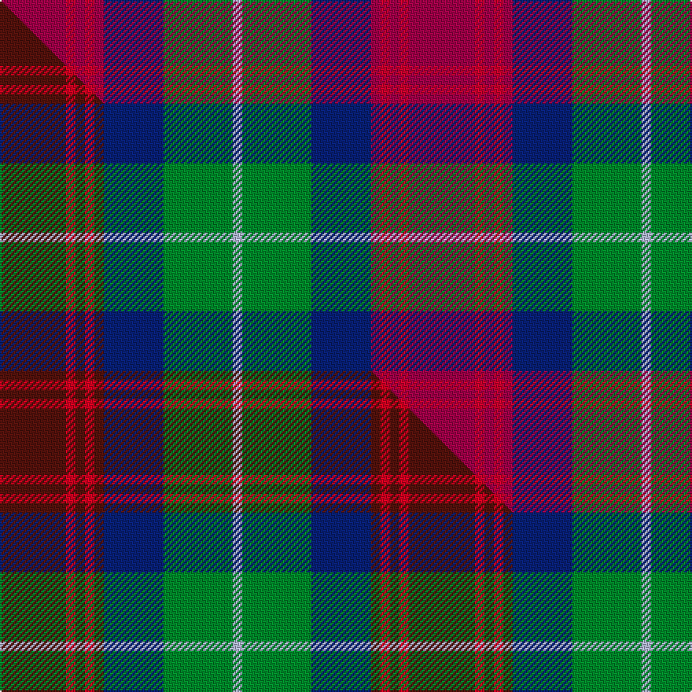

This is one **variant** — a specific cloth: this exact thread count and colourway, with its own
provenance below. It is one weaving of the [sett](/tartans/a/ak/akins/) (the scale-free proportion — the
same cloth at any scale or shade), whose colour order is pattern [RRRRRBGW](/stripes/rrrrrbgw/).

Part of the [Akins](/tartans/a/ak/akins/) tartan — the named design grouping this sett with its other cloths.

Sourced from tartans-authority.  It is a [8 stripe tartan](/stripes/stripes8/).

Original link <code>http://www.tartansauthority.com/tartan-ferret/display/2426/</code> — retired · [Internet Archive copy](https://web.archive.org/web/*/http://www.tartansauthority.com/tartan-ferret/display/2426/*)

Dataset <small>— provenance for this record, inherited from the source manifest</small>

<dl class="dataset-prov">
<dt>source</dt><dd><a href="/sources/tartans-authority/">Scottish Tartans Authority</a></dd>
<dt>data captured from</dt><dd><a href="https://github.com/thetartan/tartan-database/blob/master/data/tartans-authority/data.csv">https://github.com/thetartan/tartan-database/blob/master/data/tartans-authority/data.csv</a></dd>
<dt>data date</dt><dd>c 1820 <small>(this record)</small></dd>
<dt>licence</dt><dd><a href="https://creativecommons.org/licenses/by-nc-nd/4.0/">CC BY-NC-ND 4.0</a></dd>
</dl>

Capture chain <small>— the hands this data passed through, oldest first; each capture carries its own licence</small>

<ol class="capture-chain">
<li><a href="https://www.tartansauthority.com/">Scottish Tartans Authority</a> <small>the heritage body’s archive — its tartan-ferret record browser is retired; dead record links are shown unlinked, with an Internet Archive copy (ITI numbers are not SRT references)</small></li>
<li><a href="https://github.com/thetartan/tartan-database">thetartan/tartan-database</a> <small>2016-2017</small> · <a href="https://creativecommons.org/licenses/by-nc-nd/4.0/">CC BY-NC-ND 4.0</a> <small>Levko Kravets's frozen compilation — the capture we vendored, and where its CC licence text came from</small></li>
<li>this dictionary <small>captured 2026-06-10 · commit 5bf86c7566</small> <small>each re-capture is a git commit to data/sources</small></li>
</ol>

## Register references

External register numbers recorded for this tartan.

- Scottish Tartans Authority (ITI): 2426

## Thread count
R/42 Ri6 R6 Ri6 R6 DB38 G44 LB/6

One full sett is **260 threads**.

## Palette
<table><thead><tr><th>Colour</th><th>Shade</th><th>OKLCh</th></tr></thead><tbody><tr><td>LB</td><td><code style="background-color:#B5BBDE;">#B5BBDE</code> <small style="color:#888">#B5BBDE</small></td><td><small style="color:#888">oklch(79.9% 0.050 277.6)</small></td></tr><tr><td>DB</td><td><code style="background-color:#082077;">#082077</code> <small style="color:#888">#082077</small></td><td><small style="color:#888">oklch(30.0% 0.149 265.1)</small></td></tr><tr><td>G</td><td><code style="background-color:#008B2A;">#008B2A</code> <small style="color:#888">#008B2A</small></td><td><small style="color:#888">oklch(55.4% 0.170 145.9)</small></td></tr><tr><td>R</td><td><code style="background-color:#A00048;">#A00048</code> <small style="color:#888">#A00048</small></td><td><small style="color:#888">oklch(45.4% 0.182 5.3)</small></td></tr><tr><td>R</td><td><code style="background-color:#C8002C;">#C8002C</code> <small style="color:#888">#C8002C</small></td><td><small style="color:#888">oklch(52.6% 0.212 22.0)</small></td></tr></tbody></table>

# Sample pattern

## Compared to the master

This cloth is one sett of its design; the master sett (the exemplar the design is anchored on) is below for comparison.

Its **ΔTartan distance** from the master is **0.12** — the same measure the nearest-tartans table ranks by (0 is identical; a re-scale of the same cloth is near 0, a recolour or a different proportion further).

<figure class="master-compare" style="margin:0">

this sett
master sett ★

<figcaption style="color:#888;font-size:smaller">One weave of this sett against the <a href="/setts/dr21r3dr3r3dr3db19g22lb3/">master sett ★</a>, split on the diagonal: a shared proportion runs seamlessly across it with only the shades shifting; a different proportion breaks on it.</figcaption>
</figure>

## Nearest tartan variants

The nearest existing variants by ΔTartan distance, with this cloth at the top so the swatches line up against it.

ΔTartan

Threads

Variant

Sett

—

260

<a href="/variants/s8/r21ri3r3ri3r3db19g22lb3~x2~r1807008-ri2108022/">Akins (Clan)</a>

<a href="/ttd/edit/#slug=dr21r3dr3r3dr3db19g22lb3~x2&amp;base=r21ri3r3ri3r3db19g22lb3~x2~r1807008-ri2108022" title="compare in the TTD">0.12</a>

260

<a href="/variants/s8/dr21r3dr3r3dr3db19g22lb3~x2/">Akins Clan (Personal)</a>

<a href="/ttd/edit/#slug=dr21r3dr3r3dr3db19g22b3~x2&amp;base=r21ri3r3ri3r3db19g22lb3~x2~r1807008-ri2108022" title="compare in the TTD">0.13</a>

260

<a href="/variants/s8/dr21r3dr3r3dr3db19g22b3~x2/">Akins</a>

<a href="/ttd/edit/#slug=dp24g2o2g2o5g8lr20dy4~x2~o2605035-lr2903322&amp;base=r21ri3r3ri3r3db19g22lb3~x2~r1807008-ri2108022" title="compare in the TTD">1.94</a>

212

<a href="/variants/s8/dp24g2o2g2o5g8lr20dy4~x2~o2605035-lr2903322/">Glen Shee #2 (Fashion)</a>

<a href="/ttd/edit/#slug=r10dbi6g24db24r6y3~dbi1406275-db1004274&amp;base=r21ri3r3ri3r3db19g22lb3~x2~r1807008-ri2108022" title="compare in the TTD">2.12</a>

133

<a href="/variants/s6/r10dbi6g24db24r6y3~dbi1406275-db1004274/">Canine All Dogs (Fashion)</a>

<a href="/ttd/edit/#slug=r12db3g5dt16y2g2~x2~db1406275-dt1204274&amp;base=r21ri3r3ri3r3db19g22lb3~x2~r1807008-ri2108022" title="compare in the TTD">2.29</a>

132

<a href="/variants/s6/r12dbi3g5db16y2g2~x2~dbi1406275-db1204274/">Dunbog Primary School Corporate Tartan</a>

<a href="/ttd/edit/#slug=r5t3g24db24r4y2~x2~t2405244-db1406275&amp;base=r21ri3r3ri3r3db19g22lb3~x2~r1807008-ri2108022" title="compare in the TTD">2.37</a>

234

<a href="/variants/s6/r5t3g24db24r4y2~x2~t2405244-db1406275/">Canine All Dogs</a>

<a href="/ttd/edit/#slug=dp24g2lo2g2lo5g8o20dy4~x2&amp;base=r21ri3r3ri3r3db19g22lb3~x2~r1807008-ri2108022" title="compare in the TTD">2.52</a>

212

<a href="/variants/s8/dp24g2lo2g2lo5g8o20dy4~x2/">Glen Shee</a>

<a href="/ttd/edit/#slug=db1g4db1r1db1y1db5r6db1y1~x2&amp;base=r21ri3r3ri3r3db19g22lb3~x2~r1807008-ri2108022" title="compare in the TTD">2.73</a>

84

<a href="/variants/s10/db1g4db1r1db1y1db5r6db1y1~x2/">Unidentified Specimen #3</a>

<a href="/ttd/edit/#slug=g3db12w1dg12r12dg2~x2&amp;base=r21ri3r3ri3r3db19g22lb3~x2~r1807008-ri2108022" title="compare in the TTD">2.78</a>

158

<a href="/variants/s6/g3db12w1dg12r12dg2~x2/">Patterson, John (Personal)</a>

<a href="/ttd/edit/#slug=db3dg26db3r3db20r3db3r26dg5w3~x2&amp;base=r21ri3r3ri3r3db19g22lb3~x2~r1807008-ri2108022" title="compare in the TTD">2.78</a>

368

<a href="/variants/s10/db3dg26db3r3db20r3db3r26dg5w3~x2/">Roxburgh Red District Tartan</a>

## Neighbour map

Every grey dot is one of 13657 variants placed by the first two principal components of the ΔTartan feature space (42% of its variance). Red is this tartan; blue dots are its nearest — click one to open its page. The map is a flat projection of a many-dimensional space — [how to read it](/posts/neighbourhood-maps/).

<svg viewBox="0 0 640 380" role="img" style="max-width:100%;height:auto;border:1px solid #e0e0e0;border-radius:4px;display:block" xmlns="http://www.w3.org/2000/svg"><image href="/nn/cloud.v1.png" width="640" height="380"/><a href="/variants/s8/dr21r3dr3r3dr3db19g22lb3~x2/"><circle cx="180.4" cy="204.3" r="4" fill="#3465a4"><title>Akins Clan (Personal)</title></circle></a><a href="/variants/s8/dr21r3dr3r3dr3db19g22b3~x2/"><circle cx="189.5" cy="207.5" r="4" fill="#3465a4"><title>Akins</title></circle></a><a href="/variants/s8/dp24g2o2g2o5g8lr20dy4~x2~o2605035-lr2903322/"><circle cx="194.1" cy="173.6" r="4" fill="#3465a4"><title>Glen Shee #2 (Fashion)</title></circle></a><a href="/variants/s6/r10dbi6g24db24r6y3~dbi1406275-db1004274/"><circle cx="163.0" cy="226.1" r="4" fill="#3465a4"><title>Canine All Dogs (Fashion)</title></circle></a><a href="/variants/s6/r12dbi3g5db16y2g2~x2~dbi1406275-db1204274/"><circle cx="205.5" cy="212.8" r="4" fill="#3465a4"><title>Dunbog Primary School Corporate Tartan</title></circle></a><a href="/variants/s6/r5t3g24db24r4y2~x2~t2405244-db1406275/"><circle cx="236.2" cy="196.3" r="4" fill="#3465a4"><title>Canine All Dogs</title></circle></a><a href="/variants/s8/dp24g2lo2g2lo5g8o20dy4~x2/"><circle cx="205.2" cy="177.0" r="4" fill="#3465a4"><title>Glen Shee</title></circle></a><a href="/variants/s10/db1g4db1r1db1y1db5r6db1y1~x2/"><circle cx="207.3" cy="212.6" r="4" fill="#3465a4"><title>Unidentified Specimen #3</title></circle></a><a href="/variants/s6/g3db12w1dg12r12dg2~x2/"><circle cx="178.8" cy="207.2" r="4" fill="#3465a4"><title>Patterson, John (Personal)</title></circle></a><a href="/variants/s10/db3dg26db3r3db20r3db3r26dg5w3~x2/"><circle cx="205.6" cy="186.0" r="4" fill="#3465a4"><title>Roxburgh Red District Tartan</title></circle></a><circle cx="177.0" cy="197.5" r="5" fill="#c00000"/><text x="320" y="376" text-anchor="middle" font-size="11" fill="#999">ground</text><text x="11" y="190" text-anchor="middle" font-size="11" fill="#999" transform="rotate(-90 11 190)">complexity</text></svg>

ID: /variants/s8/r21ri3r3ri3r3db19g22lb3~x2~r1807008-ri2108022/
