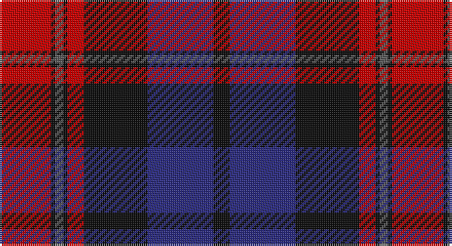

This page is one **sett** — a single exact thread-count. It belongs to the [tartan](/setts/r25k2n4k2r8k31db32k8/)
(the same proportion at any scale), whose colour order is pattern [KBKRKBKR](/stripes/kbkrkbkr/).

Part of the [Black and](/tartans/black-and/) tartan — the named design grouping this sett with its other cloths.

Sourced from register-of-tartans.  It is a [8 stripe tartan](/stripes/stripes8/).

Original link https://www.tartanregister.gov.uk/tartanDetails.aspx?ref=270

## Also known as

This cloth is also recorded under:

- Black & White Whisky
- Black and Red
- Black and White

## Register references

External register numbers recorded for this tartan.

- Scottish Register of Tartans: [270](https://www.tartanregister.gov.uk/tartanDetails.aspx?ref=270)
- Scottish Tartans Authority (ITI): 7301

## Thread count
R/25 K2 N4 K2 R8 K31 DB32 K/8

One full sett is **191 threads**.

## Palette

Palette: <strong>Tartan Register</strong> <small style="color:#888">(3 of 4 colours)</small>
<table><thead><tr><th>Colour</th><th>Threads</th><th>Shade</th><th>Base</th><th>OKLCh</th></tr></thead><tbody><tr><td>R/</td><td style="text-align:right;font-variant-numeric:tabular-nums">25</td><td><code style="background-color:#C80000;">#C80000</code> <small style="color:#888">#C80000</small></td><td>R <code style="background-color:#CC0000;">#CC0000</code></td><td><small style="color:#888">oklch(52.3% 0.215 29.2)</small></td></tr><tr><td>K</td><td style="text-align:right;font-variant-numeric:tabular-nums">2</td><td><code style="background-color:#101010;">#101010</code> <small style="color:#888">#101010</small></td><td>K <code style="background-color:#000000;">#000000</code></td><td><small style="color:#888">oklch(17.3% 0.000 89.9)</small></td></tr><tr><td>N</td><td style="text-align:right;font-variant-numeric:tabular-nums">4</td><td><code style="background-color:#5C5C5C;">#5C5C5C</code> <small style="color:#888">#5C5C5C</small></td><td>B <code style="background-color:#2A418A;">#2A418A</code></td><td><small style="color:#888">oklch(47.5% 0.000 89.9)</small></td></tr><tr><td>K</td><td style="text-align:right;font-variant-numeric:tabular-nums">2</td><td><code style="background-color:#101010;">#101010</code> <small style="color:#888">#101010</small></td><td>K <code style="background-color:#000000;">#000000</code></td><td><small style="color:#888">oklch(17.3% 0.000 89.9)</small></td></tr><tr><td>R</td><td style="text-align:right;font-variant-numeric:tabular-nums">8</td><td><code style="background-color:#C80000;">#C80000</code> <small style="color:#888">#C80000</small></td><td>R <code style="background-color:#CC0000;">#CC0000</code></td><td><small style="color:#888">oklch(52.3% 0.215 29.2)</small></td></tr><tr><td>K</td><td style="text-align:right;font-variant-numeric:tabular-nums">31</td><td><code style="background-color:#101010;">#101010</code> <small style="color:#888">#101010</small></td><td>K <code style="background-color:#000000;">#000000</code></td><td><small style="color:#888">oklch(17.3% 0.000 89.9)</small></td></tr><tr><td>DB</td><td style="text-align:right;font-variant-numeric:tabular-nums">32</td><td><code style="background-color:#2C2C80;">#2C2C80</code> <small style="color:#888">#2C2C80</small></td><td>B <code style="background-color:#2A418A;">#2A418A</code></td><td><small style="color:#888">oklch(35.0% 0.138 276.6)</small></td></tr><tr><td>K/</td><td style="text-align:right;font-variant-numeric:tabular-nums">8</td><td><code style="background-color:#101010;">#101010</code> <small style="color:#888">#101010</small></td><td>K <code style="background-color:#000000;">#000000</code></td><td><small style="color:#888">oklch(17.3% 0.000 89.9)</small></td></tr></tbody></table>

# Sample pattern

## Compared to the master

This cloth is one sett of its design; the master sett (the exemplar the design is anchored on) is below for comparison.

<figure style="margin:0"><figcaption style="color:#888;font-size:smaller">this sett</figcaption></figure>
<figure style="margin:0"><figcaption style="color:#888;font-size:smaller"><a href="/setts/k19o6k3o15w3o12w9o3w20o3w20k19r4k5w3/">master sett →</a></figcaption></figure>

## Nearest tartans

The nearest existing variants by ΔTartan distance, with this tartan at the top so the swatches line up against it.

ΔTartan

Tartan

Sett

—

<a href="/ttd/edit/#slug=r25k2n4k2r8k31db32k8">Black and Red</a> <a class="nn-out" href="/variants/s8/r25k2n4k2r8k31db32k8/" title="open its dictionary page">↗</a>

0.82

<a href="/ttd/edit/#slug=k36r3db3r3k8db24r18g3r3~x2&amp;base=r25k2n4k2r8k31db32k8">Grady (Personal)</a> <a class="nn-out" href="/variants/s9/k36r3db3r3k8db24r18g3r3~x2/" title="open its dictionary page">↗</a>

0.90

<a href="/ttd/edit/#slug=k36r3db3r3k8db24r18ly3r3~x2&amp;base=r25k2n4k2r8k31db32k8">Girl Guiding Scotland (Corporate)</a> <a class="nn-out" href="/variants/s9/k36r3db3r3k8db24r18ly3r3~x2/" title="open its dictionary page">↗</a>

0.92

<a href="/ttd/edit/#slug=db6r1db2r1db2k18r8g2~x4&amp;base=r25k2n4k2r8k31db32k8">Brown Family Tartan</a> <a class="nn-out" href="/variants/s8/db6r1db2r1db2k18r8g2~x4/" title="open its dictionary page">↗</a>

1.05

<a href="/ttd/edit/#slug=db10g1db2g3db16g1k16r16g3r2g1r10~x2&amp;base=r25k2n4k2r8k31db32k8">MacInroy (Wedding) (Personal)</a> <a class="nn-out" href="/variants/s12/db10g1db2g3db16g1k16r16g3r2g1r10~x2/" title="open its dictionary page">↗</a>

1.09

<a href="/ttd/edit/#slug=w3dg18db22r19dg1r2~x2&amp;base=r25k2n4k2r8k31db32k8">Nibley (Personal)</a> <a class="nn-out" href="/variants/s6/w3dg18db22r19dg1r2~x2/" title="open its dictionary page">↗</a>

1.13

<a href="/ttd/edit/#slug=db2r2db28k11r27w2r2~x2&amp;base=r25k2n4k2r8k31db32k8">Americana - 1978 #2 (Fashion)</a> <a class="nn-out" href="/variants/s7/db2r2db28k11r27w2r2~x2/" title="open its dictionary page">↗</a>

1.13

<a href="/ttd/edit/#slug=db4dg2r18ri10dg10db29b4~x2&amp;base=r25k2n4k2r8k31db32k8">Ross Dempster (Personal)</a> <a class="nn-out" href="/variants/s7/db4dg2r18ri10dg10db29b4~x2/" title="open its dictionary page">↗</a>

1.15

<a href="/ttd/edit/#slug=k4r37db37r2db37g37r37k4~x2&amp;base=r25k2n4k2r8k31db32k8">Skene of Cromar - 1950 (Clan)</a> <a class="nn-out" href="/variants/s8/k4r37db37r2db37g37r37k4~x2/" title="open its dictionary page">↗</a>

1.16

<a href="/ttd/edit/#slug=r3k12g4db12r1k2r1~x4&amp;base=r25k2n4k2r8k31db32k8">Sandberg</a> <a class="nn-out" href="/variants/s7/r3k12g4db12r1k2r1~x4/" title="open its dictionary page">↗</a>

1.19

<a href="/ttd/edit/#slug=w2k35db30k3r30k2r4k2r30k3w2&amp;base=r25k2n4k2r8k31db32k8">Gwyn Welsh Name Tartan</a> <a class="nn-out" href="/variants/s11/w2k35db30k3r30k2r4k2r30k3w2/" title="open its dictionary page">↗</a>

## Neighbour map

Every grey dot is one of 14360 variants placed by the first two principal components of the ΔTartan feature space (44% of its variance). Red is this tartan; blue dots are its nearest — click one to open its page.

<svg viewBox="0 0 640 380" role="img" style="max-width:100%;height:auto;border:1px solid #e0e0e0;border-radius:4px;display:block" xmlns="http://www.w3.org/2000/svg"><image href="/nn/cloud.v1.png" width="640" height="380"/><a href="/variants/s9/k36r3db3r3k8db24r18g3r3~x2/"><circle cx="259.3" cy="178.5" r="4" fill="#3465a4"><title>Grady (Personal)</title></circle></a><a href="/variants/s9/k36r3db3r3k8db24r18ly3r3~x2/"><circle cx="250.4" cy="172.6" r="4" fill="#3465a4"><title>Girl Guiding Scotland (Corporate)</title></circle></a><a href="/variants/s8/db6r1db2r1db2k18r8g2~x4/"><circle cx="284.4" cy="165.2" r="4" fill="#3465a4"><title>Brown Family Tartan</title></circle></a><a href="/variants/s12/db10g1db2g3db16g1k16r16g3r2g1r10~x2/"><circle cx="207.5" cy="156.0" r="4" fill="#3465a4"><title>MacInroy (Wedding) (Personal)</title></circle></a><a href="/variants/s6/w3dg18db22r19dg1r2~x2/"><circle cx="224.2" cy="180.6" r="4" fill="#3465a4"><title>Nibley (Personal)</title></circle></a><a href="/variants/s7/db2r2db28k11r27w2r2~x2/"><circle cx="269.8" cy="168.9" r="4" fill="#3465a4"><title>Americana - 1978 #2 (Fashion)</title></circle></a><a href="/variants/s7/db4dg2r18ri10dg10db29b4~x2/"><circle cx="224.6" cy="184.6" r="4" fill="#3465a4"><title>Ross Dempster (Personal)</title></circle></a><a href="/variants/s8/k4r37db37r2db37g37r37k4~x2/"><circle cx="234.4" cy="191.1" r="4" fill="#3465a4"><title>Skene of Cromar - 1950 (Clan)</title></circle></a><a href="/variants/s7/r3k12g4db12r1k2r1~x4/"><circle cx="243.6" cy="207.3" r="4" fill="#3465a4"><title>Sandberg</title></circle></a><a href="/variants/s11/w2k35db30k3r30k2r4k2r30k3w2/"><circle cx="297.4" cy="159.6" r="4" fill="#3465a4"><title>Gwyn Welsh Name Tartan</title></circle></a><circle cx="240.0" cy="182.0" r="5" fill="#c00000"/></svg>

ID: /variants/s8/r25k2n4k2r8k31db32k8/
