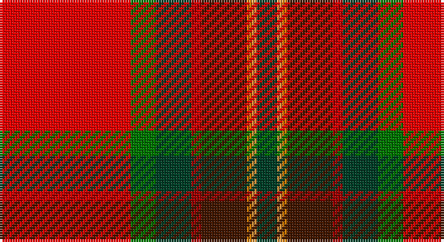

This page is one **sett** — a single exact thread-count. It belongs to the [tartan](/setts/r26g5dg7ri2do9loi1lo1dg4/)
(the same proportion at any scale), whose colour order is pattern [GYYBRGGR](/stripes/gyybrggr/).

Sourced from register-of-tartans.  It is a [8 stripe tartan](/stripes/stripes8/).

Original link https://www.tartanregister.gov.uk/tartanDetails.aspx?ref=10975

## Register references

External register numbers recorded for this tartan.

- Scottish Register of Tartans: [10975](https://www.tartanregister.gov.uk/tartanDetails.aspx?ref=10975)

## Thread count
R/52 G10 DG14 DR4 DRa18 O2 Oa2 DG/8

One full sett is **160 threads**.

## Palette

Palette: <strong>Tartan Register</strong>
<table><thead><tr><th>Colour</th><th>Threads</th><th>Shade</th><th>Base</th><th>OKLCh</th></tr></thead><tbody><tr><td>R/</td><td style="text-align:right;font-variant-numeric:tabular-nums">52</td><td><code style="background-color:#FF0000;">#FF0000</code> <small style="color:#888">#FF0000</small></td><td>R <code style="background-color:#CC0000;">#CC0000</code></td><td><small style="color:#888">oklch(62.8% 0.258 29.2)</small></td></tr><tr><td>G</td><td style="text-align:right;font-variant-numeric:tabular-nums">10</td><td><code style="background-color:#007800;">#007800</code> <small style="color:#888">#007800</small></td><td>G <code style="background-color:#006100;">#006100</code></td><td><small style="color:#888">oklch(49.6% 0.169 142.5)</small></td></tr><tr><td>DG</td><td style="text-align:right;font-variant-numeric:tabular-nums">14</td><td><code style="background-color:#004028;">#004028</code> <small style="color:#888">#004028</small></td><td>G <code style="background-color:#006100;">#006100</code></td><td><small style="color:#888">oklch(32.8% 0.073 160.8)</small></td></tr><tr><td>DR</td><td style="text-align:right;font-variant-numeric:tabular-nums">4</td><td><code style="background-color:#A00000;">#A00000</code> <small style="color:#888">#A00000</small></td><td>R <code style="background-color:#CC0000;">#CC0000</code></td><td><small style="color:#888">oklch(44.3% 0.182 29.2)</small></td></tr><tr><td>DRa</td><td style="text-align:right;font-variant-numeric:tabular-nums">18</td><td><code style="background-color:#441800;">#441800</code> <small style="color:#888">#441800</small></td><td>B <code style="background-color:#2A418A;">#2A418A</code></td><td><small style="color:#888">oklch(27.3% 0.076 46.3)</small></td></tr><tr><td>O</td><td style="text-align:right;font-variant-numeric:tabular-nums">2</td><td><code style="background-color:#D87C00;">#D87C00</code> <small style="color:#888">#D87C00</small></td><td>Y <code style="background-color:#F2BF00;">#F2BF00</code></td><td><small style="color:#888">oklch(67.3% 0.155 61.8)</small></td></tr><tr><td>Oa</td><td style="text-align:right;font-variant-numeric:tabular-nums">2</td><td><code style="background-color:#DC943C;">#DC943C</code> <small style="color:#888">#DC943C</small></td><td>Y <code style="background-color:#F2BF00;">#F2BF00</code></td><td><small style="color:#888">oklch(72.3% 0.133 67.9)</small></td></tr><tr><td>DG/</td><td style="text-align:right;font-variant-numeric:tabular-nums">8</td><td><code style="background-color:#004028;">#004028</code> <small style="color:#888">#004028</small></td><td>G <code style="background-color:#006100;">#006100</code></td><td><small style="color:#888">oklch(32.8% 0.073 160.8)</small></td></tr></tbody></table>

# Sample pattern

## Nearest tartans

The nearest existing variants by ΔTartan distance, with this tartan at the top so the swatches line up against it.

ΔTartan

Tartan

Sett

—

<a href="/ttd/edit/#slug=r26g5dg7ri2do9loi1lo1dg4~x2">Tartan Army Whisky</a> <a class="nn-out" href="/variants/s8/r26g5dg7ri2do9loi1lo1dg4~x2/" title="open its dictionary page">↗</a>

1.09

<a href="/ttd/edit/#slug=r26g5dg7ri2do9lo1loi1dg4~x2&amp;base=r26g5dg7ri2do9loi1lo1dg4~x2">Tartan Army Whisky</a> <a class="nn-out" href="/variants/s8/r26g5dg7ri2do9lo1loi1dg4~x2/" title="open its dictionary page">↗</a>

1.12

<a href="/ttd/edit/#slug=r40g16ly2k8y4w1db5w2~x2&amp;base=r26g5dg7ri2do9loi1lo1dg4~x2">Ancient Caledonian Society</a> <a class="nn-out" href="/variants/s8/r40g16ly2k8y4w1db5w2~x2/" title="open its dictionary page">↗</a>

1.32

<a href="/ttd/edit/#slug=ly3r4k1r27lyi14r4db15w2~x2&amp;base=r26g5dg7ri2do9loi1lo1dg4~x2">Dalmagarry (Corporate)</a> <a class="nn-out" href="/variants/s8/ly3r4k1r27lyi14r4db15w2~x2/" title="open its dictionary page">↗</a>

1.32

<a href="/ttd/edit/#slug=r40g16ly2k8t4w1db5w2~x2&amp;base=r26g5dg7ri2do9loi1lo1dg4~x2">Caledonian Society, Ancient</a> <a class="nn-out" href="/variants/s8/r40g16ly2k8t4w1db5w2~x2/" title="open its dictionary page">↗</a>

1.32

<a href="/ttd/edit/#slug=g3r4k1r26y14r4dp16w2~x2&amp;base=r26g5dg7ri2do9loi1lo1dg4~x2">MacQueen of Dalmagarry (Clan?)</a> <a class="nn-out" href="/variants/s8/g3r4k1r26y14r4dp16w2~x2/" title="open its dictionary page">↗</a>

1.44

<a href="/ttd/edit/#slug=r3lo15g4dt6w2r30dt6ly3~x2&amp;base=r26g5dg7ri2do9loi1lo1dg4~x2">Round Table Sweden</a> <a class="nn-out" href="/variants/s8/r3lo15g4dt6w2r30dt6ly3~x2/" title="open its dictionary page">↗</a>

1.47

<a href="/ttd/edit/#slug=r48t8k10ly2k3w2g25r10k3r3w2~x2&amp;base=r26g5dg7ri2do9loi1lo1dg4~x2">Followers' Plaid</a> <a class="nn-out" href="/variants/s11/r48t8k10ly2k3w2g25r10k3r3w2~x2/" title="open its dictionary page">↗</a>

1.47

<a href="/ttd/edit/#slug=r26w1k8ly1dg13k1w4k1ly2k4t3r8~x4&amp;base=r26g5dg7ri2do9loi1lo1dg4~x2">Drummond Relic</a> <a class="nn-out" href="/variants/s12/r26w1k8ly1dg13k1w4k1ly2k4t3r8~x4/" title="open its dictionary page">↗</a>

1.50

<a href="/ttd/edit/#slug=r41w2p5ly2g21r9p5db3w2~x2&amp;base=r26g5dg7ri2do9loi1lo1dg4~x2">Perthshire, or Drummond</a> <a class="nn-out" href="/variants/s9/r41w2p5ly2g21r9p5db3w2~x2/" title="open its dictionary page">↗</a>

1.52

<a href="/ttd/edit/#slug=y9t5k8ly2k4w4k4dg31r50t4r4k3~x2&amp;base=r26g5dg7ri2do9loi1lo1dg4~x2">MacLean of Duart</a> <a class="nn-out" href="/variants/s12/y9t5k8ly2k4w4k4dg31r50t4r4k3~x2/" title="open its dictionary page">↗</a>

## Neighbour map

Every grey dot is one of 14360 variants placed by the first two principal components of the ΔTartan feature space (44% of its variance). Red is this tartan; blue dots are its nearest — click one to open its page.

<svg viewBox="0 0 640 380" role="img" style="max-width:100%;height:auto;border:1px solid #e0e0e0;border-radius:4px;display:block" xmlns="http://www.w3.org/2000/svg"><image href="/nn/cloud.v1.png" width="640" height="380"/><a href="/variants/s8/r26g5dg7ri2do9lo1loi1dg4~x2/"><circle cx="261.6" cy="96.3" r="4" fill="#3465a4"><title>Tartan Army Whisky</title></circle></a><a href="/variants/s8/r40g16ly2k8y4w1db5w2~x2/"><circle cx="274.4" cy="56.7" r="4" fill="#3465a4"><title>Ancient Caledonian Society</title></circle></a><a href="/variants/s8/ly3r4k1r27lyi14r4db15w2~x2/"><circle cx="253.7" cy="92.7" r="4" fill="#3465a4"><title>Dalmagarry (Corporate)</title></circle></a><a href="/variants/s8/r40g16ly2k8t4w1db5w2~x2/"><circle cx="262.7" cy="53.0" r="4" fill="#3465a4"><title>Caledonian Society, Ancient</title></circle></a><a href="/variants/s8/g3r4k1r26y14r4dp16w2~x2/"><circle cx="271.0" cy="113.2" r="4" fill="#3465a4"><title>MacQueen of Dalmagarry (Clan?)</title></circle></a><a href="/variants/s8/r3lo15g4dt6w2r30dt6ly3~x2/"><circle cx="229.2" cy="120.6" r="4" fill="#3465a4"><title>Round Table Sweden</title></circle></a><a href="/variants/s11/r48t8k10ly2k3w2g25r10k3r3w2~x2/"><circle cx="280.4" cy="76.3" r="4" fill="#3465a4"><title>Followers' Plaid</title></circle></a><a href="/variants/s12/r26w1k8ly1dg13k1w4k1ly2k4t3r8~x4/"><circle cx="228.6" cy="67.9" r="4" fill="#3465a4"><title>Drummond Relic</title></circle></a><a href="/variants/s9/r41w2p5ly2g21r9p5db3w2~x2/"><circle cx="307.9" cy="95.1" r="4" fill="#3465a4"><title>Perthshire, or Drummond</title></circle></a><a href="/variants/s12/y9t5k8ly2k4w4k4dg31r50t4r4k3~x2/"><circle cx="199.8" cy="53.8" r="4" fill="#3465a4"><title>MacLean of Duart</title></circle></a><circle cx="236.0" cy="77.0" r="5" fill="#c00000"/></svg>

ID: /variants/s8/r26g5dg7ri2do9loi1lo1dg4~x2/
