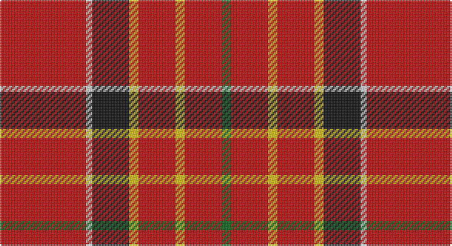

This page is one **sett** — a single exact thread-count. It belongs to the [tartan](/setts/r28w2k12ly3r12ly3r12g3/)
(the same proportion at any scale), whose colour order is pattern [GRYRYKWR](/stripes/gryrykwr/).

Part of the [Hackston or Halkerston](/tartans/hackston-or-halkerston/) tartan — the named design grouping this sett with its other cloths.

Sourced from house-of-tartan.  It is a [8 stripe tartan](/stripes/stripes8/).

Original link http://www.house-of-tartan.scotland.net/house/TartanViewjs.asp?colr=Def&tnam=907

## Provenance

Earliest known date: 1987 Taken from a portrait (c. 1746) Red pivot reduced by half for display. Should read R112.

## Also known as

This cloth is also recorded under:

- Hackston, or Halkerston

## Thread count
R/56 LN4 K24 Y6 R24 Y6 R24 G/6

One full sett is **238 threads**.

## Palette

Palette: <strong>Tartan Register</strong>
<table><thead><tr><th>Colour</th><th>Threads</th><th>Shade</th><th>Base</th><th>OKLCh</th></tr></thead><tbody><tr><td>R/</td><td style="text-align:right;font-variant-numeric:tabular-nums">56</td><td><code style="background-color:#C80000;">#C80000</code> <small style="color:#888">#C80000</small></td><td>R <code style="background-color:#CC0000;">#CC0000</code></td><td><small style="color:#888">oklch(52.3% 0.215 29.2)</small></td></tr><tr><td>LN</td><td style="text-align:right;font-variant-numeric:tabular-nums">4</td><td><code style="background-color:#E0E0E0;">#E0E0E0</code> <small style="color:#888">#E0E0E0</small></td><td>W <code style="background-color:#F7F7F7;">#F7F7F7</code></td><td><small style="color:#888">oklch(90.7% 0.000 89.9)</small></td></tr><tr><td>K</td><td style="text-align:right;font-variant-numeric:tabular-nums">24</td><td><code style="background-color:#101010;">#101010</code> <small style="color:#888">#101010</small></td><td>K <code style="background-color:#000000;">#000000</code></td><td><small style="color:#888">oklch(17.3% 0.000 89.9)</small></td></tr><tr><td>Y</td><td style="text-align:right;font-variant-numeric:tabular-nums">6</td><td><code style="background-color:#E8C000;">#E8C000</code> <small style="color:#888">#E8C000</small></td><td>Y <code style="background-color:#F2BF00;">#F2BF00</code></td><td><small style="color:#888">oklch(81.9% 0.168 93.7)</small></td></tr><tr><td>R</td><td style="text-align:right;font-variant-numeric:tabular-nums">24</td><td><code style="background-color:#C80000;">#C80000</code> <small style="color:#888">#C80000</small></td><td>R <code style="background-color:#CC0000;">#CC0000</code></td><td><small style="color:#888">oklch(52.3% 0.215 29.2)</small></td></tr><tr><td>Y</td><td style="text-align:right;font-variant-numeric:tabular-nums">6</td><td><code style="background-color:#E8C000;">#E8C000</code> <small style="color:#888">#E8C000</small></td><td>Y <code style="background-color:#F2BF00;">#F2BF00</code></td><td><small style="color:#888">oklch(81.9% 0.168 93.7)</small></td></tr><tr><td>R</td><td style="text-align:right;font-variant-numeric:tabular-nums">24</td><td><code style="background-color:#C80000;">#C80000</code> <small style="color:#888">#C80000</small></td><td>R <code style="background-color:#CC0000;">#CC0000</code></td><td><small style="color:#888">oklch(52.3% 0.215 29.2)</small></td></tr><tr><td>G/</td><td style="text-align:right;font-variant-numeric:tabular-nums">6</td><td><code style="background-color:#006818;">#006818</code> <small style="color:#888">#006818</small></td><td>G <code style="background-color:#006100;">#006100</code></td><td><small style="color:#888">oklch(45.0% 0.142 145.0)</small></td></tr></tbody></table>

# Sample pattern

## Compared to the master

This cloth is one sett of its design; the master sett (the exemplar the design is anchored on) is below for comparison.

<figure style="margin:0"><figcaption style="color:#888;font-size:smaller">this sett</figcaption></figure>
<figure style="margin:0"><figcaption style="color:#888;font-size:smaller"><a href="/setts/r11lo3r11lo3k11lr2r51lr2k11lo3r11lo3r11g3/">master sett →</a></figcaption></figure>

## Nearest tartans

The nearest existing variants by ΔTartan distance, with this tartan at the top so the swatches line up against it.

ΔTartan

Tartan

Sett

—

<a href="/ttd/edit/#slug=r28w2k12ly3r12ly3r12g3~x2">Hackston or Halkerston Family Tartan</a> <a class="nn-out" href="/variants/s8/r28w2k12ly3r12ly3r12g3~x2/" title="open its dictionary page">↗</a>

0.81

<a href="/ttd/edit/#slug=r30g12k5w2t6r30&amp;base=r28w2k12ly3r12ly3r12g3~x2">Sinclair</a> <a class="nn-out" href="/variants/s6/r30g12k5w2t6r30/" title="open its dictionary page">↗</a>

1.26

<a href="/ttd/edit/#slug=r48ly14r9gi14k6r11g6r10gi3~x2&amp;base=r28w2k12ly3r12ly3r12g3~x2">Justerini &amp; Brooks</a> <a class="nn-out" href="/variants/s9/r48ly14r9gi14k6r11g6r10gi3~x2/" title="open its dictionary page">↗</a>

1.29

<a href="/ttd/edit/#slug=k3w1r20db4r4g10r4db4r20k1w3~x2&amp;base=r28w2k12ly3r12ly3r12g3~x2">Hoben (Personal)</a> <a class="nn-out" href="/variants/s11/k3w1r20db4r4g10r4db4r20k1w3~x2/" title="open its dictionary page">↗</a>

1.35

<a href="/ttd/edit/#slug=r30dg12k5lr2b6r30~x2&amp;base=r28w2k12ly3r12ly3r12g3~x2">Sinclair</a> <a class="nn-out" href="/variants/s6/r30dg12k5lr2b6r30~x2/" title="open its dictionary page">↗</a>

1.35

<a href="/ttd/edit/#slug=r30dg12k5lr2b6r30&amp;base=r28w2k12ly3r12ly3r12g3~x2">Sinclair</a> <a class="nn-out" href="/variants/s6/r30dg12k5lr2b6r30/" title="open its dictionary page">↗</a>

1.38

<a href="/ttd/edit/#slug=r8w4r50k12r4k15g5~x2&amp;base=r28w2k12ly3r12ly3r12g3~x2">Instakilt, Red (Fashion)</a> <a class="nn-out" href="/variants/s7/r8w4r50k12r4k15g5~x2/" title="open its dictionary page">↗</a>

1.47

<a href="/ttd/edit/#slug=r28g16k4w1t6r28~x2&amp;base=r28w2k12ly3r12ly3r12g3~x2">Sinclair</a> <a class="nn-out" href="/variants/s6/r28g16k4w1t6r28~x2/" title="open its dictionary page">↗</a>

1.50

<a href="/ttd/edit/#slug=r6g14r6db12r31lb2r4ly3~x2&amp;base=r28w2k12ly3r12ly3r12g3~x2">Loch Lochy (District)</a> <a class="nn-out" href="/variants/s8/r6g14r6db12r31lb2r4ly3~x2/" title="open its dictionary page">↗</a>

1.51

<a href="/ttd/edit/#slug=r6dg14r6db11r31lb2r4ly3~x2&amp;base=r28w2k12ly3r12ly3r12g3~x2">Loch Lochy</a> <a class="nn-out" href="/variants/s8/r6dg14r6db11r31lb2r4ly3~x2/" title="open its dictionary page">↗</a>

1.51

<a href="/ttd/edit/#slug=g4r32db9r6db2r3db2r12w3~x2&amp;base=r28w2k12ly3r12ly3r12g3~x2">Rose</a> <a class="nn-out" href="/variants/s9/g4r32db9r6db2r3db2r12w3~x2/" title="open its dictionary page">↗</a>

## Neighbour map

Every grey dot is one of 14360 variants placed by the first two principal components of the ΔTartan feature space (44% of its variance). Red is this tartan; blue dots are its nearest — click one to open its page.

<svg viewBox="0 0 640 380" role="img" style="max-width:100%;height:auto;border:1px solid #e0e0e0;border-radius:4px;display:block" xmlns="http://www.w3.org/2000/svg"><image href="/nn/cloud.v1.png" width="640" height="380"/><a href="/variants/s6/r30g12k5w2t6r30/"><circle cx="399.3" cy="169.7" r="4" fill="#3465a4"><title>Sinclair</title></circle></a><a href="/variants/s9/r48ly14r9gi14k6r11g6r10gi3~x2/"><circle cx="354.4" cy="138.4" r="4" fill="#3465a4"><title>Justerini &amp; Brooks</title></circle></a><a href="/variants/s11/k3w1r20db4r4g10r4db4r20k1w3~x2/"><circle cx="360.0" cy="116.2" r="4" fill="#3465a4"><title>Hoben (Personal)</title></circle></a><a href="/variants/s6/r30dg12k5lr2b6r30~x2/"><circle cx="418.5" cy="183.1" r="4" fill="#3465a4"><title>Sinclair</title></circle></a><a href="/variants/s6/r30dg12k5lr2b6r30/"><circle cx="418.5" cy="183.1" r="4" fill="#3465a4"><title>Sinclair</title></circle></a><a href="/variants/s7/r8w4r50k12r4k15g5~x2/"><circle cx="364.9" cy="150.8" r="4" fill="#3465a4"><title>Instakilt, Red (Fashion)</title></circle></a><a href="/variants/s6/r28g16k4w1t6r28~x2/"><circle cx="402.5" cy="152.1" r="4" fill="#3465a4"><title>Sinclair</title></circle></a><a href="/variants/s8/r6g14r6db12r31lb2r4ly3~x2/"><circle cx="333.6" cy="149.6" r="4" fill="#3465a4"><title>Loch Lochy (District)</title></circle></a><a href="/variants/s8/r6dg14r6db11r31lb2r4ly3~x2/"><circle cx="331.2" cy="143.9" r="4" fill="#3465a4"><title>Loch Lochy</title></circle></a><a href="/variants/s9/g4r32db9r6db2r3db2r12w3~x2/"><circle cx="461.9" cy="145.7" r="4" fill="#3465a4"><title>Rose</title></circle></a><circle cx="382.8" cy="148.3" r="5" fill="#c00000"/></svg>

ID: /variants/s8/r28w2k12ly3r12ly3r12g3~x2/
