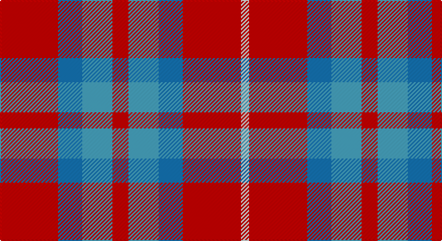

This page is one **sett** — a single exact thread-count. It belongs to the [tartan](/setts/r29b12lg15r8lg15b12r29w4/)
(the same proportion at any scale), whose colour order is pattern [RBYRYBRW](/stripes/rbyrybrw/).

Part of the [Snowbird](/tartans/snowbird/) tartan — the named design grouping this sett with its other cloths.

Sourced from register-of-tartans.  It is a [8 stripe tartan](/stripes/stripes8/).

Original link https://www.tartanregister.gov.uk/tartanDetails.aspx?ref=3829

## Register references

External register numbers recorded for this tartan.

- Scottish Register of Tartans: [3829](https://www.tartanregister.gov.uk/tartanDetails.aspx?ref=3829)
- Scottish Tartans Authority (ITI): 6428

## Thread count
R/58 B24 Ba30 R16 Ba30 B24 R58 LN/8

One full sett is **430 threads**.

## Palette

Palette: <strong>Tartan Register</strong>
<table><thead><tr><th>Colour</th><th>Threads</th><th>Shade</th><th>Base</th><th>OKLCh</th></tr></thead><tbody><tr><td>R/</td><td style="text-align:right;font-variant-numeric:tabular-nums">58</td><td><code style="background-color:#C80000;">#C80000</code> <small style="color:#888">#C80000</small></td><td>R <code style="background-color:#CC0000;">#CC0000</code></td><td><small style="color:#888">oklch(52.3% 0.215 29.2)</small></td></tr><tr><td>B</td><td style="text-align:right;font-variant-numeric:tabular-nums">24</td><td><code style="background-color:#1474B4;">#1474B4</code> <small style="color:#888">#1474B4</small></td><td>B <code style="background-color:#2A418A;">#2A418A</code></td><td><small style="color:#888">oklch(54.0% 0.129 245.1)</small></td></tr><tr><td>Ba</td><td style="text-align:right;font-variant-numeric:tabular-nums">30</td><td><code style="background-color:#48A4C0;">#48A4C0</code> <small style="color:#888">#48A4C0</small></td><td>Y <code style="background-color:#F2BF00;">#F2BF00</code></td><td><small style="color:#888">oklch(67.5% 0.096 221.0)</small></td></tr><tr><td>R</td><td style="text-align:right;font-variant-numeric:tabular-nums">16</td><td><code style="background-color:#C80000;">#C80000</code> <small style="color:#888">#C80000</small></td><td>R <code style="background-color:#CC0000;">#CC0000</code></td><td><small style="color:#888">oklch(52.3% 0.215 29.2)</small></td></tr><tr><td>Ba</td><td style="text-align:right;font-variant-numeric:tabular-nums">30</td><td><code style="background-color:#48A4C0;">#48A4C0</code> <small style="color:#888">#48A4C0</small></td><td>Y <code style="background-color:#F2BF00;">#F2BF00</code></td><td><small style="color:#888">oklch(67.5% 0.096 221.0)</small></td></tr><tr><td>B</td><td style="text-align:right;font-variant-numeric:tabular-nums">24</td><td><code style="background-color:#1474B4;">#1474B4</code> <small style="color:#888">#1474B4</small></td><td>B <code style="background-color:#2A418A;">#2A418A</code></td><td><small style="color:#888">oklch(54.0% 0.129 245.1)</small></td></tr><tr><td>R</td><td style="text-align:right;font-variant-numeric:tabular-nums">58</td><td><code style="background-color:#C80000;">#C80000</code> <small style="color:#888">#C80000</small></td><td>R <code style="background-color:#CC0000;">#CC0000</code></td><td><small style="color:#888">oklch(52.3% 0.215 29.2)</small></td></tr><tr><td>LN/</td><td style="text-align:right;font-variant-numeric:tabular-nums">8</td><td><code style="background-color:#E0E0E0;">#E0E0E0</code> <small style="color:#888">#E0E0E0</small></td><td>W <code style="background-color:#F7F7F7;">#F7F7F7</code></td><td><small style="color:#888">oklch(90.7% 0.000 89.9)</small></td></tr></tbody></table>

# Sample pattern

## Nearest tartans

The nearest existing variants by ΔTartan distance, with this tartan at the top so the swatches line up against it.

ΔTartan

Tartan

Sett

—

<a href="/ttd/edit/#slug=r29b12lg15r8lg15b12r29w4~x2">Snowbird</a> <a class="nn-out" href="/variants/s8/r29b12lg15r8lg15b12r29w4~x2/" title="open its dictionary page">↗</a>

1.04

<a href="/ttd/edit/#slug=r8lg15b12r29w4~x2&amp;base=r29b12lg15r8lg15b12r29w4~x2">Snowbird (Corporate)</a> <a class="nn-out" href="/variants/s5/r8lg15b12r29w4~x2/" title="open its dictionary page">↗</a>

1.23

<a href="/ttd/edit/#slug=r6g3r6db1w1db1r2db8r4~x2&amp;base=r29b12lg15r8lg15b12r29w4~x2">Cameron of Lochiel</a> <a class="nn-out" href="/variants/s9/r6g3r6db1w1db1r2db8r4~x2/" title="open its dictionary page">↗</a>

1.30

<a href="/ttd/edit/#slug=r16o2r11o6k4w2k4o16~x2&amp;base=r29b12lg15r8lg15b12r29w4~x2">Sidney (Nova Scotia) Canadian Tartan</a> <a class="nn-out" href="/variants/s8/r16o2r11o6k4w2k4o16~x2/" title="open its dictionary page">↗</a>

1.32

<a href="/ttd/edit/#slug=b6o6w1o6b6ly1~x8&amp;base=r29b12lg15r8lg15b12r29w4~x2">Unidentified Lindley</a> <a class="nn-out" href="/variants/s6/b6o6w1o6b6ly1~x8/" title="open its dictionary page">↗</a>

1.39

<a href="/ttd/edit/#slug=o16oi2o11oi6k4w2k4oi16~x2&amp;base=r29b12lg15r8lg15b12r29w4~x2">Sydney (Nova Scotia) (District)</a> <a class="nn-out" href="/variants/s8/o16oi2o11oi6k4w2k4oi16~x2/" title="open its dictionary page">↗</a>

1.47

<a href="/ttd/edit/#slug=r13t3r13g12ly2dp9t9r13dp2~x2&amp;base=r29b12lg15r8lg15b12r29w4~x2">Caledonia No 3</a> <a class="nn-out" href="/variants/s9/r13t3r13g12ly2dp9t9r13dp2~x2/" title="open its dictionary page">↗</a>

1.50

<a href="/ttd/edit/#slug=dp2r4g12r3dp6r10w2~x2&amp;base=r29b12lg15r8lg15b12r29w4~x2">MacKintosh-Geddes (Personal?)</a> <a class="nn-out" href="/variants/s7/dp2r4g12r3dp6r10w2~x2/" title="open its dictionary page">↗</a>

1.52

<a href="/ttd/edit/#slug=r22t8k9dg14r10t2r10~x2&amp;base=r29b12lg15r8lg15b12r29w4~x2">MacDuff #2</a> <a class="nn-out" href="/variants/s7/r22t8k9dg14r10t2r10~x2/" title="open its dictionary page">↗</a>

1.56

<a href="/ttd/edit/#slug=r13t3r13dg12ly2dp9t9r13dp2~x2&amp;base=r29b12lg15r8lg15b12r29w4~x2">Caledonia No 3</a> <a class="nn-out" href="/variants/s9/r13t3r13dg12ly2dp9t9r13dp2~x2/" title="open its dictionary page">↗</a>

1.56

<a href="/ttd/edit/#slug=r8t3k4dg6r4k1r4~x2&amp;base=r29b12lg15r8lg15b12r29w4~x2">MacDuff #5</a> <a class="nn-out" href="/variants/s7/r8t3k4dg6r4k1r4~x2/" title="open its dictionary page">↗</a>

## Neighbour map

Every grey dot is one of 14360 variants placed by the first two principal components of the ΔTartan feature space (44% of its variance). Red is this tartan; blue dots are its nearest — click one to open its page.

<svg viewBox="0 0 640 380" role="img" style="max-width:100%;height:auto;border:1px solid #e0e0e0;border-radius:4px;display:block" xmlns="http://www.w3.org/2000/svg"><image href="/nn/cloud.v1.png" width="640" height="380"/><a href="/variants/s5/r8lg15b12r29w4~x2/"><circle cx="267.6" cy="236.1" r="4" fill="#3465a4"><title>Snowbird (Corporate)</title></circle></a><a href="/variants/s9/r6g3r6db1w1db1r2db8r4~x2/"><circle cx="299.8" cy="210.1" r="4" fill="#3465a4"><title>Cameron of Lochiel</title></circle></a><a href="/variants/s8/r16o2r11o6k4w2k4o16~x2/"><circle cx="235.6" cy="203.4" r="4" fill="#3465a4"><title>Sidney (Nova Scotia) Canadian Tartan</title></circle></a><a href="/variants/s6/b6o6w1o6b6ly1~x8/"><circle cx="231.8" cy="248.3" r="4" fill="#3465a4"><title>Unidentified Lindley</title></circle></a><a href="/variants/s8/o16oi2o11oi6k4w2k4oi16~x2/"><circle cx="243.6" cy="214.0" r="4" fill="#3465a4"><title>Sydney (Nova Scotia) (District)</title></circle></a><a href="/variants/s9/r13t3r13g12ly2dp9t9r13dp2~x2/"><circle cx="198.6" cy="210.4" r="4" fill="#3465a4"><title>Caledonia No 3</title></circle></a><a href="/variants/s7/dp2r4g12r3dp6r10w2~x2/"><circle cx="200.6" cy="223.5" r="4" fill="#3465a4"><title>MacKintosh-Geddes (Personal?)</title></circle></a><a href="/variants/s7/r22t8k9dg14r10t2r10~x2/"><circle cx="267.5" cy="216.7" r="4" fill="#3465a4"><title>MacDuff #2</title></circle></a><a href="/variants/s9/r13t3r13dg12ly2dp9t9r13dp2~x2/"><circle cx="191.7" cy="204.6" r="4" fill="#3465a4"><title>Caledonia No 3</title></circle></a><a href="/variants/s7/r8t3k4dg6r4k1r4~x2/"><circle cx="230.9" cy="233.9" r="4" fill="#3465a4"><title>MacDuff #5</title></circle></a><circle cx="249.4" cy="228.7" r="5" fill="#c00000"/></svg>

ID: /variants/s8/r29b12lg15r8lg15b12r29w4~x2/
