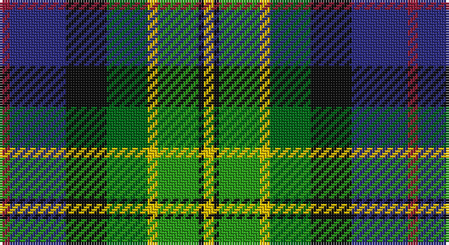

This page is one **sett** — a single exact thread-count. It belongs to the [tartan](/setts/r2db11k8gi8ly2g8k1ly2/)
(the same proportion at any scale), whose colour order is pattern [RBKGYGKY](/stripes/rbkgygky/).

Part of the [Scout Mapping Service](/tartans/scout-mapping-service/) tartan — the named design grouping this sett with its other cloths.

Sourced from tartans-authority.  It is a [8 stripe tartan](/stripes/stripes8/).

Original link http://www.tartansauthority.com/tartan-ferret/display/3823/

## Also known as

This cloth is also recorded under:

- Scout Mapping Service #1
- Scout Mapping Service #2

## Register references

External register numbers recorded for this tartan.

- Scottish Tartans Authority (ITI): 3823

## Thread count
DR/4 DB22 K16 Ga16 Y4 G16 K2 Y/4

One full sett is **160 threads**.

## Palette

Palette: <strong>Tartan Register</strong>
<table><thead><tr><th>Colour</th><th>Threads</th><th>Shade</th><th>Base</th><th>OKLCh</th></tr></thead><tbody><tr><td>DR/</td><td style="text-align:right;font-variant-numeric:tabular-nums">4</td><td><code style="background-color:#901C38;">#901C38</code> <small style="color:#888">#901C38</small></td><td>R <code style="background-color:#CC0000;">#CC0000</code></td><td><small style="color:#888">oklch(43.2% 0.150 13.1)</small></td></tr><tr><td>DB</td><td style="text-align:right;font-variant-numeric:tabular-nums">22</td><td><code style="background-color:#2C2C80;">#2C2C80</code> <small style="color:#888">#2C2C80</small></td><td>B <code style="background-color:#2A418A;">#2A418A</code></td><td><small style="color:#888">oklch(35.0% 0.138 276.6)</small></td></tr><tr><td>K</td><td style="text-align:right;font-variant-numeric:tabular-nums">16</td><td><code style="background-color:#101010;">#101010</code> <small style="color:#888">#101010</small></td><td>K <code style="background-color:#000000;">#000000</code></td><td><small style="color:#888">oklch(17.3% 0.000 89.9)</small></td></tr><tr><td>Ga</td><td style="text-align:right;font-variant-numeric:tabular-nums">16</td><td><code style="background-color:#006818;">#006818</code> <small style="color:#888">#006818</small></td><td>G <code style="background-color:#006100;">#006100</code></td><td><small style="color:#888">oklch(45.0% 0.142 145.0)</small></td></tr><tr><td>Y</td><td style="text-align:right;font-variant-numeric:tabular-nums">4</td><td><code style="background-color:#E8C000;">#E8C000</code> <small style="color:#888">#E8C000</small></td><td>Y <code style="background-color:#F2BF00;">#F2BF00</code></td><td><small style="color:#888">oklch(81.9% 0.168 93.7)</small></td></tr><tr><td>G</td><td style="text-align:right;font-variant-numeric:tabular-nums">16</td><td><code style="background-color:#289C18;">#289C18</code> <small style="color:#888">#289C18</small></td><td>G <code style="background-color:#006100;">#006100</code></td><td><small style="color:#888">oklch(60.6% 0.191 141.6)</small></td></tr><tr><td>K</td><td style="text-align:right;font-variant-numeric:tabular-nums">2</td><td><code style="background-color:#101010;">#101010</code> <small style="color:#888">#101010</small></td><td>K <code style="background-color:#000000;">#000000</code></td><td><small style="color:#888">oklch(17.3% 0.000 89.9)</small></td></tr><tr><td>Y/</td><td style="text-align:right;font-variant-numeric:tabular-nums">4</td><td><code style="background-color:#E8C000;">#E8C000</code> <small style="color:#888">#E8C000</small></td><td>Y <code style="background-color:#F2BF00;">#F2BF00</code></td><td><small style="color:#888">oklch(81.9% 0.168 93.7)</small></td></tr></tbody></table>

# Sample pattern

## Compared to the master

This cloth is one sett of its design; the master sett (the exemplar the design is anchored on) is below for comparison.

<figure style="margin:0"><figcaption style="color:#888;font-size:smaller">this sett</figcaption></figure>
<figure style="margin:0"><figcaption style="color:#888;font-size:smaller"><a href="/setts/db24ri8gi8r2g8k1ly2/">master sett →</a></figcaption></figure>

## Nearest tartans

The nearest existing variants by ΔTartan distance, with this tartan at the top so the swatches line up against it.

ΔTartan

Tartan

Sett

—

<a href="/ttd/edit/#slug=r2db11k8gi8ly2g8k1ly2~x2">Scout Mapping Service #2 (Corporate)</a> <a class="nn-out" href="/variants/s8/r2db11k8gi8ly2g8k1ly2~x2/" title="open its dictionary page">↗</a>

1.11

<a href="/ttd/edit/#slug=w2db3r6k8g12lo1db4k2w2~x2&amp;base=r2db11k8gi8ly2g8k1ly2~x2">National (1934), The</a> <a class="nn-out" href="/variants/s9/w2db3r6k8g12lo1db4k2w2~x2/" title="open its dictionary page">↗</a>

1.15

<a href="/ttd/edit/#slug=w2db3r6k8g12ly1db4k2w2~x2&amp;base=r2db11k8gi8ly2g8k1ly2~x2">National</a> <a class="nn-out" href="/variants/s9/w2db3r6k8g12ly1db4k2w2~x2/" title="open its dictionary page">↗</a>

1.17

<a href="/ttd/edit/#slug=k3db10k2w1k2g10k2dg10r1dg1~x4&amp;base=r2db11k8gi8ly2g8k1ly2~x2">Rutledge</a> <a class="nn-out" href="/variants/s10/k3db10k2w1k2g10k2dg10r1dg1~x4/" title="open its dictionary page">↗</a>

1.18

<a href="/ttd/edit/#slug=w2r2db16k14g15r2ly2~x2&amp;base=r2db11k8gi8ly2g8k1ly2~x2">Council of Scottish Clans &amp; Ass. (Co</a> <a class="nn-out" href="/variants/s7/w2r2db16k14g15r2ly2~x2/" title="open its dictionary page">↗</a>

1.18

<a href="/ttd/edit/#slug=r4w1r4dg10ly1k10t4k2t4~x4&amp;base=r2db11k8gi8ly2g8k1ly2~x2">Comyn/Cumming</a> <a class="nn-out" href="/variants/s9/r4w1r4dg10ly1k10t4k2t4~x4/" title="open its dictionary page">↗</a>

1.18

<a href="/ttd/edit/#slug=k4o10k4g8k12r5g16t16r5t6w2~x2&amp;base=r2db11k8gi8ly2g8k1ly2~x2">Manderson Family Tartan</a> <a class="nn-out" href="/variants/s11/k4o10k4g8k12r5g16t16r5t6w2~x2/" title="open its dictionary page">↗</a>

1.18

<a href="/ttd/edit/#slug=db11k8gi8ly2g8k1ly2k1g8ly2gi8k8db11r2~x2&amp;base=r2db11k8gi8ly2g8k1ly2~x2">Scout Mapping Service #2</a> <a class="nn-out" href="/variants/s14/db11k8gi8ly2g8k1ly2k1g8ly2gi8k8db11r2~x2/" title="open its dictionary page">↗</a>

1.19

<a href="/ttd/edit/#slug=g2dp2g10k6r2k6t10k1lb2~x2&amp;base=r2db11k8gi8ly2g8k1ly2~x2">Birch (Personal) (Estimated threadcount)</a> <a class="nn-out" href="/variants/s9/g2dp2g10k6r2k6t10k1lb2~x2/" title="open its dictionary page">↗</a>

1.19

<a href="/ttd/edit/#slug=k20ly4db13w4g30w4r13~x2&amp;base=r2db11k8gi8ly2g8k1ly2~x2">South Africa 1994 (Fashion)</a> <a class="nn-out" href="/variants/s7/k20ly4db13w4g30w4r13~x2/" title="open its dictionary page">↗</a>

1.20

<a href="/ttd/edit/#slug=p11db2t4db21k16g19ly4~x2&amp;base=r2db11k8gi8ly2g8k1ly2~x2">Ayrshire</a> <a class="nn-out" href="/variants/s7/p11db2t4db21k16g19ly4~x2/" title="open its dictionary page">↗</a>

## Neighbour map

Every grey dot is one of 14360 variants placed by the first two principal components of the ΔTartan feature space (44% of its variance). Red is this tartan; blue dots are its nearest — click one to open its page.

<svg viewBox="0 0 640 380" role="img" style="max-width:100%;height:auto;border:1px solid #e0e0e0;border-radius:4px;display:block" xmlns="http://www.w3.org/2000/svg"><image href="/nn/cloud.v1.png" width="640" height="380"/><a href="/variants/s9/w2db3r6k8g12lo1db4k2w2~x2/"><circle cx="74.6" cy="146.9" r="4" fill="#3465a4"><title>National (1934), The</title></circle></a><a href="/variants/s9/w2db3r6k8g12ly1db4k2w2~x2/"><circle cx="65.2" cy="143.8" r="4" fill="#3465a4"><title>National</title></circle></a><a href="/variants/s10/k3db10k2w1k2g10k2dg10r1dg1~x4/"><circle cx="93.2" cy="159.0" r="4" fill="#3465a4"><title>Rutledge</title></circle></a><a href="/variants/s7/w2r2db16k14g15r2ly2~x2/"><circle cx="84.4" cy="168.5" r="4" fill="#3465a4"><title>Council of Scottish Clans &amp; Ass. (Co</title></circle></a><a href="/variants/s9/r4w1r4dg10ly1k10t4k2t4~x4/"><circle cx="85.9" cy="163.7" r="4" fill="#3465a4"><title>Comyn/Cumming</title></circle></a><a href="/variants/s11/k4o10k4g8k12r5g16t16r5t6w2~x2/"><circle cx="54.1" cy="187.7" r="4" fill="#3465a4"><title>Manderson Family Tartan</title></circle></a><a href="/variants/s14/db11k8gi8ly2g8k1ly2k1g8ly2gi8k8db11r2~x2/"><circle cx="52.9" cy="158.1" r="4" fill="#3465a4"><title>Scout Mapping Service #2</title></circle></a><a href="/variants/s9/g2dp2g10k6r2k6t10k1lb2~x2/"><circle cx="76.5" cy="159.3" r="4" fill="#3465a4"><title>Birch (Personal) (Estimated threadcount)</title></circle></a><a href="/variants/s7/k20ly4db13w4g30w4r13~x2/"><circle cx="79.4" cy="180.4" r="4" fill="#3465a4"><title>South Africa 1994 (Fashion)</title></circle></a><a href="/variants/s7/p11db2t4db21k16g19ly4~x2/"><circle cx="69.7" cy="179.8" r="4" fill="#3465a4"><title>Ayrshire</title></circle></a><circle cx="57.7" cy="172.8" r="5" fill="#c00000"/></svg>

ID: /variants/s8/r2db11k8gi8ly2g8k1ly2~x2/
