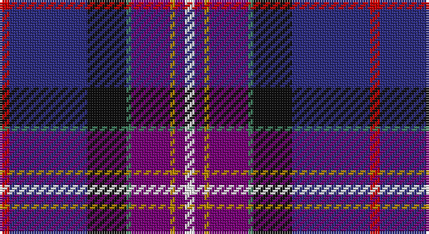

This page is one **sett** — a single exact thread-count. It belongs to the [tartan](/setts/r2db16k8g1dp8lo1dp2w2/)
(the same proportion at any scale), whose colour order is pattern [RBKGBYBW](/stripes/rbkgbybw/).

Sourced from register-of-tartans.  It is a [8 stripe tartan](/stripes/stripes8/).

Original link https://www.tartanregister.gov.uk/tartanDetails.aspx?ref=1279

2 attestations — the source records this cloth was collapsed from (oldest owns this page)

<ul>
<li>01/12/2003 — Freemasons' Universal (register-of-tartans, <a href="https://www.tartanregister.gov.uk/tartanDetails.aspx?ref=1279">record</a>)</li>
<li>Dec 2003 — Freemasons' Universal (Corporate) (tartans-authority, <a href="http://www.tartansauthority.com/tartan-ferret/display/6245/">record</a>)</li>
</ul>

## Register references

External register numbers recorded for this tartan.

- Scottish Register of Tartans: [1279](https://www.tartanregister.gov.uk/tartanDetails.aspx?ref=1279)
- Scottish Tartans Authority (ITI): 6245

## Thread count
R/4 DB32 K16 G2 P16 DY2 P4 W/4

One full sett is **152 threads**.

## Palette

Palette: <strong>Tartan Register</strong>
<table><thead><tr><th>Colour</th><th>Threads</th><th>Shade</th><th>Base</th><th>OKLCh</th></tr></thead><tbody><tr><td>R/</td><td style="text-align:right;font-variant-numeric:tabular-nums">4</td><td><code style="background-color:#C80000;">#C80000</code> <small style="color:#888">#C80000</small></td><td>R <code style="background-color:#CC0000;">#CC0000</code></td><td><small style="color:#888">oklch(52.3% 0.215 29.2)</small></td></tr><tr><td>DB</td><td style="text-align:right;font-variant-numeric:tabular-nums">32</td><td><code style="background-color:#2C2C80;">#2C2C80</code> <small style="color:#888">#2C2C80</small></td><td>B <code style="background-color:#2A418A;">#2A418A</code></td><td><small style="color:#888">oklch(35.0% 0.138 276.6)</small></td></tr><tr><td>K</td><td style="text-align:right;font-variant-numeric:tabular-nums">16</td><td><code style="background-color:#101010;">#101010</code> <small style="color:#888">#101010</small></td><td>K <code style="background-color:#000000;">#000000</code></td><td><small style="color:#888">oklch(17.3% 0.000 89.9)</small></td></tr><tr><td>G</td><td style="text-align:right;font-variant-numeric:tabular-nums">2</td><td><code style="background-color:#408060;">#408060</code> <small style="color:#888">#408060</small></td><td>G <code style="background-color:#006100;">#006100</code></td><td><small style="color:#888">oklch(54.8% 0.084 160.1)</small></td></tr><tr><td>P</td><td style="text-align:right;font-variant-numeric:tabular-nums">16</td><td><code style="background-color:#780078;">#780078</code> <small style="color:#888">#780078</small></td><td>B <code style="background-color:#2A418A;">#2A418A</code></td><td><small style="color:#888">oklch(40.2% 0.185 328.4)</small></td></tr><tr><td>DY</td><td style="text-align:right;font-variant-numeric:tabular-nums">2</td><td><code style="background-color:#BC8C00;">#BC8C00</code> <small style="color:#888">#BC8C00</small></td><td>Y <code style="background-color:#F2BF00;">#F2BF00</code></td><td><small style="color:#888">oklch(66.8% 0.137 84.1)</small></td></tr><tr><td>P</td><td style="text-align:right;font-variant-numeric:tabular-nums">4</td><td><code style="background-color:#780078;">#780078</code> <small style="color:#888">#780078</small></td><td>B <code style="background-color:#2A418A;">#2A418A</code></td><td><small style="color:#888">oklch(40.2% 0.185 328.4)</small></td></tr><tr><td>W/</td><td style="text-align:right;font-variant-numeric:tabular-nums">4</td><td><code style="background-color:#FCFCFC;">#FCFCFC</code> <small style="color:#888">#FCFCFC</small></td><td>W <code style="background-color:#F7F7F7;">#F7F7F7</code></td><td><small style="color:#888">oklch(99.1% 0.000 89.9)</small></td></tr></tbody></table>

# Sample pattern

## Nearest tartans

The nearest existing variants by ΔTartan distance, with this tartan at the top so the swatches line up against it.

ΔTartan

Tartan

Sett

—

<a href="/ttd/edit/#slug=r2db16k8g1dp8lo1dp2w2~x2">Freemasons' Universal</a> <a class="nn-out" href="/variants/s8/r2db16k8g1dp8lo1dp2w2~x2/" title="open its dictionary page">↗</a>

1.28

<a href="/ttd/edit/#slug=dg4t2db18r2k4r6t1w1~x4&amp;base=r2db16k8g1dp8lo1dp2w2~x2">Glenn</a> <a class="nn-out" href="/variants/s8/dg4t2db18r2k4r6t1w1~x4/" title="open its dictionary page">↗</a>

1.28

<a href="/ttd/edit/#slug=db1w2t12k2db2k2dp15db2ly1~x2&amp;base=r2db16k8g1dp8lo1dp2w2~x2">Hek (Name)</a> <a class="nn-out" href="/variants/s9/db1w2t12k2db2k2dp15db2ly1~x2/" title="open its dictionary page">↗</a>

1.30

<a href="/ttd/edit/#slug=dt8ly4w2db25dy25dbi2r5~x2&amp;base=r2db16k8g1dp8lo1dp2w2~x2">Kildrummie (Name)</a> <a class="nn-out" href="/variants/s7/dt8ly4w2db25dy25dbi2r5~x2/" title="open its dictionary page">↗</a>

1.30

<a href="/ttd/edit/#slug=r4oi10k9o2k9db33dt7g4~x2&amp;base=r2db16k8g1dp8lo1dp2w2~x2">Anne Arundel County</a> <a class="nn-out" href="/variants/s8/r4oi10k9o2k9db33dt7g4~x2/" title="open its dictionary page">↗</a>

1.35

<a href="/ttd/edit/#slug=db40r4k16w3dy8ri4dy3ri8k10~x2&amp;base=r2db16k8g1dp8lo1dp2w2~x2">United Arrows House Check</a> <a class="nn-out" href="/variants/s9/db40r4k16w3dy8ri4dy3ri8k10~x2/" title="open its dictionary page">↗</a>

1.38

<a href="/ttd/edit/#slug=k3dp16g5dp3p2dp2k12dt23w2~x2&amp;base=r2db16k8g1dp8lo1dp2w2~x2">Creiff Highland Gathering</a> <a class="nn-out" href="/variants/s9/k3dp16g5dp3p2dp2k12dt23w2~x2/" title="open its dictionary page">↗</a>

1.44

<a href="/ttd/edit/#slug=r6db3dp24w2k23y23k2y6~x2&amp;base=r2db16k8g1dp8lo1dp2w2~x2">Culloden Grey</a> <a class="nn-out" href="/variants/s8/r6db3dp24w2k23y23k2y6~x2/" title="open its dictionary page">↗</a>

1.46

<a href="/ttd/edit/#slug=dp2dg8r1lo1db4dbi16lb1~x4&amp;base=r2db16k8g1dp8lo1dp2w2~x2">Ellan Vannin (1958)</a> <a class="nn-out" href="/variants/s7/dp2dg8r1lo1db4dbi16lb1~x4/" title="open its dictionary page">↗</a>

1.46

<a href="/ttd/edit/#slug=dp24dt2g3m2g3k11dt29w2~x2&amp;base=r2db16k8g1dp8lo1dp2w2~x2">Alba</a> <a class="nn-out" href="/variants/s8/dp24dt2g3m2g3k11dt29w2~x2/" title="open its dictionary page">↗</a>

1.47

<a href="/variants/s8/r4y10k9dy2k9db33ki7g4~x2/">Anne Arundel County</a>

## Neighbour map

Every grey dot is one of 14360 variants placed by the first two principal components of the ΔTartan feature space (44% of its variance). Red is this tartan; blue dots are its nearest — click one to open its page.

<svg viewBox="0 0 640 380" role="img" style="max-width:100%;height:auto;border:1px solid #e0e0e0;border-radius:4px;display:block" xmlns="http://www.w3.org/2000/svg"><image href="/nn/cloud.v1.png" width="640" height="380"/><a href="/variants/s8/dg4t2db18r2k4r6t1w1~x4/"><circle cx="237.0" cy="128.4" r="4" fill="#3465a4"><title>Glenn</title></circle></a><a href="/variants/s9/db1w2t12k2db2k2dp15db2ly1~x2/"><circle cx="186.2" cy="118.3" r="4" fill="#3465a4"><title>Hek (Name)</title></circle></a><a href="/variants/s7/dt8ly4w2db25dy25dbi2r5~x2/"><circle cx="148.7" cy="143.6" r="4" fill="#3465a4"><title>Kildrummie (Name)</title></circle></a><a href="/variants/s8/r4oi10k9o2k9db33dt7g4~x2/"><circle cx="196.3" cy="143.8" r="4" fill="#3465a4"><title>Anne Arundel County</title></circle></a><a href="/variants/s9/db40r4k16w3dy8ri4dy3ri8k10~x2/"><circle cx="206.6" cy="148.6" r="4" fill="#3465a4"><title>United Arrows House Check</title></circle></a><a href="/variants/s9/k3dp16g5dp3p2dp2k12dt23w2~x2/"><circle cx="168.5" cy="160.4" r="4" fill="#3465a4"><title>Creiff Highland Gathering</title></circle></a><a href="/variants/s8/r6db3dp24w2k23y23k2y6~x2/"><circle cx="138.1" cy="152.9" r="4" fill="#3465a4"><title>Culloden Grey</title></circle></a><a href="/variants/s7/dp2dg8r1lo1db4dbi16lb1~x4/"><circle cx="248.1" cy="141.5" r="4" fill="#3465a4"><title>Ellan Vannin (1958)</title></circle></a><a href="/variants/s8/dp24dt2g3m2g3k11dt29w2~x2/"><circle cx="236.9" cy="154.6" r="4" fill="#3465a4"><title>Alba</title></circle></a><a href="/variants/s8/r4y10k9dy2k9db33ki7g4~x2/"><circle cx="162.2" cy="128.6" r="4" fill="#3465a4"><title>Anne Arundel County</title></circle></a><circle cx="175.9" cy="124.1" r="5" fill="#c00000"/></svg>

ID: /variants/s8/r2db16k8g1dp8lo1dp2w2~x2/
