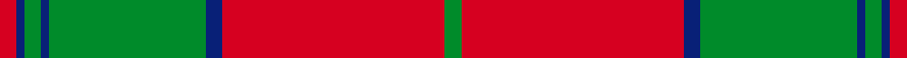

This is one **variant** — a specific cloth: this exact thread count and colourway, with its own
provenance below. It is one weaving of the [sett](/tartans/t/th/thomas/) (the scale-free proportion — the
same cloth at any scale or shade), whose colour order is pattern [GRBGBGBR](/stripes/grbgbgbr/).

Part of the [Thomas](/tartans/t/th/thomas/) tartan — the named design grouping this sett with its other cloths.

Sourced from register-of-tartans.  It is a [8 stripe tartan](/stripes/stripes8/).

Original link [https://www.tartanregister.gov.uk/tartanDetails.aspx?ref=4106](https://www.tartanregister.gov.uk/tartanDetails.aspx?ref=4106)

2 attestations — the source records this cloth was collapsed from (oldest owns this page)

<ul>
<li>01/01/2002 — Thomas of Wales (register-of-tartans, <a href="https://www.tartanregister.gov.uk/tartanDetails.aspx?ref=4106">record</a>)  <em>According to the WTC variants are: Thoms, Tombs, Tomlinson, Thompkins, Thompson. Despite there being no known tradition of tartan in Wales, this is one of a growing series of commercial Welsh 'name' tartans marketed by the Wales Tartan Centre in Cardiff. Their inclusion in this Index does not confer upon them any historical or genealogical credibility and the use of the words 'of Wales' is not of conventional territorial significance but is purely to identify the source and thus avoid confusion with surnames which have a genuine tartan connection. Designed for The Wales Tartan Centre in Cardiff by Sheila Daniel of Cambrian Woollen Mill, Powys. They're unusual in that almost all of them incorporate odd numbered threads and have quite different warp & weft, both in thread numbers and sometimes colours. This places the classification of some of them as tartans in some doubt. Welsh Tartan Centre Cardiff.</em></li>
<li>2002 — Thomas (Werlsh Name) (tartans-authority, <a href="https://web.archive.org/web/*/http://www.tartansauthority.com/tartan-ferret/display/5763/*">record</a>)  <em>Variants are: Thoms, Tombs, Tomlinson, Thompkins, Thompson. The tartan for this Welsh surname and its variations, is commercially accepted as a tartan or ?plaid? in Wales, this is one of the tartans actually woven in Wales at the Cambrian Woollen Mill, weaving on the same site since 1830. This tartan differs from many traditional patterns in that the warp and weft differ, giving the finished worsted wool cloth more of a predominant ?stripe?, vertically noticeable in the finished Kilt, or ?Cilt? in Wales. Available from Wales Tartan Centres in Swansea, +44 (0)1792 474685.</em></li>
</ul>

Dataset <small>— provenance for this record, inherited from the source manifest</small>

<dl class="dataset-prov">
<dt>source</dt><dd><a href="/sources/register-of-tartans/">Scottish Register of Tartans</a></dd>
<dt>data captured from</dt><dd><a href="https://github.com/thetartan/tartan-database/blob/master/data/register-of-tartans/data.csv">https://github.com/thetartan/tartan-database/blob/master/data/register-of-tartans/data.csv</a></dd>
<dt>data date</dt><dd>2002 <small>(this record)</small></dd>
<dt>licence</dt><dd><a href="https://www.tartanregister.gov.uk/copyright">Crown copyright</a></dd>
</dl>

Capture chain <small>— the hands this data passed through, oldest first; each capture carries its own licence</small>

<ol class="capture-chain">
<li><a href="https://www.tartanregister.gov.uk/">Scottish Register of Tartans</a> · <a href="https://www.tartanregister.gov.uk/copyright">Crown copyright</a> <small>the living register — still published by National Records of Scotland</small></li>
<li><a href="https://github.com/thetartan/tartan-database">thetartan/tartan-database</a> <small>2016-2017</small> · <a href="https://creativecommons.org/licenses/by-nc-nd/4.0/">CC BY-NC-ND 4.0</a> <small>Levko Kravets's frozen compilation — the capture we vendored, and where its CC licence text came from</small></li>
<li>this dictionary <small>captured 2026-06-10 · commit 5bf86c7566</small> <small>each re-capture is a git commit to data/sources</small></li>
</ol>

## Register references

External register numbers recorded for this tartan.

- Scottish Register of Tartans: [4106](https://www.tartanregister.gov.uk/tartanDetails.aspx?ref=4106)
- Scottish Tartans Authority (ITI): 5763

## Thread count
R/4 DB2 G4 DB2 G38 DB4 R54 G/4

One full sett is **216 threads**.

## Palette
<table><thead><tr><th>Colour</th><th>Shade</th><th>OKLCh</th></tr></thead><tbody><tr><td>DB</td><td><code style="background-color:#082077;">#082077</code> <small style="color:#888">#082077</small></td><td><small style="color:#888">oklch(30.0% 0.149 265.1)</small></td></tr><tr><td>DG</td><td><code style="background-color:#053819;">#053819</code> <small style="color:#888">#053819</small></td><td><small style="color:#888">oklch(30.0% 0.075 151.3)</small></td></tr><tr><td>G</td><td><code style="background-color:#008B2A;">#008B2A</code> <small style="color:#888">#008B2A</small></td><td><small style="color:#888">oklch(55.4% 0.170 145.9)</small></td></tr><tr><td>W</td><td><code style="background-color:#F7F7F7;">#F7F7F7</code> <small style="color:#888">#F7F7F7</small></td><td><small style="color:#888">oklch(97.6% 0.000 89.9)</small></td></tr><tr><td>R</td><td><code style="background-color:#D60020;">#D60020</code> <small style="color:#888">#D60020</small></td><td><small style="color:#888">oklch(55.2% 0.224 25.5)</small></td></tr></tbody></table>

# Sample pattern

## Nearest tartan variants

The nearest existing variants by ΔTartan distance, with this cloth at the top so the swatches line up against it.

ΔTartan

Threads

Variant

Sett

—

216

<a href="/variants/s8/r2db1g2db1g19db2r27g2~x2/">Thomas of Wales</a>

<a href="/ttd/edit/#slug=w5g1w1g33y3r24g3r4~x2&amp;base=r2db1g2db1g19db2r27g2~x2" title="compare in the TTD">1.51</a>

278

<a href="/variants/s8/w5g1w1g33y3r24g3r4~x2/">Sutherland de Albergaria Dress (Personal)</a>

<a href="/ttd/edit/#slug=r4g4lo4g12r22lo1g4~x4&amp;base=r2db1g2db1g19db2r27g2~x2" title="compare in the TTD">1.58</a>

376

<a href="/variants/s7/r4g4lo4g12r22lo1g4~x4/">Spice Apple</a>

<a href="/ttd/edit/#slug=r30g3db5g21r3g21db2~x2&amp;base=r2db1g2db1g19db2r27g2~x2" title="compare in the TTD">1.76</a>

276

<a href="/variants/s7/r30g3db5g21r3g21db2~x2/">Scottish Piping Soc. of London (Corp</a>

<a href="/ttd/edit/#slug=g18r3g2r2db6r2g2r24g1r2g6~x2&amp;base=r2db1g2db1g19db2r27g2~x2" title="compare in the TTD">1.83</a>

224

<a href="/variants/s11/g18r3g2r2db6r2g2r24g1r2g6~x2/">MacDonell of Glengarry #4</a>

<a href="/ttd/edit/#slug=r3g3y1r18w1g21y1g1y3~x2&amp;base=r2db1g2db1g19db2r27g2~x2" title="compare in the TTD">2.00</a>

196

<a href="/variants/s9/r3g3y1r18w1g21y1g1y3~x2/">MacDonald of Kingsburgh Clan Tartan</a>

<a href="/ttd/edit/#slug=r44db2g26r3db2&amp;base=r2db1g2db1g19db2r27g2~x2" title="compare in the TTD">2.08</a>

108

<a href="/variants/s5/r44db2g26r3db2/">Unidentified Cant #09</a>

<a href="/ttd/edit/#slug=g6r1g24r28g1r4~x2&amp;base=r2db1g2db1g19db2r27g2~x2" title="compare in the TTD">2.14</a>

236

<a href="/variants/s6/g6r1g24r28g1r4~x2/">Erskine (Green &amp; Red) Clan Tartan</a>

<a href="/ttd/edit/#slug=dg6r1dg24r28dg1r4~x2&amp;base=r2db1g2db1g19db2r27g2~x2" title="compare in the TTD">2.15</a>

236

<a href="/variants/s6/dg6r1dg24r28dg1r4~x2/">Erskine (Vestiarium Scoticum)</a>

<a href="/ttd/edit/#slug=r1g10r1db4r18g1~x4&amp;base=r2db1g2db1g19db2r27g2~x2" title="compare in the TTD">2.28</a>

272

<a href="/variants/s6/r1g10r1db4r18g1~x4/">Robertson 6</a>

<a href="/ttd/edit/#slug=r2g20r2db8r36g1~x2&amp;base=r2db1g2db1g19db2r27g2~x2" title="compare in the TTD">2.31</a>

270

<a href="/variants/s6/r2g20r2db8r36g1~x2/">Robertson</a>

## Neighbour map

Every grey dot is one of 13662 variants placed by the first two principal components of the ΔTartan feature space (42% of its variance). Red is this tartan; blue dots are its nearest — click one to open its page. The map is a flat projection of a many-dimensional space — [how to read it](/posts/neighbourhood-maps/).

<svg viewBox="0 0 640 380" role="img" style="max-width:100%;height:auto;border:1px solid #e0e0e0;border-radius:4px;display:block" xmlns="http://www.w3.org/2000/svg"><image href="/nn/cloud.v1.png" width="640" height="380"/><a href="/variants/s8/w5g1w1g33y3r24g3r4~x2/"><circle cx="346.2" cy="133.7" r="4" fill="#3465a4"><title>Sutherland de Albergaria Dress (Personal)</title></circle></a><a href="/variants/s7/r4g4lo4g12r22lo1g4~x4/"><circle cx="373.0" cy="189.7" r="4" fill="#3465a4"><title>Spice Apple</title></circle></a><a href="/variants/s7/r30g3db5g21r3g21db2~x2/"><circle cx="349.8" cy="206.9" r="4" fill="#3465a4"><title>Scottish Piping Soc. of London (Corp</title></circle></a><a href="/variants/s11/g18r3g2r2db6r2g2r24g1r2g6~x2/"><circle cx="352.9" cy="147.8" r="4" fill="#3465a4"><title>MacDonell of Glengarry #4</title></circle></a><a href="/variants/s9/r3g3y1r18w1g21y1g1y3~x2/"><circle cx="355.8" cy="152.2" r="4" fill="#3465a4"><title>MacDonald of Kingsburgh Clan Tartan</title></circle></a><a href="/variants/s5/r44db2g26r3db2/"><circle cx="367.7" cy="169.8" r="4" fill="#3465a4"><title>Unidentified Cant #09</title></circle></a><a href="/variants/s6/g6r1g24r28g1r4~x2/"><circle cx="432.5" cy="192.8" r="4" fill="#3465a4"><title>Erskine (Green &amp; Red) Clan Tartan</title></circle></a><a href="/variants/s6/dg6r1dg24r28dg1r4~x2/"><circle cx="421.7" cy="183.6" r="4" fill="#3465a4"><title>Erskine (Vestiarium Scoticum)</title></circle></a><a href="/variants/s6/r1g10r1db4r18g1~x4/"><circle cx="385.2" cy="181.9" r="4" fill="#3465a4"><title>Robertson 6</title></circle></a><a href="/variants/s6/r2g20r2db8r36g1~x2/"><circle cx="412.1" cy="154.3" r="4" fill="#3465a4"><title>Robertson</title></circle></a><circle cx="391.0" cy="145.1" r="5" fill="#c00000"/><text x="320" y="376" text-anchor="middle" font-size="11" fill="#999">ground</text><text x="11" y="190" text-anchor="middle" font-size="11" fill="#999" transform="rotate(-90 11 190)">complexity</text></svg>

ID: /variants/s8/r2db1g2db1g19db2r27g2~x2/
