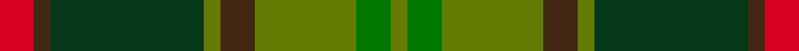

This page is one **sett** — a single exact thread-count. It belongs to the [tartan](/setts/r2do1dg9gi1do2gi6g2gi1/)
(the same proportion at any scale), whose colour order is pattern [GGGBGGBR](/stripes/gggbggbr/).

Sourced from register-of-tartans.  It is a [8 stripe tartan](/stripes/stripes8/).

Original link https://www.tartanregister.gov.uk/tartanDetails.aspx?ref=4135

2 attestations — the source records this cloth was collapsed from (oldest owns this page)

<ul>
<li>01/01/2002 — Tomass (register-of-tartans, <a href="https://www.tartanregister.gov.uk/tartanDetails.aspx?ref=4135">record</a>)  <em>A Lochcarron design in May 1995 for Antony Albert Tomass, Renfrew, Scotland. A family tartan with no known restrictions.</em></li>
<li>pre 2002 — Tomass (Name) (tartans-authority, <a href="http://www.tartansauthority.com/tartan-ferret/display/5106/">record</a>)  <em>A Lochcarron design in May 1995 for Antony Albert Tomass, Renfrew, Scotland. A family tartan with no known restrictions.</em></li>
</ul>

## Register references

External register numbers recorded for this tartan.

- Scottish Register of Tartans: [4135](https://www.tartanregister.gov.uk/tartanDetails.aspx?ref=4135)
- Scottish Tartans Authority (ITI): 5106

## Thread count
R/8 DO4 DG36 Gi4 DO8 Gi24 G8 Gi/4

One full sett is **180 threads**.

## Palette
<table><thead><tr><th>Colour</th><th>Shade</th><th>OKLCh</th></tr></thead><tbody><tr><td>DR</td><td><code style="background-color:#D60020;">#D60020</code> <small style="color:#888">#D60020</small></td><td><small style="color:#888">oklch(55.2% 0.224 25.5)</small></td></tr><tr><td>G</td><td><code style="background-color:#053819;">#053819</code> <small style="color:#888">#053819</small></td><td><small style="color:#888">oklch(30.0% 0.075 151.3)</small></td></tr><tr><td>Ga</td><td><code style="background-color:#647C00;">#647C00</code> <small style="color:#888">#647C00</small></td><td><small style="color:#888">oklch(54.7% 0.133 122.1)</small></td></tr><tr><td>Gb</td><td><code style="background-color:#007800;">#007800</code> <small style="color:#888">#007800</small></td><td><small style="color:#888">oklch(49.6% 0.169 142.5)</small></td></tr><tr><td>T</td><td><code style="background-color:#412714;">#412714</code> <small style="color:#888">#412714</small></td><td><small style="color:#888">oklch(30.1% 0.050 55.7)</small></td></tr></tbody></table>

# Sample pattern

ID: /variants/s8/r2do1dg9gi1do2gi6g2gi1~x4~gi2205128-g2007139/
