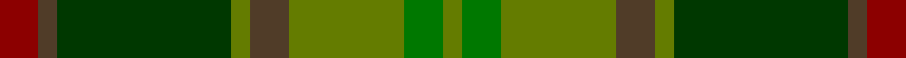
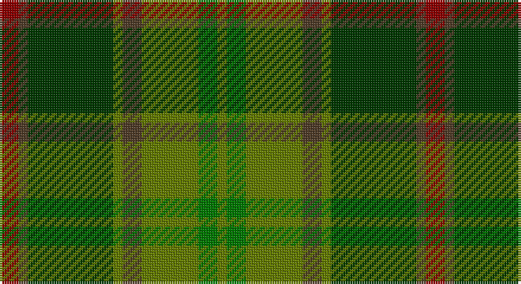

This page is one **sett** — a single exact thread-count. It belongs to the [tartan](/setts/r2dy1dg9y1dy2y6g2y1/)
(the same proportion at any scale), whose colour order is pattern [GGGGGGGR](/stripes/gggggggr/).

Sourced from register-of-tartans.  It is a [8 stripe tartan](/stripes/stripes8/).

Original link https://www.tartanregister.gov.uk/tartanDetails.aspx?ref=4135

2 attestations — the source records this cloth was collapsed from (oldest owns this page)

<ul>
<li>01/01/2002 — Tomass (register-of-tartans, <a href="https://www.tartanregister.gov.uk/tartanDetails.aspx?ref=4135">record</a>)</li>
<li>pre 2002 — Tomass (Name) (tartans-authority, <a href="http://www.tartansauthority.com/tartan-ferret/display/5106/">record</a>)</li>
</ul>

## Register references

External register numbers recorded for this tartan.

- Scottish Register of Tartans: [4135](https://www.tartanregister.gov.uk/tartanDetails.aspx?ref=4135)
- Scottish Tartans Authority (ITI): 5106

## Thread count
DR/8 T4 G36 Ga4 T8 Ga24 Gb8 Ga/4

One full sett is **180 threads**.

## Palette

Palette: <strong>Tartan Register</strong> <small style="color:#888">(1 of 5 colours)</small>
<table><thead><tr><th>Colour</th><th>Threads</th><th>Shade</th><th>Base</th><th>OKLCh</th></tr></thead><tbody><tr><td>DR/</td><td style="text-align:right;font-variant-numeric:tabular-nums">8</td><td><code style="background-color:#8C0000;">#8C0000</code> <small style="color:#888">#8C0000</small></td><td>R <code style="background-color:#CC0000;">#CC0000</code></td><td><small style="color:#888">oklch(40.2% 0.165 29.2)</small></td></tr><tr><td>T</td><td style="text-align:right;font-variant-numeric:tabular-nums">4</td><td><code style="background-color:#503C28;">#503C28</code> <small style="color:#888">#503C28</small></td><td>G <code style="background-color:#006100;">#006100</code></td><td><small style="color:#888">oklch(37.3% 0.042 65.9)</small></td></tr><tr><td>G</td><td style="text-align:right;font-variant-numeric:tabular-nums">36</td><td><code style="background-color:#003800;">#003800</code> <small style="color:#888">#003800</small></td><td>G <code style="background-color:#006100;">#006100</code></td><td><small style="color:#888">oklch(29.5% 0.100 142.5)</small></td></tr><tr><td>Ga</td><td style="text-align:right;font-variant-numeric:tabular-nums">4</td><td><code style="background-color:#647C00;">#647C00</code> <small style="color:#888">#647C00</small></td><td>G <code style="background-color:#006100;">#006100</code></td><td><small style="color:#888">oklch(54.7% 0.133 122.1)</small></td></tr><tr><td>T</td><td style="text-align:right;font-variant-numeric:tabular-nums">8</td><td><code style="background-color:#503C28;">#503C28</code> <small style="color:#888">#503C28</small></td><td>G <code style="background-color:#006100;">#006100</code></td><td><small style="color:#888">oklch(37.3% 0.042 65.9)</small></td></tr><tr><td>Ga</td><td style="text-align:right;font-variant-numeric:tabular-nums">24</td><td><code style="background-color:#647C00;">#647C00</code> <small style="color:#888">#647C00</small></td><td>G <code style="background-color:#006100;">#006100</code></td><td><small style="color:#888">oklch(54.7% 0.133 122.1)</small></td></tr><tr><td>Gb</td><td style="text-align:right;font-variant-numeric:tabular-nums">8</td><td><code style="background-color:#007800;">#007800</code> <small style="color:#888">#007800</small></td><td>G <code style="background-color:#006100;">#006100</code></td><td><small style="color:#888">oklch(49.6% 0.169 142.5)</small></td></tr><tr><td>Ga/</td><td style="text-align:right;font-variant-numeric:tabular-nums">4</td><td><code style="background-color:#647C00;">#647C00</code> <small style="color:#888">#647C00</small></td><td>G <code style="background-color:#006100;">#006100</code></td><td><small style="color:#888">oklch(54.7% 0.133 122.1)</small></td></tr></tbody></table>

# Sample pattern

## Nearest tartans

The nearest existing variants by ΔTartan distance, with this tartan at the top so the swatches line up against it.

ΔTartan

Tartan

Sett

—

<a href="/ttd/edit/#slug=r2dy1dg9y1dy2y6g2y1~x4">Tomass</a> <a class="nn-out" href="/variants/s8/r2dy1dg9y1dy2y6g2y1~x4/" title="open its dictionary page">↗</a>

1.04

<a href="/ttd/edit/#slug=dy9k2dy2r2g6k1lo1k1g6r3~x4&amp;base=r2dy1dg9y1dy2y6g2y1~x4">MacAart (Personal)</a> <a class="nn-out" href="/variants/s10/dy9k2dy2r2g6k1lo1k1g6r3~x4/" title="open its dictionary page">↗</a>

1.28

<a href="/ttd/edit/#slug=r3g6k1lo1k1g6r2dy2k2dy9k2~x4&amp;base=r2dy1dg9y1dy2y6g2y1~x4">MacAart (Personal)</a> <a class="nn-out" href="/variants/s11/r3g6k1lo1k1g6r2dy2k2dy9k2~x4/" title="open its dictionary page">↗</a>

1.29

<a href="/ttd/edit/#slug=g4r1db2r1g10y5r3y10ly1~x4&amp;base=r2dy1dg9y1dy2y6g2y1~x4">Moncton, City of</a> <a class="nn-out" href="/variants/s9/g4r1db2r1g10y5r3y10ly1~x4/" title="open its dictionary page">↗</a>

1.30

<a href="/ttd/edit/#slug=r4g46r10db10dy33db5dy4lo3~x2&amp;base=r2dy1dg9y1dy2y6g2y1~x4">State Seal of Minnesota (Fashion)</a> <a class="nn-out" href="/variants/s8/r4g46r10db10dy33db5dy4lo3~x2/" title="open its dictionary page">↗</a>

1.35

<a href="/ttd/edit/#slug=dgi3r3dgi31dg18dgi4k22lo3&amp;base=r2dy1dg9y1dy2y6g2y1~x4">MacSween Hunting (Lochs, Isle of Lewis) (Personal)</a> <a class="nn-out" href="/variants/s7/dgi3r3dgi31dg18dgi4k22lo3/" title="open its dictionary page">↗</a>

1.46

<a href="/ttd/edit/#slug=r3o23gi8g6gi8t6gi10t12gi3~x2&amp;base=r2dy1dg9y1dy2y6g2y1~x4">Lawrence's Seven Pillars of Khaki</a> <a class="nn-out" href="/variants/s9/r3o23gi8g6gi8t6gi10t12gi3~x2/" title="open its dictionary page">↗</a>

1.46

<a href="/ttd/edit/#slug=dg12w2k5g24k4dg9k2g13k4dg13k2ly3~x2&amp;base=r2dy1dg9y1dy2y6g2y1~x4">Handley (Personal)</a> <a class="nn-out" href="/variants/s12/dg12w2k5g24k4dg9k2g13k4dg13k2ly3~x2/" title="open its dictionary page">↗</a>

1.47

<a href="/ttd/edit/#slug=dy35dg19r3y8r3dg8r3t3~x2&amp;base=r2dy1dg9y1dy2y6g2y1~x4">John Muir Way</a> <a class="nn-out" href="/variants/s8/dy35dg19r3y8r3dg8r3t3~x2/" title="open its dictionary page">↗</a>

1.47

<a href="/ttd/edit/#slug=g1r7g7n2r1dg15lb1~x4&amp;base=r2dy1dg9y1dy2y6g2y1~x4">Ramsay (Green Fashion)</a> <a class="nn-out" href="/variants/s7/g1r7g7n2r1dg15lb1~x4/" title="open its dictionary page">↗</a>

1.51

<a href="/ttd/edit/#slug=k3r9k4dy9y3dy9k4g26k2y3~x2&amp;base=r2dy1dg9y1dy2y6g2y1~x4">Cavan, County</a> <a class="nn-out" href="/variants/s10/k3r9k4dy9y3dy9k4g26k2y3~x2/" title="open its dictionary page">↗</a>

## Neighbour map

Every grey dot is one of 14360 variants placed by the first two principal components of the ΔTartan feature space (44% of its variance). Red is this tartan; blue dots are its nearest — click one to open its page.

<svg viewBox="0 0 640 380" role="img" style="max-width:100%;height:auto;border:1px solid #e0e0e0;border-radius:4px;display:block" xmlns="http://www.w3.org/2000/svg"><image href="/nn/cloud.v1.png" width="640" height="380"/><a href="/variants/s10/dy9k2dy2r2g6k1lo1k1g6r3~x4/"><circle cx="217.3" cy="216.6" r="4" fill="#3465a4"><title>MacAart (Personal)</title></circle></a><a href="/variants/s11/r3g6k1lo1k1g6r2dy2k2dy9k2~x4/"><circle cx="195.1" cy="208.3" r="4" fill="#3465a4"><title>MacAart (Personal)</title></circle></a><a href="/variants/s9/g4r1db2r1g10y5r3y10ly1~x4/"><circle cx="256.7" cy="209.1" r="4" fill="#3465a4"><title>Moncton, City of</title></circle></a><a href="/variants/s8/r4g46r10db10dy33db5dy4lo3~x2/"><circle cx="289.3" cy="195.3" r="4" fill="#3465a4"><title>State Seal of Minnesota (Fashion)</title></circle></a><a href="/variants/s7/dgi3r3dgi31dg18dgi4k22lo3/"><circle cx="277.6" cy="230.0" r="4" fill="#3465a4"><title>MacSween Hunting (Lochs, Isle of Lewis) (Personal)</title></circle></a><a href="/variants/s9/r3o23gi8g6gi8t6gi10t12gi3~x2/"><circle cx="198.4" cy="237.3" r="4" fill="#3465a4"><title>Lawrence's Seven Pillars of Khaki</title></circle></a><a href="/variants/s12/dg12w2k5g24k4dg9k2g13k4dg13k2ly3~x2/"><circle cx="230.7" cy="198.0" r="4" fill="#3465a4"><title>Handley (Personal)</title></circle></a><a href="/variants/s8/dy35dg19r3y8r3dg8r3t3~x2/"><circle cx="301.9" cy="206.3" r="4" fill="#3465a4"><title>John Muir Way</title></circle></a><a href="/variants/s7/g1r7g7n2r1dg15lb1~x4/"><circle cx="314.2" cy="212.4" r="4" fill="#3465a4"><title>Ramsay (Green Fashion)</title></circle></a><a href="/variants/s10/k3r9k4dy9y3dy9k4g26k2y3~x2/"><circle cx="206.5" cy="177.0" r="4" fill="#3465a4"><title>Cavan, County</title></circle></a><circle cx="234.2" cy="221.0" r="5" fill="#c00000"/></svg>

ID: /variants/s8/r2dy1dg9y1dy2y6g2y1~x4/
