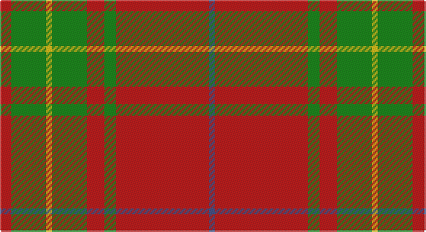

This page is one **sett** — a single exact thread-count. It belongs to the [tartan](/setts/r2g6ly1g6r3g2r16db1/)
(the same proportion at any scale), whose colour order is pattern [BRGRGYGR](/stripes/brgrgygr/).

Part of the [Burnett](/tartans/burnett/) tartan — the named design grouping this sett with its other cloths.

Sourced from weddslist.  It is a [8 stripe tartan](/stripes/stripes8/).

Original link http://www.weddslist.com/cgi-bin/tartans/pg.pl?source=sts

## Thread count
R/8 G24 Y4 G24 R12 G8 R64 B/4

One full sett is **284 threads**.

## Palette

Palette: <strong>custom</strong>
<table><thead><tr><th>Colour</th><th>Threads</th><th>Shade</th><th>Base</th><th>OKLCh</th></tr></thead><tbody><tr><td>R/</td><td style="text-align:right;font-variant-numeric:tabular-nums">8</td><td><code style="background-color:#C00000;">#C00000</code> <small style="color:#888">#C00000</small></td><td>R <code style="background-color:#CC0000;">#CC0000</code></td><td><small style="color:#888">oklch(50.7% 0.208 29.2)</small></td></tr><tr><td>G</td><td style="text-align:right;font-variant-numeric:tabular-nums">24</td><td><code style="background-color:#008000;">#008000</code> <small style="color:#888">#008000</small></td><td>G <code style="background-color:#006100;">#006100</code></td><td><small style="color:#888">oklch(52.0% 0.177 142.5)</small></td></tr><tr><td>Y</td><td style="text-align:right;font-variant-numeric:tabular-nums">4</td><td><code style="background-color:#F0C000;">#F0C000</code> <small style="color:#888">#F0C000</small></td><td>Y <code style="background-color:#F2BF00;">#F2BF00</code></td><td><small style="color:#888">oklch(82.7% 0.169 90.5)</small></td></tr><tr><td>G</td><td style="text-align:right;font-variant-numeric:tabular-nums">24</td><td><code style="background-color:#008000;">#008000</code> <small style="color:#888">#008000</small></td><td>G <code style="background-color:#006100;">#006100</code></td><td><small style="color:#888">oklch(52.0% 0.177 142.5)</small></td></tr><tr><td>R</td><td style="text-align:right;font-variant-numeric:tabular-nums">12</td><td><code style="background-color:#C00000;">#C00000</code> <small style="color:#888">#C00000</small></td><td>R <code style="background-color:#CC0000;">#CC0000</code></td><td><small style="color:#888">oklch(50.7% 0.208 29.2)</small></td></tr><tr><td>G</td><td style="text-align:right;font-variant-numeric:tabular-nums">8</td><td><code style="background-color:#008000;">#008000</code> <small style="color:#888">#008000</small></td><td>G <code style="background-color:#006100;">#006100</code></td><td><small style="color:#888">oklch(52.0% 0.177 142.5)</small></td></tr><tr><td>R</td><td style="text-align:right;font-variant-numeric:tabular-nums">64</td><td><code style="background-color:#C00000;">#C00000</code> <small style="color:#888">#C00000</small></td><td>R <code style="background-color:#CC0000;">#CC0000</code></td><td><small style="color:#888">oklch(50.7% 0.208 29.2)</small></td></tr><tr><td>B/</td><td style="text-align:right;font-variant-numeric:tabular-nums">4</td><td><code style="background-color:#304080;">#304080</code> <small style="color:#888">#304080</small></td><td>B <code style="background-color:#2A418A;">#2A418A</code></td><td><small style="color:#888">oklch(39.4% 0.109 270.2)</small></td></tr></tbody></table>

# Sample pattern

## Compared to the master

This cloth is one sett of its design; the master sett (the exemplar the design is anchored on) is below for comparison.

<figure style="margin:0"><figcaption style="color:#888;font-size:smaller">this sett</figcaption></figure>
<figure style="margin:0"><figcaption style="color:#888;font-size:smaller"><a href="/setts/r4g14ly3g14r4g3r29y4/">master sett →</a></figcaption></figure>

## Nearest tartans

The nearest existing variants by ΔTartan distance, with this tartan at the top so the swatches line up against it.

ΔTartan

Tartan

Sett

—

<a href="/ttd/edit/#slug=r2g6ly1g6r3g2r16db1~x4">Burnett</a> <a class="nn-out" href="/variants/s8/r2g6ly1g6r3g2r16db1~x4/" title="open its dictionary page">↗</a>

0.33

<a href="/ttd/edit/#slug=r2g6ly1g6r3g2r16t1~x4&amp;base=r2g6ly1g6r3g2r16db1~x4">Burnett of Leys Family Tartan</a> <a class="nn-out" href="/variants/s8/r2g6ly1g6r3g2r16t1~x4/" title="open its dictionary page">↗</a>

0.44

<a href="/ttd/edit/#slug=w1r12g2r1g16r1g2r12ly1~x4&amp;base=r2g6ly1g6r3g2r16db1~x4">MacPhie/Macfie</a> <a class="nn-out" href="/variants/s9/w1r12g2r1g16r1g2r12ly1~x4/" title="open its dictionary page">↗</a>

0.46

<a href="/ttd/edit/#slug=w1r12g2r1g16r1g2r12ly1~x2&amp;base=r2g6ly1g6r3g2r16db1~x4">MacPhee, MacFie</a> <a class="nn-out" href="/variants/s9/w1r12g2r1g16r1g2r12ly1~x2/" title="open its dictionary page">↗</a>

0.70

<a href="/ttd/edit/#slug=ly1r12dg2r1dg16r1dg2r12lb1&amp;base=r2g6ly1g6r3g2r16db1~x4">MacFie</a> <a class="nn-out" href="/variants/s9/ly1r12dg2r1dg16r1dg2r12lb1/" title="open its dictionary page">↗</a>

0.77

<a href="/ttd/edit/#slug=r32t5g17r4g5w2~x2&amp;base=r2g6ly1g6r3g2r16db1~x4">Wilson's, No 5</a> <a class="nn-out" href="/variants/s6/r32t5g17r4g5w2~x2/" title="open its dictionary page">↗</a>

0.81

<a href="/ttd/edit/#slug=r4g4w3g4r4g14r28k2r2g3~x2&amp;base=r2g6ly1g6r3g2r16db1~x4">Scott Red Clan Tartan</a> <a class="nn-out" href="/variants/s10/r4g4w3g4r4g14r28k2r2g3~x2/" title="open its dictionary page">↗</a>

0.83

<a href="/ttd/edit/#slug=r5g20r5g3r4g5r36do2w4~x2&amp;base=r2g6ly1g6r3g2r16db1~x4">Baluch Regiment (Military)</a> <a class="nn-out" href="/variants/s9/r5g20r5g3r4g5r36do2w4~x2/" title="open its dictionary page">↗</a>

0.91

<a href="/ttd/edit/#slug=k1r18g12r2g12r18w1~x2&amp;base=r2g6ly1g6r3g2r16db1~x4">MacKinnon 8</a> <a class="nn-out" href="/variants/s7/k1r18g12r2g12r18w1~x2/" title="open its dictionary page">↗</a>

0.92

<a href="/ttd/edit/#slug=r3g16r4k6r28g2lo3~x2&amp;base=r2g6ly1g6r3g2r16db1~x4">McInally (Name)</a> <a class="nn-out" href="/variants/s7/r3g16r4k6r28g2lo3~x2/" title="open its dictionary page">↗</a>

0.93

<a href="/ttd/edit/#slug=r4g8w1g8r4g4r2g4r24k2~x2&amp;base=r2g6ly1g6r3g2r16db1~x4">Cumming, Comyn</a> <a class="nn-out" href="/variants/s10/r4g8w1g8r4g4r2g4r24k2~x2/" title="open its dictionary page">↗</a>

## Neighbour map

Every grey dot is one of 14360 variants placed by the first two principal components of the ΔTartan feature space (44% of its variance). Red is this tartan; blue dots are its nearest — click one to open its page.

<svg viewBox="0 0 640 380" role="img" style="max-width:100%;height:auto;border:1px solid #e0e0e0;border-radius:4px;display:block" xmlns="http://www.w3.org/2000/svg"><image href="/nn/cloud.v1.png" width="640" height="380"/><a href="/variants/s8/r2g6ly1g6r3g2r16t1~x4/"><circle cx="376.7" cy="168.9" r="4" fill="#3465a4"><title>Burnett of Leys Family Tartan</title></circle></a><a href="/variants/s9/w1r12g2r1g16r1g2r12ly1~x4/"><circle cx="360.4" cy="155.5" r="4" fill="#3465a4"><title>MacPhie/Macfie</title></circle></a><a href="/variants/s9/w1r12g2r1g16r1g2r12ly1~x2/"><circle cx="359.2" cy="156.0" r="4" fill="#3465a4"><title>MacPhee, MacFie</title></circle></a><a href="/variants/s9/ly1r12dg2r1dg16r1dg2r12lb1/"><circle cx="359.0" cy="155.0" r="4" fill="#3465a4"><title>MacFie</title></circle></a><a href="/variants/s6/r32t5g17r4g5w2~x2/"><circle cx="351.4" cy="178.2" r="4" fill="#3465a4"><title>Wilson's, No 5</title></circle></a><a href="/variants/s10/r4g4w3g4r4g14r28k2r2g3~x2/"><circle cx="352.7" cy="148.3" r="4" fill="#3465a4"><title>Scott Red Clan Tartan</title></circle></a><a href="/variants/s9/r5g20r5g3r4g5r36do2w4~x2/"><circle cx="382.7" cy="141.7" r="4" fill="#3465a4"><title>Baluch Regiment (Military)</title></circle></a><a href="/variants/s7/k1r18g12r2g12r18w1~x2/"><circle cx="372.8" cy="184.3" r="4" fill="#3465a4"><title>MacKinnon 8</title></circle></a><a href="/variants/s7/r3g16r4k6r28g2lo3~x2/"><circle cx="344.4" cy="171.9" r="4" fill="#3465a4"><title>McInally (Name)</title></circle></a><a href="/variants/s10/r4g8w1g8r4g4r2g4r24k2~x2/"><circle cx="365.3" cy="135.8" r="4" fill="#3465a4"><title>Cumming, Comyn</title></circle></a><circle cx="370.8" cy="167.1" r="5" fill="#c00000"/></svg>

ID: /variants/s8/r2g6ly1g6r3g2r16db1~x4/
