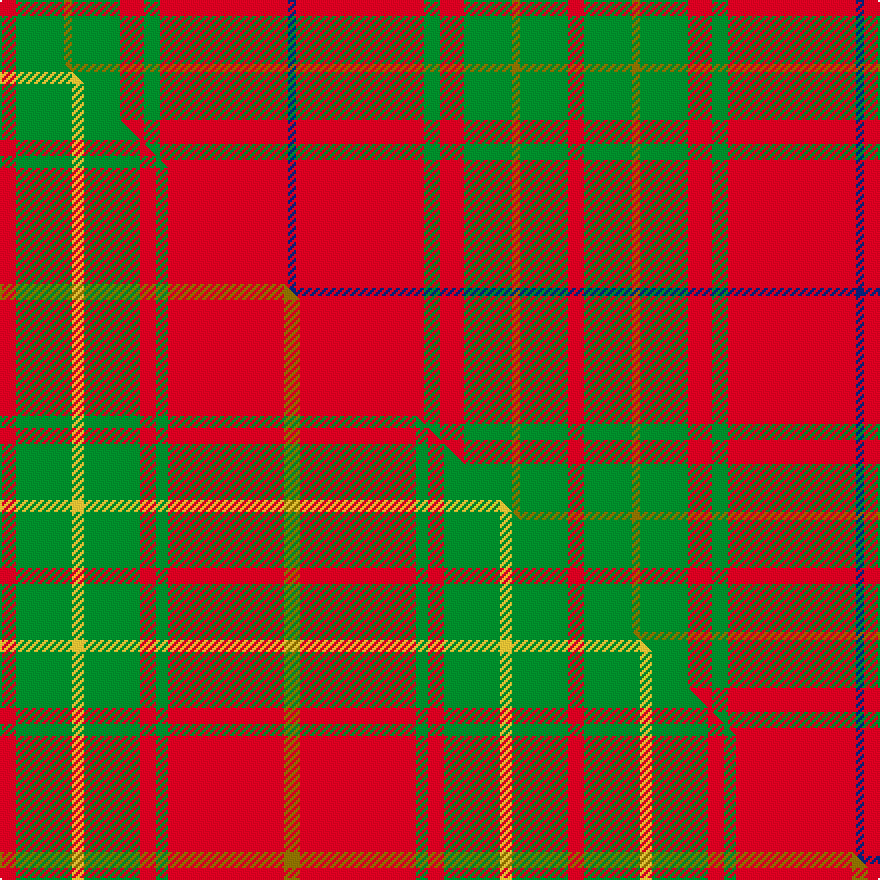

This is one **variant** — a specific cloth: this exact thread count and colourway, with its own
provenance below. It is one weaving of the [sett](/setts/r2g6y1g6r3g2r16db1/) (the scale-free proportion — the
same cloth at any scale or shade), whose colour order is pattern [BRGRGGGR](/stripes/brgrgggr/).

Part of the [Burnett](/tartans/burnett/) tartan — the named design grouping this sett with its other cloths.

Sourced from weddslist.  It is a [8 stripe tartan](/stripes/stripes8/).

Original link [http://www.weddslist.com/cgi-bin/tartans/pg.pl?source=sts](http://www.weddslist.com/cgi-bin/tartans/pg.pl?source=sts)

Dataset <small>— provenance for this record, inherited from the source manifest</small>

<dl class="dataset-prov">
<dt>source</dt><dd><a href="/sources/weddslist/">Weddslist</a></dd>
<dt>data captured from</dt><dd><a href="https://github.com/thetartan/tartan-database/blob/master/data/weddslist/data.csv">https://github.com/thetartan/tartan-database/blob/master/data/weddslist/data.csv</a></dd>
<dt>data date</dt><dd>2016-11-17 <small>(dataset default)</small></dd>
<dt>licence</dt><dd><a href="https://creativecommons.org/licenses/by-nc-nd/4.0/">CC BY-NC-ND 4.0</a></dd>
</dl>

Capture chain <small>— the hands this data passed through, oldest first; each capture carries its own licence</small>

<ol class="capture-chain">
<li><a href="https://www.weddslist.com/tartans/">Weddslist</a> <small>the living privately compiled reference</small></li>
<li><a href="https://github.com/thetartan/tartan-database">thetartan/tartan-database</a> <small>2016-2017</small> · <a href="https://creativecommons.org/licenses/by-nc-nd/4.0/">CC BY-NC-ND 4.0</a> <small>Levko Kravets's frozen compilation — the capture we vendored, and where its CC licence text came from</small></li>
<li>this dictionary <small>captured 2026-06-10 · commit 5bf86c7566</small> <small>each re-capture is a git commit to data/sources</small></li>
</ol>

## Thread count
R/8 G24 Y4 G24 R12 G8 R64 DB/4

One full sett is **284 threads**.

## Palette
<table><thead><tr><th>Colour</th><th>Shade</th><th>OKLCh</th></tr></thead><tbody><tr><td>DB</td><td><code style="background-color:#082077;">#082077</code> <small style="color:#888">#082077</small></td><td><small style="color:#888">oklch(30.0% 0.149 265.1)</small></td></tr><tr><td>G</td><td><code style="background-color:#008B2A;">#008B2A</code> <small style="color:#888">#008B2A</small></td><td><small style="color:#888">oklch(55.4% 0.170 145.9)</small></td></tr><tr><td>R</td><td><code style="background-color:#D60020;">#D60020</code> <small style="color:#888">#D60020</small></td><td><small style="color:#888">oklch(55.2% 0.224 25.5)</small></td></tr><tr><td>Y</td><td><code style="background-color:#8B6E00;">#8B6E00</code> <small style="color:#888">#8B6E00</small></td><td><small style="color:#888">oklch(55.1% 0.113 90.4)</small></td></tr></tbody></table>

# Sample pattern

## Compared to the master

This cloth is one sett of its design; the master sett (the exemplar the design is anchored on) is below for comparison.

Its **ΔTartan distance** from the master is **1.11** — the same measure the nearest-tartans table ranks by (0 is identical; a re-scale of the same cloth is near 0, a recolour or a different proportion further).

<figure class="master-compare" style="margin:0">

this sett
master sett ★

<figcaption style="color:#888;font-size:smaller">One weave of this sett against the <a href="/setts/r4g14ly3g14r4g3r29y4/">master sett ★</a>, split on the diagonal: a shared proportion runs seamlessly across it with only the shades shifting; a different proportion breaks on it.</figcaption>
</figure>

## Nearest tartan variants

The nearest existing variants by ΔTartan distance, with this cloth at the top so the swatches line up against it.

ΔTartan

Threads

Variant

Sett

—

284

<a href="/variants/s8/r2g6y1g6r3g2r16db1~x4/">Burnett</a>

<a href="/ttd/edit/#slug=r2g6y1g6r3g2r16lb1~x4&amp;base=r2g6y1g6r3g2r16db1~x4" title="compare in the TTD">0.03</a>

284

<a href="/variants/s8/r2g6y1g6r3g2r16lb1~x4/">Burnett of Leys Family Tartan</a>

<a href="/ttd/edit/#slug=r4g14ly3g14r4g3r29y4~x2&amp;base=r2g6y1g6r3g2r16db1~x4" title="compare in the TTD">1.11</a>

284

<a href="/variants/s8/r4g14ly3g14r4g3r29y4~x2/">Burnett</a>

<a href="/ttd/edit/#slug=r6lb2r30g12r3g12r3~x2&amp;base=r2g6y1g6r3g2r16db1~x4" title="compare in the TTD">1.66</a>

254

<a href="/variants/s7/r6lb2r30g12r3g12r3~x2/">Crawford</a>

<a href="/ttd/edit/#slug=r24t3w1g9r12~x8&amp;base=r2g6y1g6r3g2r16db1~x4" title="compare in the TTD">1.79</a>

496

<a href="/variants/s5/r24t3w1g9r12~x8/">Menzies</a>

<a href="/ttd/edit/#slug=r2g6r2g6r16y1~x2&amp;base=r2g6y1g6r3g2r16db1~x4" title="compare in the TTD">1.86</a>

126

<a href="/variants/s6/r2g6r2g6r16y1~x2/">Cameron Clan Tartan</a>

<a href="/ttd/edit/#slug=r2dg6r2dg6r16ly1~x4&amp;base=r2g6y1g6r3g2r16db1~x4" title="compare in the TTD">1.86</a>

252

<a href="/variants/s6/r2dg6r2dg6r16ly1~x4/">Cameron (Clan)</a>

<a href="/ttd/edit/#slug=r1g6r1g6r15y1~x2&amp;base=r2g6y1g6r3g2r16db1~x4" title="compare in the TTD">1.94</a>

116

<a href="/variants/s6/r1g6r1g6r15y1~x2/">Cameron Clan D</a>

<a href="/ttd/edit/#slug=r6w2r30g12r3g12r3~x2&amp;base=r2g6y1g6r3g2r16db1~x4" title="compare in the TTD">1.96</a>

254

<a href="/variants/s7/r6w2r30g12r3g12r3~x2/">Crawford (Clan)</a>

<a href="/ttd/edit/#slug=r6w2r30g12r3g12r3&amp;base=r2g6y1g6r3g2r16db1~x4" title="compare in the TTD">1.96</a>

127

<a href="/variants/s7/r6w2r30g12r3g12r3/">Crawford</a>

<a href="/ttd/edit/#slug=r1g10r1db4r18g1~x4&amp;base=r2g6y1g6r3g2r16db1~x4" title="compare in the TTD">1.99</a>

272

<a href="/variants/s6/r1g10r1db4r18g1~x4/">Robertson 6</a>

## Neighbour map

Every grey dot is one of 13621 variants placed by the first two principal components of the ΔTartan feature space (42% of its variance). Red is this tartan; blue dots are its nearest — click one to open its page.

<svg viewBox="0 0 640 380" role="img" style="max-width:100%;height:auto;border:1px solid #e0e0e0;border-radius:4px;display:block" xmlns="http://www.w3.org/2000/svg"><image href="/nn/cloud.v1.png" width="640" height="380"/><a href="/variants/s8/r2g6y1g6r3g2r16lb1~x4/"><circle cx="383.4" cy="175.4" r="4" fill="#3465a4"><title>Burnett of Leys Family Tartan</title></circle></a><a href="/variants/s8/r4g14ly3g14r4g3r29y4~x2/"><circle cx="324.8" cy="205.9" r="4" fill="#3465a4"><title>Burnett</title></circle></a><a href="/variants/s7/r6lb2r30g12r3g12r3~x2/"><circle cx="421.6" cy="196.4" r="4" fill="#3465a4"><title>Crawford</title></circle></a><a href="/variants/s5/r24t3w1g9r12~x8/"><circle cx="375.4" cy="163.7" r="4" fill="#3465a4"><title>Menzies</title></circle></a><a href="/variants/s6/r2g6r2g6r16y1~x2/"><circle cx="431.0" cy="206.5" r="4" fill="#3465a4"><title>Cameron Clan Tartan</title></circle></a><a href="/variants/s6/r2dg6r2dg6r16ly1~x4/"><circle cx="408.3" cy="194.8" r="4" fill="#3465a4"><title>Cameron (Clan)</title></circle></a><a href="/variants/s6/r1g6r1g6r15y1~x2/"><circle cx="412.7" cy="205.0" r="4" fill="#3465a4"><title>Cameron Clan D</title></circle></a><a href="/variants/s7/r6w2r30g12r3g12r3~x2/"><circle cx="412.8" cy="193.6" r="4" fill="#3465a4"><title>Crawford (Clan)</title></circle></a><a href="/variants/s7/r6w2r30g12r3g12r3/"><circle cx="412.8" cy="193.6" r="4" fill="#3465a4"><title>Crawford</title></circle></a><a href="/variants/s6/r1g10r1db4r18g1~x4/"><circle cx="385.0" cy="182.9" r="4" fill="#3465a4"><title>Robertson 6</title></circle></a><circle cx="379.8" cy="174.2" r="5" fill="#c00000"/><text x="320" y="376" text-anchor="middle" font-size="11" fill="#999">ground</text><text x="11" y="190" text-anchor="middle" font-size="11" fill="#999" transform="rotate(-90 11 190)">complexity</text></svg>

ID: /variants/s8/r2g6y1g6r3g2r16db1~x4/
