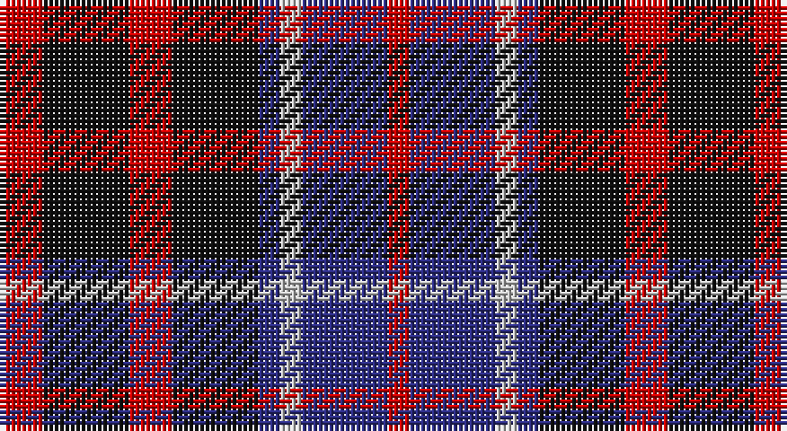

This page is one **sett** — a single exact thread-count. It belongs to the [tartan](/setts/r2k4r2k4db1lb1db4r1/)
(the same proportion at any scale), whose colour order is pattern [RBWBKRKR](/stripes/rbwbkrkr/).

Part of the [MacKean](/tartans/mackean/) tartan — the named design grouping this sett with its other cloths.

Sourced from register-of-tartans.  It is a [8 stripe tartan](/stripes/stripes8/).

Original link https://www.tartanregister.gov.uk/tartanDetails.aspx?ref=2511

## Also known as

This cloth is also recorded under:

- MacKean Green
- MacKean Red
- MacKean, Green

## Register references

External register numbers recorded for this tartan.

- Scottish Register of Tartans: [2511](https://www.tartanregister.gov.uk/tartanDetails.aspx?ref=2511)
- Scottish Tartans Authority (ITI): 1604
- Scottish Tartans World Register: 1604

## Thread count
R/8 K16 R8 K16 DB4 N4 DB16 R/4

One full sett is **140 threads**.

## Palette

Palette: <strong>Tartan Register</strong>
<table><thead><tr><th>Colour</th><th>Threads</th><th>Shade</th><th>Base</th><th>OKLCh</th></tr></thead><tbody><tr><td>R/</td><td style="text-align:right;font-variant-numeric:tabular-nums">8</td><td><code style="background-color:#C80000;">#C80000</code> <small style="color:#888">#C80000</small></td><td>R <code style="background-color:#CC0000;">#CC0000</code></td><td><small style="color:#888">oklch(52.3% 0.215 29.2)</small></td></tr><tr><td>K</td><td style="text-align:right;font-variant-numeric:tabular-nums">16</td><td><code style="background-color:#101010;">#101010</code> <small style="color:#888">#101010</small></td><td>K <code style="background-color:#000000;">#000000</code></td><td><small style="color:#888">oklch(17.3% 0.000 89.9)</small></td></tr><tr><td>R</td><td style="text-align:right;font-variant-numeric:tabular-nums">8</td><td><code style="background-color:#C80000;">#C80000</code> <small style="color:#888">#C80000</small></td><td>R <code style="background-color:#CC0000;">#CC0000</code></td><td><small style="color:#888">oklch(52.3% 0.215 29.2)</small></td></tr><tr><td>K</td><td style="text-align:right;font-variant-numeric:tabular-nums">16</td><td><code style="background-color:#101010;">#101010</code> <small style="color:#888">#101010</small></td><td>K <code style="background-color:#000000;">#000000</code></td><td><small style="color:#888">oklch(17.3% 0.000 89.9)</small></td></tr><tr><td>DB</td><td style="text-align:right;font-variant-numeric:tabular-nums">4</td><td><code style="background-color:#2C2C80;">#2C2C80</code> <small style="color:#888">#2C2C80</small></td><td>B <code style="background-color:#2A418A;">#2A418A</code></td><td><small style="color:#888">oklch(35.0% 0.138 276.6)</small></td></tr><tr><td>N</td><td style="text-align:right;font-variant-numeric:tabular-nums">4</td><td><code style="background-color:#C0C0C0;">#C0C0C0</code> <small style="color:#888">#C0C0C0</small></td><td>W <code style="background-color:#F7F7F7;">#F7F7F7</code></td><td><small style="color:#888">oklch(80.8% 0.000 89.9)</small></td></tr><tr><td>DB</td><td style="text-align:right;font-variant-numeric:tabular-nums">16</td><td><code style="background-color:#2C2C80;">#2C2C80</code> <small style="color:#888">#2C2C80</small></td><td>B <code style="background-color:#2A418A;">#2A418A</code></td><td><small style="color:#888">oklch(35.0% 0.138 276.6)</small></td></tr><tr><td>R/</td><td style="text-align:right;font-variant-numeric:tabular-nums">4</td><td><code style="background-color:#C80000;">#C80000</code> <small style="color:#888">#C80000</small></td><td>R <code style="background-color:#CC0000;">#CC0000</code></td><td><small style="color:#888">oklch(52.3% 0.215 29.2)</small></td></tr></tbody></table>

# Sample pattern

## Compared to the master

This cloth is one sett of its design; the master sett (the exemplar the design is anchored on) is below for comparison.

<figure style="margin:0"><figcaption style="color:#888;font-size:smaller">this sett</figcaption></figure>
<figure style="margin:0"><figcaption style="color:#888;font-size:smaller"><a href="/setts/k4db8k4db8r2g10k1w2/">master sett →</a></figcaption></figure>

## Nearest tartans

The nearest existing variants by ΔTartan distance, with this tartan at the top so the swatches line up against it.

ΔTartan

Tartan

Sett

—

<a href="/ttd/edit/#slug=r2k4r2k4db1lb1db4r1~x4">MacKean Red (Personal)</a> <a class="nn-out" href="/variants/s8/r2k4r2k4db1lb1db4r1~x4/" title="open its dictionary page">↗</a>

1.03

<a href="/ttd/edit/#slug=r2k4r2k4db1w1db4r1~x4&amp;base=r2k4r2k4db1lb1db4r1~x4">MacKean</a> <a class="nn-out" href="/variants/s8/r2k4r2k4db1w1db4r1~x4/" title="open its dictionary page">↗</a>

1.06

<a href="/variants/s8/db13k4y4k4r13~x4/">Clark, Red</a>

1.13

<a href="/ttd/edit/#slug=db5r17dg16k10db10r17db5~x2&amp;base=r2k4r2k4db1lb1db4r1~x4">MacNaughton (Logan)</a> <a class="nn-out" href="/variants/s7/db5r17dg16k10db10r17db5~x2/" title="open its dictionary page">↗</a>

1.25

<a href="/ttd/edit/#slug=db5k1g1k1r3k1~x4&amp;base=r2k4r2k4db1lb1db4r1~x4">Clerk</a> <a class="nn-out" href="/variants/s6/db5k1g1k1r3k1~x4/" title="open its dictionary page">↗</a>

1.26

<a href="/ttd/edit/#slug=lo2db4k1db4m4lo4db1~x8&amp;base=r2k4r2k4db1lb1db4r1~x4">Isle of Gigha (District)</a> <a class="nn-out" href="/variants/s7/lo2db4k1db4m4lo4db1~x8/" title="open its dictionary page">↗</a>

1.28

<a href="/ttd/edit/#slug=db5k1dg1k1r3k1~x4&amp;base=r2k4r2k4db1lb1db4r1~x4">Clerk</a> <a class="nn-out" href="/variants/s6/db5k1dg1k1r3k1~x4/" title="open its dictionary page">↗</a>

1.31

<a href="/ttd/edit/#slug=dp9k11t2g9k3g9t2k11dp9k3~x2&amp;base=r2k4r2k4db1lb1db4r1~x4">Scott, Sir Walter</a> <a class="nn-out" href="/variants/s10/dp9k11t2g9k3g9t2k11dp9k3~x2/" title="open its dictionary page">↗</a>

1.34

<a href="/ttd/edit/#slug=t1r6db1t3k3t1~x8&amp;base=r2k4r2k4db1lb1db4r1~x4">MacTavish #2</a> <a class="nn-out" href="/variants/s6/t1r6db1t3k3t1~x8/" title="open its dictionary page">↗</a>

1.36

<a href="/ttd/edit/#slug=db13k13db13r29ly4~x2&amp;base=r2k4r2k4db1lb1db4r1~x4">Highland Pub Company</a> <a class="nn-out" href="/variants/s5/db13k13db13r29ly4~x2/" title="open its dictionary page">↗</a>

1.38

<a href="/ttd/edit/#slug=r3k1dg1k1b3~x8&amp;base=r2k4r2k4db1lb1db4r1~x4">Clark</a> <a class="nn-out" href="/variants/s5/r3k1dg1k1b3~x8/" title="open its dictionary page">↗</a>

## Neighbour map

Every grey dot is one of 14360 variants placed by the first two principal components of the ΔTartan feature space (44% of its variance). Red is this tartan; blue dots are its nearest — click one to open its page.

<svg viewBox="0 0 640 380" role="img" style="max-width:100%;height:auto;border:1px solid #e0e0e0;border-radius:4px;display:block" xmlns="http://www.w3.org/2000/svg"><image href="/nn/cloud.v1.png" width="640" height="380"/><a href="/variants/s8/r2k4r2k4db1w1db4r1~x4/"><circle cx="133.0" cy="246.5" r="4" fill="#3465a4"><title>MacKean</title></circle></a><a href="/variants/s8/db13k4y4k4r13~x4/"><circle cx="104.8" cy="253.2" r="4" fill="#3465a4"><title>Clark, Red</title></circle></a><a href="/variants/s7/db5r17dg16k10db10r17db5~x2/"><circle cx="130.9" cy="274.8" r="4" fill="#3465a4"><title>MacNaughton (Logan)</title></circle></a><a href="/variants/s6/db5k1g1k1r3k1~x4/"><circle cx="172.1" cy="234.5" r="4" fill="#3465a4"><title>Clerk</title></circle></a><a href="/variants/s7/lo2db4k1db4m4lo4db1~x8/"><circle cx="115.1" cy="251.2" r="4" fill="#3465a4"><title>Isle of Gigha (District)</title></circle></a><a href="/variants/s6/db5k1dg1k1r3k1~x4/"><circle cx="195.2" cy="243.4" r="4" fill="#3465a4"><title>Clerk</title></circle></a><a href="/variants/s10/dp9k11t2g9k3g9t2k11dp9k3~x2/"><circle cx="166.9" cy="251.8" r="4" fill="#3465a4"><title>Scott, Sir Walter</title></circle></a><a href="/variants/s6/t1r6db1t3k3t1~x8/"><circle cx="192.3" cy="235.8" r="4" fill="#3465a4"><title>MacTavish #2</title></circle></a><a href="/variants/s5/db13k13db13r29ly4~x2/"><circle cx="184.1" cy="249.7" r="4" fill="#3465a4"><title>Highland Pub Company</title></circle></a><a href="/variants/s5/r3k1dg1k1b3~x8/"><circle cx="100.4" cy="279.2" r="4" fill="#3465a4"><title>Clark</title></circle></a><circle cx="156.4" cy="254.9" r="5" fill="#c00000"/></svg>

ID: /variants/s8/r2k4r2k4db1lb1db4r1~x4/
