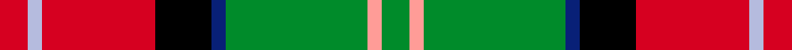

This page is one **sett** — a single exact thread-count. It belongs to the [tartan](/setts/r2lb1r8k4db1g10lr1g2/)
(the same proportion at any scale), whose colour order is pattern [GYGBKRWR](/stripes/gygbkrwr/).

Part of the [Sawyer](/tartans/sawyer/) tartan — the named design grouping this sett with its other cloths.

Sourced from register-of-tartans.  It is a [8 stripe tartan](/stripes/stripes8/).

Original link https://www.tartanregister.gov.uk/tartanDetails.aspx?ref=3662

2 attestations — the source records this cloth was collapsed from (oldest owns this page)

<ul>
<li>01/01/1994 — Sawyer (register-of-tartans, <a href="https://www.tartanregister.gov.uk/tartanDetails.aspx?ref=3662">record</a>)  <em>Designed and copyrighted by Dr.Philip D. Smith, 1994.</em></li>
<li>1994 — Sawyer (Name) (tartans-authority, <a href="http://www.tartansauthority.com/tartan-ferret/display/2162/">record</a>)  <em>Designed and copyrighted by Dr.Philip D. Smith, 1994. Regarded as 'Name.'</em></li>
</ul>

## Register references

External register numbers recorded for this tartan.

- Scottish Register of Tartans: [3662](https://www.tartanregister.gov.uk/tartanDetails.aspx?ref=3662)
- Scottish Tartans Authority (ITI): 2162
- Scottish Tartans World Register: 2162

## Thread count
R/8 LB4 R32 K16 DB4 G40 LR4 G/8

One full sett is **216 threads**.

## Palette
<table><thead><tr><th>Colour</th><th>Shade</th><th>OKLCh</th></tr></thead><tbody><tr><td>DB</td><td><code style="background-color:#082077;">#082077</code> <small style="color:#888">#082077</small></td><td><small style="color:#888">oklch(30.0% 0.149 265.1)</small></td></tr><tr><td>DR</td><td><code style="background-color:#D60020;">#D60020</code> <small style="color:#888">#D60020</small></td><td><small style="color:#888">oklch(55.2% 0.224 25.5)</small></td></tr><tr><td>G</td><td><code style="background-color:#008B2A;">#008B2A</code> <small style="color:#888">#008B2A</small></td><td><small style="color:#888">oklch(55.4% 0.170 145.9)</small></td></tr><tr><td>K</td><td><code style="background-color:#000000;">#000000</code> <small style="color:#888">#000000</small></td><td><small style="color:#888">oklch(0.0% 0.000 0.0)</small></td></tr><tr><td>LP</td><td><code style="background-color:#B5BBDE;">#B5BBDE</code> <small style="color:#888">#B5BBDE</small></td><td><small style="color:#888">oklch(79.9% 0.050 277.6)</small></td></tr><tr><td>N</td><td><code style="background-color:#FF9C97;">#FF9C97</code> <small style="color:#888">#FF9C97</small></td><td><small style="color:#888">oklch(79.3% 0.119 23.2)</small></td></tr></tbody></table>

# Sample pattern

## Nearest variants

The nearest existing variants by ΔTartan distance, with this cloth at the top so the swatches line up against it.

ΔTartan

Threads

Variant

Sett

—

216

<a href="/variants/s8/r2lb1r8k4db1g10lr1g2~x4/">Sawyer</a>

<a href="/ttd/edit/#slug=r2lb1r8k4db1g10w1g2~x4&amp;base=r2lb1r8k4db1g10lr1g2~x4" title="compare in the TTD">0.30</a>

216

<a href="/variants/s8/r2lb1r8k4db1g10w1g2~x4/">Sawyer</a>

<a href="/ttd/edit/#slug=g28db3g3k10r2k10r20y4~x2&amp;base=r2lb1r8k4db1g10lr1g2~x4" title="compare in the TTD">2.57</a>

256

<a href="/variants/s8/g28db3g3k10r2k10r20y4~x2/">Garvock (2015)</a>

<a href="/ttd/edit/#slug=db4w1k3y1g1w1k1g8r12w1r2k1~x2&amp;base=r2lb1r8k4db1g10lr1g2~x4" title="compare in the TTD">2.70</a>

134

<a href="/variants/s12/db4w1k3y1g1w1k1g8r12w1r2k1~x2/">MacLean</a>

## Neighbour map

Every grey dot is one of 13620 variants placed by the first two principal components of the ΔTartan feature space (42% of its variance). Red is this tartan; blue dots are its nearest — click one to open its page.

<svg viewBox="0 0 640 380" role="img" style="max-width:100%;height:auto;border:1px solid #e0e0e0;border-radius:4px;display:block" xmlns="http://www.w3.org/2000/svg"><image href="/nn/cloud.v1.png" width="640" height="380"/><a href="/variants/s8/r2lb1r8k4db1g10w1g2~x4/"><circle cx="142.8" cy="147.2" r="4" fill="#3465a4"><title>Sawyer</title></circle></a><a href="/variants/s8/g28db3g3k10r2k10r20y4~x2/"><circle cx="147.0" cy="148.2" r="4" fill="#3465a4"><title>Garvock (2015)</title></circle></a><a href="/variants/s12/db4w1k3y1g1w1k1g8r12w1r2k1~x2/"><circle cx="120.6" cy="105.2" r="4" fill="#3465a4"><title>MacLean</title></circle></a><circle cx="146.7" cy="147.9" r="5" fill="#c00000"/><text x="320" y="376" text-anchor="middle" font-size="11" fill="#999">ground</text><text x="11" y="190" text-anchor="middle" font-size="11" fill="#999" transform="rotate(-90 11 190)">complexity</text></svg>

ID: /variants/s8/r2lb1r8k4db1g10lr1g2~x4/
