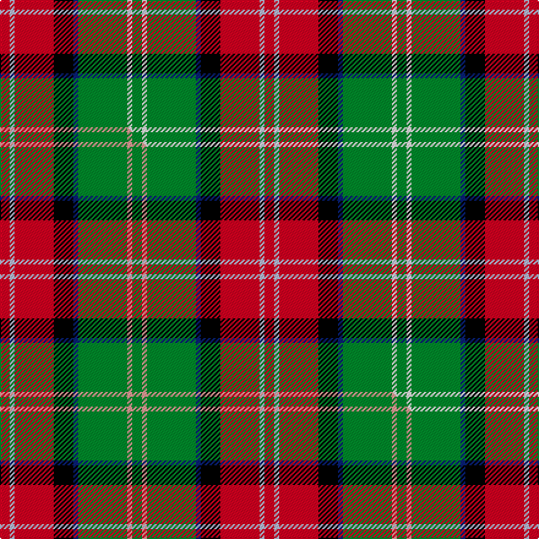

This is one **variant** — a specific cloth: this exact thread count and colourway, with its own
provenance below. It is one weaving of the [sett](/setts/r2lb1r8k4db1g10w1g2/) (the scale-free proportion — the
same cloth at any scale or shade), whose colour order is pattern [GWGBKRWR](/stripes/gwgbkrwr/).

Part of the [Sawyer](/tartans/s/sa/sawyer/) tartan — the named design grouping this sett with its other cloths.

Sourced from house-of-tartan.  It is a [8 stripe tartan](/stripes/stripes8/).

Original link [http://www.house-of-tartan.scotland.net/house/TartanViewjs.asp?colr=Def&tnam=2162](http://www.house-of-tartan.scotland.net/house/TartanViewjs.asp?colr=Def&tnam=2162)

## Provenance

Earliest known date: 1994 Information from Dr. Phil Smith, Narvon, USA.

2 attestations — the source records this cloth was collapsed from (oldest owns this page)

<ul>
<li>1994 — Sawyer Family Tartan (house-of-tartan, <a href="http://www.house-of-tartan.scotland.net/house/TartanViewjs.asp?colr=Def&tnam=2162">record</a>) </li>
<li>undated — Sawyer (weddslist, <a href="http://www.weddslist.com/cgi-bin/tartans/pg.pl?source=sts">record</a>) </li>
</ul>

Dataset <small>— provenance for this record, inherited from the source manifest</small>

<dl class="dataset-prov">
<dt>source</dt><dd><a href="/sources/house-of-tartan/">House of Tartan</a></dd>
<dt>data captured from</dt><dd><a href="https://github.com/thetartan/tartan-database/blob/master/data/house-of-tartan/data.csv">https://github.com/thetartan/tartan-database/blob/master/data/house-of-tartan/data.csv</a></dd>
<dt>data date</dt><dd>1994 <small>(this record)</small></dd>
<dt>licence</dt><dd><a href="https://creativecommons.org/licenses/by-nc-nd/4.0/">CC BY-NC-ND 4.0</a></dd>
</dl>

Capture chain <small>— the hands this data passed through, oldest first; each capture carries its own licence</small>

<ol class="capture-chain">
<li><a href="http://www.house-of-tartan.scotland.net/">House of Tartan</a> <small>the weaver/retailer's database — the site is now offline; the URL is kept as the ultimate source's identity</small></li>
<li><a href="https://github.com/thetartan/tartan-database">thetartan/tartan-database</a> <small>2016-2017</small> · <a href="https://creativecommons.org/licenses/by-nc-nd/4.0/">CC BY-NC-ND 4.0</a> <small>Levko Kravets's frozen compilation — the capture we vendored, and where its CC licence text came from</small></li>
<li>this dictionary <small>captured 2026-06-10 · commit 5bf86c7566</small> <small>each re-capture is a git commit to data/sources</small></li>
</ol>

## Thread count
R/8 LB4 R32 K16 DB4 G40 W4 G/8

One full sett is **216 threads**.

## Palette
<table><thead><tr><th>Colour</th><th>Shade</th><th>OKLCh</th></tr></thead><tbody><tr><td>LB</td><td><code style="background-color:#B5BBDE;">#B5BBDE</code> <small style="color:#888">#B5BBDE</small></td><td><small style="color:#888">oklch(79.9% 0.050 277.6)</small></td></tr><tr><td>DB</td><td><code style="background-color:#082077;">#082077</code> <small style="color:#888">#082077</small></td><td><small style="color:#888">oklch(30.0% 0.149 265.1)</small></td></tr><tr><td>G</td><td><code style="background-color:#008B2A;">#008B2A</code> <small style="color:#888">#008B2A</small></td><td><small style="color:#888">oklch(55.4% 0.170 145.9)</small></td></tr><tr><td>K</td><td><code style="background-color:#000000;">#000000</code> <small style="color:#888">#000000</small></td><td><small style="color:#888">oklch(0.0% 0.000 0.0)</small></td></tr><tr><td>W</td><td><code style="background-color:#F7F7F7;">#F7F7F7</code> <small style="color:#888">#F7F7F7</small></td><td><small style="color:#888">oklch(97.6% 0.000 89.9)</small></td></tr><tr><td>R</td><td><code style="background-color:#D60020;">#D60020</code> <small style="color:#888">#D60020</small></td><td><small style="color:#888">oklch(55.2% 0.224 25.5)</small></td></tr></tbody></table>

# Sample pattern

## Compared to the master

This cloth is one sett of its design; the master sett (the exemplar the design is anchored on) is below for comparison.

Its **ΔTartan distance** from the master is **0.30** — the same measure the nearest-tartans table ranks by (0 is identical; a re-scale of the same cloth is near 0, a recolour or a different proportion further).

<figure class="master-compare" style="margin:0">

this sett
master sett ★

<figcaption style="color:#888;font-size:smaller">One weave of this sett against the <a href="/setts/r2lb1r8k4db1g10lr1g2/">master sett ★</a>, split on the diagonal: a shared proportion runs seamlessly across it with only the shades shifting; a different proportion breaks on it.</figcaption>
</figure>

## Nearest tartan variants

The nearest existing variants by ΔTartan distance, with this cloth at the top so the swatches line up against it.

ΔTartan

Threads

Variant

Sett

—

216

<a href="/variants/s8/r2lb1r8k4db1g10w1g2~x4/">Sawyer Family Tartan</a>

<a href="/ttd/edit/#slug=r2lb1r8k4db1g10lr1g2~x4&amp;base=r2lb1r8k4db1g10w1g2~x4" title="compare in the TTD">0.30</a>

216

<a href="/variants/s8/r2lb1r8k4db1g10lr1g2~x4/">Sawyer</a>

<a href="/ttd/edit/#slug=ly4y2ly21do11w2k20r3~x2&amp;base=r2lb1r8k4db1g10w1g2~x4" title="compare in the TTD">1.69</a>

238

<a href="/variants/s7/ly4y2ly21do11w2k20r3~x2/">Barbour Corporate Tartan</a>

<a href="/ttd/edit/#slug=g5lg5y26k4y6r5k15w4~x2&amp;base=r2lb1r8k4db1g10w1g2~x4" title="compare in the TTD">2.02</a>

262

<a href="/variants/s8/g5lg5y26k4y6r5k15w4~x2/">Cornish Christophers (Personal)</a>

<a href="/ttd/edit/#slug=lg2r20g2dt15k2lg19lb2~x2&amp;base=r2lb1r8k4db1g10w1g2~x4" title="compare in the TTD">2.03</a>

240

<a href="/variants/s7/lg2r20g2dt15k2lg19lb2~x2/">Wallace Memorial Centenary</a>

<a href="/ttd/edit/#slug=lb4dy27ly8k4ly8k4ly8o11y3~x2&amp;base=r2lb1r8k4db1g10w1g2~x4" title="compare in the TTD">2.12</a>

294

<a href="/variants/s9/lb4dy27ly8k4ly8k4ly8o11y3~x2/">Brittany National Walking</a>

<a href="/ttd/edit/#slug=o4k12b2k2b2k2b2ly16dr3ly2lr2ly4~x2&amp;base=r2lb1r8k4db1g10w1g2~x4" title="compare in the TTD">2.42</a>

196

<a href="/variants/s12/o4k12b2k2b2k2b2ly16dr3ly2lr2ly4~x2/">Cailean #2 (Fashion)</a>

<a href="/ttd/edit/#slug=db4w1k3y1g1w1k1g8r12w1r2k1~x2&amp;base=r2lb1r8k4db1g10w1g2~x4" title="compare in the TTD">2.47</a>

134

<a href="/variants/s12/db4w1k3y1g1w1k1g8r12w1r2k1~x2/">MacLean</a>

<a href="/ttd/edit/#slug=k20ly4r4ly20g20w5g2dg2~x2~g1903114-dg1806142&amp;base=r2lb1r8k4db1g10w1g2~x4" title="compare in the TTD">2.49</a>

264

<a href="/variants/s8/k20ly4r4ly20g20w5g2dg2~x2~g1903114-dg1806142/">Hackett Hunting (Personal)</a>

<a href="/ttd/edit/#slug=dg9w2dg9k2o14ly4w2r2~x4~o2503076-ly2705081&amp;base=r2lb1r8k4db1g10w1g2~x4" title="compare in the TTD">2.57</a>

308

<a href="/variants/s8/dg9w2dg9k2ly14lyi4w2r2~x4~ly2503076-lyi2705081/">MacShane (Clan)</a>

<a href="/ttd/edit/#slug=g28db3g3k10r2k10r20y4~x2&amp;base=r2lb1r8k4db1g10w1g2~x4" title="compare in the TTD">2.58</a>

256

<a href="/variants/s8/g28db3g3k10r2k10r20y4~x2/">Garvock (2015)</a>

## Neighbour map

Every grey dot is one of 13621 variants placed by the first two principal components of the ΔTartan feature space (42% of its variance). Red is this tartan; blue dots are its nearest — click one to open its page.

<svg viewBox="0 0 640 380" role="img" style="max-width:100%;height:auto;border:1px solid #e0e0e0;border-radius:4px;display:block" xmlns="http://www.w3.org/2000/svg"><image href="/nn/cloud.v1.png" width="640" height="380"/><a href="/variants/s8/r2lb1r8k4db1g10lr1g2~x4/"><circle cx="146.7" cy="148.2" r="4" fill="#3465a4"><title>Sawyer</title></circle></a><a href="/variants/s7/ly4y2ly21do11w2k20r3~x2/"><circle cx="112.5" cy="147.1" r="4" fill="#3465a4"><title>Barbour Corporate Tartan</title></circle></a><a href="/variants/s8/g5lg5y26k4y6r5k15w4~x2/"><circle cx="122.0" cy="164.5" r="4" fill="#3465a4"><title>Cornish Christophers (Personal)</title></circle></a><a href="/variants/s7/lg2r20g2dt15k2lg19lb2~x2/"><circle cx="121.2" cy="159.7" r="4" fill="#3465a4"><title>Wallace Memorial Centenary</title></circle></a><a href="/variants/s9/lb4dy27ly8k4ly8k4ly8o11y3~x2/"><circle cx="99.8" cy="161.1" r="4" fill="#3465a4"><title>Brittany National Walking</title></circle></a><a href="/variants/s12/o4k12b2k2b2k2b2ly16dr3ly2lr2ly4~x2/"><circle cx="103.3" cy="126.3" r="4" fill="#3465a4"><title>Cailean #2 (Fashion)</title></circle></a><a href="/variants/s12/db4w1k3y1g1w1k1g8r12w1r2k1~x2/"><circle cx="120.5" cy="105.3" r="4" fill="#3465a4"><title>MacLean</title></circle></a><a href="/variants/s8/k20ly4r4ly20g20w5g2dg2~x2~g1903114-dg1806142/"><circle cx="72.7" cy="153.2" r="4" fill="#3465a4"><title>Hackett Hunting (Personal)</title></circle></a><a href="/variants/s8/dg9w2dg9k2ly14lyi4w2r2~x4~ly2503076-lyi2705081/"><circle cx="127.6" cy="180.2" r="4" fill="#3465a4"><title>MacShane (Clan)</title></circle></a><a href="/variants/s8/g28db3g3k10r2k10r20y4~x2/"><circle cx="147.0" cy="148.4" r="4" fill="#3465a4"><title>Garvock (2015)</title></circle></a><circle cx="142.8" cy="147.5" r="5" fill="#c00000"/><text x="320" y="376" text-anchor="middle" font-size="11" fill="#999">ground</text><text x="11" y="190" text-anchor="middle" font-size="11" fill="#999" transform="rotate(-90 11 190)">complexity</text></svg>

ID: /variants/s8/r2lb1r8k4db1g10w1g2~x4/
