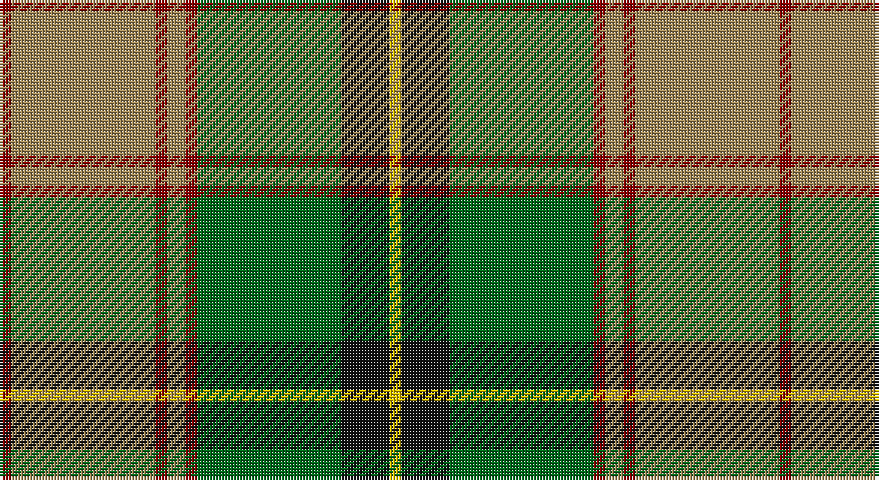

This page is one **sett** — a single exact thread-count. It belongs to the [tartan](/setts/r2lo24r2lo3r2g24k8ly2/)
(the same proportion at any scale), whose colour order is pattern [RYRYRGKY](/stripes/ryryrgky/).

Sourced from tartans-authority.  It is a [8 stripe tartan](/stripes/stripes8/).

Original link http://www.tartansauthority.com/tartan-ferret/display/8585/

## Register references

External register numbers recorded for this tartan.

- Scottish Tartans Authority (ITI): 8585

## Thread count
DR/4 LT48 DR4 LT6 DR4 G48 K16 Y/4

One full sett is **260 threads**.

## Palette

Palette: <strong>Tartan Register</strong>
<table><thead><tr><th>Colour</th><th>Threads</th><th>Shade</th><th>Base</th><th>OKLCh</th></tr></thead><tbody><tr><td>DR/</td><td style="text-align:right;font-variant-numeric:tabular-nums">4</td><td><code style="background-color:#880000;">#880000</code> <small style="color:#888">#880000</small></td><td>R <code style="background-color:#CC0000;">#CC0000</code></td><td><small style="color:#888">oklch(39.4% 0.162 29.2)</small></td></tr><tr><td>LT</td><td style="text-align:right;font-variant-numeric:tabular-nums">48</td><td><code style="background-color:#A08858;">#A08858</code> <small style="color:#888">#A08858</small></td><td>Y <code style="background-color:#F2BF00;">#F2BF00</code></td><td><small style="color:#888">oklch(63.7% 0.071 84.0)</small></td></tr><tr><td>DR</td><td style="text-align:right;font-variant-numeric:tabular-nums">4</td><td><code style="background-color:#880000;">#880000</code> <small style="color:#888">#880000</small></td><td>R <code style="background-color:#CC0000;">#CC0000</code></td><td><small style="color:#888">oklch(39.4% 0.162 29.2)</small></td></tr><tr><td>LT</td><td style="text-align:right;font-variant-numeric:tabular-nums">6</td><td><code style="background-color:#A08858;">#A08858</code> <small style="color:#888">#A08858</small></td><td>Y <code style="background-color:#F2BF00;">#F2BF00</code></td><td><small style="color:#888">oklch(63.7% 0.071 84.0)</small></td></tr><tr><td>DR</td><td style="text-align:right;font-variant-numeric:tabular-nums">4</td><td><code style="background-color:#880000;">#880000</code> <small style="color:#888">#880000</small></td><td>R <code style="background-color:#CC0000;">#CC0000</code></td><td><small style="color:#888">oklch(39.4% 0.162 29.2)</small></td></tr><tr><td>G</td><td style="text-align:right;font-variant-numeric:tabular-nums">48</td><td><code style="background-color:#006818;">#006818</code> <small style="color:#888">#006818</small></td><td>G <code style="background-color:#006100;">#006100</code></td><td><small style="color:#888">oklch(45.0% 0.142 145.0)</small></td></tr><tr><td>K</td><td style="text-align:right;font-variant-numeric:tabular-nums">16</td><td><code style="background-color:#101010;">#101010</code> <small style="color:#888">#101010</small></td><td>K <code style="background-color:#000000;">#000000</code></td><td><small style="color:#888">oklch(17.3% 0.000 89.9)</small></td></tr><tr><td>Y/</td><td style="text-align:right;font-variant-numeric:tabular-nums">4</td><td><code style="background-color:#E8C000;">#E8C000</code> <small style="color:#888">#E8C000</small></td><td>Y <code style="background-color:#F2BF00;">#F2BF00</code></td><td><small style="color:#888">oklch(81.9% 0.168 93.7)</small></td></tr></tbody></table>

# Sample pattern

## Nearest tartans

The nearest existing variants by ΔTartan distance, with this tartan at the top so the swatches line up against it.

ΔTartan

Tartan

Sett

—

<a href="/ttd/edit/#slug=r2lo24r2lo3r2g24k8ly2~x2">Botherston (Name)</a> <a class="nn-out" href="/variants/s8/r2lo24r2lo3r2g24k8ly2~x2/" title="open its dictionary page">↗</a>

0.99

<a href="/ttd/edit/#slug=t2g1t1g12r2g1ri6ly2~x2&amp;base=r2lo24r2lo3r2g24k8ly2~x2">Manitoba</a> <a class="nn-out" href="/variants/s8/t2g1t1g12r2g1ri6ly2~x2/" title="open its dictionary page">↗</a>

1.02

<a href="/ttd/edit/#slug=t2g1t1g12r2g1m6ly2~x2&amp;base=r2lo24r2lo3r2g24k8ly2~x2">Manitoba District Tartan</a> <a class="nn-out" href="/variants/s8/t2g1t1g12r2g1m6ly2~x2/" title="open its dictionary page">↗</a>

1.07

<a href="/ttd/edit/#slug=t2g1t1g12dg2g1r6ly2~x4&amp;base=r2lo24r2lo3r2g24k8ly2~x2">Manitoba District Tartan</a> <a class="nn-out" href="/variants/s8/t2g1t1g12dg2g1r6ly2~x4/" title="open its dictionary page">↗</a>

1.08

<a href="/ttd/edit/#slug=g2do13g11ly5do1lo21g2dy1~x2&amp;base=r2lo24r2lo3r2g24k8ly2~x2">St. Lawrence #2 (Fashion)</a> <a class="nn-out" href="/variants/s8/g2do13g11ly5do1lo21g2dy1~x2/" title="open its dictionary page">↗</a>

1.11

<a href="/ttd/edit/#slug=t2g1t1g12dg2g1m6ly2~x4&amp;base=r2lo24r2lo3r2g24k8ly2~x2">Manitoba</a> <a class="nn-out" href="/variants/s8/t2g1t1g12dg2g1m6ly2~x4/" title="open its dictionary page">↗</a>

1.13

<a href="/ttd/edit/#slug=dg70ly6y28g56y5g11y5g11lo12&amp;base=r2lo24r2lo3r2g24k8ly2~x2">Dalwhinnie</a> <a class="nn-out" href="/variants/s9/dg70ly6y28g56y5g11y5g11lo12/" title="open its dictionary page">↗</a>

1.18

<a href="/ttd/edit/#slug=dg70ly6o28g56o5g11o5g11lo12&amp;base=r2lo24r2lo3r2g24k8ly2~x2">Dalwhinnie Trade Tartan</a> <a class="nn-out" href="/variants/s9/dg70ly6o28g56o5g11o5g11lo12/" title="open its dictionary page">↗</a>

1.19

<a href="/ttd/edit/#slug=dg70ly6lr28g56lr5g11lr5g11r12&amp;base=r2lo24r2lo3r2g24k8ly2~x2">Dalwhinnie</a> <a class="nn-out" href="/variants/s9/dg70ly6lr28g56lr5g11lr5g11r12/" title="open its dictionary page">↗</a>

1.20

<a href="/ttd/edit/#slug=t2dg1t1dg12r2dg1ri6ly2~x2&amp;base=r2lo24r2lo3r2g24k8ly2~x2">Manitoba Red</a> <a class="nn-out" href="/variants/s8/t2dg1t1dg12r2dg1ri6ly2~x2/" title="open its dictionary page">↗</a>

1.23

<a href="/ttd/edit/#slug=g10dp42r5gi42g42ly5g6&amp;base=r2lo24r2lo3r2g24k8ly2~x2">New Mexico (Fashion)</a> <a class="nn-out" href="/variants/s7/g10dp42r5gi42g42ly5g6/" title="open its dictionary page">↗</a>

## Neighbour map

Every grey dot is one of 14360 variants placed by the first two principal components of the ΔTartan feature space (44% of its variance). Red is this tartan; blue dots are its nearest — click one to open its page.

<svg viewBox="0 0 640 380" role="img" style="max-width:100%;height:auto;border:1px solid #e0e0e0;border-radius:4px;display:block" xmlns="http://www.w3.org/2000/svg"><image href="/nn/cloud.v1.png" width="640" height="380"/><a href="/variants/s8/t2g1t1g12r2g1ri6ly2~x2/"><circle cx="268.2" cy="162.1" r="4" fill="#3465a4"><title>Manitoba</title></circle></a><a href="/variants/s8/t2g1t1g12r2g1m6ly2~x2/"><circle cx="273.7" cy="163.8" r="4" fill="#3465a4"><title>Manitoba District Tartan</title></circle></a><a href="/variants/s8/t2g1t1g12dg2g1r6ly2~x4/"><circle cx="280.1" cy="173.4" r="4" fill="#3465a4"><title>Manitoba District Tartan</title></circle></a><a href="/variants/s8/g2do13g11ly5do1lo21g2dy1~x2/"><circle cx="210.1" cy="143.0" r="4" fill="#3465a4"><title>St. Lawrence #2 (Fashion)</title></circle></a><a href="/variants/s8/t2g1t1g12dg2g1m6ly2~x4/"><circle cx="266.8" cy="167.6" r="4" fill="#3465a4"><title>Manitoba</title></circle></a><a href="/variants/s9/dg70ly6y28g56y5g11y5g11lo12/"><circle cx="206.3" cy="164.8" r="4" fill="#3465a4"><title>Dalwhinnie</title></circle></a><a href="/variants/s9/dg70ly6o28g56o5g11o5g11lo12/"><circle cx="202.9" cy="162.0" r="4" fill="#3465a4"><title>Dalwhinnie Trade Tartan</title></circle></a><a href="/variants/s9/dg70ly6lr28g56lr5g11lr5g11r12/"><circle cx="221.8" cy="170.8" r="4" fill="#3465a4"><title>Dalwhinnie</title></circle></a><a href="/variants/s8/t2dg1t1dg12r2dg1ri6ly2~x2/"><circle cx="273.5" cy="164.5" r="4" fill="#3465a4"><title>Manitoba Red</title></circle></a><a href="/variants/s7/g10dp42r5gi42g42ly5g6/"><circle cx="171.4" cy="198.7" r="4" fill="#3465a4"><title>New Mexico (Fashion)</title></circle></a><circle cx="226.4" cy="162.5" r="5" fill="#c00000"/></svg>

ID: /variants/s8/r2lo24r2lo3r2g24k8ly2~x2/
