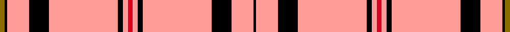

This is one **variant** — a specific cloth: this exact thread count and colourway, with its own
provenance below. It is one weaving of the [sett](/tartans/s/su/summer-spirit/) (the scale-free proportion — the
same cloth at any scale or shade), whose colour order is pattern [GKYKYKYR](/stripes/gkykykyr/).

Part of the [Summer Spirit](/tartans/s/su/summer-spirit/) tartan — the named design grouping this sett with its other cloths.

Sourced from register-of-tartans.  It is a [8 stripe tartan](/stripes/stripes8/).

Original link [https://www.tartanregister.gov.uk/tartanDetails.aspx?ref=4038](https://www.tartanregister.gov.uk/tartanDetails.aspx?ref=4038)

2 attestations — the source records this cloth was collapsed from (oldest owns this page)

<ul>
<li>01/12/2005 — Summer Spirit (register-of-tartans, <a href="https://www.tartanregister.gov.uk/tartanDetails.aspx?ref=4038">record</a>)  <em>From the House of Edgar for ACS Clothing of Glasgow for use in their clothing range. Woven sample. The white shown here should be slightly creamier.</em></li>
<li>2005 December — Summer Spirit (Fashion) (tartans-authority, <a href="https://web.archive.org/web/*/http://www.tartansauthority.com/tartan-ferret/display/6824/*">record</a>)  <em>From the House of Edgar designed by Kirsty Anderson of House of Edgar.for ACS Clothing of Glasgow for use in their clothing range. Woven sample. The white shown here should be slightly creamier.</em></li>
</ul>

Dataset <small>— provenance for this record, inherited from the source manifest</small>

<dl class="dataset-prov">
<dt>source</dt><dd><a href="/sources/register-of-tartans/">Scottish Register of Tartans</a></dd>
<dt>data captured from</dt><dd><a href="https://github.com/thetartan/tartan-database/blob/master/data/register-of-tartans/data.csv">https://github.com/thetartan/tartan-database/blob/master/data/register-of-tartans/data.csv</a></dd>
<dt>data date</dt><dd>01/12/2005 <small>(this record)</small></dd>
<dt>licence</dt><dd><a href="https://www.tartanregister.gov.uk/copyright">Crown copyright</a></dd>
</dl>

Capture chain <small>— the hands this data passed through, oldest first; each capture carries its own licence</small>

<ol class="capture-chain">
<li><a href="https://www.tartanregister.gov.uk/">Scottish Register of Tartans</a> · <a href="https://www.tartanregister.gov.uk/copyright">Crown copyright</a> <small>the living register — still published by National Records of Scotland</small></li>
<li><a href="https://github.com/thetartan/tartan-database">thetartan/tartan-database</a> <small>2016-2017</small> · <a href="https://creativecommons.org/licenses/by-nc-nd/4.0/">CC BY-NC-ND 4.0</a> <small>Levko Kravets's frozen compilation — the capture we vendored, and where its CC licence text came from</small></li>
<li>this dictionary <small>captured 2026-06-10 · commit 5bf86c7566</small> <small>each re-capture is a git commit to data/sources</small></li>
</ol>

## Register references

External register numbers recorded for this tartan.

- Scottish Register of Tartans: [4038](https://www.tartanregister.gov.uk/tartanDetails.aspx?ref=4038)
- Scottish Tartans Authority (ITI): 6824

## Thread count
R/4 LR4 K4 LR56 K16 LR18 K2 Y/4

One full sett is **208 threads**.

The source recorded this cloth as Y/4 K2 LR18 K16 LR56 K4 LR4 R4 LR4 K4 LR56 K16 LR18 K/2 — 410 threads; it folds to the canonical 208-thread sett above.

## Palette
<table><thead><tr><th>Colour</th><th>Shade</th><th>OKLCh</th></tr></thead><tbody><tr><td>K</td><td><code style="background-color:#000000;">#000000</code> <small style="color:#888">#000000</small></td><td><small style="color:#888">oklch(0.0% 0.000 0.0)</small></td></tr><tr><td>W</td><td><code style="background-color:#E8CCB8;">#E8CCB8</code> <small style="color:#888">#E8CCB8</small></td><td><small style="color:#888">oklch(86.3% 0.042 57.7)</small></td></tr><tr><td>R</td><td><code style="background-color:#D60020;">#D60020</code> <small style="color:#888">#D60020</small></td><td><small style="color:#888">oklch(55.2% 0.224 25.5)</small></td></tr><tr><td>W</td><td><code style="background-color:#F8F8F8;">#F8F8F8</code> <small style="color:#888">#F8F8F8</small></td><td><small style="color:#888">oklch(97.9% 0.000 89.9)</small></td></tr><tr><td>LR</td><td><code style="background-color:#FF9C97;">#FF9C97</code> <small style="color:#888">#FF9C97</small></td><td><small style="color:#888">oklch(79.3% 0.119 23.2)</small></td></tr><tr><td>Y</td><td><code style="background-color:#8B6E00;">#8B6E00</code> <small style="color:#888">#8B6E00</small></td><td><small style="color:#888">oklch(55.1% 0.113 90.4)</small></td></tr></tbody></table>

# Sample pattern

## Nearest tartan variants

The nearest existing variants by ΔTartan distance, with this cloth at the top so the swatches line up against it.

ΔTartan

Threads

Variant

Sett

—

410

<a href="/variants/s8/r2lr2k2lr28k8lr9k1y2~x2/">Summer Spirit</a>

<a href="/ttd/edit/#slug=lr18k1dy3k1lr2dr2k2dr2lr2~x4&amp;base=r2lr2k2lr28k8lr9k1y2~x2" title="compare in the TTD">2.79</a>

184

<a href="/variants/s9/lr18k1dy3k1lr2dr2k2dr2lr2~x4/">Anthony Plaid Ecru</a>

<a href="/ttd/edit/#slug=r32k2n3w4n3k2r22k1r5k2w6k2r4w5~x2&amp;base=r2lr2k2lr28k8lr9k1y2~x2" title="compare in the TTD">3.83</a>

298

<a href="/variants/s14/r32k2n3w4n3k2r22k1r5k2w6k2r4w5~x2/">Alabama, University of</a>

## Neighbour map

Every grey dot is one of 13662 variants placed by the first two principal components of the ΔTartan feature space (42% of its variance). Red is this tartan; blue dots are its nearest — click one to open its page. The map is a flat projection of a many-dimensional space — [how to read it](/posts/neighbourhood-maps/).

<svg viewBox="0 0 640 380" role="img" style="max-width:100%;height:auto;border:1px solid #e0e0e0;border-radius:4px;display:block" xmlns="http://www.w3.org/2000/svg"><image href="/nn/cloud.v1.png" width="640" height="380"/><a href="/variants/s9/lr18k1dy3k1lr2dr2k2dr2lr2~x4/"><circle cx="347.3" cy="102.3" r="4" fill="#3465a4"><title>Anthony Plaid Ecru</title></circle></a><a href="/variants/s14/r32k2n3w4n3k2r22k1r5k2w6k2r4w5~x2/"><circle cx="371.1" cy="64.2" r="4" fill="#3465a4"><title>Alabama, University of</title></circle></a><circle cx="405.1" cy="76.3" r="5" fill="#c00000"/><text x="320" y="376" text-anchor="middle" font-size="11" fill="#999">ground</text><text x="11" y="190" text-anchor="middle" font-size="11" fill="#999" transform="rotate(-90 11 190)">complexity</text></svg>

ID: /variants/s8/r2lr2k2lr28k8lr9k1y2~x2/
