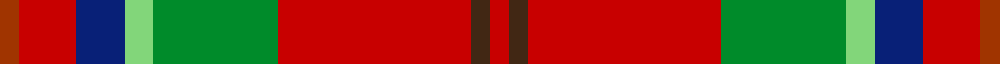

This page is one **sett** — a single exact thread-count. It belongs to the [tartan](/setts/r2ri6db5lg3g13ri20do2ri2/)
(the same proportion at any scale), whose colour order is pattern [RBRGYBRR](/stripes/rbrgybrr/).

Sourced from tartans-authority.  It is a [8 stripe tartan](/stripes/stripes8/).

Original link [https://www.tartanregister.gov.uk/tartanDetails.aspx?ref=10895](https://www.tartanregister.gov.uk/tartanDetails.aspx?ref=10895)

Dataset <small>— provenance for this record, inherited from the source manifest</small>

<dl class="dataset-prov">
<dt>source</dt><dd><a href="/sources/tartans-authority/">Scottish Tartans Authority</a></dd>
<dt>data captured from</dt><dd><a href="https://github.com/thetartan/tartan-database/blob/master/data/tartans-authority/data.csv">https://github.com/thetartan/tartan-database/blob/master/data/tartans-authority/data.csv</a></dd>
<dt>data date</dt><dd>2013 <small>(this record)</small></dd>
<dt>licence</dt><dd><a href="https://creativecommons.org/licenses/by-nc-nd/4.0/">CC BY-NC-ND 4.0</a></dd>
</dl>

Capture chain <small>— the hands this data passed through, oldest first; each capture carries its own licence</small>

<ol class="capture-chain">
<li><a href="https://www.tartansauthority.com/">Scottish Tartans Authority</a> <small>the heritage body's archive — its tartan-ferret record browser is retired (links repaired to the SRT, above)</small></li>
<li><a href="https://github.com/thetartan/tartan-database">thetartan/tartan-database</a> <small>2016-2017</small> · <a href="https://creativecommons.org/licenses/by-nc-nd/4.0/">CC BY-NC-ND 4.0</a> <small>Levko Kravets's frozen compilation — the capture we vendored, and where its CC licence text came from</small></li>
<li>this dictionary <small>captured 2026-06-10 · commit 5bf86c7566</small> <small>each re-capture is a git commit to data/sources</small></li>
</ol>

## Register references

External register numbers recorded for this tartan.

- Scottish Register of Tartans: [10895](https://www.tartanregister.gov.uk/tartanDetails?ref=10895)
- Scottish Tartans Authority (ITI): 10895

## Thread count
R/4 Ri12 DB10 LG6 G26 Ri40 DO4 Ri/4

One full sett is **204 threads**.

## Palette
<table><thead><tr><th>Colour</th><th>Shade</th><th>OKLCh</th></tr></thead><tbody><tr><td>LG</td><td><code style="background-color:#82D67A;">#82D67A</code> <small style="color:#888">#82D67A</small></td><td><small style="color:#888">oklch(80.1% 0.150 142.2)</small></td></tr><tr><td>DB</td><td><code style="background-color:#082077;">#082077</code> <small style="color:#888">#082077</small></td><td><small style="color:#888">oklch(30.0% 0.149 265.1)</small></td></tr><tr><td>DO</td><td><code style="background-color:#412714;">#412714</code> <small style="color:#888">#412714</small></td><td><small style="color:#888">oklch(30.1% 0.050 55.7)</small></td></tr><tr><td>G</td><td><code style="background-color:#008B2A;">#008B2A</code> <small style="color:#888">#008B2A</small></td><td><small style="color:#888">oklch(55.4% 0.170 145.9)</small></td></tr><tr><td>R</td><td><code style="background-color:#A03400;">#A03400</code> <small style="color:#888">#A03400</small></td><td><small style="color:#888">oklch(47.9% 0.152 39.6)</small></td></tr><tr><td>R</td><td><code style="background-color:#C80000;">#C80000</code> <small style="color:#888">#C80000</small></td><td><small style="color:#888">oklch(52.3% 0.215 29.2)</small></td></tr></tbody></table>

# Sample pattern

## Nearest tartan variants

The nearest existing variants by ΔTartan distance, with this cloth at the top so the swatches line up against it.

ΔTartan

Threads

Variant

Sett

—

204

<a href="/variants/s8/r2ri6db5lg3g13ri20do2ri2~x2~r1906038-ri2109032/">Flowers of the Forest, The</a>

<a href="/ttd/edit/#slug=r1do1r9g6lb2t3r2ly1~x4&amp;base=r2ri6db5lg3g13ri20do2ri2~x2~r1906038-ri2109032" title="compare in the TTD">1.83</a>

192

<a href="/variants/s8/r1do1r9g6lb2t3r2ly1~x4/">Battle of Bannockburn, The</a>

<a href="/ttd/edit/#slug=y3r16n5dy22g2dy4w3~x2&amp;base=r2ri6db5lg3g13ri20do2ri2~x2~r1906038-ri2109032" title="compare in the TTD">1.92</a>

208

<a href="/variants/s7/y3r16n5dy22g2dy4w3~x2/">Pubcrawlers, The</a>

<a href="/ttd/edit/#slug=r1dy1r9g6lg2gi3r2y1~x4~lg2803208-gi2203208&amp;base=r2ri6db5lg3g13ri20do2ri2~x2~r1906038-ri2109032" title="compare in the TTD">2.10</a>

192

<a href="/variants/s8/r1dy1r9g6lg2t3r2y1~x4~lg2803208-t2203208/">Battle of Bannockburn, The</a>

<a href="/ttd/edit/#slug=r3b1r12o3dg12w1dg2~x4&amp;base=r2ri6db5lg3g13ri20do2ri2~x2~r1906038-ri2109032" title="compare in the TTD">2.73</a>

252

<a href="/variants/s7/r3b1r12o3dg12w1dg2~x4/">Leckie (Personal)</a>

<a href="/ttd/edit/#slug=r48t16ly5g17w8dy3~x2&amp;base=r2ri6db5lg3g13ri20do2ri2~x2~r1906038-ri2109032" title="compare in the TTD">2.74</a>

286

<a href="/variants/s6/r48t16ly5g17w8dy3~x2/">Scottish American Soc. of Michigan</a>

<a href="/ttd/edit/#slug=r5g9y2g9r5db9r28g3lb2r4db2~x2&amp;base=r2ri6db5lg3g13ri20do2ri2~x2~r1906038-ri2109032" title="compare in the TTD">2.84</a>

298

<a href="/variants/s11/r5g9y2g9r5db9r28g3lb2r4db2~x2/">Loch Creran</a>

<a href="/ttd/edit/#slug=g4y9g3db4g3w3r32g4y3~x2&amp;base=r2ri6db5lg3g13ri20do2ri2~x2~r1906038-ri2109032" title="compare in the TTD">2.89</a>

246

<a href="/variants/s9/g4y9g3db4g3w3r32g4y3~x2/">Antrim County Crest (Fashion)</a>

<a href="/ttd/edit/#slug=db4do2db2w2do9o27r4~x3&amp;base=r2ri6db5lg3g13ri20do2ri2~x2~r1906038-ri2109032" title="compare in the TTD">2.93</a>

276

<a href="/variants/s7/db4do2db2w2do9o27r4~x3/">Unidentified 35</a>

<a href="/ttd/edit/#slug=dy6r30n2k3n30g3n2r25w6~x2&amp;base=r2ri6db5lg3g13ri20do2ri2~x2~r1906038-ri2109032" title="compare in the TTD">2.98</a>

404

<a href="/variants/s9/dy6r30n2k3n30g3n2r25w6~x2/">Virginia Military Institute, New Market</a>

<a href="/ttd/edit/#slug=dg30lo3dg4lo3dg30r30y4db8y4r30~x2&amp;base=r2ri6db5lg3g13ri20do2ri2~x2~r1906038-ri2109032" title="compare in the TTD">3.01</a>

464

<a href="/variants/s10/dg30lo3dg4lo3dg30r30y4db8y4r30~x2/">Hutcheson</a>

## Neighbour map

Every grey dot is one of 13621 variants placed by the first two principal components of the ΔTartan feature space (42% of its variance). Red is this tartan; blue dots are its nearest — click one to open its page.

<svg viewBox="0 0 640 380" role="img" style="max-width:100%;height:auto;border:1px solid #e0e0e0;border-radius:4px;display:block" xmlns="http://www.w3.org/2000/svg"><image href="/nn/cloud.v1.png" width="640" height="380"/><a href="/variants/s8/r1do1r9g6lb2t3r2ly1~x4/"><circle cx="234.6" cy="182.2" r="4" fill="#3465a4"><title>Battle of Bannockburn, The</title></circle></a><a href="/variants/s7/y3r16n5dy22g2dy4w3~x2/"><circle cx="241.7" cy="171.5" r="4" fill="#3465a4"><title>Pubcrawlers, The</title></circle></a><a href="/variants/s8/r1dy1r9g6lg2t3r2y1~x4~lg2803208-t2203208/"><circle cx="247.2" cy="186.3" r="4" fill="#3465a4"><title>Battle of Bannockburn, The</title></circle></a><a href="/variants/s7/r3b1r12o3dg12w1dg2~x4/"><circle cx="261.5" cy="175.5" r="4" fill="#3465a4"><title>Leckie (Personal)</title></circle></a><a href="/variants/s6/r48t16ly5g17w8dy3~x2/"><circle cx="252.8" cy="160.5" r="4" fill="#3465a4"><title>Scottish American Soc. of Michigan</title></circle></a><a href="/variants/s11/r5g9y2g9r5db9r28g3lb2r4db2~x2/"><circle cx="294.8" cy="147.4" r="4" fill="#3465a4"><title>Loch Creran</title></circle></a><a href="/variants/s9/g4y9g3db4g3w3r32g4y3~x2/"><circle cx="284.6" cy="157.0" r="4" fill="#3465a4"><title>Antrim County Crest (Fashion)</title></circle></a><a href="/variants/s7/db4do2db2w2do9o27r4~x3/"><circle cx="324.0" cy="161.5" r="4" fill="#3465a4"><title>Unidentified 35</title></circle></a><a href="/variants/s9/dy6r30n2k3n30g3n2r25w6~x2/"><circle cx="271.8" cy="131.6" r="4" fill="#3465a4"><title>Virginia Military Institute, New Market</title></circle></a><a href="/variants/s10/dg30lo3dg4lo3dg30r30y4db8y4r30~x2/"><circle cx="245.2" cy="178.5" r="4" fill="#3465a4"><title>Hutcheson</title></circle></a><circle cx="260.3" cy="165.7" r="5" fill="#c00000"/><text x="320" y="376" text-anchor="middle" font-size="11" fill="#999">ground</text><text x="11" y="190" text-anchor="middle" font-size="11" fill="#999" transform="rotate(-90 11 190)">complexity</text></svg>

ID: /variants/s8/r2ri6db5lg3g13ri20do2ri2~x2~r1906038-ri2109032/
