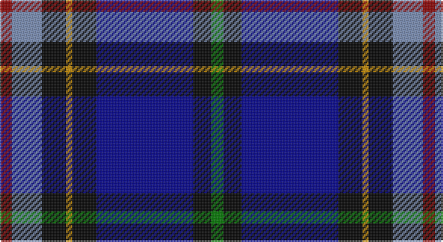

This page is one **sett** — a single exact thread-count. It belongs to the [tartan](/setts/r2t5k4lo1k4db16k3g2/)
(the same proportion at any scale), whose colour order is pattern [GKBKYKBR](/stripes/gkbkykbr/).

Part of the [Arundel County](/tartans/arundel-county/) tartan — the named design grouping this sett with its other cloths.

Sourced from register-of-tartans.  It is a [8 stripe tartan](/stripes/stripes8/).

Original link https://www.tartanregister.gov.uk/tartanDetails.aspx?ref=120

## Register references

External register numbers recorded for this tartan.

- Scottish Register of Tartans: [120](https://www.tartanregister.gov.uk/tartanDetails.aspx?ref=120)
- Scottish Tartans Authority (ITI): 4149

## Thread count
DR/8 B20 K16 DY4 K16 DB64 K12 G/8

One full sett is **280 threads**.

## Palette

Palette: <strong>Tartan Register</strong> <small style="color:#888">(7 of 8 colours)</small>
<table><thead><tr><th>Colour</th><th>Threads</th><th>Shade</th><th>Base</th><th>OKLCh</th></tr></thead><tbody><tr><td>DR/</td><td style="text-align:right;font-variant-numeric:tabular-nums">8</td><td><code style="background-color:#8C0000;">#8C0000</code> <small style="color:#888">#8C0000</small></td><td>R <code style="background-color:#CC0000;">#CC0000</code></td><td><small style="color:#888">oklch(40.2% 0.165 29.2)</small></td></tr><tr><td>B</td><td style="text-align:right;font-variant-numeric:tabular-nums">20</td><td><code style="background-color:#788CB4;">#788CB4</code> <small style="color:#888">#788CB4</small></td><td>B <code style="background-color:#2A418A;">#2A418A</code></td><td><small style="color:#888">oklch(63.9% 0.065 264.0)</small></td></tr><tr><td>K</td><td style="text-align:right;font-variant-numeric:tabular-nums">16</td><td><code style="background-color:#000000;">#000000</code> <small style="color:#888">#000000</small></td><td>K <code style="background-color:#000000;">#000000</code></td><td><small style="color:#888">oklch(0.0% 0.000 0.0)</small></td></tr><tr><td>DY</td><td style="text-align:right;font-variant-numeric:tabular-nums">4</td><td><code style="background-color:#C88C00;">#C88C00</code> <small style="color:#888">#C88C00</small></td><td>Y <code style="background-color:#F2BF00;">#F2BF00</code></td><td><small style="color:#888">oklch(68.2% 0.142 78.2)</small></td></tr><tr><td>K</td><td style="text-align:right;font-variant-numeric:tabular-nums">16</td><td><code style="background-color:#000000;">#000000</code> <small style="color:#888">#000000</small></td><td>K <code style="background-color:#000000;">#000000</code></td><td><small style="color:#888">oklch(0.0% 0.000 0.0)</small></td></tr><tr><td>DB</td><td style="text-align:right;font-variant-numeric:tabular-nums">64</td><td><code style="background-color:#00008C;">#00008C</code> <small style="color:#888">#00008C</small></td><td>B <code style="background-color:#2A418A;">#2A418A</code></td><td><small style="color:#888">oklch(28.9% 0.200 264.1)</small></td></tr><tr><td>K</td><td style="text-align:right;font-variant-numeric:tabular-nums">12</td><td><code style="background-color:#000000;">#000000</code> <small style="color:#888">#000000</small></td><td>K <code style="background-color:#000000;">#000000</code></td><td><small style="color:#888">oklch(0.0% 0.000 0.0)</small></td></tr><tr><td>G/</td><td style="text-align:right;font-variant-numeric:tabular-nums">8</td><td><code style="background-color:#007800;">#007800</code> <small style="color:#888">#007800</small></td><td>G <code style="background-color:#006100;">#006100</code></td><td><small style="color:#888">oklch(49.6% 0.169 142.5)</small></td></tr></tbody></table>

# Sample pattern

## Nearest tartans

The nearest existing variants by ΔTartan distance, with this tartan at the top so the swatches line up against it.

ΔTartan

Tartan

Sett

—

<a href="/ttd/edit/#slug=r2t5k4lo1k4db16k3g2~x4">Arundel County (Dalgleish)</a> <a class="nn-out" href="/variants/s8/r2t5k4lo1k4db16k3g2~x4/" title="open its dictionary page">↗</a>

1.03

<a href="/ttd/edit/#slug=k17lb2k3db16t28db2t3lo2~x2&amp;base=r2t5k4lo1k4db16k3g2~x4">Banff and Buchan</a> <a class="nn-out" href="/variants/s8/k17lb2k3db16t28db2t3lo2~x2/" title="open its dictionary page">↗</a>

1.16

<a href="/ttd/edit/#slug=db35r2k16ly2b25w2b6~x2&amp;base=r2t5k4lo1k4db16k3g2~x4">Unidentified #23</a> <a class="nn-out" href="/variants/s7/db35r2k16ly2b25w2b6~x2/" title="open its dictionary page">↗</a>

1.21

<a href="/variants/s10/r2db24lb6k6g6ki4g2ki2g2ki1~x2/">Crookdake-Cheng (Personal)</a>

1.22

<a href="/ttd/edit/#slug=k33ly4w3db33r2dg2~x2&amp;base=r2t5k4lo1k4db16k3g2~x4">Atlantic Police Academy</a> <a class="nn-out" href="/variants/s6/k33ly4w3db33r2dg2~x2/" title="open its dictionary page">↗</a>

1.23

<a href="/ttd/edit/#slug=b11db5g4w3r3k16db28b2~x2&amp;base=r2t5k4lo1k4db16k3g2~x4">Scottish Italian</a> <a class="nn-out" href="/variants/s8/b11db5g4w3r3k16db28b2~x2/" title="open its dictionary page">↗</a>

1.34

<a href="/ttd/edit/#slug=lo6g28r4k20r3db45k5~x2&amp;base=r2t5k4lo1k4db16k3g2~x4">Nery</a> <a class="nn-out" href="/variants/s7/lo6g28r4k20r3db45k5~x2/" title="open its dictionary page">↗</a>

1.35

<a href="/ttd/edit/#slug=db35r2k16ly2t25w2t6~x2&amp;base=r2t5k4lo1k4db16k3g2~x4">US Forces (Thurso) Regimental Tartan</a> <a class="nn-out" href="/variants/s7/db35r2k16ly2t25w2t6~x2/" title="open its dictionary page">↗</a>

1.35

<a href="/ttd/edit/#slug=w4db54k53dp4t8ly4&amp;base=r2t5k4lo1k4db16k3g2~x4">Pipers' Trail, The</a> <a class="nn-out" href="/variants/s6/w4db54k53dp4t8ly4/" title="open its dictionary page">↗</a>

1.36

<a href="/variants/s8/r4y10k9dy2k9db33ki7g4~x2/">Anne Arundel County</a>

1.41

<a href="/ttd/edit/#slug=dg22lo2dg4dp3dg4k20db20k1lb3~x2&amp;base=r2t5k4lo1k4db16k3g2~x4">National Wedding</a> <a class="nn-out" href="/variants/s9/dg22lo2dg4dp3dg4k20db20k1lb3~x2/" title="open its dictionary page">↗</a>

## Neighbour map

Every grey dot is one of 14360 variants placed by the first two principal components of the ΔTartan feature space (44% of its variance). Red is this tartan; blue dots are its nearest — click one to open its page.

<svg viewBox="0 0 640 380" role="img" style="max-width:100%;height:auto;border:1px solid #e0e0e0;border-radius:4px;display:block" xmlns="http://www.w3.org/2000/svg"><image href="/nn/cloud.v1.png" width="640" height="380"/><a href="/variants/s8/k17lb2k3db16t28db2t3lo2~x2/"><circle cx="199.3" cy="157.4" r="4" fill="#3465a4"><title>Banff and Buchan</title></circle></a><a href="/variants/s7/db35r2k16ly2b25w2b6~x2/"><circle cx="177.7" cy="139.7" r="4" fill="#3465a4"><title>Unidentified #23</title></circle></a><a href="/variants/s10/r2db24lb6k6g6ki4g2ki2g2ki1~x2/"><circle cx="184.6" cy="100.8" r="4" fill="#3465a4"><title>Crookdake-Cheng (Personal)</title></circle></a><a href="/variants/s6/k33ly4w3db33r2dg2~x2/"><circle cx="239.6" cy="152.5" r="4" fill="#3465a4"><title>Atlantic Police Academy</title></circle></a><a href="/variants/s8/b11db5g4w3r3k16db28b2~x2/"><circle cx="208.2" cy="156.9" r="4" fill="#3465a4"><title>Scottish Italian</title></circle></a><a href="/variants/s7/lo6g28r4k20r3db45k5~x2/"><circle cx="183.1" cy="168.7" r="4" fill="#3465a4"><title>Nery</title></circle></a><a href="/variants/s7/db35r2k16ly2t25w2t6~x2/"><circle cx="198.7" cy="147.5" r="4" fill="#3465a4"><title>US Forces (Thurso) Regimental Tartan</title></circle></a><a href="/variants/s6/w4db54k53dp4t8ly4/"><circle cx="232.4" cy="159.6" r="4" fill="#3465a4"><title>Pipers' Trail, The</title></circle></a><a href="/variants/s8/r4y10k9dy2k9db33ki7g4~x2/"><circle cx="162.2" cy="128.6" r="4" fill="#3465a4"><title>Anne Arundel County</title></circle></a><a href="/variants/s9/dg22lo2dg4dp3dg4k20db20k1lb3~x2/"><circle cx="190.0" cy="139.9" r="4" fill="#3465a4"><title>National Wedding</title></circle></a><circle cx="184.7" cy="143.7" r="5" fill="#c00000"/></svg>

ID: /variants/s8/r2t5k4lo1k4db16k3g2~x4/
