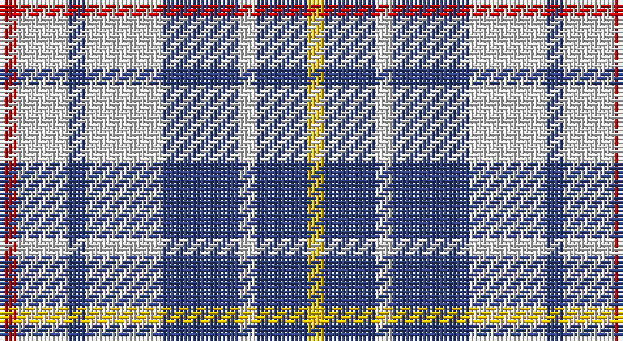

This page is one **sett** — a single exact thread-count. It belongs to the [tartan](/setts/r2w6db2w9db9w2db6ly2/)
(the same proportion at any scale), whose colour order is pattern [RWBWBWBY](/stripes/rwbwbwby/).

Sourced from weddslist.  It is a [8 stripe tartan](/stripes/stripes8/).

Original link http://www.weddslist.com/cgi-bin/tartans/pg.pl?source=sts

## Provenance

Earliest known date: 1985 Originally designed for the North Island Highlanders Pipe & Drum Band by Robert Fells of Port Hardy, B.C.

## Also known as

This cloth is also recorded under:

- North Vancouver, Island

2 attestations — the source records this cloth was collapsed from (oldest owns this page)

<ul>
<li>undated — North Vancouver, Island (weddslist, <a href="http://www.weddslist.com/cgi-bin/tartans/pg.pl?source=sts">record</a>)</li>
<li>undated — North Vancouver Island District Tartan (house-of-tartan, <a href="http://www.house-of-tartan.scotland.net/house/TartanViewjs.asp?colr=Def&tnam=1682">record</a>)</li>
</ul>

## Thread count
R/4 LN12 B4 LN18 B18 LN4 B12 Y/4

One full sett is **144 threads**.

## Palette

Palette: <strong>Tartan Dictionary</strong> <small style="color:#888">(1 of 4 colours)</small>
<table><thead><tr><th>Colour</th><th>Threads</th><th>Shade</th><th>Base</th><th>OKLCh</th></tr></thead><tbody><tr><td>R/</td><td style="text-align:right;font-variant-numeric:tabular-nums">4</td><td><code style="background-color:#C00000;">#C00000</code> <small style="color:#888">#C00000</small></td><td>R <code style="background-color:#CC0000;">#CC0000</code></td><td><small style="color:#888">oklch(50.7% 0.208 29.2)</small></td></tr><tr><td>LN</td><td style="text-align:right;font-variant-numeric:tabular-nums">12</td><td><code style="background-color:#E0E0E0;">#E0E0E0</code> <small style="color:#888">#E0E0E0</small></td><td>W <code style="background-color:#F7F7F7;">#F7F7F7</code></td><td><small style="color:#888">oklch(90.7% 0.000 89.9)</small></td></tr><tr><td>B</td><td style="text-align:right;font-variant-numeric:tabular-nums">4</td><td><code style="background-color:#304080;">#304080</code> <small style="color:#888">#304080</small></td><td>B <code style="background-color:#2A418A;">#2A418A</code></td><td><small style="color:#888">oklch(39.4% 0.109 270.2)</small></td></tr><tr><td>LN</td><td style="text-align:right;font-variant-numeric:tabular-nums">18</td><td><code style="background-color:#E0E0E0;">#E0E0E0</code> <small style="color:#888">#E0E0E0</small></td><td>W <code style="background-color:#F7F7F7;">#F7F7F7</code></td><td><small style="color:#888">oklch(90.7% 0.000 89.9)</small></td></tr><tr><td>B</td><td style="text-align:right;font-variant-numeric:tabular-nums">18</td><td><code style="background-color:#304080;">#304080</code> <small style="color:#888">#304080</small></td><td>B <code style="background-color:#2A418A;">#2A418A</code></td><td><small style="color:#888">oklch(39.4% 0.109 270.2)</small></td></tr><tr><td>LN</td><td style="text-align:right;font-variant-numeric:tabular-nums">4</td><td><code style="background-color:#E0E0E0;">#E0E0E0</code> <small style="color:#888">#E0E0E0</small></td><td>W <code style="background-color:#F7F7F7;">#F7F7F7</code></td><td><small style="color:#888">oklch(90.7% 0.000 89.9)</small></td></tr><tr><td>B</td><td style="text-align:right;font-variant-numeric:tabular-nums">12</td><td><code style="background-color:#304080;">#304080</code> <small style="color:#888">#304080</small></td><td>B <code style="background-color:#2A418A;">#2A418A</code></td><td><small style="color:#888">oklch(39.4% 0.109 270.2)</small></td></tr><tr><td>Y/</td><td style="text-align:right;font-variant-numeric:tabular-nums">4</td><td><code style="background-color:#F0C000;">#F0C000</code> <small style="color:#888">#F0C000</small></td><td>Y <code style="background-color:#F2BF00;">#F2BF00</code></td><td><small style="color:#888">oklch(82.7% 0.169 90.5)</small></td></tr></tbody></table>

# Sample pattern

## Nearest tartans

The nearest existing variants by ΔTartan distance, with this tartan at the top so the swatches line up against it.

ΔTartan

Tartan

Sett

—

<a href="/ttd/edit/#slug=r2w6db2w9db9w2db6ly2~x2">North Vancouver, Island</a> <a class="nn-out" href="/variants/s8/r2w6db2w9db9w2db6ly2~x2/" title="open its dictionary page">↗</a>

0.56

<a href="/ttd/edit/#slug=r2w6db2w9db9w2db6ly2~x4&amp;base=r2w6db2w9db9w2db6ly2~x2">North Vancouver Island</a> <a class="nn-out" href="/variants/s8/r2w6db2w9db9w2db6ly2~x4/" title="open its dictionary page">↗</a>

1.16

<a href="/ttd/edit/#slug=w1b3w3b1w5k1w2k3lo1~x4&amp;base=r2w6db2w9db9w2db6ly2~x2">Henderson Dress (Dance)</a> <a class="nn-out" href="/variants/s9/w1b3w3b1w5k1w2k3lo1~x4/" title="open its dictionary page">↗</a>

1.44

<a href="/ttd/edit/#slug=b8w13r3w2k5~x2&amp;base=r2w6db2w9db9w2db6ly2~x2">Boswell Dress (Personal)</a> <a class="nn-out" href="/variants/s5/b8w13r3w2k5~x2/" title="open its dictionary page">↗</a>

1.48

<a href="/ttd/edit/#slug=b4w1o1k2b4o2w1o1w1o1~x4&amp;base=r2w6db2w9db9w2db6ly2~x2">City of Pointe-Claire</a> <a class="nn-out" href="/variants/s10/b4w1o1k2b4o2w1o1w1o1~x4/" title="open its dictionary page">↗</a>

1.50

<a href="/ttd/edit/#slug=lb7k2w2k2w2k2lb7t4k10w2~x4&amp;base=r2w6db2w9db9w2db6ly2~x2">Investors Group</a> <a class="nn-out" href="/variants/s10/lb7k2w2k2w2k2lb7t4k10w2~x4/" title="open its dictionary page">↗</a>

1.52

<a href="/ttd/edit/#slug=w5r3w26db21w3db8ly3~x2&amp;base=r2w6db2w9db9w2db6ly2~x2">MacPherson, Blue &amp; White</a> <a class="nn-out" href="/variants/s7/w5r3w26db21w3db8ly3~x2/" title="open its dictionary page">↗</a>

1.52

<a href="/ttd/edit/#slug=k3db10ly5db16g3w16g5w3~x2&amp;base=r2w6db2w9db9w2db6ly2~x2">Ship Hector, The (Commemorative)</a> <a class="nn-out" href="/variants/s8/k3db10ly5db16g3w16g5w3~x2/" title="open its dictionary page">↗</a>

1.53

<a href="/ttd/edit/#slug=db12w4r12w5k4w12db20r4db5r4~x2&amp;base=r2w6db2w9db9w2db6ly2~x2">Commonwealth, Games 1986</a> <a class="nn-out" href="/variants/s10/db12w4r12w5k4w12db20r4db5r4~x2/" title="open its dictionary page">↗</a>

1.53

<a href="/ttd/edit/#slug=db6w2r6w3k2w6db10r2db3r2~x4&amp;base=r2w6db2w9db9w2db6ly2~x2">Commonwealth Games 1986</a> <a class="nn-out" href="/variants/s10/db6w2r6w3k2w6db10r2db3r2~x4/" title="open its dictionary page">↗</a>

1.57

<a href="/ttd/edit/#slug=r7w36db36ly7~x2&amp;base=r2w6db2w9db9w2db6ly2~x2">MacRae of Conchra #3</a> <a class="nn-out" href="/variants/s4/r7w36db36ly7~x2/" title="open its dictionary page">↗</a>

## Neighbour map

Every grey dot is one of 14360 variants placed by the first two principal components of the ΔTartan feature space (44% of its variance). Red is this tartan; blue dots are its nearest — click one to open its page.

<svg viewBox="0 0 640 380" role="img" style="max-width:100%;height:auto;border:1px solid #e0e0e0;border-radius:4px;display:block" xmlns="http://www.w3.org/2000/svg"><image href="/nn/cloud.v1.png" width="640" height="380"/><a href="/variants/s8/r2w6db2w9db9w2db6ly2~x4/"><circle cx="156.0" cy="214.8" r="4" fill="#3465a4"><title>North Vancouver Island</title></circle></a><a href="/variants/s9/w1b3w3b1w5k1w2k3lo1~x4/"><circle cx="173.3" cy="206.1" r="4" fill="#3465a4"><title>Henderson Dress (Dance)</title></circle></a><a href="/variants/s5/b8w13r3w2k5~x2/"><circle cx="164.3" cy="214.5" r="4" fill="#3465a4"><title>Boswell Dress (Personal)</title></circle></a><a href="/variants/s10/b4w1o1k2b4o2w1o1w1o1~x4/"><circle cx="130.4" cy="221.6" r="4" fill="#3465a4"><title>City of Pointe-Claire</title></circle></a><a href="/variants/s10/lb7k2w2k2w2k2lb7t4k10w2~x4/"><circle cx="118.9" cy="201.5" r="4" fill="#3465a4"><title>Investors Group</title></circle></a><a href="/variants/s7/w5r3w26db21w3db8ly3~x2/"><circle cx="240.9" cy="178.8" r="4" fill="#3465a4"><title>MacPherson, Blue &amp; White</title></circle></a><a href="/variants/s8/k3db10ly5db16g3w16g5w3~x2/"><circle cx="109.3" cy="190.4" r="4" fill="#3465a4"><title>Ship Hector, The (Commemorative)</title></circle></a><a href="/variants/s10/db12w4r12w5k4w12db20r4db5r4~x2/"><circle cx="152.6" cy="207.8" r="4" fill="#3465a4"><title>Commonwealth, Games 1986</title></circle></a><a href="/variants/s10/db6w2r6w3k2w6db10r2db3r2~x4/"><circle cx="142.5" cy="205.5" r="4" fill="#3465a4"><title>Commonwealth Games 1986</title></circle></a><a href="/variants/s4/r7w36db36ly7~x2/"><circle cx="160.8" cy="234.0" r="4" fill="#3465a4"><title>MacRae of Conchra #3</title></circle></a><circle cx="169.0" cy="222.5" r="5" fill="#c00000"/></svg>

ID: /variants/s8/r2w6db2w9db9w2db6ly2~x2/
