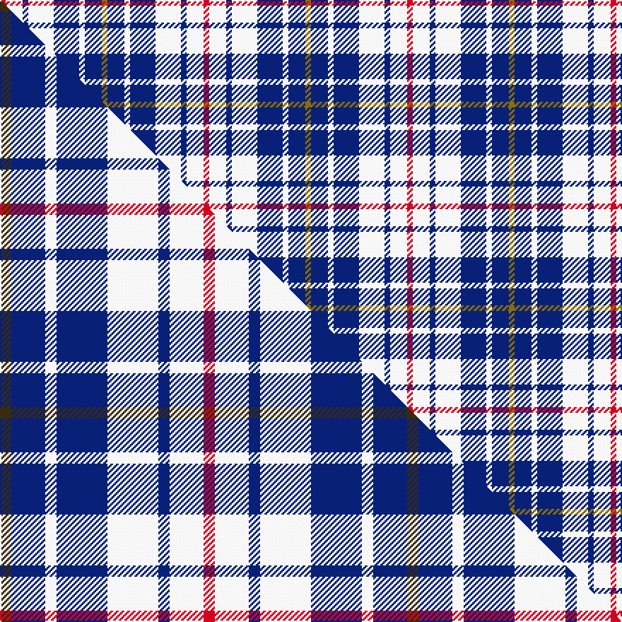

This page is one **sett** — a single exact thread-count. It belongs to the [tartan](/setts/r2w6db2w9db9w2db6y2/)
(the same proportion at any scale), whose colour order is pattern [GBWBWBWR](/stripes/gbwbwbwr/).

Part of the [North Vancouver Island](/tartans/north-vancouver-island/) tartan — the named design grouping this sett with its other cloths.

Sourced from weddslist.  It is a [8 stripe tartan](/stripes/stripes8/).

Original link http://www.weddslist.com/cgi-bin/tartans/pg.pl?source=sts

## Provenance

Earliest known date: 1985 Originally designed for the North Island Highlanders Pipe & Drum Band by Robert Fells of Port Hardy, B.C.

2 attestations — the source records this cloth was collapsed from (oldest owns this page)

<ul>
<li>undated — North Vancouver, Island (weddslist, <a href="http://www.weddslist.com/cgi-bin/tartans/pg.pl?source=sts">record</a>) </li>
<li>undated — North Vancouver Island District Tartan (house-of-tartan, <a href="http://www.house-of-tartan.scotland.net/house/TartanViewjs.asp?colr=Def&tnam=1682">record</a>) </li>
</ul>

Dataset <small>— provenance for this record, inherited from the source manifest</small>

<dl class="dataset-prov">
<dt>source</dt><dd><a href="/sources/weddslist/">Weddslist</a></dd>
<dt>data captured from</dt><dd><a href="https://github.com/thetartan/tartan-database/blob/master/data/weddslist/data.csv">https://github.com/thetartan/tartan-database/blob/master/data/weddslist/data.csv</a></dd>
<dt>data date</dt><dd>2016-11-17 <small>(dataset default)</small></dd>
<dt>licence</dt><dd><a href="https://creativecommons.org/licenses/by-nc-nd/4.0/">CC BY-NC-ND 4.0</a></dd>
</dl>

Capture chain <small>— the hands this data passed through, oldest first; each capture carries its own licence</small>

<ol class="capture-chain">
<li><a href="https://www.weddslist.com/tartans/">Weddslist</a> <small>the living privately compiled reference</small></li>
<li><a href="https://github.com/thetartan/tartan-database">thetartan/tartan-database</a> <small>2016-2017</small> · <a href="https://creativecommons.org/licenses/by-nc-nd/4.0/">CC BY-NC-ND 4.0</a> <small>Levko Kravets's frozen compilation — the capture we vendored, and where its CC licence text came from</small></li>
<li>this dictionary <small>captured 2026-06-10 · commit 5bf86c7566</small> <small>each re-capture is a git commit to data/sources</small></li>
</ol>

## Thread count
R/4 W12 DB4 W18 DB18 W4 DB12 Y/4

One full sett is **144 threads**.

## Palette
<table><thead><tr><th>Colour</th><th>Shade</th><th>OKLCh</th></tr></thead><tbody><tr><td>DB</td><td><code style="background-color:#082077;">#082077</code> <small style="color:#888">#082077</small></td><td><small style="color:#888">oklch(30.0% 0.149 265.1)</small></td></tr><tr><td>W</td><td><code style="background-color:#F7F7F7;">#F7F7F7</code> <small style="color:#888">#F7F7F7</small></td><td><small style="color:#888">oklch(97.6% 0.000 89.9)</small></td></tr><tr><td>R</td><td><code style="background-color:#D60020;">#D60020</code> <small style="color:#888">#D60020</small></td><td><small style="color:#888">oklch(55.2% 0.224 25.5)</small></td></tr><tr><td>Y</td><td><code style="background-color:#8B6E00;">#8B6E00</code> <small style="color:#888">#8B6E00</small></td><td><small style="color:#888">oklch(55.1% 0.113 90.4)</small></td></tr></tbody></table>

# Sample pattern

## Compared to the master

This cloth is one sett of its design; the master sett (the exemplar the design is anchored on) is below for comparison.

Its **ΔTartan distance** from the master is **0.03** — the same measure the nearest-tartans table ranks by (0 is identical; a re-scale of the same cloth is near 0, a recolour or a different proportion further).

<figure class="master-compare" style="margin:0">

this sett
master sett ★

<figcaption style="color:#888;font-size:smaller">One weave of this sett against the <a href="/setts/dy2db6w2db9w9db2w6r2/">master sett ★</a>, split on the diagonal: a shared proportion runs seamlessly across it with only the shades shifting; a different proportion breaks on it.</figcaption>
</figure>

## Nearest tartan variants

The nearest existing variants by ΔTartan distance, with this cloth at the top so the swatches line up against it.

ΔTartan

Threads

Variant

Sett

—

144

<a href="/variants/s8/r2w6db2w9db9w2db6y2~x2/">North Vancouver, Island</a>

<a href="/ttd/edit/#slug=dy2db6w2db9w9db2w6r2~x4&amp;base=r2w6db2w9db9w2db6y2~x2" title="compare in the TTD">0.03</a>

288

<a href="/variants/s8/dy2db6w2db9w9db2w6r2~x4/">North Vancouver Island</a>

<a href="/ttd/edit/#slug=w5r3w26db21w3db8y3~x2&amp;base=r2w6db2w9db9w2db6y2~x2" title="compare in the TTD">1.78</a>

260

<a href="/variants/s7/w5r3w26db21w3db8y3~x2/">MacPherson, Blue &amp; White</a>

<a href="/ttd/edit/#slug=r5k3lb22k17lb22k3y5~x2&amp;base=r2w6db2w9db9w2db6y2~x2" title="compare in the TTD">1.82</a>

288

<a href="/variants/s7/r5k3lb22k17lb22k3y5~x2/">MacCrimmon from Skye</a>

<a href="/ttd/edit/#slug=y8db4lb23w3db22w25db3w6~x2&amp;base=r2w6db2w9db9w2db6y2~x2" title="compare in the TTD">1.83</a>

348

<a href="/variants/s8/y8db4lb23w3db22w25db3w6~x2/">Culloden, Blue Dress (Dance)</a>

<a href="/ttd/edit/#slug=w5db16w5db16w33r3~x2&amp;base=r2w6db2w9db9w2db6y2~x2" title="compare in the TTD">1.99</a>

296

<a href="/variants/s6/w5db16w5db16w33r3~x2/">Buchanan Dress, Blue (Dance)</a>

<a href="/ttd/edit/#slug=db7w1r7db4r2db4w2~x2&amp;base=r2w6db2w9db9w2db6y2~x2" title="compare in the TTD">2.34</a>

90

<a href="/variants/s7/db7w1r7db4r2db4w2~x2/">Coronation</a>

<a href="/ttd/edit/#slug=b2w4k2w1b4k1b1g1~x4&amp;base=r2w6db2w9db9w2db6y2~x2" title="compare in the TTD">2.93</a>

116

<a href="/variants/s8/b2w4k2w1b4k1b1g1~x4/">Culloden - 1977 (Fashion)</a>

<a href="/ttd/edit/#slug=w1b3w3b1w5k1w2k3lo1~x4&amp;base=r2w6db2w9db9w2db6y2~x2" title="compare in the TTD">2.98</a>

152

<a href="/variants/s9/w1b3w3b1w5k1w2k3lo1~x4/">Henderson Dress (Dance)</a>

<a href="/ttd/edit/#slug=r7w36db36y7~x2&amp;base=r2w6db2w9db9w2db6y2~x2" title="compare in the TTD">3.27</a>

316

<a href="/variants/s4/r7w36db36y7~x2/">MacRae of Conchra #3</a>

<a href="/ttd/edit/#slug=db6w2r6w3k2w6db10r2db3r2~x4&amp;base=r2w6db2w9db9w2db6y2~x2" title="compare in the TTD">3.28</a>

304

<a href="/variants/s10/db6w2r6w3k2w6db10r2db3r2~x4/">Commonwealth Games 1986 (Corporate)</a>

## Neighbour map

Every grey dot is one of 13620 variants placed by the first two principal components of the ΔTartan feature space (42% of its variance). Red is this tartan; blue dots are its nearest — click one to open its page.

<svg viewBox="0 0 640 380" role="img" style="max-width:100%;height:auto;border:1px solid #e0e0e0;border-radius:4px;display:block" xmlns="http://www.w3.org/2000/svg"><image href="/nn/cloud.v1.png" width="640" height="380"/><a href="/variants/s8/dy2db6w2db9w9db2w6r2~x4/"><circle cx="177.9" cy="241.7" r="4" fill="#3465a4"><title>North Vancouver Island</title></circle></a><a href="/variants/s7/w5r3w26db21w3db8y3~x2/"><circle cx="251.3" cy="202.2" r="4" fill="#3465a4"><title>MacPherson, Blue &amp; White</title></circle></a><a href="/variants/s7/r5k3lb22k17lb22k3y5~x2/"><circle cx="223.2" cy="193.1" r="4" fill="#3465a4"><title>MacCrimmon from Skye</title></circle></a><a href="/variants/s8/y8db4lb23w3db22w25db3w6~x2/"><circle cx="180.0" cy="226.7" r="4" fill="#3465a4"><title>Culloden, Blue Dress (Dance)</title></circle></a><a href="/variants/s6/w5db16w5db16w33r3~x2/"><circle cx="306.6" cy="221.0" r="4" fill="#3465a4"><title>Buchanan Dress, Blue (Dance)</title></circle></a><a href="/variants/s7/db7w1r7db4r2db4w2~x2/"><circle cx="274.6" cy="246.8" r="4" fill="#3465a4"><title>Coronation</title></circle></a><a href="/variants/s8/b2w4k2w1b4k1b1g1~x4/"><circle cx="123.7" cy="236.5" r="4" fill="#3465a4"><title>Culloden - 1977 (Fashion)</title></circle></a><a href="/variants/s9/w1b3w3b1w5k1w2k3lo1~x4/"><circle cx="179.7" cy="224.6" r="4" fill="#3465a4"><title>Henderson Dress (Dance)</title></circle></a><a href="/variants/s4/r7w36db36y7~x2/"><circle cx="182.2" cy="258.4" r="4" fill="#3465a4"><title>MacRae of Conchra #3</title></circle></a><a href="/variants/s10/db6w2r6w3k2w6db10r2db3r2~x4/"><circle cx="145.4" cy="218.9" r="4" fill="#3465a4"><title>Commonwealth Games 1986 (Corporate)</title></circle></a><circle cx="178.7" cy="242.1" r="5" fill="#c00000"/><text x="320" y="376" text-anchor="middle" font-size="11" fill="#999">ground</text><text x="11" y="190" text-anchor="middle" font-size="11" fill="#999" transform="rotate(-90 11 190)">complexity</text></svg>

ID: /variants/s8/r2w6db2w9db9w2db6y2~x2/
