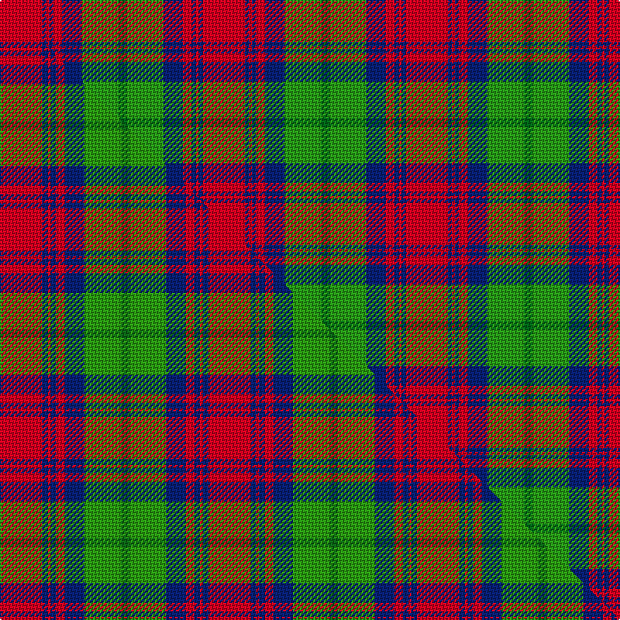

This is one **variant** — a specific cloth: this exact thread count and colourway, with its own
provenance below. It is one weaving of the [sett](/tartans/c/cr/cranston-dress/) (the scale-free proportion — the
same cloth at any scale or shade), whose colour order is pattern [GGBRBRBR](/stripes/ggbrbrbr/).

Part of the [Cranston Dress](/tartans/c/cr/cranston-dress/) tartan — the named design grouping this sett with its other cloths.

Sourced from house-of-tartan.  It is a [8 stripe tartan](/stripes/stripes8/).

Original link [http://www.house-of-tartan.scotland.net/house/TartanViewjs.asp?colr=Def&tnam=753](http://www.house-of-tartan.scotland.net/house/TartanViewjs.asp?colr=Def&tnam=753)

## Provenance

Earliest known date: pre 2003 Restricted

Dataset <small>— provenance for this record, inherited from the source manifest</small>

<dl class="dataset-prov">
<dt>source</dt><dd><a href="/sources/house-of-tartan/">House of Tartan</a></dd>
<dt>data captured from</dt><dd><a href="https://github.com/thetartan/tartan-database/blob/master/data/house-of-tartan/data.csv">https://github.com/thetartan/tartan-database/blob/master/data/house-of-tartan/data.csv</a></dd>
<dt>data date</dt><dd>pre 2003 <small>(this record)</small></dd>
<dt>licence</dt><dd><a href="https://creativecommons.org/licenses/by-nc-nd/4.0/">CC BY-NC-ND 4.0</a></dd>
</dl>

Capture chain <small>— the hands this data passed through, oldest first; each capture carries its own licence</small>

<ol class="capture-chain">
<li><a href="http://www.house-of-tartan.scotland.net/">House of Tartan</a> <small>the weaver/retailer's database — the site is now offline; the URL is kept as the ultimate source's identity</small></li>
<li><a href="https://github.com/thetartan/tartan-database">thetartan/tartan-database</a> <small>2016-2017</small> · <a href="https://creativecommons.org/licenses/by-nc-nd/4.0/">CC BY-NC-ND 4.0</a> <small>Levko Kravets's frozen compilation — the capture we vendored, and where its CC licence text came from</small></li>
<li>this dictionary <small>captured 2026-06-10 · commit 5bf86c7566</small> <small>each re-capture is a git commit to data/sources</small></li>
</ol>

## Thread count
R/30 DB3 R2 DB3 R6 DB14 G26 DG/6

One full sett is **144 threads**.

## Palette
<table><thead><tr><th>Colour</th><th>Shade</th><th>OKLCh</th></tr></thead><tbody><tr><td>DB</td><td><code style="background-color:#082077;">#082077</code> <small style="color:#888">#082077</small></td><td><small style="color:#888">oklch(30.0% 0.149 265.1)</small></td></tr><tr><td>DG</td><td><code style="background-color:#006818;">#006818</code> <small style="color:#888">#006818</small></td><td><small style="color:#888">oklch(45.0% 0.142 145.0)</small></td></tr><tr><td>G</td><td><code style="background-color:#289C18;">#289C18</code> <small style="color:#888">#289C18</small></td><td><small style="color:#888">oklch(60.6% 0.191 141.6)</small></td></tr><tr><td>R</td><td><code style="background-color:#D60020;">#D60020</code> <small style="color:#888">#D60020</small></td><td><small style="color:#888">oklch(55.2% 0.224 25.5)</small></td></tr></tbody></table>

# Sample pattern

## Compared to the master

This cloth is one sett of its design; the master sett (the exemplar the design is anchored on) is below for comparison.

Its **ΔTartan distance** from the master is **0.03** — the same measure the nearest-tartans table ranks by (0 is identical; a re-scale of the same cloth is near 0, a recolour or a different proportion further).

<figure class="master-compare" style="margin:0">

this sett
master sett ★

<figcaption style="color:#888;font-size:smaller">One weave of this sett against the <a href="/setts/r15db2r1db2r3db7g13dg3/">master sett ★</a>, split on the diagonal: a shared proportion runs seamlessly across it with only the shades shifting; a different proportion breaks on it.</figcaption>
</figure>

## Nearest tartan variants

The nearest existing variants by ΔTartan distance, with this cloth at the top so the swatches line up against it.

ΔTartan

Threads

Variant

Sett

—

144

<a href="/variants/s8/r30db3r2db3r6db14g26dg6~g6019141-dg4514144/">Cranston Dress Family Tartan</a>

<a href="/ttd/edit/#slug=r15db2r1db2r3db7g13dg3~x2~g6019141-dg4514144&amp;base=r30db3r2db3r6db14g26dg6~g6019141-dg4514144" title="compare in the TTD">0.03</a>

148

<a href="/variants/s8/r15db2r1db2r3db7g13dg3~x2~g6019141-dg4514144/">Cranston Dress</a>

<a href="/ttd/edit/#slug=dp9o4dp1o4g15r4dp1~x4~o6912030-r5221021&amp;base=r30db3r2db3r6db14g26dg6~g6019141-dg4514144" title="compare in the TTD">1.36</a>

264

<a href="/variants/s7/dp9lr4dp1lr4g15r4dp1~x4~lr6912030-r5221021/">Logan #3</a>

<a href="/ttd/edit/#slug=r3dr14g8r2g2w2g2r1~x2&amp;base=r30db3r2db3r6db14g26dg6~g6019141-dg4514144" title="compare in the TTD">1.40</a>

128

<a href="/variants/s8/r3dr14g8r2g2w2g2r1~x2/">Scott Hunting Clan Tartan</a>

<a href="/ttd/edit/#slug=dp8r3y1r3g14r3y1~x4&amp;base=r30db3r2db3r6db14g26dg6~g6019141-dg4514144" title="compare in the TTD">1.44</a>

228

<a href="/variants/s7/dp8r3y1r3g14r3y1~x4/">Logan with Yellow</a>

<a href="/ttd/edit/#slug=dp9r4dp1r4g15ri4dp1~x2~r5419027-ri5623030&amp;base=r30db3r2db3r6db14g26dg6~g6019141-dg4514144" title="compare in the TTD">1.56</a>

132

<a href="/variants/s7/dp9r4dp1r4g15ri4dp1~x2~r5419027-ri5623030/">Logan Light</a>

<a href="/ttd/edit/#slug=g5dr1r4db2r20g12db16r4dr1~x2&amp;base=r30db3r2db3r6db14g26dg6~g6019141-dg4514144" title="compare in the TTD">1.69</a>

248

<a href="/variants/s9/g5dr1r4db2r20g12db16r4dr1~x2/">Diana Princess of Wales</a>

<a href="/ttd/edit/#slug=dp1r5g15r3dp9r10w1~x4&amp;base=r30db3r2db3r6db14g26dg6~g6019141-dg4514144" title="compare in the TTD">1.80</a>

344

<a href="/variants/s7/dp1r5g15r3dp9r10w1~x4/">Geddes</a>

<a href="/ttd/edit/#slug=g28r4dp25w5r22g27r4dp2~x2&amp;base=r30db3r2db3r6db14g26dg6~g6019141-dg4514144" title="compare in the TTD">1.83</a>

408

<a href="/variants/s8/g28r4dp25w5r22g27r4dp2~x2/">New Glasgow (Canada)</a>

<a href="/ttd/edit/#slug=db1r5g18r4db9r10w1~x4&amp;base=r30db3r2db3r6db14g26dg6~g6019141-dg4514144" title="compare in the TTD">1.91</a>

376

<a href="/variants/s7/db1r5g18r4db9r10w1~x4/">MacKintosh Geddes</a>

<a href="/ttd/edit/#slug=do2b2do15b1w10o15b2o2~x2&amp;base=r30db3r2db3r6db14g26dg6~g6019141-dg4514144" title="compare in the TTD">1.93</a>

188

<a href="/variants/s8/do2b2do15b1w10o15b2o2~x2/">Bannockbane</a>

## Neighbour map

Every grey dot is one of 13662 variants placed by the first two principal components of the ΔTartan feature space (42% of its variance). Red is this tartan; blue dots are its nearest — click one to open its page. The map is a flat projection of a many-dimensional space — [how to read it](/posts/neighbourhood-maps/).

<svg viewBox="0 0 640 380" role="img" style="max-width:100%;height:auto;border:1px solid #e0e0e0;border-radius:4px;display:block" xmlns="http://www.w3.org/2000/svg"><image href="/nn/cloud.v1.png" width="640" height="380"/><a href="/variants/s8/r15db2r1db2r3db7g13dg3~x2~g6019141-dg4514144/"><circle cx="234.7" cy="181.8" r="4" fill="#3465a4"><title>Cranston Dress</title></circle></a><a href="/variants/s7/dp9lr4dp1lr4g15r4dp1~x4~lr6912030-r5221021/"><circle cx="234.9" cy="195.6" r="4" fill="#3465a4"><title>Logan #3</title></circle></a><a href="/variants/s8/r3dr14g8r2g2w2g2r1~x2/"><circle cx="242.1" cy="174.8" r="4" fill="#3465a4"><title>Scott Hunting Clan Tartan</title></circle></a><a href="/variants/s7/dp8r3y1r3g14r3y1~x4/"><circle cx="261.1" cy="192.5" r="4" fill="#3465a4"><title>Logan with Yellow</title></circle></a><a href="/variants/s7/dp9r4dp1r4g15ri4dp1~x2~r5419027-ri5623030/"><circle cx="243.4" cy="195.8" r="4" fill="#3465a4"><title>Logan Light</title></circle></a><a href="/variants/s9/g5dr1r4db2r20g12db16r4dr1~x2/"><circle cx="260.8" cy="163.1" r="4" fill="#3465a4"><title>Diana Princess of Wales</title></circle></a><a href="/variants/s7/dp1r5g15r3dp9r10w1~x4/"><circle cx="247.3" cy="196.1" r="4" fill="#3465a4"><title>Geddes</title></circle></a><a href="/variants/s8/g28r4dp25w5r22g27r4dp2~x2/"><circle cx="249.1" cy="196.0" r="4" fill="#3465a4"><title>New Glasgow (Canada)</title></circle></a><a href="/variants/s7/db1r5g18r4db9r10w1~x4/"><circle cx="243.5" cy="186.8" r="4" fill="#3465a4"><title>MacKintosh Geddes</title></circle></a><a href="/variants/s8/do2b2do15b1w10o15b2o2~x2/"><circle cx="199.7" cy="176.1" r="4" fill="#3465a4"><title>Bannockbane</title></circle></a><circle cx="242.1" cy="178.9" r="5" fill="#c00000"/><text x="320" y="376" text-anchor="middle" font-size="11" fill="#999">ground</text><text x="11" y="190" text-anchor="middle" font-size="11" fill="#999" transform="rotate(-90 11 190)">complexity</text></svg>

ID: /variants/s8/r30db3r2db3r6db14g26dg6~g6019141-dg4514144/
