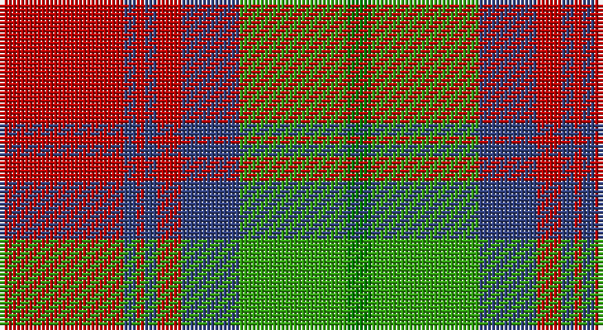

This page is one **sett** — a single exact thread-count. It belongs to the [tartan](/setts/r30db3r2db3r6db14gi26g6/)
(the same proportion at any scale), whose colour order is pattern [GGBRBRBR](/stripes/ggbrbrbr/).

Sourced from weddslist.  It is a [8 stripe tartan](/stripes/stripes8/).

Original link http://www.weddslist.com/cgi-bin/tartans/pg.pl?source=sts

## Thread count
R/30 B3 R2 B3 R6 B14 G26 Ga/6

One full sett is **144 threads**.

## Palette

Palette: <strong>custom</strong>
<table><thead><tr><th>Colour</th><th>Threads</th><th>Shade</th><th>Base</th><th>OKLCh</th></tr></thead><tbody><tr><td>R/</td><td style="text-align:right;font-variant-numeric:tabular-nums">30</td><td><code style="background-color:#C00000;">#C00000</code> <small style="color:#888">#C00000</small></td><td>R <code style="background-color:#CC0000;">#CC0000</code></td><td><small style="color:#888">oklch(50.7% 0.208 29.2)</small></td></tr><tr><td>B</td><td style="text-align:right;font-variant-numeric:tabular-nums">3</td><td><code style="background-color:#304080;">#304080</code> <small style="color:#888">#304080</small></td><td>B <code style="background-color:#2A418A;">#2A418A</code></td><td><small style="color:#888">oklch(39.4% 0.109 270.2)</small></td></tr><tr><td>R</td><td style="text-align:right;font-variant-numeric:tabular-nums">2</td><td><code style="background-color:#C00000;">#C00000</code> <small style="color:#888">#C00000</small></td><td>R <code style="background-color:#CC0000;">#CC0000</code></td><td><small style="color:#888">oklch(50.7% 0.208 29.2)</small></td></tr><tr><td>B</td><td style="text-align:right;font-variant-numeric:tabular-nums">3</td><td><code style="background-color:#304080;">#304080</code> <small style="color:#888">#304080</small></td><td>B <code style="background-color:#2A418A;">#2A418A</code></td><td><small style="color:#888">oklch(39.4% 0.109 270.2)</small></td></tr><tr><td>R</td><td style="text-align:right;font-variant-numeric:tabular-nums">6</td><td><code style="background-color:#C00000;">#C00000</code> <small style="color:#888">#C00000</small></td><td>R <code style="background-color:#CC0000;">#CC0000</code></td><td><small style="color:#888">oklch(50.7% 0.208 29.2)</small></td></tr><tr><td>B</td><td style="text-align:right;font-variant-numeric:tabular-nums">14</td><td><code style="background-color:#304080;">#304080</code> <small style="color:#888">#304080</small></td><td>B <code style="background-color:#2A418A;">#2A418A</code></td><td><small style="color:#888">oklch(39.4% 0.109 270.2)</small></td></tr><tr><td>G</td><td style="text-align:right;font-variant-numeric:tabular-nums">26</td><td><code style="background-color:#30A010;">#30A010</code> <small style="color:#888">#30A010</small></td><td>G <code style="background-color:#006100;">#006100</code></td><td><small style="color:#888">oklch(61.9% 0.195 140.5)</small></td></tr><tr><td>Ga/</td><td style="text-align:right;font-variant-numeric:tabular-nums">6</td><td><code style="background-color:#008000;">#008000</code> <small style="color:#888">#008000</small></td><td>G <code style="background-color:#006100;">#006100</code></td><td><small style="color:#888">oklch(52.0% 0.177 142.5)</small></td></tr></tbody></table>

# Sample pattern

## Nearest tartans

The nearest existing variants by ΔTartan distance, with this tartan at the top so the swatches line up against it.

ΔTartan

Tartan

Sett

—

<a href="/ttd/edit/#slug=r30db3r2db3r6db14gi26g6">Cranston, dress</a> <a class="nn-out" href="/variants/s8/r30db3r2db3r6db14gi26g6/" title="open its dictionary page">↗</a>

0.36

<a href="/ttd/edit/#slug=r30db3r2db3r6db14g26gi6&amp;base=r30db3r2db3r6db14gi26g6">Cranston Dress Family Tartan</a> <a class="nn-out" href="/variants/s8/r30db3r2db3r6db14g26gi6/" title="open its dictionary page">↗</a>

0.38

<a href="/ttd/edit/#slug=p8r3ly1r3g14r3ly1~x4&amp;base=r30db3r2db3r6db14gi26g6">Logan, with Yellow</a> <a class="nn-out" href="/variants/s7/p8r3ly1r3g14r3ly1~x4/" title="open its dictionary page">↗</a>

0.44

<a href="/ttd/edit/#slug=r15db2r1db2r3db7g13gi3~x2&amp;base=r30db3r2db3r6db14gi26g6">Cranston Dress</a> <a class="nn-out" href="/variants/s8/r15db2r1db2r3db7g13gi3~x2/" title="open its dictionary page">↗</a>

0.59

<a href="/ttd/edit/#slug=dp8r3ly1r3g14r3ly1~x4&amp;base=r30db3r2db3r6db14gi26g6">Logan with Yellow</a> <a class="nn-out" href="/variants/s7/dp8r3ly1r3g14r3ly1~x4/" title="open its dictionary page">↗</a>

0.61

<a href="/ttd/edit/#slug=g12t6g6r15k1r1k2~x4&amp;base=r30db3r2db3r6db14gi26g6">McCook/Cook (Name)</a> <a class="nn-out" href="/variants/s7/g12t6g6r15k1r1k2~x4/" title="open its dictionary page">↗</a>

0.65

<a href="/ttd/edit/#slug=db1r5g18r4db9r10w1~x4&amp;base=r30db3r2db3r6db14gi26g6">MacKintosh, Geddes</a> <a class="nn-out" href="/variants/s7/db1r5g18r4db9r10w1~x4/" title="open its dictionary page">↗</a>

0.75

<a href="/ttd/edit/#slug=p9r4p1r4g15ri4p1~x2&amp;base=r30db3r2db3r6db14gi26g6">Logan, Light</a> <a class="nn-out" href="/variants/s7/p9r4p1r4g15ri4p1~x2/" title="open its dictionary page">↗</a>

0.81

<a href="/ttd/edit/#slug=dp9lr4dp1lr4g15r4dp1~x4&amp;base=r30db3r2db3r6db14gi26g6">Logan #3</a> <a class="nn-out" href="/variants/s7/dp9lr4dp1lr4g15r4dp1~x4/" title="open its dictionary page">↗</a>

0.83

<a href="/ttd/edit/#slug=dp8r3ly1r3dg14r3ly1~x4&amp;base=r30db3r2db3r6db14gi26g6">Logan - 1819 (with yellow)</a> <a class="nn-out" href="/variants/s7/dp8r3ly1r3dg14r3ly1~x4/" title="open its dictionary page">↗</a>

0.85

<a href="/ttd/edit/#slug=lo15k1lo2k1lo2k10y14w2~x2&amp;base=r30db3r2db3r6db14gi26g6">Buccleuch (Fashion)</a> <a class="nn-out" href="/variants/s8/lo15k1lo2k1lo2k10y14w2~x2/" title="open its dictionary page">↗</a>

## Neighbour map

Every grey dot is one of 14360 variants placed by the first two principal components of the ΔTartan feature space (44% of its variance). Red is this tartan; blue dots are its nearest — click one to open its page.

<svg viewBox="0 0 640 380" role="img" style="max-width:100%;height:auto;border:1px solid #e0e0e0;border-radius:4px;display:block" xmlns="http://www.w3.org/2000/svg"><image href="/nn/cloud.v1.png" width="640" height="380"/><a href="/variants/s8/r30db3r2db3r6db14g26gi6/"><circle cx="236.2" cy="167.0" r="4" fill="#3465a4"><title>Cranston Dress Family Tartan</title></circle></a><a href="/variants/s7/p8r3ly1r3g14r3ly1~x4/"><circle cx="239.1" cy="174.8" r="4" fill="#3465a4"><title>Logan, with Yellow</title></circle></a><a href="/variants/s8/r15db2r1db2r3db7g13gi3~x2/"><circle cx="228.6" cy="170.0" r="4" fill="#3465a4"><title>Cranston Dress</title></circle></a><a href="/variants/s7/dp8r3ly1r3g14r3ly1~x4/"><circle cx="246.7" cy="178.7" r="4" fill="#3465a4"><title>Logan with Yellow</title></circle></a><a href="/variants/s7/g12t6g6r15k1r1k2~x4/"><circle cx="248.7" cy="189.5" r="4" fill="#3465a4"><title>McCook/Cook (Name)</title></circle></a><a href="/variants/s7/db1r5g18r4db9r10w1~x4/"><circle cx="248.6" cy="182.9" r="4" fill="#3465a4"><title>MacKintosh, Geddes</title></circle></a><a href="/variants/s7/p9r4p1r4g15ri4p1~x2/"><circle cx="218.0" cy="174.3" r="4" fill="#3465a4"><title>Logan, Light</title></circle></a><a href="/variants/s7/dp9lr4dp1lr4g15r4dp1~x4/"><circle cx="210.4" cy="177.3" r="4" fill="#3465a4"><title>Logan #3</title></circle></a><a href="/variants/s7/dp8r3ly1r3dg14r3ly1~x4/"><circle cx="248.0" cy="181.0" r="4" fill="#3465a4"><title>Logan - 1819 (with yellow)</title></circle></a><a href="/variants/s8/lo15k1lo2k1lo2k10y14w2~x2/"><circle cx="229.8" cy="169.6" r="4" fill="#3465a4"><title>Buccleuch (Fashion)</title></circle></a><circle cx="242.0" cy="170.6" r="5" fill="#c00000"/></svg>

ID: /variants/s8/r30db3r2db3r6db14gi26g6/
