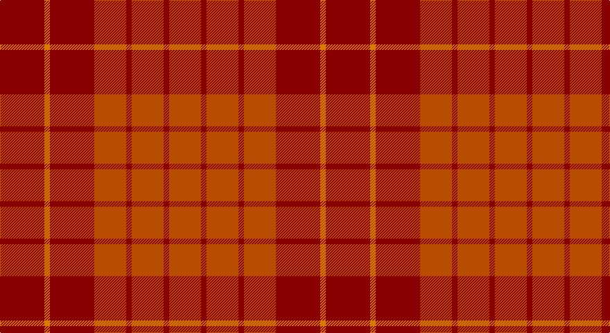

This page is one **sett** — a single exact thread-count. It belongs to the [tartan](/setts/r32lo4r32o23r4o23r4o23/)
(the same proportion at any scale), whose colour order is pattern [RRRRRRYR](/stripes/rrrrrryr/).

Part of the [Hamilton](/tartans/hamilton-2/) tartan — the named design grouping this sett with its other cloths.

Sourced from register-of-tartans.  It is a [8 stripe tartan](/stripes/stripes8/).

Original link https://www.tartanregister.gov.uk/tartanDetails.aspx?ref=1581

## Also known as

This cloth is also recorded under:

- Hamilton, Red

## Register references

External register numbers recorded for this tartan.

- Scottish Register of Tartans: [1581](https://www.tartanregister.gov.uk/tartanDetails.aspx?ref=1581)
- Scottish Tartans Authority (ITI): 4043

## Thread count
DR/64 O8 DR64 DO46 DR8 DO46 DR8 DO/46

One full sett is **470 threads**.

## Palette

Palette: <strong>Tartan Register</strong> <small style="color:#888">(4 of 5 colours)</small>
<table><thead><tr><th>Colour</th><th>Threads</th><th>Shade</th><th>Base</th><th>OKLCh</th></tr></thead><tbody><tr><td>DR/</td><td style="text-align:right;font-variant-numeric:tabular-nums">64</td><td><code style="background-color:#880000;">#880000</code> <small style="color:#888">#880000</small></td><td>R <code style="background-color:#CC0000;">#CC0000</code></td><td><small style="color:#888">oklch(39.4% 0.162 29.2)</small></td></tr><tr><td>O</td><td style="text-align:right;font-variant-numeric:tabular-nums">8</td><td><code style="background-color:#D87C00;">#D87C00</code> <small style="color:#888">#D87C00</small></td><td>Y <code style="background-color:#F2BF00;">#F2BF00</code></td><td><small style="color:#888">oklch(67.3% 0.155 61.8)</small></td></tr><tr><td>DR</td><td style="text-align:right;font-variant-numeric:tabular-nums">64</td><td><code style="background-color:#880000;">#880000</code> <small style="color:#888">#880000</small></td><td>R <code style="background-color:#CC0000;">#CC0000</code></td><td><small style="color:#888">oklch(39.4% 0.162 29.2)</small></td></tr><tr><td>DO</td><td style="text-align:right;font-variant-numeric:tabular-nums">46</td><td><code style="background-color:#B84C00;">#B84C00</code> <small style="color:#888">#B84C00</small></td><td>R <code style="background-color:#CC0000;">#CC0000</code></td><td><small style="color:#888">oklch(55.1% 0.156 45.5)</small></td></tr><tr><td>DR</td><td style="text-align:right;font-variant-numeric:tabular-nums">8</td><td><code style="background-color:#880000;">#880000</code> <small style="color:#888">#880000</small></td><td>R <code style="background-color:#CC0000;">#CC0000</code></td><td><small style="color:#888">oklch(39.4% 0.162 29.2)</small></td></tr><tr><td>DO</td><td style="text-align:right;font-variant-numeric:tabular-nums">46</td><td><code style="background-color:#B84C00;">#B84C00</code> <small style="color:#888">#B84C00</small></td><td>R <code style="background-color:#CC0000;">#CC0000</code></td><td><small style="color:#888">oklch(55.1% 0.156 45.5)</small></td></tr><tr><td>DR</td><td style="text-align:right;font-variant-numeric:tabular-nums">8</td><td><code style="background-color:#880000;">#880000</code> <small style="color:#888">#880000</small></td><td>R <code style="background-color:#CC0000;">#CC0000</code></td><td><small style="color:#888">oklch(39.4% 0.162 29.2)</small></td></tr><tr><td>DO/</td><td style="text-align:right;font-variant-numeric:tabular-nums">46</td><td><code style="background-color:#B84C00;">#B84C00</code> <small style="color:#888">#B84C00</small></td><td>R <code style="background-color:#CC0000;">#CC0000</code></td><td><small style="color:#888">oklch(55.1% 0.156 45.5)</small></td></tr></tbody></table>

# Sample pattern

## Compared to the master

This cloth is one sett of its design; the master sett (the exemplar the design is anchored on) is below for comparison.

<figure style="margin:0"><figcaption style="color:#888;font-size:smaller">this sett</figcaption></figure>
<figure style="margin:0"><figcaption style="color:#888;font-size:smaller"><a href="/setts/r15db8r2db8r2db8r15w2/">master sett →</a></figcaption></figure>

## Nearest tartans

The nearest existing variants by ΔTartan distance, with this tartan at the top so the swatches line up against it.

ΔTartan

Tartan

Sett

—

<a href="/ttd/edit/#slug=r32lo4r32o23r4o23r4o23~x2">Hamilton, Red</a> <a class="nn-out" href="/variants/s8/r32lo4r32o23r4o23r4o23~x2/" title="open its dictionary page">↗</a>

1.44

<a href="/ttd/edit/#slug=r23o4r23o32r4~x2&amp;base=r32lo4r32o23r4o23r4o23~x2">Hamilton, Red (Fashion?)</a> <a class="nn-out" href="/variants/s5/r23o4r23o32r4~x2/" title="open its dictionary page">↗</a>

2.00

<a href="/ttd/edit/#slug=ri3r18rii6ri15r4ri3r4ri7w2~x2&amp;base=r32lo4r32o23r4o23r4o23~x2">Tune Hotels (Corporate)</a> <a class="nn-out" href="/variants/s9/ri3r18rii6ri15r4ri3r4ri7w2~x2/" title="open its dictionary page">↗</a>

2.32

<a href="/ttd/edit/#slug=g1dr10r10g1~x6&amp;base=r32lo4r32o23r4o23r4o23~x2">Stirling of Keir (Clan)</a> <a class="nn-out" href="/variants/s4/g1dr10r10g1~x6/" title="open its dictionary page">↗</a>

2.38

<a href="/ttd/edit/#slug=riii2r2ri2r2rii6r1~x8&amp;base=r32lo4r32o23r4o23r4o23~x2">Youth on The Horizon (Fashion)</a> <a class="nn-out" href="/variants/s6/riii2r2ri2r2rii6r1~x8/" title="open its dictionary page">↗</a>

2.43

<a href="/ttd/edit/#slug=r3ri18rii6r15ri4r3ri4r7w2~x2&amp;base=r32lo4r32o23r4o23r4o23~x2">Tune Hotels</a> <a class="nn-out" href="/variants/s9/r3ri18rii6r15ri4r3ri4r7w2~x2/" title="open its dictionary page">↗</a>

2.55

<a href="/ttd/edit/#slug=do10y24r3y3r24dg3y6do6~x2&amp;base=r32lo4r32o23r4o23r4o23~x2">Earle's Flame (Fashion)</a> <a class="nn-out" href="/variants/s8/do10y24r3y3r24dg3y6do6~x2/" title="open its dictionary page">↗</a>

2.56

<a href="/variants/s10/r2k1r12ri12t1m2~x4/">Grelloch</a>

2.61

<a href="/ttd/edit/#slug=r3ri18rii6r15ri4r3ri4r7k2~x2&amp;base=r32lo4r32o23r4o23r4o23~x2">Tune Hotels Corporate Tartan</a> <a class="nn-out" href="/variants/s9/r3ri18rii6r15ri4r3ri4r7k2~x2/" title="open its dictionary page">↗</a>

2.65

<a href="/ttd/edit/#slug=r5n35r46o5~x2&amp;base=r32lo4r32o23r4o23r4o23~x2">Bryce</a> <a class="nn-out" href="/variants/s4/r5n35r46o5~x2/" title="open its dictionary page">↗</a>

2.71

<a href="/ttd/edit/#slug=ri32r3ri3r2ri3r23~x2&amp;base=r32lo4r32o23r4o23r4o23~x2">Samye Sangha #2</a> <a class="nn-out" href="/variants/s6/ri32r3ri3r2ri3r23~x2/" title="open its dictionary page">↗</a>

## Neighbour map

Every grey dot is one of 14360 variants placed by the first two principal components of the ΔTartan feature space (44% of its variance). Red is this tartan; blue dots are its nearest — click one to open its page.

<svg viewBox="0 0 640 380" role="img" style="max-width:100%;height:auto;border:1px solid #e0e0e0;border-radius:4px;display:block" xmlns="http://www.w3.org/2000/svg"><image href="/nn/cloud.v1.png" width="640" height="380"/><a href="/variants/s5/r23o4r23o32r4~x2/"><circle cx="482.9" cy="328.9" r="4" fill="#3465a4"><title>Hamilton, Red (Fashion?)</title></circle></a><a href="/variants/s9/ri3r18rii6ri15r4ri3r4ri7w2~x2/"><circle cx="389.8" cy="248.7" r="4" fill="#3465a4"><title>Tune Hotels (Corporate)</title></circle></a><a href="/variants/s4/g1dr10r10g1~x6/"><circle cx="453.0" cy="314.9" r="4" fill="#3465a4"><title>Stirling of Keir (Clan)</title></circle></a><a href="/variants/s6/riii2r2ri2r2rii6r1~x8/"><circle cx="302.4" cy="281.1" r="4" fill="#3465a4"><title>Youth on The Horizon (Fashion)</title></circle></a><a href="/variants/s9/r3ri18rii6r15ri4r3ri4r7w2~x2/"><circle cx="347.9" cy="222.7" r="4" fill="#3465a4"><title>Tune Hotels</title></circle></a><a href="/variants/s8/do10y24r3y3r24dg3y6do6~x2/"><circle cx="341.5" cy="261.9" r="4" fill="#3465a4"><title>Earle's Flame (Fashion)</title></circle></a><a href="/variants/s10/r2k1r12ri12t1m2~x4/"><circle cx="394.0" cy="206.6" r="4" fill="#3465a4"><title>Grelloch</title></circle></a><a href="/variants/s9/r3ri18rii6r15ri4r3ri4r7k2~x2/"><circle cx="339.9" cy="220.0" r="4" fill="#3465a4"><title>Tune Hotels Corporate Tartan</title></circle></a><a href="/variants/s4/r5n35r46o5~x2/"><circle cx="529.2" cy="338.0" r="4" fill="#3465a4"><title>Bryce</title></circle></a><a href="/variants/s6/ri32r3ri3r2ri3r23~x2/"><circle cx="600.6" cy="274.6" r="4" fill="#3465a4"><title>Samye Sangha #2</title></circle></a><circle cx="439.5" cy="297.6" r="5" fill="#c00000"/></svg>

ID: /variants/s8/r32lo4r32o23r4o23r4o23~x2/
