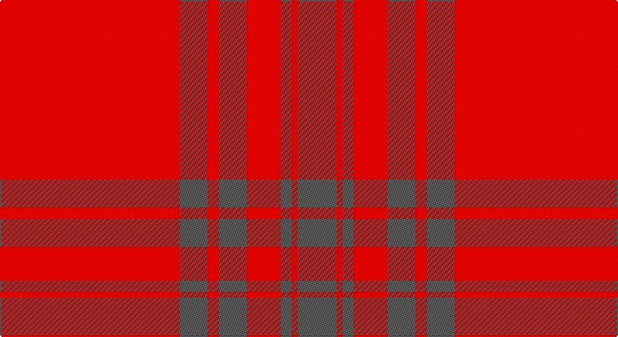

This page is one **sett** — a single exact thread-count. It belongs to the [tartan](/setts/r32n5r2n5r6n2r1n7/)
(the same proportion at any scale), whose colour order is pattern [BRBRBRBR](/stripes/brbrbrbr/).

Part of the [Lomond](/tartans/lomond/) tartan — the named design grouping this sett with its other cloths.

Sourced from register-of-tartans.  It is a [8 stripe tartan](/stripes/stripes8/).

Original link https://www.tartanregister.gov.uk/tartanDetails.aspx?ref=2191

## Register references

External register numbers recorded for this tartan.

- Scottish Register of Tartans: [2191](https://www.tartanregister.gov.uk/tartanDetails.aspx?ref=2191)
- Scottish Tartans Authority (ITI): 5478

## Thread count
R/128 N20 R8 N20 R24 N8 R4 N/28

One full sett is **324 threads**.

## Palette

Palette: <strong>Tartan Register</strong> <small style="color:#888">(1 of 2 colours)</small>
<table><thead><tr><th>Colour</th><th>Threads</th><th>Shade</th><th>Base</th><th>OKLCh</th></tr></thead><tbody><tr><td>R/</td><td style="text-align:right;font-variant-numeric:tabular-nums">128</td><td><code style="background-color:#C80000;">#C80000</code> <small style="color:#888">#C80000</small></td><td>R <code style="background-color:#CC0000;">#CC0000</code></td><td><small style="color:#888">oklch(52.3% 0.215 29.2)</small></td></tr><tr><td>N</td><td style="text-align:right;font-variant-numeric:tabular-nums">20</td><td><code style="background-color:#5C5C5C;">#5C5C5C</code> <small style="color:#888">#5C5C5C</small></td><td>B <code style="background-color:#2A418A;">#2A418A</code></td><td><small style="color:#888">oklch(47.5% 0.000 89.9)</small></td></tr><tr><td>R</td><td style="text-align:right;font-variant-numeric:tabular-nums">8</td><td><code style="background-color:#C80000;">#C80000</code> <small style="color:#888">#C80000</small></td><td>R <code style="background-color:#CC0000;">#CC0000</code></td><td><small style="color:#888">oklch(52.3% 0.215 29.2)</small></td></tr><tr><td>N</td><td style="text-align:right;font-variant-numeric:tabular-nums">20</td><td><code style="background-color:#5C5C5C;">#5C5C5C</code> <small style="color:#888">#5C5C5C</small></td><td>B <code style="background-color:#2A418A;">#2A418A</code></td><td><small style="color:#888">oklch(47.5% 0.000 89.9)</small></td></tr><tr><td>R</td><td style="text-align:right;font-variant-numeric:tabular-nums">24</td><td><code style="background-color:#C80000;">#C80000</code> <small style="color:#888">#C80000</small></td><td>R <code style="background-color:#CC0000;">#CC0000</code></td><td><small style="color:#888">oklch(52.3% 0.215 29.2)</small></td></tr><tr><td>N</td><td style="text-align:right;font-variant-numeric:tabular-nums">8</td><td><code style="background-color:#5C5C5C;">#5C5C5C</code> <small style="color:#888">#5C5C5C</small></td><td>B <code style="background-color:#2A418A;">#2A418A</code></td><td><small style="color:#888">oklch(47.5% 0.000 89.9)</small></td></tr><tr><td>R</td><td style="text-align:right;font-variant-numeric:tabular-nums">4</td><td><code style="background-color:#C80000;">#C80000</code> <small style="color:#888">#C80000</small></td><td>R <code style="background-color:#CC0000;">#CC0000</code></td><td><small style="color:#888">oklch(52.3% 0.215 29.2)</small></td></tr><tr><td>N/</td><td style="text-align:right;font-variant-numeric:tabular-nums">28</td><td><code style="background-color:#5C5C5C;">#5C5C5C</code> <small style="color:#888">#5C5C5C</small></td><td>B <code style="background-color:#2A418A;">#2A418A</code></td><td><small style="color:#888">oklch(47.5% 0.000 89.9)</small></td></tr></tbody></table>

# Sample pattern

## Nearest tartans

The nearest existing variants by ΔTartan distance, with this tartan at the top so the swatches line up against it.

ΔTartan

Tartan

Sett

—

<a href="/ttd/edit/#slug=r32n5r2n5r6n2r1n7~x4">Lomond</a> <a class="nn-out" href="/variants/s8/r32n5r2n5r6n2r1n7~x4/" title="open its dictionary page">↗</a>

1.63

<a href="/ttd/edit/#slug=r50dp1r4dp3r8dp15r2dp2r3dp4~x2&amp;base=r32n5r2n5r6n2r1n7~x4">Masai Shuka 06 (Artefact)</a> <a class="nn-out" href="/variants/s10/r50dp1r4dp3r8dp15r2dp2r3dp4~x2/" title="open its dictionary page">↗</a>

1.69

<a href="/variants/s8/r100dg4r8dg18r3~x2/">KaDeWe</a>

1.88

<a href="/ttd/edit/#slug=r54dp6r5dp6r10dp3r2dp18~x2&amp;base=r32n5r2n5r6n2r1n7~x4">Kyle Blue (Clan)</a> <a class="nn-out" href="/variants/s8/r54dp6r5dp6r10dp3r2dp18~x2/" title="open its dictionary page">↗</a>

2.05

<a href="/ttd/edit/#slug=r2dt1ri6r1ri2dg2ri24dt6ri2~x2&amp;base=r32n5r2n5r6n2r1n7~x4">Fitzgibbon Red</a> <a class="nn-out" href="/variants/s9/r2dt1ri6r1ri2dg2ri24dt6ri2~x2/" title="open its dictionary page">↗</a>

2.31

<a href="/ttd/edit/#slug=r78lo10lo1g2lo6r2lo3r2lo43~x2&amp;base=r32n5r2n5r6n2r1n7~x4">Montreal Granate (Fashion)</a> <a class="nn-out" href="/variants/s9/r78lo10lo1g2lo6r2lo3r2lo43~x2/" title="open its dictionary page">↗</a>

2.36

<a href="/variants/s8/r9y2r45y20lo3~x2/">Hunt (Personal)</a>

2.38

<a href="/ttd/edit/#slug=r2k1ri6r1ri2g2ri24k6ri2~x2&amp;base=r32n5r2n5r6n2r1n7~x4">Fitzgibbon Red (Name)</a> <a class="nn-out" href="/variants/s9/r2k1ri6r1ri2g2ri24k6ri2~x2/" title="open its dictionary page">↗</a>

2.38

<a href="/ttd/edit/#slug=r54g6r5g6r10g3r2g18~x2&amp;base=r32n5r2n5r6n2r1n7~x4">Kyle Green (Name)</a> <a class="nn-out" href="/variants/s8/r54g6r5g6r10g3r2g18~x2/" title="open its dictionary page">↗</a>

2.43

<a href="/ttd/edit/#slug=r9y2r45y20lo3~x2&amp;base=r32n5r2n5r6n2r1n7~x4">Hunt (Personal)</a> <a class="nn-out" href="/variants/s5/r9y2r45y20lo3~x2/" title="open its dictionary page">↗</a>

2.44

<a href="/ttd/edit/#slug=m37dy9m3g9dy3~x2&amp;base=r32n5r2n5r6n2r1n7~x4">Glen Shee Trade Tartan</a> <a class="nn-out" href="/variants/s5/m37dy9m3g9dy3~x2/" title="open its dictionary page">↗</a>

## Neighbour map

Every grey dot is one of 14360 variants placed by the first two principal components of the ΔTartan feature space (44% of its variance). Red is this tartan; blue dots are its nearest — click one to open its page.

<svg viewBox="0 0 640 380" role="img" style="max-width:100%;height:auto;border:1px solid #e0e0e0;border-radius:4px;display:block" xmlns="http://www.w3.org/2000/svg"><image href="/nn/cloud.v1.png" width="640" height="380"/><a href="/variants/s10/r50dp1r4dp3r8dp15r2dp2r3dp4~x2/"><circle cx="626.0" cy="149.5" r="4" fill="#3465a4"><title>Masai Shuka 06 (Artefact)</title></circle></a><a href="/variants/s8/r100dg4r8dg18r3~x2/"><circle cx="626.0" cy="192.7" r="4" fill="#3465a4"><title>KaDeWe</title></circle></a><a href="/variants/s8/r54dp6r5dp6r10dp3r2dp18~x2/"><circle cx="564.4" cy="176.9" r="4" fill="#3465a4"><title>Kyle Blue (Clan)</title></circle></a><a href="/variants/s9/r2dt1ri6r1ri2dg2ri24dt6ri2~x2/"><circle cx="600.7" cy="178.4" r="4" fill="#3465a4"><title>Fitzgibbon Red</title></circle></a><a href="/variants/s9/r78lo10lo1g2lo6r2lo3r2lo43~x2/"><circle cx="510.1" cy="129.8" r="4" fill="#3465a4"><title>Montreal Granate (Fashion)</title></circle></a><a href="/variants/s8/r9y2r45y20lo3~x2/"><circle cx="499.3" cy="196.0" r="4" fill="#3465a4"><title>Hunt (Personal)</title></circle></a><a href="/variants/s9/r2k1ri6r1ri2g2ri24k6ri2~x2/"><circle cx="563.3" cy="160.6" r="4" fill="#3465a4"><title>Fitzgibbon Red (Name)</title></circle></a><a href="/variants/s8/r54g6r5g6r10g3r2g18~x2/"><circle cx="534.8" cy="172.0" r="4" fill="#3465a4"><title>Kyle Green (Name)</title></circle></a><a href="/variants/s5/r9y2r45y20lo3~x2/"><circle cx="515.3" cy="209.3" r="4" fill="#3465a4"><title>Hunt (Personal)</title></circle></a><a href="/variants/s5/m37dy9m3g9dy3~x2/"><circle cx="494.1" cy="241.8" r="4" fill="#3465a4"><title>Glen Shee Trade Tartan</title></circle></a><circle cx="607.0" cy="193.3" r="5" fill="#c00000"/></svg>

ID: /variants/s8/r32n5r2n5r6n2r1n7~x4/
