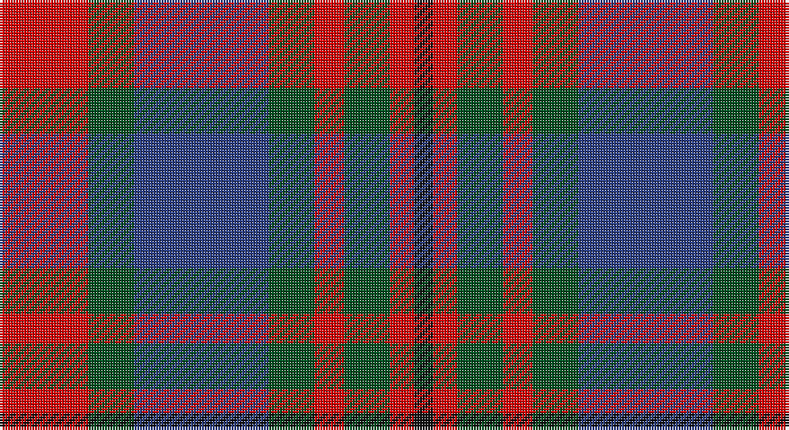

This page is one **sett** — a single exact thread-count. It belongs to the [tartan](/setts/r33dg17db50dg17r11dg17r9k7/)
(the same proportion at any scale), whose colour order is pattern [KRGRGBGR](/stripes/krgrgbgr/).

Sourced from register-of-tartans.  It is a [8 stripe tartan](/stripes/stripes8/).

Original link https://www.tartanregister.gov.uk/tartanDetails.aspx?ref=568

## Also known as

This cloth is also recorded under:

- Carnegie #3

## Register references

External register numbers recorded for this tartan.

- Scottish Register of Tartans: [568](https://www.tartanregister.gov.uk/tartanDetails.aspx?ref=568)
- Scottish Tartans World Register: 1153

## Thread count
R/33 G17 B50 G17 R11 G17 R9 K/7

One full sett is **282 threads**.

## Palette

Palette: <strong>Tartan Register</strong>
<table><thead><tr><th>Colour</th><th>Threads</th><th>Shade</th><th>Base</th><th>OKLCh</th></tr></thead><tbody><tr><td>R/</td><td style="text-align:right;font-variant-numeric:tabular-nums">33</td><td><code style="background-color:#DC0000;">#DC0000</code> <small style="color:#888">#DC0000</small></td><td>R <code style="background-color:#CC0000;">#CC0000</code></td><td><small style="color:#888">oklch(56.2% 0.230 29.2)</small></td></tr><tr><td>G</td><td style="text-align:right;font-variant-numeric:tabular-nums">17</td><td><code style="background-color:#005020;">#005020</code> <small style="color:#888">#005020</small></td><td>G <code style="background-color:#006100;">#006100</code></td><td><small style="color:#888">oklch(37.7% 0.105 149.6)</small></td></tr><tr><td>B</td><td style="text-align:right;font-variant-numeric:tabular-nums">50</td><td><code style="background-color:#2C4084;">#2C4084</code> <small style="color:#888">#2C4084</small></td><td>B <code style="background-color:#2A418A;">#2A418A</code></td><td><small style="color:#888">oklch(39.4% 0.117 268.3)</small></td></tr><tr><td>G</td><td style="text-align:right;font-variant-numeric:tabular-nums">17</td><td><code style="background-color:#005020;">#005020</code> <small style="color:#888">#005020</small></td><td>G <code style="background-color:#006100;">#006100</code></td><td><small style="color:#888">oklch(37.7% 0.105 149.6)</small></td></tr><tr><td>R</td><td style="text-align:right;font-variant-numeric:tabular-nums">11</td><td><code style="background-color:#DC0000;">#DC0000</code> <small style="color:#888">#DC0000</small></td><td>R <code style="background-color:#CC0000;">#CC0000</code></td><td><small style="color:#888">oklch(56.2% 0.230 29.2)</small></td></tr><tr><td>G</td><td style="text-align:right;font-variant-numeric:tabular-nums">17</td><td><code style="background-color:#005020;">#005020</code> <small style="color:#888">#005020</small></td><td>G <code style="background-color:#006100;">#006100</code></td><td><small style="color:#888">oklch(37.7% 0.105 149.6)</small></td></tr><tr><td>R</td><td style="text-align:right;font-variant-numeric:tabular-nums">9</td><td><code style="background-color:#DC0000;">#DC0000</code> <small style="color:#888">#DC0000</small></td><td>R <code style="background-color:#CC0000;">#CC0000</code></td><td><small style="color:#888">oklch(56.2% 0.230 29.2)</small></td></tr><tr><td>K/</td><td style="text-align:right;font-variant-numeric:tabular-nums">7</td><td><code style="background-color:#101010;">#101010</code> <small style="color:#888">#101010</small></td><td>K <code style="background-color:#000000;">#000000</code></td><td><small style="color:#888">oklch(17.3% 0.000 89.9)</small></td></tr></tbody></table>

# Sample pattern

## Nearest tartans

The nearest existing variants by ΔTartan distance, with this tartan at the top so the swatches line up against it.

ΔTartan

Tartan

Sett

—

<a href="/ttd/edit/#slug=r33dg17db50dg17r11dg17r9k7">Carnegie #3</a> <a class="nn-out" href="/variants/s8/r33dg17db50dg17r11dg17r9k7/" title="open its dictionary page">↗</a>

0.70

<a href="/ttd/edit/#slug=r33g17db50g17r11g17r9k7&amp;base=r33dg17db50dg17r11dg17r9k7">Carnegie</a> <a class="nn-out" href="/variants/s8/r33g17db50g17r11g17r9k7/" title="open its dictionary page">↗</a>

0.80

<a href="/ttd/edit/#slug=db9r3ly1r3dg9r3ly1~x2&amp;base=r33dg17db50dg17r11dg17r9k7">Logan #2</a> <a class="nn-out" href="/variants/s7/db9r3ly1r3dg9r3ly1~x2/" title="open its dictionary page">↗</a>

0.88

<a href="/ttd/edit/#slug=dg12k2r12k3o12k16o12k3r6~x2&amp;base=r33dg17db50dg17r11dg17r9k7">Borthwick</a> <a class="nn-out" href="/variants/s9/dg12k2r12k3o12k16o12k3r6~x2/" title="open its dictionary page">↗</a>

0.91

<a href="/ttd/edit/#slug=g12k2m12k3o12k16o12k3m6~x2&amp;base=r33dg17db50dg17r11dg17r9k7">Borthwick Family Tartan</a> <a class="nn-out" href="/variants/s9/g12k2m12k3o12k16o12k3m6~x2/" title="open its dictionary page">↗</a>

0.94

<a href="/ttd/edit/#slug=r2g4db8r9g9k2r2~x4&amp;base=r33dg17db50dg17r11dg17r9k7">Stewart (Artefact)</a> <a class="nn-out" href="/variants/s7/r2g4db8r9g9k2r2~x4/" title="open its dictionary page">↗</a>

0.99

<a href="/ttd/edit/#slug=r18db12w2db12dg8r3dg10~x2&amp;base=r33dg17db50dg17r11dg17r9k7">Brough (Name)</a> <a class="nn-out" href="/variants/s7/r18db12w2db12dg8r3dg10~x2/" title="open its dictionary page">↗</a>

0.99

<a href="/ttd/edit/#slug=p11o2p2o2p2o11g14w2~x2&amp;base=r33dg17db50dg17r11dg17r9k7">Lamont</a> <a class="nn-out" href="/variants/s8/p11o2p2o2p2o11g14w2~x2/" title="open its dictionary page">↗</a>

1.01

<a href="/ttd/edit/#slug=w2r3dg9r3db2r3db3w1~x6&amp;base=r33dg17db50dg17r11dg17r9k7">Utah (US State)</a> <a class="nn-out" href="/variants/s8/w2r3dg9r3db2r3db3w1~x6/" title="open its dictionary page">↗</a>

1.02

<a href="/ttd/edit/#slug=db16r2db2r2g14r13w2r13g14db14r2db2~x2&amp;base=r33dg17db50dg17r11dg17r9k7">Fraser of Lovat</a> <a class="nn-out" href="/variants/s12/db16r2db2r2g14r13w2r13g14db14r2db2~x2/" title="open its dictionary page">↗</a>

1.03

<a href="/ttd/edit/#slug=t1r6db1t3k3t1~x8&amp;base=r33dg17db50dg17r11dg17r9k7">MacTavish #2</a> <a class="nn-out" href="/variants/s6/t1r6db1t3k3t1~x8/" title="open its dictionary page">↗</a>

## Neighbour map

Every grey dot is one of 14360 variants placed by the first two principal components of the ΔTartan feature space (44% of its variance). Red is this tartan; blue dots are its nearest — click one to open its page.

<svg viewBox="0 0 640 380" role="img" style="max-width:100%;height:auto;border:1px solid #e0e0e0;border-radius:4px;display:block" xmlns="http://www.w3.org/2000/svg"><image href="/nn/cloud.v1.png" width="640" height="380"/><a href="/variants/s8/r33g17db50g17r11g17r9k7/"><circle cx="157.8" cy="222.2" r="4" fill="#3465a4"><title>Carnegie</title></circle></a><a href="/variants/s7/db9r3ly1r3dg9r3ly1~x2/"><circle cx="167.8" cy="207.2" r="4" fill="#3465a4"><title>Logan #2</title></circle></a><a href="/variants/s9/dg12k2r12k3o12k16o12k3r6~x2/"><circle cx="127.8" cy="226.4" r="4" fill="#3465a4"><title>Borthwick</title></circle></a><a href="/variants/s9/g12k2m12k3o12k16o12k3m6~x2/"><circle cx="124.0" cy="223.8" r="4" fill="#3465a4"><title>Borthwick Family Tartan</title></circle></a><a href="/variants/s7/r2g4db8r9g9k2r2~x4/"><circle cx="159.8" cy="253.8" r="4" fill="#3465a4"><title>Stewart (Artefact)</title></circle></a><a href="/variants/s7/r18db12w2db12dg8r3dg10~x2/"><circle cx="194.9" cy="247.2" r="4" fill="#3465a4"><title>Brough (Name)</title></circle></a><a href="/variants/s8/p11o2p2o2p2o11g14w2~x2/"><circle cx="186.8" cy="212.2" r="4" fill="#3465a4"><title>Lamont</title></circle></a><a href="/variants/s8/w2r3dg9r3db2r3db3w1~x6/"><circle cx="158.4" cy="207.5" r="4" fill="#3465a4"><title>Utah (US State)</title></circle></a><a href="/variants/s12/db16r2db2r2g14r13w2r13g14db14r2db2~x2/"><circle cx="178.2" cy="193.2" r="4" fill="#3465a4"><title>Fraser of Lovat</title></circle></a><a href="/variants/s6/t1r6db1t3k3t1~x8/"><circle cx="192.3" cy="235.8" r="4" fill="#3465a4"><title>MacTavish #2</title></circle></a><circle cx="171.6" cy="227.1" r="5" fill="#c00000"/></svg>

ID: /variants/s8/r33dg17db50dg17r11dg17r9k7/
