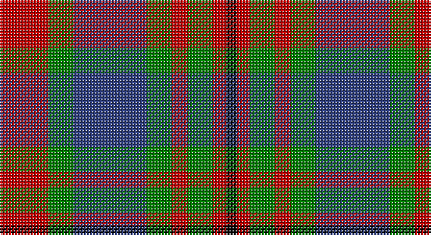

This page is one **sett** — a single exact thread-count. It belongs to the [tartan](/setts/r33g17db50g17r11g17r9k7/)
(the same proportion at any scale), whose colour order is pattern [KRGRGBGR](/stripes/krgrgbgr/).

Part of the [Carnegie](/tartans/carnegie/) tartan — the named design grouping this sett with its other cloths.

Sourced from weddslist.  It is a [8 stripe tartan](/stripes/stripes8/).

Original link http://www.weddslist.com/cgi-bin/tartans/pg.pl?source=sts

## Also known as

This cloth is also recorded under:

- Carnegie #2
- Carnegie Check

## Thread count
R/33 G17 B50 G17 R11 G17 R9 K/7

One full sett is **282 threads**.

## Palette

Palette: <strong>Ingles Buchan</strong> <small style="color:#888">(1 of 4 colours)</small>
<table><thead><tr><th>Colour</th><th>Threads</th><th>Shade</th><th>Base</th><th>OKLCh</th></tr></thead><tbody><tr><td>R/</td><td style="text-align:right;font-variant-numeric:tabular-nums">33</td><td><code style="background-color:#C00000;">#C00000</code> <small style="color:#888">#C00000</small></td><td>R <code style="background-color:#CC0000;">#CC0000</code></td><td><small style="color:#888">oklch(50.7% 0.208 29.2)</small></td></tr><tr><td>G</td><td style="text-align:right;font-variant-numeric:tabular-nums">17</td><td><code style="background-color:#008000;">#008000</code> <small style="color:#888">#008000</small></td><td>G <code style="background-color:#006100;">#006100</code></td><td><small style="color:#888">oklch(52.0% 0.177 142.5)</small></td></tr><tr><td>B</td><td style="text-align:right;font-variant-numeric:tabular-nums">50</td><td><code style="background-color:#304080;">#304080</code> <small style="color:#888">#304080</small></td><td>B <code style="background-color:#2A418A;">#2A418A</code></td><td><small style="color:#888">oklch(39.4% 0.109 270.2)</small></td></tr><tr><td>G</td><td style="text-align:right;font-variant-numeric:tabular-nums">17</td><td><code style="background-color:#008000;">#008000</code> <small style="color:#888">#008000</small></td><td>G <code style="background-color:#006100;">#006100</code></td><td><small style="color:#888">oklch(52.0% 0.177 142.5)</small></td></tr><tr><td>R</td><td style="text-align:right;font-variant-numeric:tabular-nums">11</td><td><code style="background-color:#C00000;">#C00000</code> <small style="color:#888">#C00000</small></td><td>R <code style="background-color:#CC0000;">#CC0000</code></td><td><small style="color:#888">oklch(50.7% 0.208 29.2)</small></td></tr><tr><td>G</td><td style="text-align:right;font-variant-numeric:tabular-nums">17</td><td><code style="background-color:#008000;">#008000</code> <small style="color:#888">#008000</small></td><td>G <code style="background-color:#006100;">#006100</code></td><td><small style="color:#888">oklch(52.0% 0.177 142.5)</small></td></tr><tr><td>R</td><td style="text-align:right;font-variant-numeric:tabular-nums">9</td><td><code style="background-color:#C00000;">#C00000</code> <small style="color:#888">#C00000</small></td><td>R <code style="background-color:#CC0000;">#CC0000</code></td><td><small style="color:#888">oklch(50.7% 0.208 29.2)</small></td></tr><tr><td>K/</td><td style="text-align:right;font-variant-numeric:tabular-nums">7</td><td><code style="background-color:#000000;">#000000</code> <small style="color:#888">#000000</small></td><td>K <code style="background-color:#000000;">#000000</code></td><td><small style="color:#888">oklch(0.0% 0.000 0.0)</small></td></tr></tbody></table>

# Sample pattern

## Compared to the master

This cloth is one sett of its design; the master sett (the exemplar the design is anchored on) is below for comparison.

<figure style="margin:0"><figcaption style="color:#888;font-size:smaller">this sett</figcaption></figure>
<figure style="margin:0"><figcaption style="color:#888;font-size:smaller"><a href="/setts/db3r1db1r2db6r1k6g6r2g1r1g2ly1/">master sett →</a></figcaption></figure>

## Nearest tartans

The nearest existing variants by ΔTartan distance, with this tartan at the top so the swatches line up against it.

ΔTartan

Tartan

Sett

—

<a href="/ttd/edit/#slug=r33g17db50g17r11g17r9k7">Carnegie</a> <a class="nn-out" href="/variants/s8/r33g17db50g17r11g17r9k7/" title="open its dictionary page">↗</a>

0.70

<a href="/ttd/edit/#slug=r33dg17db50dg17r11dg17r9k7&amp;base=r33g17db50g17r11g17r9k7">Carnegie #3</a> <a class="nn-out" href="/variants/s8/r33dg17db50dg17r11dg17r9k7/" title="open its dictionary page">↗</a>

0.74

<a href="/ttd/edit/#slug=db9r3ly1r3dg9r3ly1~x2&amp;base=r33g17db50g17r11g17r9k7">Logan #2</a> <a class="nn-out" href="/variants/s7/db9r3ly1r3dg9r3ly1~x2/" title="open its dictionary page">↗</a>

0.74

<a href="/ttd/edit/#slug=db9r3ly1r3g9r3ly1~x2&amp;base=r33g17db50g17r11g17r9k7">Logan</a> <a class="nn-out" href="/variants/s7/db9r3ly1r3g9r3ly1~x2/" title="open its dictionary page">↗</a>

0.87

<a href="/ttd/edit/#slug=g12k2m12k3o12k16o12k3m6~x2&amp;base=r33g17db50g17r11g17r9k7">Borthwick Family Tartan</a> <a class="nn-out" href="/variants/s9/g12k2m12k3o12k16o12k3m6~x2/" title="open its dictionary page">↗</a>

0.88

<a href="/ttd/edit/#slug=dg12k2r12k3o12k16o12k3r6~x2&amp;base=r33g17db50g17r11g17r9k7">Borthwick</a> <a class="nn-out" href="/variants/s9/dg12k2r12k3o12k16o12k3r6~x2/" title="open its dictionary page">↗</a>

0.91

<a href="/variants/s8/g6k1r1t2r2~x4/">Wilson's No.193</a>

0.92

<a href="/ttd/edit/#slug=r2g4db8r9g9k2r2~x2&amp;base=r33g17db50g17r11g17r9k7">Stewart, Plaid</a> <a class="nn-out" href="/variants/s7/r2g4db8r9g9k2r2~x2/" title="open its dictionary page">↗</a>

0.93

<a href="/ttd/edit/#slug=r2g4db8r9g9k2r2~x4&amp;base=r33g17db50g17r11g17r9k7">Stewart (Artefact)</a> <a class="nn-out" href="/variants/s7/r2g4db8r9g9k2r2~x4/" title="open its dictionary page">↗</a>

1.04

<a href="/ttd/edit/#slug=r10k10r4g2r2k2r4g12dt12g3dt4~x2&amp;base=r33g17db50g17r11g17r9k7">Hueg (Personal)</a> <a class="nn-out" href="/variants/s11/r10k10r4g2r2k2r4g12dt12g3dt4~x2/" title="open its dictionary page">↗</a>

1.04

<a href="/ttd/edit/#slug=w2r3dg9r3db2r3db3w1~x6&amp;base=r33g17db50g17r11g17r9k7">Utah (US State)</a> <a class="nn-out" href="/variants/s8/w2r3dg9r3db2r3db3w1~x6/" title="open its dictionary page">↗</a>

## Neighbour map

Every grey dot is one of 14360 variants placed by the first two principal components of the ΔTartan feature space (44% of its variance). Red is this tartan; blue dots are its nearest — click one to open its page.

<svg viewBox="0 0 640 380" role="img" style="max-width:100%;height:auto;border:1px solid #e0e0e0;border-radius:4px;display:block" xmlns="http://www.w3.org/2000/svg"><image href="/nn/cloud.v1.png" width="640" height="380"/><a href="/variants/s8/r33dg17db50dg17r11dg17r9k7/"><circle cx="171.6" cy="227.1" r="4" fill="#3465a4"><title>Carnegie #3</title></circle></a><a href="/variants/s7/db9r3ly1r3dg9r3ly1~x2/"><circle cx="167.8" cy="207.2" r="4" fill="#3465a4"><title>Logan #2</title></circle></a><a href="/variants/s7/db9r3ly1r3g9r3ly1~x2/"><circle cx="166.4" cy="208.0" r="4" fill="#3465a4"><title>Logan</title></circle></a><a href="/variants/s9/g12k2m12k3o12k16o12k3m6~x2/"><circle cx="124.0" cy="223.8" r="4" fill="#3465a4"><title>Borthwick Family Tartan</title></circle></a><a href="/variants/s9/dg12k2r12k3o12k16o12k3r6~x2/"><circle cx="127.8" cy="226.4" r="4" fill="#3465a4"><title>Borthwick</title></circle></a><a href="/variants/s8/g6k1r1t2r2~x4/"><circle cx="164.0" cy="219.3" r="4" fill="#3465a4"><title>Wilson's No.193</title></circle></a><a href="/variants/s7/r2g4db8r9g9k2r2~x2/"><circle cx="145.6" cy="247.8" r="4" fill="#3465a4"><title>Stewart, Plaid</title></circle></a><a href="/variants/s7/r2g4db8r9g9k2r2~x4/"><circle cx="159.8" cy="253.8" r="4" fill="#3465a4"><title>Stewart (Artefact)</title></circle></a><a href="/variants/s11/r10k10r4g2r2k2r4g12dt12g3dt4~x2/"><circle cx="129.8" cy="221.1" r="4" fill="#3465a4"><title>Hueg (Personal)</title></circle></a><a href="/variants/s8/w2r3dg9r3db2r3db3w1~x6/"><circle cx="158.4" cy="207.5" r="4" fill="#3465a4"><title>Utah (US State)</title></circle></a><circle cx="157.8" cy="222.2" r="5" fill="#c00000"/></svg>

ID: /variants/s8/r33g17db50g17r11g17r9k7/
