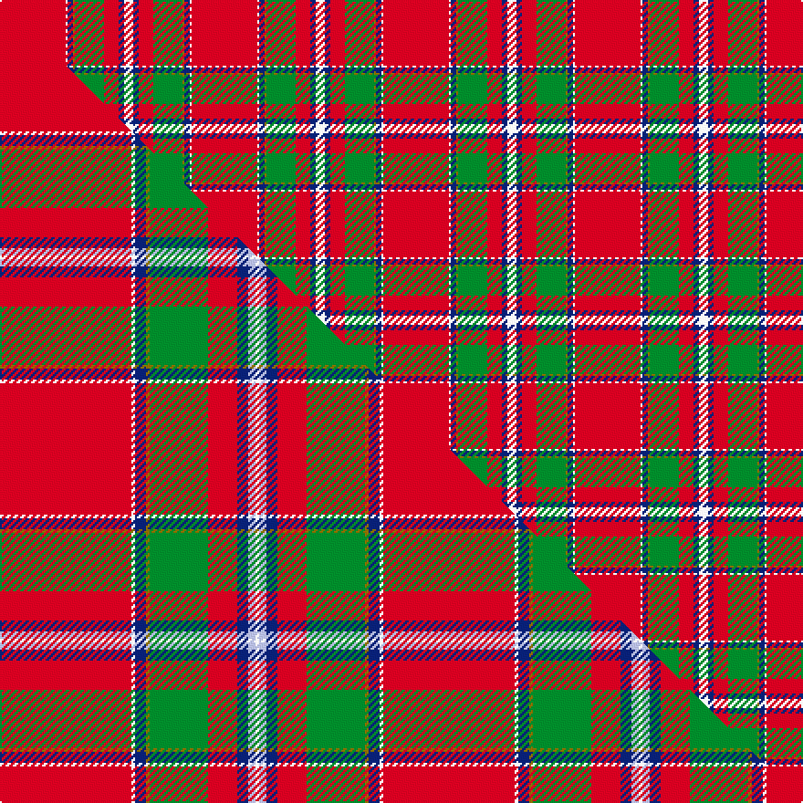

This page is one **sett** — a single exact thread-count. It belongs to the [tartan](/setts/r36w1db3y1g16r8db3w5/)
(the same proportion at any scale), whose colour order is pattern [RWBGGRBW](/stripes/rwbggrbw/).

Part of the [Drummond of Perth](/tartans/drummond-of-perth/) tartan — the named design grouping this sett with its other cloths.

Sourced from weddslist.  It is a [8 stripe tartan](/stripes/stripes8/).

Original link http://www.weddslist.com/cgi-bin/tartans/pg.pl?source=rb

Dataset <small>— provenance for this record, inherited from the source manifest</small>

<dl class="dataset-prov">
<dt>source</dt><dd><a href="/sources/weddslist/">Weddslist</a></dd>
<dt>data captured from</dt><dd><a href="https://github.com/thetartan/tartan-database/blob/master/data/weddslist/data.csv">https://github.com/thetartan/tartan-database/blob/master/data/weddslist/data.csv</a></dd>
<dt>data date</dt><dd>2016-11-17 <small>(dataset default)</small></dd>
<dt>licence</dt><dd><a href="https://creativecommons.org/licenses/by-nc-nd/4.0/">CC BY-NC-ND 4.0</a></dd>
</dl>

Capture chain <small>— the hands this data passed through, oldest first; each capture carries its own licence</small>

<ol class="capture-chain">
<li><a href="https://www.weddslist.com/tartans/">Weddslist</a> <small>the living privately compiled reference</small></li>
<li><a href="https://github.com/thetartan/tartan-database">thetartan/tartan-database</a> <small>2016-2017</small> · <a href="https://creativecommons.org/licenses/by-nc-nd/4.0/">CC BY-NC-ND 4.0</a> <small>Levko Kravets's frozen compilation — the capture we vendored, and where its CC licence text came from</small></li>
<li>this dictionary <small>captured 2026-06-10 · commit 5bf86c7566</small> <small>each re-capture is a git commit to data/sources</small></li>
</ol>

## Thread count
R/36 W1 DB3 Y1 G16 R8 DB3 W/5

One full sett is **105 threads**.

## Palette
<table><thead><tr><th>Colour</th><th>Shade</th><th>OKLCh</th></tr></thead><tbody><tr><td>DB</td><td><code style="background-color:#082077;">#082077</code> <small style="color:#888">#082077</small></td><td><small style="color:#888">oklch(30.0% 0.149 265.1)</small></td></tr><tr><td>G</td><td><code style="background-color:#008B2A;">#008B2A</code> <small style="color:#888">#008B2A</small></td><td><small style="color:#888">oklch(55.4% 0.170 145.9)</small></td></tr><tr><td>W</td><td><code style="background-color:#F7F7F7;">#F7F7F7</code> <small style="color:#888">#F7F7F7</small></td><td><small style="color:#888">oklch(97.6% 0.000 89.9)</small></td></tr><tr><td>R</td><td><code style="background-color:#D60020;">#D60020</code> <small style="color:#888">#D60020</small></td><td><small style="color:#888">oklch(55.2% 0.224 25.5)</small></td></tr><tr><td>Y</td><td><code style="background-color:#8B6E00;">#8B6E00</code> <small style="color:#888">#8B6E00</small></td><td><small style="color:#888">oklch(55.1% 0.113 90.4)</small></td></tr></tbody></table>

# Sample pattern

## Compared to the master

This cloth is one sett of its design; the master sett (the exemplar the design is anchored on) is below for comparison.

Its **ΔTartan distance** from the master is **0.39** — the same measure the nearest-tartans table ranks by (0 is identical; a re-scale of the same cloth is near 0, a recolour or a different proportion further).

<figure class="master-compare" style="margin:0">

this sett
master sett ★

<figcaption style="color:#888;font-size:smaller">One weave of this sett against the <a href="/setts/r36w1db3y1g16r8db3lb2w1/">master sett ★</a>, split on the diagonal: a shared proportion runs seamlessly across it with only the shades shifting; a different proportion breaks on it.</figcaption>
</figure>

## Nearest tartan variants

The nearest existing variants by ΔTartan distance, with this cloth at the top so the swatches line up against it.

ΔTartan

Threads

Variant

Sett

—

105

<a href="/variants/s8/r36w1db3y1g16r8db3w5/">Drummond of Perth</a>

<a href="/ttd/edit/#slug=r36w1db3y1g16r8db3lb2w1~x2&amp;base=r36w1db3y1g16r8db3w5" title="compare in the TTD">0.39</a>

210

<a href="/variants/s9/r36w1db3y1g16r8db3lb2w1~x2/">Drummond of Perth</a>

<a href="/ttd/edit/#slug=r36w1db3y1g16r8db3lb2w1&amp;base=r36w1db3y1g16r8db3w5" title="compare in the TTD">0.39</a>

105

<a href="/variants/s9/r36w1db3y1g16r8db3lb2w1/">Drummond of Perth</a>

<a href="/ttd/edit/#slug=r36w1db3y1g16r8db3t2w1~x2&amp;base=r36w1db3y1g16r8db3w5" title="compare in the TTD">0.39</a>

210

<a href="/variants/s9/r36w1db3y1g16r8db3t2w1~x2/">Drummond of Perth (Clan)</a>

<a href="/ttd/edit/#slug=r36w1db3y1dg16r8db3lb2w1~x2&amp;base=r36w1db3y1g16r8db3w5" title="compare in the TTD">0.46</a>

210

<a href="/variants/s9/r36w1db3y1dg16r8db3lb2w1~x2/">Perthshire or Drummond of Perth</a>

<a href="/ttd/edit/#slug=r56w2db6w2g32r11db6w5&amp;base=r36w1db3y1g16r8db3w5" title="compare in the TTD">0.67</a>

179

<a href="/variants/s8/r56w2db6w2g32r11db6w5/">Spens</a>

<a href="/ttd/edit/#slug=r30w1dp4y1dg14r6dp4lb2w1~x4&amp;base=r36w1db3y1g16r8db3w5" title="compare in the TTD">0.92</a>

380

<a href="/variants/s9/r30w1dp4y1dg14r6dp4lb2w1~x4/">Perth - 1819 (District)</a>

<a href="/ttd/edit/#slug=r48db3y1g14r8db3w4do1&amp;base=r36w1db3y1g16r8db3w5" title="compare in the TTD">1.02</a>

115

<a href="/variants/s8/r48db3y1g14r8db3w4do1/">Prince Charles Cloak</a>

<a href="/ttd/edit/#slug=r22db3y1g12r6db3lb3w1~x2&amp;base=r36w1db3y1g16r8db3w5" title="compare in the TTD">1.07</a>

158

<a href="/variants/s8/r22db3y1g12r6db3lb3w1~x2/">Drummond, (Fingask)</a>

<a href="/ttd/edit/#slug=r48db3y1g14r8db3lb4w1~x2&amp;base=r36w1db3y1g16r8db3w5" title="compare in the TTD">1.07</a>

230

<a href="/variants/s8/r48db3y1g14r8db3lb4w1~x2/">Prince Charles Cloak</a>

<a href="/ttd/edit/#slug=r48db3y1g14r8db3lb4w1&amp;base=r36w1db3y1g16r8db3w5" title="compare in the TTD">1.07</a>

115

<a href="/variants/s8/r48db3y1g14r8db3lb4w1/">Prince Charles Cloak</a>

## Neighbour map

Every grey dot is one of 13620 variants placed by the first two principal components of the ΔTartan feature space (42% of its variance). Red is this tartan; blue dots are its nearest — click one to open its page.

<svg viewBox="0 0 640 380" role="img" style="max-width:100%;height:auto;border:1px solid #e0e0e0;border-radius:4px;display:block" xmlns="http://www.w3.org/2000/svg"><image href="/nn/cloud.v1.png" width="640" height="380"/><a href="/variants/s9/r36w1db3y1g16r8db3lb2w1~x2/"><circle cx="378.0" cy="80.0" r="4" fill="#3465a4"><title>Drummond of Perth</title></circle></a><a href="/variants/s9/r36w1db3y1g16r8db3lb2w1/"><circle cx="378.0" cy="80.0" r="4" fill="#3465a4"><title>Drummond of Perth</title></circle></a><a href="/variants/s9/r36w1db3y1g16r8db3t2w1~x2/"><circle cx="380.2" cy="81.0" r="4" fill="#3465a4"><title>Drummond of Perth (Clan)</title></circle></a><a href="/variants/s9/r36w1db3y1dg16r8db3lb2w1~x2/"><circle cx="372.9" cy="75.8" r="4" fill="#3465a4"><title>Perthshire or Drummond of Perth</title></circle></a><a href="/variants/s8/r56w2db6w2g32r11db6w5/"><circle cx="348.5" cy="130.6" r="4" fill="#3465a4"><title>Spens</title></circle></a><a href="/variants/s9/r30w1dp4y1dg14r6dp4lb2w1~x4/"><circle cx="335.7" cy="90.0" r="4" fill="#3465a4"><title>Perth - 1819 (District)</title></circle></a><a href="/variants/s8/r48db3y1g14r8db3w4do1/"><circle cx="434.4" cy="67.9" r="4" fill="#3465a4"><title>Prince Charles Cloak</title></circle></a><a href="/variants/s8/r22db3y1g12r6db3lb3w1~x2/"><circle cx="298.5" cy="123.1" r="4" fill="#3465a4"><title>Drummond, (Fingask)</title></circle></a><a href="/variants/s8/r48db3y1g14r8db3lb4w1~x2/"><circle cx="443.1" cy="70.8" r="4" fill="#3465a4"><title>Prince Charles Cloak</title></circle></a><a href="/variants/s8/r48db3y1g14r8db3lb4w1/"><circle cx="443.1" cy="70.8" r="4" fill="#3465a4"><title>Prince Charles Cloak</title></circle></a><circle cx="366.2" cy="104.0" r="5" fill="#c00000"/><text x="320" y="376" text-anchor="middle" font-size="11" fill="#999">ground</text><text x="11" y="190" text-anchor="middle" font-size="11" fill="#999" transform="rotate(-90 11 190)">complexity</text></svg>

ID: /variants/s8/r36w1db3y1g16r8db3w5/
