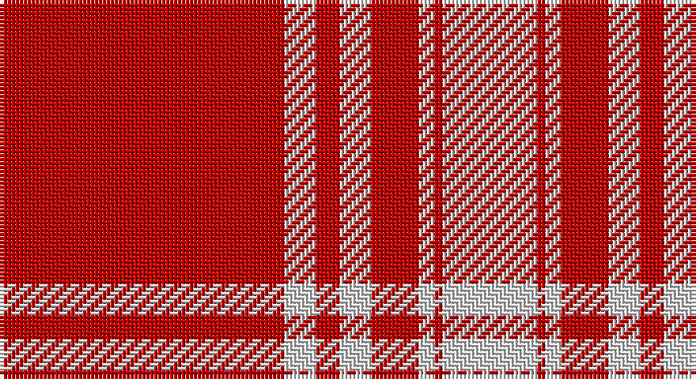

This page is one **sett** — a single exact thread-count. It belongs to the [tartan](/setts/r36w4r3w4r6w2r1w12/)
(the same proportion at any scale), whose colour order is pattern [RWRWRWRW](/stripes/rwrwrwrw/).

Part of the [Menzies Dress](/tartans/menzies-dress/) tartan — the named design grouping this sett with its other cloths.

Sourced from weddslist.  It is a [8 stripe tartan](/stripes/stripes8/).

Original link http://www.weddslist.com/cgi-bin/tartans/pg.pl?source=sts

## Provenance

Earliest known date: 1810-15 The red and white Menzies tartan appears in the Cockburn Collection (c.1815) under the name, MacFarlane, but this is taken to be an error on the part of General Cockburn at a time when the establishment of clan names for tartan was in its infancy. The same sett was certified as Menzies, by the clan chief, in the collection of the Highland Society of London (c.1816). The tartan is woven in various colours, green, black, red and white to the same design.

## Also known as

This cloth is also recorded under:

- Menzies
- Menzies 1815
- Menzies Red & White

2 attestations — the source records this cloth was collapsed from (oldest owns this page)

<ul>
<li>undated — Menzies (weddslist, <a href="http://www.weddslist.com/cgi-bin/tartans/pg.pl?source=sts">record</a>)</li>
<li>undated — Menzies Red & White Clan Tartan (house-of-tartan, <a href="http://www.house-of-tartan.scotland.net/house/TartanViewjs.asp?colr=Def&tnam=1699">record</a>)</li>
</ul>

## Thread count
R/72 LN8 R6 LN8 R12 LN4 R2 LN/24

One full sett is **176 threads**.

## Palette

Palette: <strong>Tartan Dictionary</strong> <small style="color:#888">(1 of 2 colours)</small>
<table><thead><tr><th>Colour</th><th>Threads</th><th>Shade</th><th>Base</th><th>OKLCh</th></tr></thead><tbody><tr><td>R/</td><td style="text-align:right;font-variant-numeric:tabular-nums">72</td><td><code style="background-color:#C00000;">#C00000</code> <small style="color:#888">#C00000</small></td><td>R <code style="background-color:#CC0000;">#CC0000</code></td><td><small style="color:#888">oklch(50.7% 0.208 29.2)</small></td></tr><tr><td>LN</td><td style="text-align:right;font-variant-numeric:tabular-nums">8</td><td><code style="background-color:#E0E0E0;">#E0E0E0</code> <small style="color:#888">#E0E0E0</small></td><td>W <code style="background-color:#F7F7F7;">#F7F7F7</code></td><td><small style="color:#888">oklch(90.7% 0.000 89.9)</small></td></tr><tr><td>R</td><td style="text-align:right;font-variant-numeric:tabular-nums">6</td><td><code style="background-color:#C00000;">#C00000</code> <small style="color:#888">#C00000</small></td><td>R <code style="background-color:#CC0000;">#CC0000</code></td><td><small style="color:#888">oklch(50.7% 0.208 29.2)</small></td></tr><tr><td>LN</td><td style="text-align:right;font-variant-numeric:tabular-nums">8</td><td><code style="background-color:#E0E0E0;">#E0E0E0</code> <small style="color:#888">#E0E0E0</small></td><td>W <code style="background-color:#F7F7F7;">#F7F7F7</code></td><td><small style="color:#888">oklch(90.7% 0.000 89.9)</small></td></tr><tr><td>R</td><td style="text-align:right;font-variant-numeric:tabular-nums">12</td><td><code style="background-color:#C00000;">#C00000</code> <small style="color:#888">#C00000</small></td><td>R <code style="background-color:#CC0000;">#CC0000</code></td><td><small style="color:#888">oklch(50.7% 0.208 29.2)</small></td></tr><tr><td>LN</td><td style="text-align:right;font-variant-numeric:tabular-nums">4</td><td><code style="background-color:#E0E0E0;">#E0E0E0</code> <small style="color:#888">#E0E0E0</small></td><td>W <code style="background-color:#F7F7F7;">#F7F7F7</code></td><td><small style="color:#888">oklch(90.7% 0.000 89.9)</small></td></tr><tr><td>R</td><td style="text-align:right;font-variant-numeric:tabular-nums">2</td><td><code style="background-color:#C00000;">#C00000</code> <small style="color:#888">#C00000</small></td><td>R <code style="background-color:#CC0000;">#CC0000</code></td><td><small style="color:#888">oklch(50.7% 0.208 29.2)</small></td></tr><tr><td>LN/</td><td style="text-align:right;font-variant-numeric:tabular-nums">24</td><td><code style="background-color:#E0E0E0;">#E0E0E0</code> <small style="color:#888">#E0E0E0</small></td><td>W <code style="background-color:#F7F7F7;">#F7F7F7</code></td><td><small style="color:#888">oklch(90.7% 0.000 89.9)</small></td></tr></tbody></table>

# Sample pattern

## Nearest tartans

The nearest existing variants by ΔTartan distance, with this tartan at the top so the swatches line up against it.

ΔTartan

Tartan

Sett

—

<a href="/ttd/edit/#slug=r36w4r3w4r6w2r1w12~x2">Menzies</a> <a class="nn-out" href="/variants/s8/r36w4r3w4r6w2r1w12~x2/" title="open its dictionary page">↗</a>

0.46

<a href="/ttd/edit/#slug=r36lb4r3lb4r6lb2r1lb12&amp;base=r36w4r3w4r6w2r1w12~x2">Menzies Dress</a> <a class="nn-out" href="/variants/s8/r36lb4r3lb4r6lb2r1lb12/" title="open its dictionary page">↗</a>

0.53

<a href="/ttd/edit/#slug=r36w4r3w4r6w2r1w12~x4&amp;base=r36w4r3w4r6w2r1w12~x2">Menzies (1815)</a> <a class="nn-out" href="/variants/s8/r36w4r3w4r6w2r1w12~x4/" title="open its dictionary page">↗</a>

1.11

<a href="/ttd/edit/#slug=r55w20r8w2r8w2r8w2~x2&amp;base=r36w4r3w4r6w2r1w12~x2">Masai Shuka 08 (Artefact)</a> <a class="nn-out" href="/variants/s8/r55w20r8w2r8w2r8w2~x2/" title="open its dictionary page">↗</a>

1.43

<a href="/ttd/edit/#slug=r36lr4r3lr4r6lr2r1lr12~x2&amp;base=r36w4r3w4r6w2r1w12~x2">Menzies Dress</a> <a class="nn-out" href="/variants/s8/r36lr4r3lr4r6lr2r1lr12~x2/" title="open its dictionary page">↗</a>

1.43

<a href="/ttd/edit/#slug=r36lr4r3lr4r6lr2r1lr12&amp;base=r36w4r3w4r6w2r1w12~x2">Menzies Dress</a> <a class="nn-out" href="/variants/s8/r36lr4r3lr4r6lr2r1lr12/" title="open its dictionary page">↗</a>

1.63

<a href="/ttd/edit/#slug=r41w19r7w8w1k3~x2&amp;base=r36w4r3w4r6w2r1w12~x2">MacGregor - 2005 (Black - Personal)</a> <a class="nn-out" href="/variants/s6/r41w19r7w8w1k3~x2/" title="open its dictionary page">↗</a>

1.82

<a href="/ttd/edit/#slug=r51o2r6k10r2k4o3k3~x2&amp;base=r36w4r3w4r6w2r1w12~x2">Virgin</a> <a class="nn-out" href="/variants/s8/r51o2r6k10r2k4o3k3~x2/" title="open its dictionary page">↗</a>

1.87

<a href="/ttd/edit/#slug=dr3lo3dr4dr2lo18dr1lo2dr2~x4&amp;base=r36w4r3w4r6w2r1w12~x2">Loughheed (Personal)</a> <a class="nn-out" href="/variants/s8/dr3lo3dr4dr2lo18dr1lo2dr2~x4/" title="open its dictionary page">↗</a>

1.93

<a href="/ttd/edit/#slug=t5k1w11k1r42k1~x2&amp;base=r36w4r3w4r6w2r1w12~x2">Davet (2014)</a> <a class="nn-out" href="/variants/s6/t5k1w11k1r42k1~x2/" title="open its dictionary page">↗</a>

1.93

<a href="/ttd/edit/#slug=r40w1r1dt8r1w1r6w1r1dt8~x2&amp;base=r36w4r3w4r6w2r1w12~x2">Miyuki #2</a> <a class="nn-out" href="/variants/s10/r40w1r1dt8r1w1r6w1r1dt8~x2/" title="open its dictionary page">↗</a>

## Neighbour map

Every grey dot is one of 14360 variants placed by the first two principal components of the ΔTartan feature space (44% of its variance). Red is this tartan; blue dots are its nearest — click one to open its page.

<svg viewBox="0 0 640 380" role="img" style="max-width:100%;height:auto;border:1px solid #e0e0e0;border-radius:4px;display:block" xmlns="http://www.w3.org/2000/svg"><image href="/nn/cloud.v1.png" width="640" height="380"/><a href="/variants/s8/r36lb4r3lb4r6lb2r1lb12/"><circle cx="509.2" cy="131.9" r="4" fill="#3465a4"><title>Menzies Dress</title></circle></a><a href="/variants/s8/r36w4r3w4r6w2r1w12~x4/"><circle cx="482.3" cy="117.3" r="4" fill="#3465a4"><title>Menzies (1815)</title></circle></a><a href="/variants/s8/r55w20r8w2r8w2r8w2~x2/"><circle cx="547.0" cy="140.4" r="4" fill="#3465a4"><title>Masai Shuka 08 (Artefact)</title></circle></a><a href="/variants/s8/r36lr4r3lr4r6lr2r1lr12~x2/"><circle cx="532.9" cy="150.2" r="4" fill="#3465a4"><title>Menzies Dress</title></circle></a><a href="/variants/s8/r36lr4r3lr4r6lr2r1lr12/"><circle cx="532.9" cy="150.2" r="4" fill="#3465a4"><title>Menzies Dress</title></circle></a><a href="/variants/s6/r41w19r7w8w1k3~x2/"><circle cx="406.7" cy="120.6" r="4" fill="#3465a4"><title>MacGregor - 2005 (Black - Personal)</title></circle></a><a href="/variants/s8/r51o2r6k10r2k4o3k3~x2/"><circle cx="516.5" cy="117.3" r="4" fill="#3465a4"><title>Virgin</title></circle></a><a href="/variants/s8/dr3lo3dr4dr2lo18dr1lo2dr2~x4/"><circle cx="445.3" cy="162.7" r="4" fill="#3465a4"><title>Loughheed (Personal)</title></circle></a><a href="/variants/s6/t5k1w11k1r42k1~x2/"><circle cx="462.6" cy="91.0" r="4" fill="#3465a4"><title>Davet (2014)</title></circle></a><a href="/variants/s10/r40w1r1dt8r1w1r6w1r1dt8~x2/"><circle cx="545.0" cy="99.7" r="4" fill="#3465a4"><title>Miyuki #2</title></circle></a><circle cx="495.1" cy="125.8" r="5" fill="#c00000"/></svg>

ID: /variants/s8/r36w4r3w4r6w2r1w12~x2/
