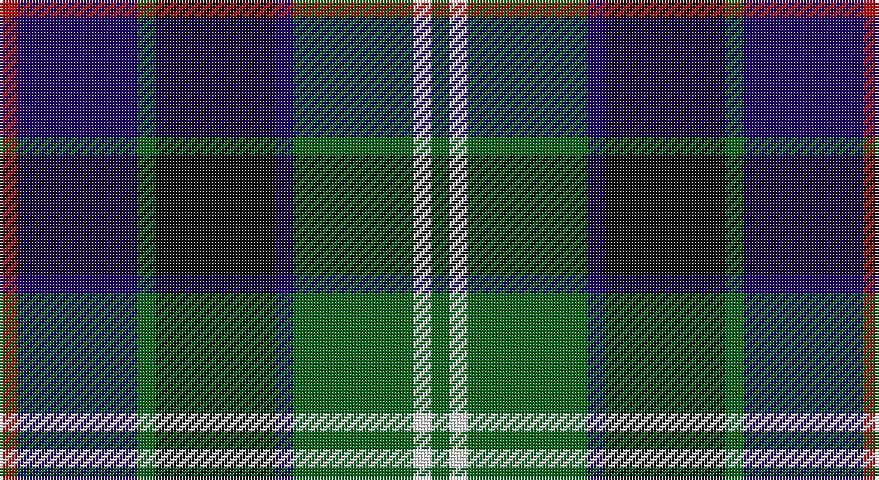

This page is one **sett** — a single exact thread-count. It belongs to the [tartan](/setts/r3db20g3k20db3g20w3g3/)
(the same proportion at any scale), whose colour order is pattern [GWGBKGBR](/stripes/gwgbkgbr/).

Sourced from tartans-authority.  It is a [8 stripe tartan](/stripes/stripes8/).

Original link http://www.tartansauthority.com/tartan-ferret/display/4561/

## Register references

External register numbers recorded for this tartan.

- Scottish Tartans Authority (ITI): 4561

## Thread count
R/6 DB40 G6 K40 DB6 G40 W6 G/6

One full sett is **288 threads**.

## Palette

Palette: <strong>Tartan Register</strong>
<table><thead><tr><th>Colour</th><th>Threads</th><th>Shade</th><th>Base</th><th>OKLCh</th></tr></thead><tbody><tr><td>R/</td><td style="text-align:right;font-variant-numeric:tabular-nums">6</td><td><code style="background-color:#C80000;">#C80000</code> <small style="color:#888">#C80000</small></td><td>R <code style="background-color:#CC0000;">#CC0000</code></td><td><small style="color:#888">oklch(52.3% 0.215 29.2)</small></td></tr><tr><td>DB</td><td style="text-align:right;font-variant-numeric:tabular-nums">40</td><td><code style="background-color:#1C0070;">#1C0070</code> <small style="color:#888">#1C0070</small></td><td>B <code style="background-color:#2A418A;">#2A418A</code></td><td><small style="color:#888">oklch(26.3% 0.162 277.1)</small></td></tr><tr><td>G</td><td style="text-align:right;font-variant-numeric:tabular-nums">6</td><td><code style="background-color:#006818;">#006818</code> <small style="color:#888">#006818</small></td><td>G <code style="background-color:#006100;">#006100</code></td><td><small style="color:#888">oklch(45.0% 0.142 145.0)</small></td></tr><tr><td>K</td><td style="text-align:right;font-variant-numeric:tabular-nums">40</td><td><code style="background-color:#101010;">#101010</code> <small style="color:#888">#101010</small></td><td>K <code style="background-color:#000000;">#000000</code></td><td><small style="color:#888">oklch(17.3% 0.000 89.9)</small></td></tr><tr><td>DB</td><td style="text-align:right;font-variant-numeric:tabular-nums">6</td><td><code style="background-color:#1C0070;">#1C0070</code> <small style="color:#888">#1C0070</small></td><td>B <code style="background-color:#2A418A;">#2A418A</code></td><td><small style="color:#888">oklch(26.3% 0.162 277.1)</small></td></tr><tr><td>G</td><td style="text-align:right;font-variant-numeric:tabular-nums">40</td><td><code style="background-color:#006818;">#006818</code> <small style="color:#888">#006818</small></td><td>G <code style="background-color:#006100;">#006100</code></td><td><small style="color:#888">oklch(45.0% 0.142 145.0)</small></td></tr><tr><td>W</td><td style="text-align:right;font-variant-numeric:tabular-nums">6</td><td><code style="background-color:#FCFCFC;">#FCFCFC</code> <small style="color:#888">#FCFCFC</small></td><td>W <code style="background-color:#F7F7F7;">#F7F7F7</code></td><td><small style="color:#888">oklch(99.1% 0.000 89.9)</small></td></tr><tr><td>G/</td><td style="text-align:right;font-variant-numeric:tabular-nums">6</td><td><code style="background-color:#006818;">#006818</code> <small style="color:#888">#006818</small></td><td>G <code style="background-color:#006100;">#006100</code></td><td><small style="color:#888">oklch(45.0% 0.142 145.0)</small></td></tr></tbody></table>

# Sample pattern

## Nearest tartans

The nearest existing variants by ΔTartan distance, with this tartan at the top so the swatches line up against it.

ΔTartan

Tartan

Sett

—

<a href="/ttd/edit/#slug=r3db20g3k20db3g20w3g3~x2">MacFrog (Personal)</a> <a class="nn-out" href="/variants/s8/r3db20g3k20db3g20w3g3~x2/" title="open its dictionary page">↗</a>

0.66

<a href="/ttd/edit/#slug=r3g16w2k16db16k2db2~x2&amp;base=r3db20g3k20db3g20w3g3~x2">Colquhoun Clan Tartan</a> <a class="nn-out" href="/variants/s7/r3g16w2k16db16k2db2~x2/" title="open its dictionary page">↗</a>

0.74

<a href="/ttd/edit/#slug=k3ly3g22db6k17g6db22r3db3~x2&amp;base=r3db20g3k20db3g20w3g3~x2">Maresh</a> <a class="nn-out" href="/variants/s9/k3ly3g22db6k17g6db22r3db3~x2/" title="open its dictionary page">↗</a>

0.79

<a href="/ttd/edit/#slug=lr8g33k21db6k6db33r6db6&amp;base=r3db20g3k20db3g20w3g3~x2">Royal Highland Corporate Tartan</a> <a class="nn-out" href="/variants/s8/lr8g33k21db6k6db33r6db6/" title="open its dictionary page">↗</a>

0.79

<a href="/ttd/edit/#slug=g2k2g17k16r2db17ly2~x2&amp;base=r3db20g3k20db3g20w3g3~x2">Greenock</a> <a class="nn-out" href="/variants/s7/g2k2g17k16r2db17ly2~x2/" title="open its dictionary page">↗</a>

0.79

<a href="/ttd/edit/#slug=g16lb3g3k10db12r2db3~x2&amp;base=r3db20g3k20db3g20w3g3~x2">MacLean, Donald (Personal)</a> <a class="nn-out" href="/variants/s7/g16lb3g3k10db12r2db3~x2/" title="open its dictionary page">↗</a>

0.82

<a href="/ttd/edit/#slug=t4g14ly2k14db14k2db3~x2&amp;base=r3db20g3k20db3g20w3g3~x2">Hogarth of Firhill (Clan)</a> <a class="nn-out" href="/variants/s7/t4g14ly2k14db14k2db3~x2/" title="open its dictionary page">↗</a>

0.84

<a href="/ttd/edit/#slug=k2g17k16r2db17w2~x2&amp;base=r3db20g3k20db3g20w3g3~x2">Galbraith</a> <a class="nn-out" href="/variants/s6/k2g17k16r2db17w2~x2/" title="open its dictionary page">↗</a>

0.87

<a href="/ttd/edit/#slug=r2g8w1k8b8k1b1~x6&amp;base=r3db20g3k20db3g20w3g3~x2">Colquhoun #2</a> <a class="nn-out" href="/variants/s7/r2g8w1k8b8k1b1~x6/" title="open its dictionary page">↗</a>

0.88

<a href="/ttd/edit/#slug=t2g6ly1k6db6k1db1~x2&amp;base=r3db20g3k20db3g20w3g3~x2">Hogarth of Firhill</a> <a class="nn-out" href="/variants/s7/t2g6ly1k6db6k1db1~x2/" title="open its dictionary page">↗</a>

0.93

<a href="/ttd/edit/#slug=r3g2r3g18k14w2db16g3~x2&amp;base=r3db20g3k20db3g20w3g3~x2">Mantle (Personal)</a> <a class="nn-out" href="/variants/s8/r3g2r3g18k14w2db16g3~x2/" title="open its dictionary page">↗</a>

## Neighbour map

Every grey dot is one of 14360 variants placed by the first two principal components of the ΔTartan feature space (44% of its variance). Red is this tartan; blue dots are its nearest — click one to open its page.

<svg viewBox="0 0 640 380" role="img" style="max-width:100%;height:auto;border:1px solid #e0e0e0;border-radius:4px;display:block" xmlns="http://www.w3.org/2000/svg"><image href="/nn/cloud.v1.png" width="640" height="380"/><a href="/variants/s7/r3g16w2k16db16k2db2~x2/"><circle cx="150.2" cy="206.9" r="4" fill="#3465a4"><title>Colquhoun Clan Tartan</title></circle></a><a href="/variants/s9/k3ly3g22db6k17g6db22r3db3~x2/"><circle cx="168.6" cy="203.3" r="4" fill="#3465a4"><title>Maresh</title></circle></a><a href="/variants/s8/lr8g33k21db6k6db33r6db6/"><circle cx="146.6" cy="218.9" r="4" fill="#3465a4"><title>Royal Highland Corporate Tartan</title></circle></a><a href="/variants/s7/g2k2g17k16r2db17ly2~x2/"><circle cx="166.9" cy="205.0" r="4" fill="#3465a4"><title>Greenock</title></circle></a><a href="/variants/s7/g16lb3g3k10db12r2db3~x2/"><circle cx="164.3" cy="216.4" r="4" fill="#3465a4"><title>MacLean, Donald (Personal)</title></circle></a><a href="/variants/s7/t4g14ly2k14db14k2db3~x2/"><circle cx="134.9" cy="222.1" r="4" fill="#3465a4"><title>Hogarth of Firhill (Clan)</title></circle></a><a href="/variants/s6/k2g17k16r2db17w2~x2/"><circle cx="151.3" cy="214.4" r="4" fill="#3465a4"><title>Galbraith</title></circle></a><a href="/variants/s7/r2g8w1k8b8k1b1~x6/"><circle cx="125.0" cy="199.6" r="4" fill="#3465a4"><title>Colquhoun #2</title></circle></a><a href="/variants/s7/t2g6ly1k6db6k1db1~x2/"><circle cx="116.2" cy="227.0" r="4" fill="#3465a4"><title>Hogarth of Firhill</title></circle></a><a href="/variants/s8/r3g2r3g18k14w2db16g3~x2/"><circle cx="174.5" cy="196.7" r="4" fill="#3465a4"><title>Mantle (Personal)</title></circle></a><circle cx="143.5" cy="200.1" r="5" fill="#c00000"/></svg>

ID: /variants/s8/r3db20g3k20db3g20w3g3~x2/
