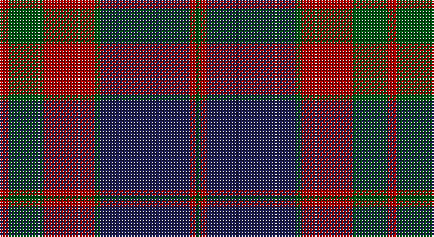

This page is one **sett** — a single exact thread-count. It belongs to the [tartan](/setts/r3dg12r12r5dg2db30r2dg2/)
(the same proportion at any scale), whose colour order is pattern [GRBGRRGR](/stripes/grbgrrgr/).

Sourced from tartans-authority.  It is a [8 stripe tartan](/stripes/stripes8/).

Original link http://www.tartansauthority.com/tartan-ferret/display/7273/

## Register references

External register numbers recorded for this tartan.

- Scottish Tartans Authority (ITI): 7273

## Thread count
DRa/6 G24 DR24 DRa10 G4 DB60 DRa4 G/4

One full sett is **262 threads**.

## Palette

Palette: <strong>Logan (The Scottish Gael, 1831)</strong> <small style="color:#888">(1 of 3 colours)</small>
<table><thead><tr><th>Colour</th><th>Threads</th><th>Shade</th><th>Base</th><th>OKLCh</th></tr></thead><tbody><tr><td>DRa/</td><td style="text-align:right;font-variant-numeric:tabular-nums">6</td><td><code style="background-color:#A80000;">#A80000</code> <small style="color:#888">#A80000</small></td><td>R <code style="background-color:#CC0000;">#CC0000</code></td><td><small style="color:#888">oklch(45.9% 0.189 29.2)</small></td></tr><tr><td>G</td><td style="text-align:right;font-variant-numeric:tabular-nums">24</td><td><code style="background-color:#005410;">#005410</code> <small style="color:#888">#005410</small></td><td>G <code style="background-color:#006100;">#006100</code></td><td><small style="color:#888">oklch(38.7% 0.123 144.7)</small></td></tr><tr><td>DR</td><td style="text-align:right;font-variant-numeric:tabular-nums">24</td><td><code style="background-color:#A80000;">#A80000</code> <small style="color:#888">#A80000</small></td><td>R <code style="background-color:#CC0000;">#CC0000</code></td><td><small style="color:#888">oklch(45.9% 0.189 29.2)</small></td></tr><tr><td>DRa</td><td style="text-align:right;font-variant-numeric:tabular-nums">10</td><td><code style="background-color:#A80000;">#A80000</code> <small style="color:#888">#A80000</small></td><td>R <code style="background-color:#CC0000;">#CC0000</code></td><td><small style="color:#888">oklch(45.9% 0.189 29.2)</small></td></tr><tr><td>G</td><td style="text-align:right;font-variant-numeric:tabular-nums">4</td><td><code style="background-color:#005410;">#005410</code> <small style="color:#888">#005410</small></td><td>G <code style="background-color:#006100;">#006100</code></td><td><small style="color:#888">oklch(38.7% 0.123 144.7)</small></td></tr><tr><td>DB</td><td style="text-align:right;font-variant-numeric:tabular-nums">60</td><td><code style="background-color:#1C1C50;">#1C1C50</code> <small style="color:#888">#1C1C50</small></td><td>B <code style="background-color:#2A418A;">#2A418A</code></td><td><small style="color:#888">oklch(26.2% 0.093 277.9)</small></td></tr><tr><td>DRa</td><td style="text-align:right;font-variant-numeric:tabular-nums">4</td><td><code style="background-color:#A80000;">#A80000</code> <small style="color:#888">#A80000</small></td><td>R <code style="background-color:#CC0000;">#CC0000</code></td><td><small style="color:#888">oklch(45.9% 0.189 29.2)</small></td></tr><tr><td>G/</td><td style="text-align:right;font-variant-numeric:tabular-nums">4</td><td><code style="background-color:#005410;">#005410</code> <small style="color:#888">#005410</small></td><td>G <code style="background-color:#006100;">#006100</code></td><td><small style="color:#888">oklch(38.7% 0.123 144.7)</small></td></tr></tbody></table>

# Sample pattern

## Nearest tartans

The nearest existing variants by ΔTartan distance, with this tartan at the top so the swatches line up against it.

ΔTartan

Tartan

Sett

—

<a href="/ttd/edit/#slug=r3dg12r12r5dg2db30r2dg2~x2">Rannoch Moor (Fashion)</a> <a class="nn-out" href="/variants/s8/r3dg12r12r5dg2db30r2dg2~x2/" title="open its dictionary page">↗</a>

0.89

<a href="/ttd/edit/#slug=n12dg2n4dg2n4k33dg13r4~x2&amp;base=r3dg12r12r5dg2db30r2dg2~x2">Brown of the Southeast (Personal)</a> <a class="nn-out" href="/variants/s8/n12dg2n4dg2n4k33dg13r4~x2/" title="open its dictionary page">↗</a>

0.95

<a href="/ttd/edit/#slug=g22k3g1k3g2dp8r1dp8r16~x2&amp;base=r3dg12r12r5dg2db30r2dg2~x2">Queen of Scots (Commemorative))</a> <a class="nn-out" href="/variants/s9/g22k3g1k3g2dp8r1dp8r16~x2/" title="open its dictionary page">↗</a>

1.00

<a href="/ttd/edit/#slug=k5o5k5o34do33k6do5t2&amp;base=r3dg12r12r5dg2db30r2dg2~x2">Brave for Men</a> <a class="nn-out" href="/variants/s8/k5o5k5o34do33k6do5t2/" title="open its dictionary page">↗</a>

1.01

<a href="/ttd/edit/#slug=dg5r1ri4db2ri20dg12db16ri4r1~x2&amp;base=r3dg12r12r5dg2db30r2dg2~x2">Diana Princess of Wales</a> <a class="nn-out" href="/variants/s9/dg5r1ri4db2ri20dg12db16ri4r1~x2/" title="open its dictionary page">↗</a>

1.08

<a href="/ttd/edit/#slug=db1k1r12g12k6db5r12k1db1~x4&amp;base=r3dg12r12r5dg2db30r2dg2~x2">Montrose (Macnaughton variation)</a> <a class="nn-out" href="/variants/s9/db1k1r12g12k6db5r12k1db1~x4/" title="open its dictionary page">↗</a>

1.10

<a href="/ttd/edit/#slug=dg26db3r3db20r3db3r30lb3k2~x2&amp;base=r3dg12r12r5dg2db30r2dg2~x2">Ormiston (Personal)</a> <a class="nn-out" href="/variants/s9/dg26db3r3db20r3db3r30lb3k2~x2/" title="open its dictionary page">↗</a>

1.10

<a href="/ttd/edit/#slug=dg28r12dg4k20lo2k3lo2k3dg7~x2&amp;base=r3dg12r12r5dg2db30r2dg2~x2">Cork, County (District)</a> <a class="nn-out" href="/variants/s9/dg28r12dg4k20lo2k3lo2k3dg7~x2/" title="open its dictionary page">↗</a>

1.14

<a href="/ttd/edit/#slug=db4dg2r17ri9dg10db30n2~x2&amp;base=r3dg12r12r5dg2db30r2dg2~x2">Dempster, Ross (Personal)</a> <a class="nn-out" href="/variants/s7/db4dg2r17ri9dg10db30n2~x2/" title="open its dictionary page">↗</a>

1.15

<a href="/ttd/edit/#slug=r16dg1g2dg1r4dg5t1dg5g14dg1t2~x2&amp;base=r3dg12r12r5dg2db30r2dg2~x2">Markson (Personal)</a> <a class="nn-out" href="/variants/s11/r16dg1g2dg1r4dg5t1dg5g14dg1t2~x2/" title="open its dictionary page">↗</a>

1.17

<a href="/ttd/edit/#slug=n32k3n3k3o5k8oi21k4~x2&amp;base=r3dg12r12r5dg2db30r2dg2~x2">Speyside Grey (Fashion)</a> <a class="nn-out" href="/variants/s8/n32k3n3k3o5k8oi21k4~x2/" title="open its dictionary page">↗</a>

## Neighbour map

Every grey dot is one of 14360 variants placed by the first two principal components of the ΔTartan feature space (44% of its variance). Red is this tartan; blue dots are its nearest — click one to open its page.

<svg viewBox="0 0 640 380" role="img" style="max-width:100%;height:auto;border:1px solid #e0e0e0;border-radius:4px;display:block" xmlns="http://www.w3.org/2000/svg"><image href="/nn/cloud.v1.png" width="640" height="380"/><a href="/variants/s8/n12dg2n4dg2n4k33dg13r4~x2/"><circle cx="303.8" cy="191.6" r="4" fill="#3465a4"><title>Brown of the Southeast (Personal)</title></circle></a><a href="/variants/s9/g22k3g1k3g2dp8r1dp8r16~x2/"><circle cx="267.3" cy="166.7" r="4" fill="#3465a4"><title>Queen of Scots (Commemorative))</title></circle></a><a href="/variants/s8/k5o5k5o34do33k6do5t2/"><circle cx="309.9" cy="188.5" r="4" fill="#3465a4"><title>Brave for Men</title></circle></a><a href="/variants/s9/dg5r1ri4db2ri20dg12db16ri4r1~x2/"><circle cx="309.4" cy="191.8" r="4" fill="#3465a4"><title>Diana Princess of Wales</title></circle></a><a href="/variants/s9/db1k1r12g12k6db5r12k1db1~x4/"><circle cx="272.3" cy="199.2" r="4" fill="#3465a4"><title>Montrose (Macnaughton variation)</title></circle></a><a href="/variants/s9/dg26db3r3db20r3db3r30lb3k2~x2/"><circle cx="254.0" cy="165.1" r="4" fill="#3465a4"><title>Ormiston (Personal)</title></circle></a><a href="/variants/s9/dg28r12dg4k20lo2k3lo2k3dg7~x2/"><circle cx="318.9" cy="203.7" r="4" fill="#3465a4"><title>Cork, County (District)</title></circle></a><a href="/variants/s7/db4dg2r17ri9dg10db30n2~x2/"><circle cx="281.0" cy="195.7" r="4" fill="#3465a4"><title>Dempster, Ross (Personal)</title></circle></a><a href="/variants/s11/r16dg1g2dg1r4dg5t1dg5g14dg1t2~x2/"><circle cx="277.1" cy="176.9" r="4" fill="#3465a4"><title>Markson (Personal)</title></circle></a><a href="/variants/s8/n32k3n3k3o5k8oi21k4~x2/"><circle cx="270.0" cy="197.8" r="4" fill="#3465a4"><title>Speyside Grey (Fashion)</title></circle></a><circle cx="289.0" cy="186.3" r="5" fill="#c00000"/></svg>

ID: /variants/s8/r3dg12r12r5dg2db30r2dg2~x2/
