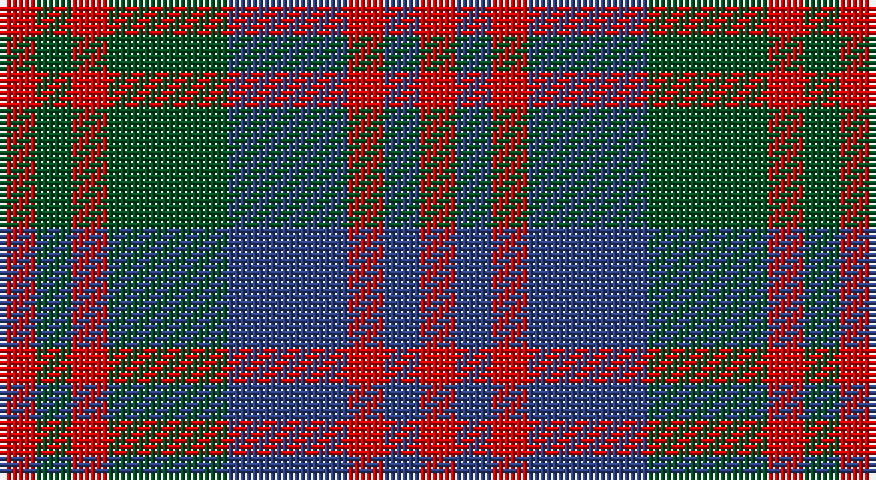

This page is one **sett** — a single exact thread-count. It belongs to the [tartan](/setts/r3dg3r3dg10db10r3db3r3/)
(the same proportion at any scale), whose colour order is pattern [RBRBGRGR](/stripes/rbrbgrgr/).

Sourced from register-of-tartans.  It is a [8 stripe tartan](/stripes/stripes8/).

Original link https://www.tartanregister.gov.uk/tartanDetails.aspx?ref=1208

## Register references

External register numbers recorded for this tartan.

- Scottish Register of Tartans: [1208](https://www.tartanregister.gov.uk/tartanDetails.aspx?ref=1208)
- Scottish Tartans World Register: 1404

## Thread count
R/6 G6 R6 G20 B20 R6 B6 R/6

One full sett is **140 threads**.

## Palette

Palette: <strong>Tartan Register</strong>
<table><thead><tr><th>Colour</th><th>Threads</th><th>Shade</th><th>Base</th><th>OKLCh</th></tr></thead><tbody><tr><td>R/</td><td style="text-align:right;font-variant-numeric:tabular-nums">6</td><td><code style="background-color:#DC0000;">#DC0000</code> <small style="color:#888">#DC0000</small></td><td>R <code style="background-color:#CC0000;">#CC0000</code></td><td><small style="color:#888">oklch(56.2% 0.230 29.2)</small></td></tr><tr><td>G</td><td style="text-align:right;font-variant-numeric:tabular-nums">6</td><td><code style="background-color:#005020;">#005020</code> <small style="color:#888">#005020</small></td><td>G <code style="background-color:#006100;">#006100</code></td><td><small style="color:#888">oklch(37.7% 0.105 149.6)</small></td></tr><tr><td>R</td><td style="text-align:right;font-variant-numeric:tabular-nums">6</td><td><code style="background-color:#DC0000;">#DC0000</code> <small style="color:#888">#DC0000</small></td><td>R <code style="background-color:#CC0000;">#CC0000</code></td><td><small style="color:#888">oklch(56.2% 0.230 29.2)</small></td></tr><tr><td>G</td><td style="text-align:right;font-variant-numeric:tabular-nums">20</td><td><code style="background-color:#005020;">#005020</code> <small style="color:#888">#005020</small></td><td>G <code style="background-color:#006100;">#006100</code></td><td><small style="color:#888">oklch(37.7% 0.105 149.6)</small></td></tr><tr><td>B</td><td style="text-align:right;font-variant-numeric:tabular-nums">20</td><td><code style="background-color:#2C4084;">#2C4084</code> <small style="color:#888">#2C4084</small></td><td>B <code style="background-color:#2A418A;">#2A418A</code></td><td><small style="color:#888">oklch(39.4% 0.117 268.3)</small></td></tr><tr><td>R</td><td style="text-align:right;font-variant-numeric:tabular-nums">6</td><td><code style="background-color:#DC0000;">#DC0000</code> <small style="color:#888">#DC0000</small></td><td>R <code style="background-color:#CC0000;">#CC0000</code></td><td><small style="color:#888">oklch(56.2% 0.230 29.2)</small></td></tr><tr><td>B</td><td style="text-align:right;font-variant-numeric:tabular-nums">6</td><td><code style="background-color:#2C4084;">#2C4084</code> <small style="color:#888">#2C4084</small></td><td>B <code style="background-color:#2A418A;">#2A418A</code></td><td><small style="color:#888">oklch(39.4% 0.117 268.3)</small></td></tr><tr><td>R/</td><td style="text-align:right;font-variant-numeric:tabular-nums">6</td><td><code style="background-color:#DC0000;">#DC0000</code> <small style="color:#888">#DC0000</small></td><td>R <code style="background-color:#CC0000;">#CC0000</code></td><td><small style="color:#888">oklch(56.2% 0.230 29.2)</small></td></tr></tbody></table>

# Sample pattern

## Nearest tartans

The nearest existing variants by ΔTartan distance, with this tartan at the top so the swatches line up against it.

ΔTartan

Tartan

Sett

—

<a href="/ttd/edit/#slug=r3dg3r3dg10db10r3db3r3~x2">Flora MacDonald</a> <a class="nn-out" href="/variants/s8/r3dg3r3dg10db10r3db3r3~x2/" title="open its dictionary page">↗</a>

0.66

<a href="/ttd/edit/#slug=r3db3r3db10g10r3g3r3~x2&amp;base=r3dg3r3dg10db10r3db3r3~x2">Flora, MacDonald</a> <a class="nn-out" href="/variants/s8/r3db3r3db10g10r3g3r3~x2/" title="open its dictionary page">↗</a>

1.13

<a href="/ttd/edit/#slug=lr10dt3lr3dt3lr3dt11dy11o3~x2&amp;base=r3dg3r3dg10db10r3db3r3~x2">Holden Monaro Corporate Tartan</a> <a class="nn-out" href="/variants/s8/lr10dt3lr3dt3lr3dt11dy11o3~x2/" title="open its dictionary page">↗</a>

1.15

<a href="/ttd/edit/#slug=o10g14o3db14o10g14o3db4~x2&amp;base=r3dg3r3dg10db10r3db3r3~x2">Glasgow District Tartan</a> <a class="nn-out" href="/variants/s8/o10g14o3db14o10g14o3db4~x2/" title="open its dictionary page">↗</a>

1.17

<a href="/ttd/edit/#slug=r2g4db8r9g9k2r2~x4&amp;base=r3dg3r3dg10db10r3db3r3~x2">Stewart (Artefact)</a> <a class="nn-out" href="/variants/s7/r2g4db8r9g9k2r2~x4/" title="open its dictionary page">↗</a>

1.35

<a href="/variants/s8/r4dg4r1db4r4~x12/">Gow</a>

1.35

<a href="/variants/s8/g4r3t1k1t3~x4/">Wilson's No.214</a>

1.36

<a href="/ttd/edit/#slug=g16r12db16r6db4r6db7r20db8g8db12~x2&amp;base=r3dg3r3dg10db10r3db3r3~x2">Fiddes</a> <a class="nn-out" href="/variants/s11/g16r12db16r6db4r6db7r20db8g8db12~x2/" title="open its dictionary page">↗</a>

1.40

<a href="/ttd/edit/#slug=dp3r19dp18g19dp3g3~x2&amp;base=r3dg3r3dg10db10r3db3r3~x2">MacNab 1</a> <a class="nn-out" href="/variants/s6/dp3r19dp18g19dp3g3~x2/" title="open its dictionary page">↗</a>

1.42

<a href="/ttd/edit/#slug=p3r14g2p10r2g14p3~x2&amp;base=r3dg3r3dg10db10r3db3r3~x2">Scottish Netball Association</a> <a class="nn-out" href="/variants/s7/p3r14g2p10r2g14p3~x2/" title="open its dictionary page">↗</a>

1.46

<a href="/ttd/edit/#slug=g4db9r9g9k2r2k2g9r9db8g4r2~x4&amp;base=r3dg3r3dg10db10r3db3r3~x2">Stewart/Stuart C18th - Cf 1314 &amp; 4454</a> <a class="nn-out" href="/variants/s12/g4db9r9g9k2r2k2g9r9db8g4r2~x4/" title="open its dictionary page">↗</a>

## Neighbour map

Every grey dot is one of 14360 variants placed by the first two principal components of the ΔTartan feature space (44% of its variance). Red is this tartan; blue dots are its nearest — click one to open its page.

<svg viewBox="0 0 640 380" role="img" style="max-width:100%;height:auto;border:1px solid #e0e0e0;border-radius:4px;display:block" xmlns="http://www.w3.org/2000/svg"><image href="/nn/cloud.v1.png" width="640" height="380"/><a href="/variants/s8/r3db3r3db10g10r3g3r3~x2/"><circle cx="170.1" cy="275.4" r="4" fill="#3465a4"><title>Flora, MacDonald</title></circle></a><a href="/variants/s8/lr10dt3lr3dt3lr3dt11dy11o3~x2/"><circle cx="141.2" cy="251.5" r="4" fill="#3465a4"><title>Holden Monaro Corporate Tartan</title></circle></a><a href="/variants/s8/o10g14o3db14o10g14o3db4~x2/"><circle cx="180.1" cy="274.4" r="4" fill="#3465a4"><title>Glasgow District Tartan</title></circle></a><a href="/variants/s7/r2g4db8r9g9k2r2~x4/"><circle cx="159.8" cy="253.8" r="4" fill="#3465a4"><title>Stewart (Artefact)</title></circle></a><a href="/variants/s8/r4dg4r1db4r4~x12/"><circle cx="170.5" cy="296.8" r="4" fill="#3465a4"><title>Gow</title></circle></a><a href="/variants/s8/g4r3t1k1t3~x4/"><circle cx="117.0" cy="251.3" r="4" fill="#3465a4"><title>Wilson's No.214</title></circle></a><a href="/variants/s11/g16r12db16r6db4r6db7r20db8g8db12~x2/"><circle cx="195.0" cy="267.2" r="4" fill="#3465a4"><title>Fiddes</title></circle></a><a href="/variants/s6/dp3r19dp18g19dp3g3~x2/"><circle cx="210.1" cy="246.7" r="4" fill="#3465a4"><title>MacNab 1</title></circle></a><a href="/variants/s7/p3r14g2p10r2g14p3~x2/"><circle cx="219.7" cy="241.4" r="4" fill="#3465a4"><title>Scottish Netball Association</title></circle></a><a href="/variants/s12/g4db9r9g9k2r2k2g9r9db8g4r2~x4/"><circle cx="144.7" cy="240.0" r="4" fill="#3465a4"><title>Stewart/Stuart C18th - Cf 1314 &amp; 4454</title></circle></a><circle cx="175.1" cy="276.4" r="5" fill="#c00000"/></svg>

ID: /variants/s8/r3dg3r3dg10db10r3db3r3~x2/
