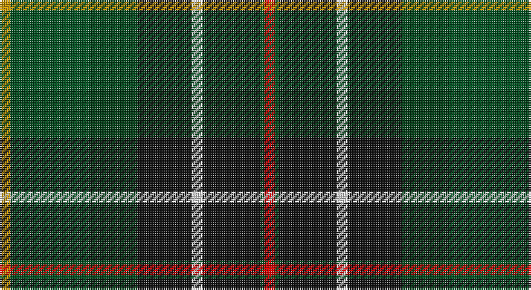

This page is one **sett** — a single exact thread-count. It belongs to the [tartan](/setts/r3dgi1k16w3k15dg13dgi22lo3/)
(the same proportion at any scale), whose colour order is pattern [RGKWKGGY](/stripes/rgkwkggy/).

Sourced from register-of-tartans.  It is a [8 stripe tartan](/stripes/stripes8/).

Original link https://www.tartanregister.gov.uk/tartanDetails.aspx?ref=5994

## Register references

External register numbers recorded for this tartan.

- Scottish Register of Tartans: [5994](https://www.tartanregister.gov.uk/tartanDetails.aspx?ref=5994)
- Scottish Tartans World Register: 3285

## Thread count
DY/6 G44 DG26 K30 LN6 K32 G2 R/6

One full sett is **292 threads**.

## Palette

Palette: <strong>Tartan Register</strong> <small style="color:#888">(5 of 6 colours)</small>
<table><thead><tr><th>Colour</th><th>Threads</th><th>Shade</th><th>Base</th><th>OKLCh</th></tr></thead><tbody><tr><td>DY/</td><td style="text-align:right;font-variant-numeric:tabular-nums">6</td><td><code style="background-color:#C89600;">#C89600</code> <small style="color:#888">#C89600</small></td><td>Y <code style="background-color:#F2BF00;">#F2BF00</code></td><td><small style="color:#888">oklch(70.2% 0.144 84.7)</small></td></tr><tr><td>G</td><td style="text-align:right;font-variant-numeric:tabular-nums">44</td><td><code style="background-color:#005020;">#005020</code> <small style="color:#888">#005020</small></td><td>G <code style="background-color:#006100;">#006100</code></td><td><small style="color:#888">oklch(37.7% 0.105 149.6)</small></td></tr><tr><td>DG</td><td style="text-align:right;font-variant-numeric:tabular-nums">26</td><td><code style="background-color:#003C14;">#003C14</code> <small style="color:#888">#003C14</small></td><td>G <code style="background-color:#006100;">#006100</code></td><td><small style="color:#888">oklch(31.1% 0.089 148.5)</small></td></tr><tr><td>K</td><td style="text-align:right;font-variant-numeric:tabular-nums">30</td><td><code style="background-color:#101010;">#101010</code> <small style="color:#888">#101010</small></td><td>K <code style="background-color:#000000;">#000000</code></td><td><small style="color:#888">oklch(17.3% 0.000 89.9)</small></td></tr><tr><td>LN</td><td style="text-align:right;font-variant-numeric:tabular-nums">6</td><td><code style="background-color:#E0E0E0;">#E0E0E0</code> <small style="color:#888">#E0E0E0</small></td><td>W <code style="background-color:#F7F7F7;">#F7F7F7</code></td><td><small style="color:#888">oklch(90.7% 0.000 89.9)</small></td></tr><tr><td>K</td><td style="text-align:right;font-variant-numeric:tabular-nums">32</td><td><code style="background-color:#101010;">#101010</code> <small style="color:#888">#101010</small></td><td>K <code style="background-color:#000000;">#000000</code></td><td><small style="color:#888">oklch(17.3% 0.000 89.9)</small></td></tr><tr><td>G</td><td style="text-align:right;font-variant-numeric:tabular-nums">2</td><td><code style="background-color:#005020;">#005020</code> <small style="color:#888">#005020</small></td><td>G <code style="background-color:#006100;">#006100</code></td><td><small style="color:#888">oklch(37.7% 0.105 149.6)</small></td></tr><tr><td>R/</td><td style="text-align:right;font-variant-numeric:tabular-nums">6</td><td><code style="background-color:#DC0000;">#DC0000</code> <small style="color:#888">#DC0000</small></td><td>R <code style="background-color:#CC0000;">#CC0000</code></td><td><small style="color:#888">oklch(56.2% 0.230 29.2)</small></td></tr></tbody></table>

# Sample pattern

## Nearest tartans

The nearest existing variants by ΔTartan distance, with this tartan at the top so the swatches line up against it.

ΔTartan

Tartan

Sett

—

<a href="/ttd/edit/#slug=r3dgi1k16w3k15dg13dgi22lo3~x2">Lawson, William</a> <a class="nn-out" href="/variants/s8/r3dgi1k16w3k15dg13dgi22lo3~x2/" title="open its dictionary page">↗</a>

1.01

<a href="/ttd/edit/#slug=dg23r7dgi25ly5dg17k5ly1w1r1~x2&amp;base=r3dgi1k16w3k15dg13dgi22lo3~x2">Cates Hunting</a> <a class="nn-out" href="/variants/s9/dg23r7dgi25ly5dg17k5ly1w1r1~x2/" title="open its dictionary page">↗</a>

1.03

<a href="/ttd/edit/#slug=r4g4k2g15do5g5do15g6w1db19r2~x2&amp;base=r3dgi1k16w3k15dg13dgi22lo3~x2">Adams</a> <a class="nn-out" href="/variants/s11/r4g4k2g15do5g5do15g6w1db19r2~x2/" title="open its dictionary page">↗</a>

1.06

<a href="/ttd/edit/#slug=dg42ly2g16dt7k16r5~x2&amp;base=r3dgi1k16w3k15dg13dgi22lo3~x2">Waterford Irish County Tartan</a> <a class="nn-out" href="/variants/s6/dg42ly2g16dt7k16r5~x2/" title="open its dictionary page">↗</a>

1.10

<a href="/ttd/edit/#slug=r4lb1y6g25k8db15lb2~x2&amp;base=r3dgi1k16w3k15dg13dgi22lo3~x2">Jones (Name)</a> <a class="nn-out" href="/variants/s7/r4lb1y6g25k8db15lb2~x2/" title="open its dictionary page">↗</a>

1.11

<a href="/ttd/edit/#slug=db3dgi19dg29k11r4ly2~x2&amp;base=r3dgi1k16w3k15dg13dgi22lo3~x2">Zimmermann, Martin (Personal)</a> <a class="nn-out" href="/variants/s6/db3dgi19dg29k11r4ly2~x2/" title="open its dictionary page">↗</a>

1.17

<a href="/ttd/edit/#slug=r9dt8r8g52w2k32dt44b4&amp;base=r3dgi1k16w3k15dg13dgi22lo3~x2">Highland Wedding (Fashion)</a> <a class="nn-out" href="/variants/s8/r9dt8r8g52w2k32dt44b4/" title="open its dictionary page">↗</a>

1.17

<a href="/ttd/edit/#slug=r4g4k2g17do5g5do17g6lb1db22r2~x2&amp;base=r3dgi1k16w3k15dg13dgi22lo3~x2">Adams (Name)</a> <a class="nn-out" href="/variants/s11/r4g4k2g17do5g5do17g6lb1db22r2~x2/" title="open its dictionary page">↗</a>

1.17

<a href="/ttd/edit/#slug=r3w2dy10dg37k12db21w2~x2&amp;base=r3dgi1k16w3k15dg13dgi22lo3~x2">Jones, The</a> <a class="nn-out" href="/variants/s7/r3w2dy10dg37k12db21w2~x2/" title="open its dictionary page">↗</a>

1.17

<a href="/ttd/edit/#slug=r3k11dg29k28g19ly2b1~x2&amp;base=r3dgi1k16w3k15dg13dgi22lo3~x2">PMMC</a> <a class="nn-out" href="/variants/s7/r3k11dg29k28g19ly2b1~x2/" title="open its dictionary page">↗</a>

1.18

<a href="/ttd/edit/#slug=k44ly2dg27ly2dgi16w8dg16w2dg8~x2&amp;base=r3dgi1k16w3k15dg13dgi22lo3~x2">Crumlish (2015)</a> <a class="nn-out" href="/variants/s9/k44ly2dg27ly2dgi16w8dg16w2dg8~x2/" title="open its dictionary page">↗</a>

## Neighbour map

Every grey dot is one of 14360 variants placed by the first two principal components of the ΔTartan feature space (44% of its variance). Red is this tartan; blue dots are its nearest — click one to open its page.

<svg viewBox="0 0 640 380" role="img" style="max-width:100%;height:auto;border:1px solid #e0e0e0;border-radius:4px;display:block" xmlns="http://www.w3.org/2000/svg"><image href="/nn/cloud.v1.png" width="640" height="380"/><a href="/variants/s9/dg23r7dgi25ly5dg17k5ly1w1r1~x2/"><circle cx="246.7" cy="134.0" r="4" fill="#3465a4"><title>Cates Hunting</title></circle></a><a href="/variants/s11/r4g4k2g15do5g5do15g6w1db19r2~x2/"><circle cx="193.2" cy="149.3" r="4" fill="#3465a4"><title>Adams</title></circle></a><a href="/variants/s6/dg42ly2g16dt7k16r5~x2/"><circle cx="250.5" cy="171.5" r="4" fill="#3465a4"><title>Waterford Irish County Tartan</title></circle></a><a href="/variants/s7/r4lb1y6g25k8db15lb2~x2/"><circle cx="209.4" cy="147.6" r="4" fill="#3465a4"><title>Jones (Name)</title></circle></a><a href="/variants/s6/db3dgi19dg29k11r4ly2~x2/"><circle cx="220.9" cy="189.4" r="4" fill="#3465a4"><title>Zimmermann, Martin (Personal)</title></circle></a><a href="/variants/s8/r9dt8r8g52w2k32dt44b4/"><circle cx="193.6" cy="144.9" r="4" fill="#3465a4"><title>Highland Wedding (Fashion)</title></circle></a><a href="/variants/s11/r4g4k2g17do5g5do17g6lb1db22r2~x2/"><circle cx="208.0" cy="142.2" r="4" fill="#3465a4"><title>Adams (Name)</title></circle></a><a href="/variants/s7/r3w2dy10dg37k12db21w2~x2/"><circle cx="199.2" cy="154.6" r="4" fill="#3465a4"><title>Jones, The</title></circle></a><a href="/variants/s7/r3k11dg29k28g19ly2b1~x2/"><circle cx="212.5" cy="142.4" r="4" fill="#3465a4"><title>PMMC</title></circle></a><a href="/variants/s9/k44ly2dg27ly2dgi16w8dg16w2dg8~x2/"><circle cx="227.2" cy="153.0" r="4" fill="#3465a4"><title>Crumlish (2015)</title></circle></a><circle cx="204.5" cy="162.8" r="5" fill="#c00000"/></svg>

ID: /variants/s8/r3dgi1k16w3k15dg13dgi22lo3~x2/
