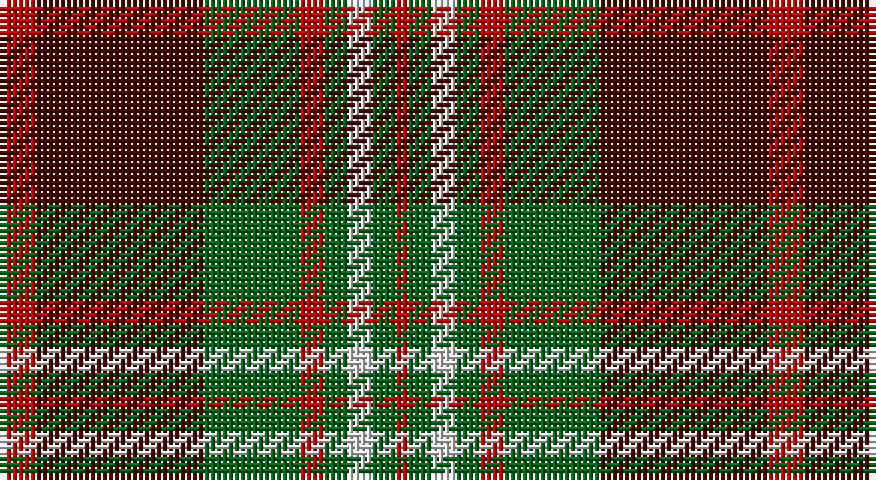

This page is one **sett** — a single exact thread-count. It belongs to the [tartan](/setts/r3dr14g8r2g2w2g2r1/)
(the same proportion at any scale), whose colour order is pattern [RBGRGWGR](/stripes/rbgrgwgr/).

Part of the [Scott Hunting](/tartans/scott-hunting/) tartan — the named design grouping this sett with its other cloths.

Sourced from house-of-tartan.  It is a [8 stripe tartan](/stripes/stripes8/).

Original link http://www.house-of-tartan.scotland.net/house/TartanViewjs.asp?colr=Def&tnam=1546

## Provenance

Earliest known date: 1906 Also known as Green Scott, this tartan is generally available today. The Chief of the Scotts is His Grace the 9th Duke of Buccleuch and 10th of Queensberry who lives in Selkirk in the borders region of Scotland.

## Also known as

This cloth is also recorded under:

- Scott Htg
- Scott, hunting

## Thread count
R/6 DR28 G16 R4 G4 LN4 G4 R/2

One full sett is **128 threads**.

## Palette

Palette: <strong>Tartan Register</strong> <small style="color:#888">(3 of 4 colours)</small>
<table><thead><tr><th>Colour</th><th>Threads</th><th>Shade</th><th>Base</th><th>OKLCh</th></tr></thead><tbody><tr><td>R/</td><td style="text-align:right;font-variant-numeric:tabular-nums">6</td><td><code style="background-color:#C80000;">#C80000</code> <small style="color:#888">#C80000</small></td><td>R <code style="background-color:#CC0000;">#CC0000</code></td><td><small style="color:#888">oklch(52.3% 0.215 29.2)</small></td></tr><tr><td>DR</td><td style="text-align:right;font-variant-numeric:tabular-nums">28</td><td><code style="background-color:#480800;">#480800</code> <small style="color:#888">#480800</small></td><td>B <code style="background-color:#2A418A;">#2A418A</code></td><td><small style="color:#888">oklch(26.1% 0.096 33.1)</small></td></tr><tr><td>G</td><td style="text-align:right;font-variant-numeric:tabular-nums">16</td><td><code style="background-color:#006818;">#006818</code> <small style="color:#888">#006818</small></td><td>G <code style="background-color:#006100;">#006100</code></td><td><small style="color:#888">oklch(45.0% 0.142 145.0)</small></td></tr><tr><td>R</td><td style="text-align:right;font-variant-numeric:tabular-nums">4</td><td><code style="background-color:#C80000;">#C80000</code> <small style="color:#888">#C80000</small></td><td>R <code style="background-color:#CC0000;">#CC0000</code></td><td><small style="color:#888">oklch(52.3% 0.215 29.2)</small></td></tr><tr><td>G</td><td style="text-align:right;font-variant-numeric:tabular-nums">4</td><td><code style="background-color:#006818;">#006818</code> <small style="color:#888">#006818</small></td><td>G <code style="background-color:#006100;">#006100</code></td><td><small style="color:#888">oklch(45.0% 0.142 145.0)</small></td></tr><tr><td>LN</td><td style="text-align:right;font-variant-numeric:tabular-nums">4</td><td><code style="background-color:#E0E0E0;">#E0E0E0</code> <small style="color:#888">#E0E0E0</small></td><td>W <code style="background-color:#F7F7F7;">#F7F7F7</code></td><td><small style="color:#888">oklch(90.7% 0.000 89.9)</small></td></tr><tr><td>G</td><td style="text-align:right;font-variant-numeric:tabular-nums">4</td><td><code style="background-color:#006818;">#006818</code> <small style="color:#888">#006818</small></td><td>G <code style="background-color:#006100;">#006100</code></td><td><small style="color:#888">oklch(45.0% 0.142 145.0)</small></td></tr><tr><td>R/</td><td style="text-align:right;font-variant-numeric:tabular-nums">2</td><td><code style="background-color:#C80000;">#C80000</code> <small style="color:#888">#C80000</small></td><td>R <code style="background-color:#CC0000;">#CC0000</code></td><td><small style="color:#888">oklch(52.3% 0.215 29.2)</small></td></tr></tbody></table>

# Sample pattern

## Compared to the master

This cloth is one sett of its design; the master sett (the exemplar the design is anchored on) is below for comparison.

<figure style="margin:0"><figcaption style="color:#888;font-size:smaller">this sett</figcaption></figure>
<figure style="margin:0"><figcaption style="color:#888;font-size:smaller"><a href="/setts/dy16g10r3g3lb2g3r3g3lb2g3r3g10dy16r3/">master sett →</a></figcaption></figure>

## Nearest tartans

The nearest existing variants by ΔTartan distance, with this tartan at the top so the swatches line up against it.

ΔTartan

Tartan

Sett

—

<a href="/ttd/edit/#slug=r3dr14g8r2g2w2g2r1~x2">Scott Hunting Clan Tartan</a> <a class="nn-out" href="/variants/s8/r3dr14g8r2g2w2g2r1~x2/" title="open its dictionary page">↗</a>

0.47

<a href="/ttd/edit/#slug=dgi12dg1dgi1dg1dgi1k5r10k1r2~x2&amp;base=r3dr14g8r2g2w2g2r1~x2">Lindsay #2</a> <a class="nn-out" href="/variants/s9/dgi12dg1dgi1dg1dgi1k5r10k1r2~x2/" title="open its dictionary page">↗</a>

0.56

<a href="/ttd/edit/#slug=dp8r3ly1r3dg14r3ly1~x4&amp;base=r3dr14g8r2g2w2g2r1~x2">Logan - 1819 (with yellow)</a> <a class="nn-out" href="/variants/s7/dp8r3ly1r3dg14r3ly1~x4/" title="open its dictionary page">↗</a>

0.70

<a href="/ttd/edit/#slug=g12k1g1k1g1ri5r10k1r2~x2&amp;base=r3dr14g8r2g2w2g2r1~x2">Lindsay</a> <a class="nn-out" href="/variants/s9/g12k1g1k1g1ri5r10k1r2~x2/" title="open its dictionary page">↗</a>

0.80

<a href="/ttd/edit/#slug=dg12g6dg6r15k1r1k2~x2&amp;base=r3dr14g8r2g2w2g2r1~x2">Cook (Name)</a> <a class="nn-out" href="/variants/s7/dg12g6dg6r15k1r1k2~x2/" title="open its dictionary page">↗</a>

0.83

<a href="/ttd/edit/#slug=k3r8k3r8lo19r7dt36r3~x2&amp;base=r3dr14g8r2g2w2g2r1~x2">Private SA Club</a> <a class="nn-out" href="/variants/s8/k3r8k3r8lo19r7dt36r3~x2/" title="open its dictionary page">↗</a>

0.83

<a href="/ttd/edit/#slug=k15dg1k3r9dg1r3lo11k1~x4&amp;base=r3dr14g8r2g2w2g2r1~x2">Island of Innis, The</a> <a class="nn-out" href="/variants/s8/k15dg1k3r9dg1r3lo11k1~x4/" title="open its dictionary page">↗</a>

0.86

<a href="/ttd/edit/#slug=k6r2dg17r16k1t2~x2&amp;base=r3dr14g8r2g2w2g2r1~x2">Unidentified #15</a> <a class="nn-out" href="/variants/s6/k6r2dg17r16k1t2~x2/" title="open its dictionary page">↗</a>

0.87

<a href="/ttd/edit/#slug=dp8r3ly1r3g14r3ly1~x4&amp;base=r3dr14g8r2g2w2g2r1~x2">Logan with Yellow</a> <a class="nn-out" href="/variants/s7/dp8r3ly1r3g14r3ly1~x4/" title="open its dictionary page">↗</a>

0.90

<a href="/ttd/edit/#slug=db3k5r2g2r3g12r6k1r3~x4&amp;base=r3dr14g8r2g2w2g2r1~x2">Fulton (1999) (Name)</a> <a class="nn-out" href="/variants/s9/db3k5r2g2r3g12r6k1r3~x4/" title="open its dictionary page">↗</a>

0.90

<a href="/ttd/edit/#slug=r30db3r2db3r6db14g26gi6&amp;base=r3dr14g8r2g2w2g2r1~x2">Cranston Dress Family Tartan</a> <a class="nn-out" href="/variants/s8/r30db3r2db3r6db14g26gi6/" title="open its dictionary page">↗</a>

## Neighbour map

Every grey dot is one of 14360 variants placed by the first two principal components of the ΔTartan feature space (44% of its variance). Red is this tartan; blue dots are its nearest — click one to open its page.

<svg viewBox="0 0 640 380" role="img" style="max-width:100%;height:auto;border:1px solid #e0e0e0;border-radius:4px;display:block" xmlns="http://www.w3.org/2000/svg"><image href="/nn/cloud.v1.png" width="640" height="380"/><a href="/variants/s9/dgi12dg1dgi1dg1dgi1k5r10k1r2~x2/"><circle cx="246.9" cy="167.8" r="4" fill="#3465a4"><title>Lindsay #2</title></circle></a><a href="/variants/s7/dp8r3ly1r3dg14r3ly1~x4/"><circle cx="248.0" cy="181.0" r="4" fill="#3465a4"><title>Logan - 1819 (with yellow)</title></circle></a><a href="/variants/s9/g12k1g1k1g1ri5r10k1r2~x2/"><circle cx="234.4" cy="158.9" r="4" fill="#3465a4"><title>Lindsay</title></circle></a><a href="/variants/s7/dg12g6dg6r15k1r1k2~x2/"><circle cx="252.7" cy="191.8" r="4" fill="#3465a4"><title>Cook (Name)</title></circle></a><a href="/variants/s8/k3r8k3r8lo19r7dt36r3~x2/"><circle cx="229.0" cy="173.9" r="4" fill="#3465a4"><title>Private SA Club</title></circle></a><a href="/variants/s8/k15dg1k3r9dg1r3lo11k1~x4/"><circle cx="232.9" cy="163.7" r="4" fill="#3465a4"><title>Island of Innis, The</title></circle></a><a href="/variants/s6/k6r2dg17r16k1t2~x2/"><circle cx="258.0" cy="179.2" r="4" fill="#3465a4"><title>Unidentified #15</title></circle></a><a href="/variants/s7/dp8r3ly1r3g14r3ly1~x4/"><circle cx="246.7" cy="178.7" r="4" fill="#3465a4"><title>Logan with Yellow</title></circle></a><a href="/variants/s9/db3k5r2g2r3g12r6k1r3~x4/"><circle cx="209.4" cy="191.2" r="4" fill="#3465a4"><title>Fulton (1999) (Name)</title></circle></a><a href="/variants/s8/r30db3r2db3r6db14g26gi6/"><circle cx="236.2" cy="167.0" r="4" fill="#3465a4"><title>Cranston Dress Family Tartan</title></circle></a><circle cx="245.5" cy="171.8" r="5" fill="#c00000"/></svg>

ID: /variants/s8/r3dr14g8r2g2w2g2r1~x2/
