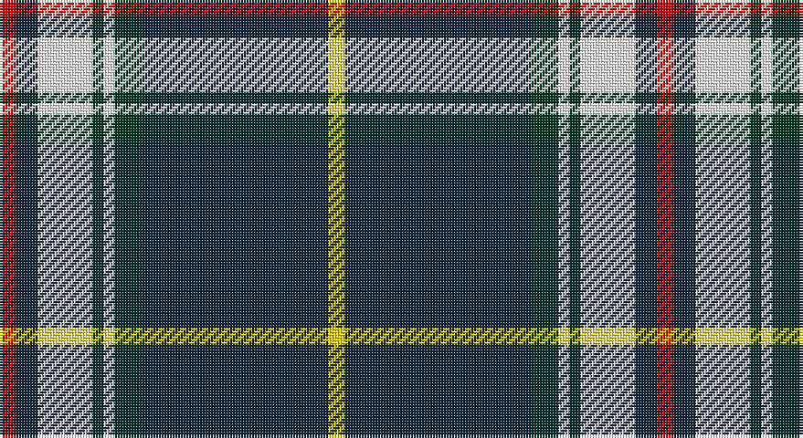

This page is one **sett** — a single exact thread-count. It belongs to the [tartan](/setts/r3dt4w10dg2w2dg5dt34ly3/)
(the same proportion at any scale), whose colour order is pattern [RBWGWGBY](/stripes/rbwgwgby/).

Part of the [Royal Troon Golf Club, The](/tartans/royal-troon-golf-club-the/) tartan — the named design grouping this sett with its other cloths.

Sourced from register-of-tartans.  It is a [8 stripe tartan](/stripes/stripes8/).

Original link https://www.tartanregister.gov.uk/tartanDetails.aspx?ref=11094

## Register references

External register numbers recorded for this tartan.

- Scottish Register of Tartans: [11094](https://www.tartanregister.gov.uk/tartanDetails.aspx?ref=11094)

## Thread count
R/6 DN8 W20 DG4 W4 DG10 DN68 Y/6

One full sett is **240 threads**.

## Palette

Palette: <strong>Tartan Register</strong>
<table><thead><tr><th>Colour</th><th>Threads</th><th>Shade</th><th>Base</th><th>OKLCh</th></tr></thead><tbody><tr><td>R/</td><td style="text-align:right;font-variant-numeric:tabular-nums">6</td><td><code style="background-color:#DC0000;">#DC0000</code> <small style="color:#888">#DC0000</small></td><td>R <code style="background-color:#CC0000;">#CC0000</code></td><td><small style="color:#888">oklch(56.2% 0.230 29.2)</small></td></tr><tr><td>DN</td><td style="text-align:right;font-variant-numeric:tabular-nums">8</td><td><code style="background-color:#14283C;">#14283C</code> <small style="color:#888">#14283C</small></td><td>B <code style="background-color:#2A418A;">#2A418A</code></td><td><small style="color:#888">oklch(27.1% 0.046 249.9)</small></td></tr><tr><td>W</td><td style="text-align:right;font-variant-numeric:tabular-nums">20</td><td><code style="background-color:#FFFFFF;">#FFFFFF</code> <small style="color:#888">#FFFFFF</small></td><td>W <code style="background-color:#F7F7F7;">#F7F7F7</code></td><td><small style="color:#888">oklch(100.0% 0.000 89.9)</small></td></tr><tr><td>DG</td><td style="text-align:right;font-variant-numeric:tabular-nums">4</td><td><code style="background-color:#003820;">#003820</code> <small style="color:#888">#003820</small></td><td>G <code style="background-color:#006100;">#006100</code></td><td><small style="color:#888">oklch(30.0% 0.070 158.3)</small></td></tr><tr><td>W</td><td style="text-align:right;font-variant-numeric:tabular-nums">4</td><td><code style="background-color:#FFFFFF;">#FFFFFF</code> <small style="color:#888">#FFFFFF</small></td><td>W <code style="background-color:#F7F7F7;">#F7F7F7</code></td><td><small style="color:#888">oklch(100.0% 0.000 89.9)</small></td></tr><tr><td>DG</td><td style="text-align:right;font-variant-numeric:tabular-nums">10</td><td><code style="background-color:#003820;">#003820</code> <small style="color:#888">#003820</small></td><td>G <code style="background-color:#006100;">#006100</code></td><td><small style="color:#888">oklch(30.0% 0.070 158.3)</small></td></tr><tr><td>DN</td><td style="text-align:right;font-variant-numeric:tabular-nums">68</td><td><code style="background-color:#14283C;">#14283C</code> <small style="color:#888">#14283C</small></td><td>B <code style="background-color:#2A418A;">#2A418A</code></td><td><small style="color:#888">oklch(27.1% 0.046 249.9)</small></td></tr><tr><td>Y/</td><td style="text-align:right;font-variant-numeric:tabular-nums">6</td><td><code style="background-color:#FFD700;">#FFD700</code> <small style="color:#888">#FFD700</small></td><td>Y <code style="background-color:#F2BF00;">#F2BF00</code></td><td><small style="color:#888">oklch(88.7% 0.182 95.3)</small></td></tr></tbody></table>

# Sample pattern

## Nearest tartans

The nearest existing variants by ΔTartan distance, with this tartan at the top so the swatches line up against it.

ΔTartan

Tartan

Sett

—

<a href="/ttd/edit/#slug=r3dt4w10dg2w2dg5dt34ly3~x2">Royal Troon Golf Club, The</a> <a class="nn-out" href="/variants/s8/r3dt4w10dg2w2dg5dt34ly3~x2/" title="open its dictionary page">↗</a>

1.03

<a href="/ttd/edit/#slug=r3g2k9lr2k2lr24ly2lr2ly1~x4&amp;base=r3dt4w10dg2w2dg5dt34ly3~x2">Bell of the Borders</a> <a class="nn-out" href="/variants/s9/r3g2k9lr2k2lr24ly2lr2ly1~x4/" title="open its dictionary page">↗</a>

1.15

<a href="/ttd/edit/#slug=db4r2db39k11g2w16r2~x2&amp;base=r3dt4w10dg2w2dg5dt34ly3~x2">Sinclair, The Jack</a> <a class="nn-out" href="/variants/s7/db4r2db39k11g2w16r2~x2/" title="open its dictionary page">↗</a>

1.18

<a href="/ttd/edit/#slug=k2r1ly1y8k15y2dp1~x4&amp;base=r3dt4w10dg2w2dg5dt34ly3~x2">Coalfields Regeneration Trust, The</a> <a class="nn-out" href="/variants/s7/k2r1ly1y8k15y2dp1~x4/" title="open its dictionary page">↗</a>

1.18

<a href="/ttd/edit/#slug=r5w4lg6db2dg43db2lg4r3~x2&amp;base=r3dt4w10dg2w2dg5dt34ly3~x2">Mullikin (2013)</a> <a class="nn-out" href="/variants/s8/r5w4lg6db2dg43db2lg4r3~x2/" title="open its dictionary page">↗</a>

1.19

<a href="/ttd/edit/#slug=r3g2k9b2k2b24ly2b2ly1~x2&amp;base=r3dt4w10dg2w2dg5dt34ly3~x2">Bell of the Borders.</a> <a class="nn-out" href="/variants/s9/r3g2k9b2k2b24ly2b2ly1~x2/" title="open its dictionary page">↗</a>

1.22

<a href="/ttd/edit/#slug=ly8k2dt20t4w1k2~x4&amp;base=r3dt4w10dg2w2dg5dt34ly3~x2">Solberg-Bell</a> <a class="nn-out" href="/variants/s6/ly8k2dt20t4w1k2~x4/" title="open its dictionary page">↗</a>

1.23

<a href="/ttd/edit/#slug=k37r4w9k2w2o9k4w2k2dy2~x2&amp;base=r3dt4w10dg2w2dg5dt34ly3~x2">Stuart/Stewart navy</a> <a class="nn-out" href="/variants/s10/k37r4w9k2w2o9k4w2k2dy2~x2/" title="open its dictionary page">↗</a>

1.23

<a href="/ttd/edit/#slug=w8k1db2k4ly2k2ly2k24w8k2~x2&amp;base=r3dt4w10dg2w2dg5dt34ly3~x2">Newcastle</a> <a class="nn-out" href="/variants/s10/w8k1db2k4ly2k2ly2k24w8k2~x2/" title="open its dictionary page">↗</a>

1.24

<a href="/ttd/edit/#slug=k62w10ly10k4w18k4lo3w4&amp;base=r3dt4w10dg2w2dg5dt34ly3~x2">Colbert Check (Fashion)</a> <a class="nn-out" href="/variants/s8/k62w10ly10k4w18k4lo3w4/" title="open its dictionary page">↗</a>

1.27

<a href="/ttd/edit/#slug=w4k2w16k4w4k37dg12k4ly4~x2&amp;base=r3dt4w10dg2w2dg5dt34ly3~x2">Gordon Dress (MacGregor-Hastie)</a> <a class="nn-out" href="/variants/s9/w4k2w16k4w4k37dg12k4ly4~x2/" title="open its dictionary page">↗</a>

## Neighbour map

Every grey dot is one of 14360 variants placed by the first two principal components of the ΔTartan feature space (44% of its variance). Red is this tartan; blue dots are its nearest — click one to open its page.

<svg viewBox="0 0 640 380" role="img" style="max-width:100%;height:auto;border:1px solid #e0e0e0;border-radius:4px;display:block" xmlns="http://www.w3.org/2000/svg"><image href="/nn/cloud.v1.png" width="640" height="380"/><a href="/variants/s9/r3g2k9lr2k2lr24ly2lr2ly1~x4/"><circle cx="307.9" cy="92.2" r="4" fill="#3465a4"><title>Bell of the Borders</title></circle></a><a href="/variants/s7/db4r2db39k11g2w16r2~x2/"><circle cx="284.1" cy="128.7" r="4" fill="#3465a4"><title>Sinclair, The Jack</title></circle></a><a href="/variants/s7/k2r1ly1y8k15y2dp1~x4/"><circle cx="310.0" cy="150.1" r="4" fill="#3465a4"><title>Coalfields Regeneration Trust, The</title></circle></a><a href="/variants/s8/r5w4lg6db2dg43db2lg4r3~x2/"><circle cx="353.7" cy="115.7" r="4" fill="#3465a4"><title>Mullikin (2013)</title></circle></a><a href="/variants/s9/r3g2k9b2k2b24ly2b2ly1~x2/"><circle cx="316.7" cy="96.5" r="4" fill="#3465a4"><title>Bell of the Borders.</title></circle></a><a href="/variants/s6/ly8k2dt20t4w1k2~x4/"><circle cx="266.2" cy="141.7" r="4" fill="#3465a4"><title>Solberg-Bell</title></circle></a><a href="/variants/s10/k37r4w9k2w2o9k4w2k2dy2~x2/"><circle cx="319.3" cy="106.1" r="4" fill="#3465a4"><title>Stuart/Stewart navy</title></circle></a><a href="/variants/s10/w8k1db2k4ly2k2ly2k24w8k2~x2/"><circle cx="330.6" cy="116.1" r="4" fill="#3465a4"><title>Newcastle</title></circle></a><a href="/variants/s8/k62w10ly10k4w18k4lo3w4/"><circle cx="338.6" cy="124.0" r="4" fill="#3465a4"><title>Colbert Check (Fashion)</title></circle></a><a href="/variants/s9/w4k2w16k4w4k37dg12k4ly4~x2/"><circle cx="275.4" cy="136.7" r="4" fill="#3465a4"><title>Gordon Dress (MacGregor-Hastie)</title></circle></a><circle cx="302.0" cy="119.4" r="5" fill="#c00000"/></svg>

ID: /variants/s8/r3dt4w10dg2w2dg5dt34ly3~x2/
