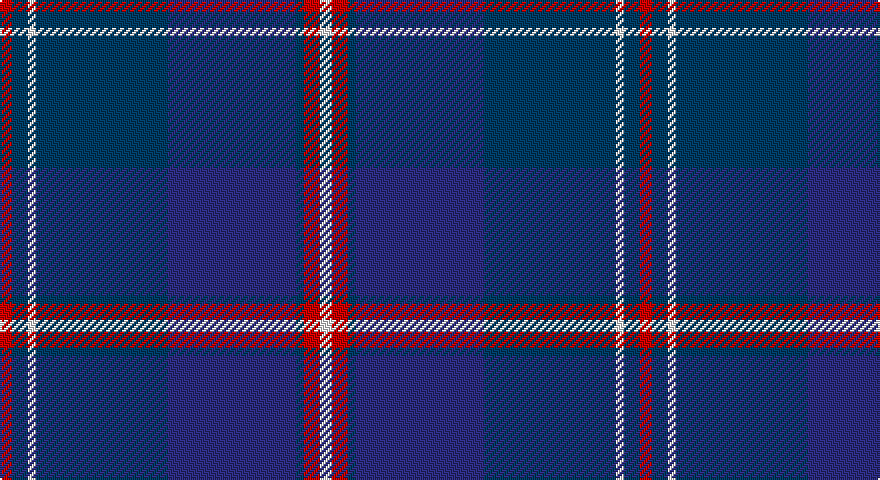

This page is one **sett** — a single exact thread-count. It belongs to the [tartan](/setts/r3dt4w2dt33db32dt2r4w3/)
(the same proportion at any scale), whose colour order is pattern [RBWBBBRW](/stripes/rbwbbbrw/).

Sourced from tartans-authority.  It is a [8 stripe tartan](/stripes/stripes8/).

Original link http://www.tartansauthority.com/tartan-ferret/display/6826/

## Also known as

This cloth is also recorded under:

- B.A.B.C.

## Register references

External register numbers recorded for this tartan.

- Scottish Tartans Authority (ITI): 6826

## Thread count
R/6 DB8 W4 DB66 DBa64 DB4 R8 W/6

One full sett is **320 threads**.

## Palette

Palette: <strong>Tartan Register</strong>
<table><thead><tr><th>Colour</th><th>Threads</th><th>Shade</th><th>Base</th><th>OKLCh</th></tr></thead><tbody><tr><td>R/</td><td style="text-align:right;font-variant-numeric:tabular-nums">6</td><td><code style="background-color:#C80000;">#C80000</code> <small style="color:#888">#C80000</small></td><td>R <code style="background-color:#CC0000;">#CC0000</code></td><td><small style="color:#888">oklch(52.3% 0.215 29.2)</small></td></tr><tr><td>DB</td><td style="text-align:right;font-variant-numeric:tabular-nums">8</td><td><code style="background-color:#003C64;">#003C64</code> <small style="color:#888">#003C64</small></td><td>B <code style="background-color:#2A418A;">#2A418A</code></td><td><small style="color:#888">oklch(34.5% 0.089 246.0)</small></td></tr><tr><td>W</td><td style="text-align:right;font-variant-numeric:tabular-nums">4</td><td><code style="background-color:#F8F8F8;">#F8F8F8</code> <small style="color:#888">#F8F8F8</small></td><td>W <code style="background-color:#F7F7F7;">#F7F7F7</code></td><td><small style="color:#888">oklch(97.9% 0.000 89.9)</small></td></tr><tr><td>DB</td><td style="text-align:right;font-variant-numeric:tabular-nums">66</td><td><code style="background-color:#003C64;">#003C64</code> <small style="color:#888">#003C64</small></td><td>B <code style="background-color:#2A418A;">#2A418A</code></td><td><small style="color:#888">oklch(34.5% 0.089 246.0)</small></td></tr><tr><td>DBa</td><td style="text-align:right;font-variant-numeric:tabular-nums">64</td><td><code style="background-color:#2C2C80;">#2C2C80</code> <small style="color:#888">#2C2C80</small></td><td>B <code style="background-color:#2A418A;">#2A418A</code></td><td><small style="color:#888">oklch(35.0% 0.138 276.6)</small></td></tr><tr><td>DB</td><td style="text-align:right;font-variant-numeric:tabular-nums">4</td><td><code style="background-color:#003C64;">#003C64</code> <small style="color:#888">#003C64</small></td><td>B <code style="background-color:#2A418A;">#2A418A</code></td><td><small style="color:#888">oklch(34.5% 0.089 246.0)</small></td></tr><tr><td>R</td><td style="text-align:right;font-variant-numeric:tabular-nums">8</td><td><code style="background-color:#C80000;">#C80000</code> <small style="color:#888">#C80000</small></td><td>R <code style="background-color:#CC0000;">#CC0000</code></td><td><small style="color:#888">oklch(52.3% 0.215 29.2)</small></td></tr><tr><td>W/</td><td style="text-align:right;font-variant-numeric:tabular-nums">6</td><td><code style="background-color:#F8F8F8;">#F8F8F8</code> <small style="color:#888">#F8F8F8</small></td><td>W <code style="background-color:#F7F7F7;">#F7F7F7</code></td><td><small style="color:#888">oklch(97.9% 0.000 89.9)</small></td></tr></tbody></table>

# Sample pattern

## Nearest tartans

The nearest existing variants by ΔTartan distance, with this tartan at the top so the swatches line up against it.

ΔTartan

Tartan

Sett

—

<a href="/ttd/edit/#slug=r3dt4w2dt33db32dt2r4w3~x2">B.A.B.C. (Corporate)</a> <a class="nn-out" href="/variants/s8/r3dt4w2dt33db32dt2r4w3~x2/" title="open its dictionary page">↗</a>

0.00

<a href="/ttd/edit/#slug=r3dt4w2dt33db32dt2r4w3&amp;base=r3dt4w2dt33db32dt2r4w3~x2">BABC</a> <a class="nn-out" href="/variants/s8/r3dt4w2dt33db32dt2r4w3/" title="open its dictionary page">↗</a>

1.27

<a href="/ttd/edit/#slug=db32k3db4k3db4k11dt4k2w3k2dt11~x2&amp;base=r3dt4w2dt33db32dt2r4w3~x2">Dawson-Nunes (Personal)</a> <a class="nn-out" href="/variants/s11/db32k3db4k3db4k11dt4k2w3k2dt11~x2/" title="open its dictionary page">↗</a>

1.31

<a href="/ttd/edit/#slug=r2db34k2lb2k2n30db3n6r2~x2&amp;base=r3dt4w2dt33db32dt2r4w3~x2">Wcwm 1475-2</a> <a class="nn-out" href="/variants/s9/r2db34k2lb2k2n30db3n6r2~x2/" title="open its dictionary page">↗</a>

1.41

<a href="/ttd/edit/#slug=dg3k3db2k16db2k2db24lb2~x2&amp;base=r3dt4w2dt33db32dt2r4w3~x2">Auckland (Fashion)</a> <a class="nn-out" href="/variants/s8/dg3k3db2k16db2k2db24lb2~x2/" title="open its dictionary page">↗</a>

1.44

<a href="/ttd/edit/#slug=lo1b12k6db1k1db1k1db6lo1~x4&amp;base=r3dt4w2dt33db32dt2r4w3~x2">Elgin City Band</a> <a class="nn-out" href="/variants/s9/lo1b12k6db1k1db1k1db6lo1~x4/" title="open its dictionary page">↗</a>

1.46

<a href="/ttd/edit/#slug=db8r2db33dt15g12lo2g2r2~x2&amp;base=r3dt4w2dt33db32dt2r4w3~x2">Moray Council</a> <a class="nn-out" href="/variants/s8/db8r2db33dt15g12lo2g2r2~x2/" title="open its dictionary page">↗</a>

1.50

<a href="/ttd/edit/#slug=k4db36k4db4k34b3k3w4~x2&amp;base=r3dt4w2dt33db32dt2r4w3~x2">Slanj Dress (Corporate)</a> <a class="nn-out" href="/variants/s8/k4db36k4db4k34b3k3w4~x2/" title="open its dictionary page">↗</a>

1.51

<a href="/ttd/edit/#slug=w2r3dbi12db3dbi3db28r3db3ly2~x2&amp;base=r3dt4w2dt33db32dt2r4w3~x2">Royal Scottish Corporation</a> <a class="nn-out" href="/variants/s9/w2r3dbi12db3dbi3db28r3db3ly2~x2/" title="open its dictionary page">↗</a>

1.51

<a href="/ttd/edit/#slug=db6lb2db2lb3db16b26r2~x2&amp;base=r3dt4w2dt33db32dt2r4w3~x2">Federal Bureau of Investigation</a> <a class="nn-out" href="/variants/s7/db6lb2db2lb3db16b26r2~x2/" title="open its dictionary page">↗</a>

1.51

<a href="/ttd/edit/#slug=dbi26db3dbi1m2dbi1db3dbi3db12g14dbi2w2~x2&amp;base=r3dt4w2dt33db32dt2r4w3~x2">Royal Highland Yacht Club (Corporate</a> <a class="nn-out" href="/variants/s11/dbi26db3dbi1m2dbi1db3dbi3db12g14dbi2w2~x2/" title="open its dictionary page">↗</a>

## Neighbour map

Every grey dot is one of 14360 variants placed by the first two principal components of the ΔTartan feature space (44% of its variance). Red is this tartan; blue dots are its nearest — click one to open its page.

<svg viewBox="0 0 640 380" role="img" style="max-width:100%;height:auto;border:1px solid #e0e0e0;border-radius:4px;display:block" xmlns="http://www.w3.org/2000/svg"><image href="/nn/cloud.v1.png" width="640" height="380"/><a href="/variants/s8/r3dt4w2dt33db32dt2r4w3/"><circle cx="325.6" cy="178.3" r="4" fill="#3465a4"><title>BABC</title></circle></a><a href="/variants/s11/db32k3db4k3db4k11dt4k2w3k2dt11~x2/"><circle cx="345.4" cy="184.5" r="4" fill="#3465a4"><title>Dawson-Nunes (Personal)</title></circle></a><a href="/variants/s9/r2db34k2lb2k2n30db3n6r2~x2/"><circle cx="317.6" cy="151.7" r="4" fill="#3465a4"><title>Wcwm 1475-2</title></circle></a><a href="/variants/s8/dg3k3db2k16db2k2db24lb2~x2/"><circle cx="362.0" cy="205.8" r="4" fill="#3465a4"><title>Auckland (Fashion)</title></circle></a><a href="/variants/s9/lo1b12k6db1k1db1k1db6lo1~x4/"><circle cx="241.5" cy="184.2" r="4" fill="#3465a4"><title>Elgin City Band</title></circle></a><a href="/variants/s8/db8r2db33dt15g12lo2g2r2~x2/"><circle cx="326.8" cy="181.4" r="4" fill="#3465a4"><title>Moray Council</title></circle></a><a href="/variants/s8/k4db36k4db4k34b3k3w4~x2/"><circle cx="348.3" cy="203.3" r="4" fill="#3465a4"><title>Slanj Dress (Corporate)</title></circle></a><a href="/variants/s9/w2r3dbi12db3dbi3db28r3db3ly2~x2/"><circle cx="341.2" cy="156.7" r="4" fill="#3465a4"><title>Royal Scottish Corporation</title></circle></a><a href="/variants/s7/db6lb2db2lb3db16b26r2~x2/"><circle cx="288.2" cy="191.5" r="4" fill="#3465a4"><title>Federal Bureau of Investigation</title></circle></a><a href="/variants/s11/dbi26db3dbi1m2dbi1db3dbi3db12g14dbi2w2~x2/"><circle cx="315.6" cy="142.4" r="4" fill="#3465a4"><title>Royal Highland Yacht Club (Corporate</title></circle></a><circle cx="325.6" cy="178.3" r="5" fill="#c00000"/></svg>

ID: /variants/s8/r3dt4w2dt33db32dt2r4w3~x2/
