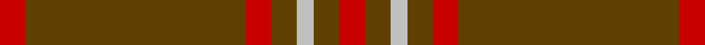
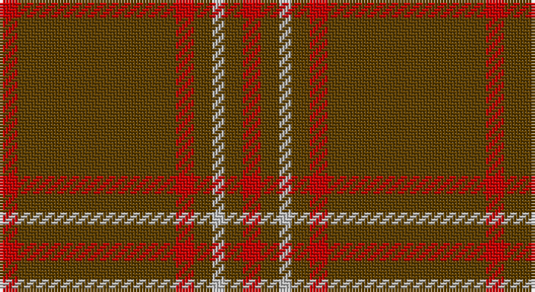

This page is one **sett** — a single exact thread-count. It belongs to the [tartan](/setts/r3dy16dy10r3dy3lb2dy3r3/)
(the same proportion at any scale), whose colour order is pattern [RGGRGWGR](/stripes/rggrgwgr/).

Part of the [Scott Hunting](/tartans/scott-hunting/) tartan — the named design grouping this sett with its other cloths.

Sourced from tartans-authority.  It is a [8 stripe tartan](/stripes/stripes8/).

Original link http://www.tartansauthority.com/tartan-ferret/display/8838/

## Also known as

This cloth is also recorded under:

- Scott Htg
- Scott, hunting

## Register references

External register numbers recorded for this tartan.

- Scottish Register of Tartans: [8838](https://www.tartanregister.gov.uk/tartanDetails?ref=8838)
- Scottish Tartans Authority (ITI): 8838

## Thread count
R/6 T32 T20 R6 T6 N4 T6 R/6

One full sett is **160 threads**.

## Palette

Palette: <strong>Tartan Register</strong>
<table><thead><tr><th>Colour</th><th>Threads</th><th>Shade</th><th>Base</th><th>OKLCh</th></tr></thead><tbody><tr><td>R/</td><td style="text-align:right;font-variant-numeric:tabular-nums">6</td><td><code style="background-color:#C80000;">#C80000</code> <small style="color:#888">#C80000</small></td><td>R <code style="background-color:#CC0000;">#CC0000</code></td><td><small style="color:#888">oklch(52.3% 0.215 29.2)</small></td></tr><tr><td>T</td><td style="text-align:right;font-variant-numeric:tabular-nums">32</td><td><code style="background-color:#604000;">#604000</code> <small style="color:#888">#604000</small></td><td>G <code style="background-color:#006100;">#006100</code></td><td><small style="color:#888">oklch(39.8% 0.083 76.8)</small></td></tr><tr><td>T</td><td style="text-align:right;font-variant-numeric:tabular-nums">20</td><td><code style="background-color:#604000;">#604000</code> <small style="color:#888">#604000</small></td><td>G <code style="background-color:#006100;">#006100</code></td><td><small style="color:#888">oklch(39.8% 0.083 76.8)</small></td></tr><tr><td>R</td><td style="text-align:right;font-variant-numeric:tabular-nums">6</td><td><code style="background-color:#C80000;">#C80000</code> <small style="color:#888">#C80000</small></td><td>R <code style="background-color:#CC0000;">#CC0000</code></td><td><small style="color:#888">oklch(52.3% 0.215 29.2)</small></td></tr><tr><td>T</td><td style="text-align:right;font-variant-numeric:tabular-nums">6</td><td><code style="background-color:#604000;">#604000</code> <small style="color:#888">#604000</small></td><td>G <code style="background-color:#006100;">#006100</code></td><td><small style="color:#888">oklch(39.8% 0.083 76.8)</small></td></tr><tr><td>N</td><td style="text-align:right;font-variant-numeric:tabular-nums">4</td><td><code style="background-color:#C0C0C0;">#C0C0C0</code> <small style="color:#888">#C0C0C0</small></td><td>W <code style="background-color:#F7F7F7;">#F7F7F7</code></td><td><small style="color:#888">oklch(80.8% 0.000 89.9)</small></td></tr><tr><td>T</td><td style="text-align:right;font-variant-numeric:tabular-nums">6</td><td><code style="background-color:#604000;">#604000</code> <small style="color:#888">#604000</small></td><td>G <code style="background-color:#006100;">#006100</code></td><td><small style="color:#888">oklch(39.8% 0.083 76.8)</small></td></tr><tr><td>R/</td><td style="text-align:right;font-variant-numeric:tabular-nums">6</td><td><code style="background-color:#C80000;">#C80000</code> <small style="color:#888">#C80000</small></td><td>R <code style="background-color:#CC0000;">#CC0000</code></td><td><small style="color:#888">oklch(52.3% 0.215 29.2)</small></td></tr></tbody></table>

# Sample pattern

## Compared to the master

This cloth is one sett of its design; the master sett (the exemplar the design is anchored on) is below for comparison.

<figure style="margin:0"><figcaption style="color:#888;font-size:smaller">this sett</figcaption></figure>
<figure style="margin:0"><figcaption style="color:#888;font-size:smaller"><a href="/setts/dy16g10r3g3lb2g3r3g3lb2g3r3g10dy16r3/">master sett →</a></figcaption></figure>

## Nearest tartans

The nearest existing variants by ΔTartan distance, with this tartan at the top so the swatches line up against it.

ΔTartan

Tartan

Sett

—

<a href="/ttd/edit/#slug=r3dy16dy10r3dy3lb2dy3r3~x2">Scott Htg (Error 2)</a> <a class="nn-out" href="/variants/s8/r3dy16dy10r3dy3lb2dy3r3~x2/" title="open its dictionary page">↗</a>

1.16

<a href="/ttd/edit/#slug=r8g2r2k1r1g2~x10&amp;base=r3dy16dy10r3dy3lb2dy3r3~x2">Waverley Care Aids Trust (Corporate)</a> <a class="nn-out" href="/variants/s6/r8g2r2k1r1g2~x10/" title="open its dictionary page">↗</a>

1.63

<a href="/variants/s10/dy9t3dy6t3dy20ly2~x2/">Oman, Sultanate of / Oliver dress</a>

1.65

<a href="/variants/s10/r8g2r2k1r1g2~x10/">Waverley Care Aids Trust</a>

1.71

<a href="/ttd/edit/#slug=dy9t3dy6t3dy20ly2~x2&amp;base=r3dy16dy10r3dy3lb2dy3r3~x2">Oman RAF, Sultanate of (Military)</a> <a class="nn-out" href="/variants/s6/dy9t3dy6t3dy20ly2~x2/" title="open its dictionary page">↗</a>

1.77

<a href="/ttd/edit/#slug=o5k2o28k10o26k4o4~x2&amp;base=r3dy16dy10r3dy3lb2dy3r3~x2">Dunbar, John Telfer (Personal)</a> <a class="nn-out" href="/variants/s7/o5k2o28k10o26k4o4~x2/" title="open its dictionary page">↗</a>

1.84

<a href="/variants/s12/k4dy2r2dy2k2dy15lo2~x4/">Welsh National #2</a>

1.87

<a href="/ttd/edit/#slug=r9k1r5g6r4k2~x4&amp;base=r3dy16dy10r3dy3lb2dy3r3~x2">MacAn of Lurgyvallan (Hose)</a> <a class="nn-out" href="/variants/s6/r9k1r5g6r4k2~x4/" title="open its dictionary page">↗</a>

1.91

<a href="/ttd/edit/#slug=y21r3y21db5y3r30y3db5y21r3y21db2~x2&amp;base=r3dy16dy10r3dy3lb2dy3r3~x2">Scottish Piping Society of London</a> <a class="nn-out" href="/variants/s12/y21r3y21db5y3r30y3db5y21r3y21db2~x2/" title="open its dictionary page">↗</a>

1.99

<a href="/ttd/edit/#slug=g4o4g13o13g4o36lo4~x2&amp;base=r3dy16dy10r3dy3lb2dy3r3~x2">Wolfe (Name)</a> <a class="nn-out" href="/variants/s7/g4o4g13o13g4o36lo4~x2/" title="open its dictionary page">↗</a>

2.01

<a href="/ttd/edit/#slug=r12g2r1g1r1g1r6g12r1k1r12k1r1k1r3~x4&amp;base=r3dy16dy10r3dy3lb2dy3r3~x2">MacDonell of Keppoch #3</a> <a class="nn-out" href="/variants/s15/r12g2r1g1r1g1r6g12r1k1r12k1r1k1r3~x4/" title="open its dictionary page">↗</a>

## Neighbour map

Every grey dot is one of 14360 variants placed by the first two principal components of the ΔTartan feature space (44% of its variance). Red is this tartan; blue dots are its nearest — click one to open its page.

<svg viewBox="0 0 640 380" role="img" style="max-width:100%;height:auto;border:1px solid #e0e0e0;border-radius:4px;display:block" xmlns="http://www.w3.org/2000/svg"><image href="/nn/cloud.v1.png" width="640" height="380"/><a href="/variants/s6/r8g2r2k1r1g2~x10/"><circle cx="470.6" cy="254.5" r="4" fill="#3465a4"><title>Waverley Care Aids Trust (Corporate)</title></circle></a><a href="/variants/s10/dy9t3dy6t3dy20ly2~x2/"><circle cx="560.4" cy="240.6" r="4" fill="#3465a4"><title>Oman, Sultanate of / Oliver dress</title></circle></a><a href="/variants/s10/r8g2r2k1r1g2~x10/"><circle cx="415.7" cy="230.1" r="4" fill="#3465a4"><title>Waverley Care Aids Trust</title></circle></a><a href="/variants/s6/dy9t3dy6t3dy20ly2~x2/"><circle cx="557.9" cy="256.6" r="4" fill="#3465a4"><title>Oman RAF, Sultanate of (Military)</title></circle></a><a href="/variants/s7/o5k2o28k10o26k4o4~x2/"><circle cx="601.1" cy="251.2" r="4" fill="#3465a4"><title>Dunbar, John Telfer (Personal)</title></circle></a><a href="/variants/s12/k4dy2r2dy2k2dy15lo2~x4/"><circle cx="455.1" cy="198.1" r="4" fill="#3465a4"><title>Welsh National #2</title></circle></a><a href="/variants/s6/r9k1r5g6r4k2~x4/"><circle cx="421.0" cy="277.9" r="4" fill="#3465a4"><title>MacAn of Lurgyvallan (Hose)</title></circle></a><a href="/variants/s12/y21r3y21db5y3r30y3db5y21r3y21db2~x2/"><circle cx="443.1" cy="208.1" r="4" fill="#3465a4"><title>Scottish Piping Society of London</title></circle></a><a href="/variants/s7/g4o4g13o13g4o36lo4~x2/"><circle cx="446.9" cy="215.3" r="4" fill="#3465a4"><title>Wolfe (Name)</title></circle></a><a href="/variants/s15/r12g2r1g1r1g1r6g12r1k1r12k1r1k1r3~x4/"><circle cx="465.2" cy="184.2" r="4" fill="#3465a4"><title>MacDonell of Keppoch #3</title></circle></a><circle cx="510.7" cy="252.6" r="5" fill="#c00000"/></svg>

ID: /variants/s8/r3dy16dy10r3dy3lb2dy3r3~x2/
