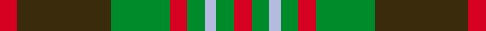

This page is one **sett** — a single exact thread-count. It belongs to the [tartan](/setts/r3dy16g10r3g3lb2g3r3/)
(the same proportion at any scale), whose colour order is pattern [RGGRGWGR](/stripes/rggrgwgr/).

Sourced from tartans-authority.  It is a [8 stripe tartan](/stripes/stripes8/).

Original link http://www.tartansauthority.com/tartan-ferret/display/1546/

## Register references

External register numbers recorded for this tartan.

- Scottish Tartans Authority (ITI): 1546

## Thread count
R/6 DY32 G20 R6 G6 LB4 G6 R/6

One full sett is **160 threads**.

## Palette
<table><thead><tr><th>Colour</th><th>Shade</th><th>OKLCh</th></tr></thead><tbody><tr><td>G</td><td><code style="background-color:#008B2A;">#008B2A</code> <small style="color:#888">#008B2A</small></td><td><small style="color:#888">oklch(55.4% 0.170 145.9)</small></td></tr><tr><td>N</td><td><code style="background-color:#B5BBDE;">#B5BBDE</code> <small style="color:#888">#B5BBDE</small></td><td><small style="color:#888">oklch(79.9% 0.050 277.6)</small></td></tr><tr><td>R</td><td><code style="background-color:#D60020;">#D60020</code> <small style="color:#888">#D60020</small></td><td><small style="color:#888">oklch(55.2% 0.224 25.5)</small></td></tr><tr><td>T</td><td><code style="background-color:#3A2B0D;">#3A2B0D</code> <small style="color:#888">#3A2B0D</small></td><td><small style="color:#888">oklch(30.0% 0.049 82.0)</small></td></tr></tbody></table>

# Sample pattern

## Nearest variants

The nearest existing variants by ΔTartan distance, with this cloth at the top so the swatches line up against it.

ΔTartan

Threads

Variant

Sett

—

160

<a href="/variants/s8/r3dy16g10r3g3lb2g3r3~x2/">Scott Htg (Clan)</a>

<a href="/ttd/edit/#slug=r2y1db8r1g7y1r2~x6&amp;base=r3dy16g10r3g3lb2g3r3~x2" title="compare in the TTD">2.97</a>

240

<a href="/variants/s7/r2y1db8r1g7y1r2~x6/">Cercle de Fermières de Saint-Élie d'Orford</a>

<a href="/ttd/edit/#slug=r2ly1t8r1g7ly1r2~x6&amp;base=r3dy16g10r3g3lb2g3r3~x2" title="compare in the TTD">2.97</a>

240

<a href="/variants/s7/r2ly1t8r1g7ly1r2~x6/">Cercle de Fermieres de St-Elie . . .</a>

## Neighbour map

Every grey dot is one of 13620 variants placed by the first two principal components of the ΔTartan feature space (42% of its variance). Red is this tartan; blue dots are its nearest — click one to open its page.

<svg viewBox="0 0 640 380" role="img" style="max-width:100%;height:auto;border:1px solid #e0e0e0;border-radius:4px;display:block" xmlns="http://www.w3.org/2000/svg"><image href="/nn/cloud.v1.png" width="640" height="380"/><a href="/variants/s7/r2y1db8r1g7y1r2~x6/"><circle cx="200.2" cy="214.4" r="4" fill="#3465a4"><title>Cercle de Fermières de Saint-Élie d'Orford</title></circle></a><a href="/variants/s7/r2ly1t8r1g7ly1r2~x6/"><circle cx="241.6" cy="233.7" r="4" fill="#3465a4"><title>Cercle de Fermieres de St-Elie . . .</title></circle></a><circle cx="221.2" cy="215.5" r="5" fill="#c00000"/><text x="320" y="376" text-anchor="middle" font-size="11" fill="#999">ground</text><text x="11" y="190" text-anchor="middle" font-size="11" fill="#999" transform="rotate(-90 11 190)">complexity</text></svg>

ID: /variants/s8/r3dy16g10r3g3lb2g3r3~x2/
