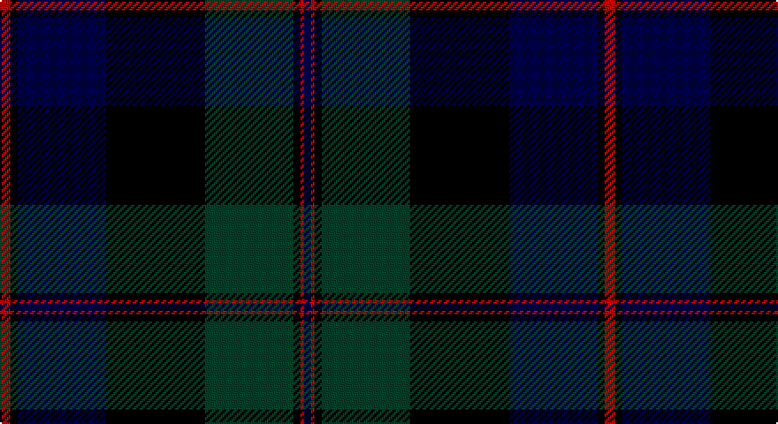

This page is one **sett** — a single exact thread-count. It belongs to the [tartan](/setts/r3k2db25k28dg25k2r1db2/)
(the same proportion at any scale), whose colour order is pattern [BRKGKBKR](/stripes/brkgkbkr/).

Sourced from register-of-tartans.  It is a [8 stripe tartan](/stripes/stripes8/).

Original link https://www.tartanregister.gov.uk/tartanDetails.aspx?ref=720

## Also known as

This cloth is also recorded under:

- Common Kilt

2 attestations — the source records this cloth was collapsed from (oldest owns this page)

<ul>
<li>01/01/1819 — Common Kilt (register-of-tartans, <a href="https://www.tartanregister.gov.uk/tartanDetails.aspx?ref=720">record</a>)</li>
<li>1819? — Common Kilt (Fashion) (tartans-authority, <a href="http://www.tartansauthority.com/tartan-ferret/display/554/">record</a>)</li>
</ul>

## Register references

External register numbers recorded for this tartan.

- Scottish Register of Tartans: [720](https://www.tartanregister.gov.uk/tartanDetails.aspx?ref=720)
- Scottish Tartans Authority (ITI): 554
- Scottish Tartans World Register: 554

## Thread count
R/6 K4 DB50 K56 DG50 K4 R2 DB/4

One full sett is **342 threads**.

## Palette

Palette: <strong>Tartan Register</strong> <small style="color:#888">(3 of 4 colours)</small>
<table><thead><tr><th>Colour</th><th>Threads</th><th>Shade</th><th>Base</th><th>OKLCh</th></tr></thead><tbody><tr><td>R/</td><td style="text-align:right;font-variant-numeric:tabular-nums">6</td><td><code style="background-color:#C80000;">#C80000</code> <small style="color:#888">#C80000</small></td><td>R <code style="background-color:#CC0000;">#CC0000</code></td><td><small style="color:#888">oklch(52.3% 0.215 29.2)</small></td></tr><tr><td>K</td><td style="text-align:right;font-variant-numeric:tabular-nums">4</td><td><code style="background-color:#000000;">#000000</code> <small style="color:#888">#000000</small></td><td>K <code style="background-color:#000000;">#000000</code></td><td><small style="color:#888">oklch(0.0% 0.000 0.0)</small></td></tr><tr><td>DB</td><td style="text-align:right;font-variant-numeric:tabular-nums">50</td><td><code style="background-color:#000048;">#000048</code> <small style="color:#888">#000048</small></td><td>B <code style="background-color:#2A418A;">#2A418A</code></td><td><small style="color:#888">oklch(18.2% 0.126 264.1)</small></td></tr><tr><td>K</td><td style="text-align:right;font-variant-numeric:tabular-nums">56</td><td><code style="background-color:#000000;">#000000</code> <small style="color:#888">#000000</small></td><td>K <code style="background-color:#000000;">#000000</code></td><td><small style="color:#888">oklch(0.0% 0.000 0.0)</small></td></tr><tr><td>DG</td><td style="text-align:right;font-variant-numeric:tabular-nums">50</td><td><code style="background-color:#044028;">#044028</code> <small style="color:#888">#044028</small></td><td>G <code style="background-color:#006100;">#006100</code></td><td><small style="color:#888">oklch(32.9% 0.072 160.0)</small></td></tr><tr><td>K</td><td style="text-align:right;font-variant-numeric:tabular-nums">4</td><td><code style="background-color:#000000;">#000000</code> <small style="color:#888">#000000</small></td><td>K <code style="background-color:#000000;">#000000</code></td><td><small style="color:#888">oklch(0.0% 0.000 0.0)</small></td></tr><tr><td>R</td><td style="text-align:right;font-variant-numeric:tabular-nums">2</td><td><code style="background-color:#C80000;">#C80000</code> <small style="color:#888">#C80000</small></td><td>R <code style="background-color:#CC0000;">#CC0000</code></td><td><small style="color:#888">oklch(52.3% 0.215 29.2)</small></td></tr><tr><td>DB/</td><td style="text-align:right;font-variant-numeric:tabular-nums">4</td><td><code style="background-color:#000048;">#000048</code> <small style="color:#888">#000048</small></td><td>B <code style="background-color:#2A418A;">#2A418A</code></td><td><small style="color:#888">oklch(18.2% 0.126 264.1)</small></td></tr></tbody></table>

# Sample pattern

## Nearest tartans

The nearest existing variants by ΔTartan distance, with this tartan at the top so the swatches line up against it.

ΔTartan

Tartan

Sett

—

<a href="/ttd/edit/#slug=r3k2db25k28dg25k2r1db2~x2">Common Kilt</a> <a class="nn-out" href="/variants/s8/r3k2db25k28dg25k2r1db2~x2/" title="open its dictionary page">↗</a>

1.13

<a href="/ttd/edit/#slug=dg1dg1r2dg21k11db21r2db1db1~x2&amp;base=r3k2db25k28dg25k2r1db2~x2">MacThomas</a> <a class="nn-out" href="/variants/s9/dg1dg1r2dg21k11db21r2db1db1~x2/" title="open its dictionary page">↗</a>

1.19

<a href="/ttd/edit/#slug=r3k2dg25k28db25k2r3~x2&amp;base=r3k2db25k28dg25k2r1db2~x2">Coarse Kilt</a> <a class="nn-out" href="/variants/s7/r3k2dg25k28db25k2r3~x2/" title="open its dictionary page">↗</a>

1.21

<a href="/ttd/edit/#slug=db28ly1db2k16dg24k1dg2r3~x2&amp;base=r3k2db25k28dg25k2r1db2~x2">Ogilvy VS</a> <a class="nn-out" href="/variants/s8/db28ly1db2k16dg24k1dg2r3~x2/" title="open its dictionary page">↗</a>

1.23

<a href="/ttd/edit/#slug=k10r4dg34db34k1lo3~x2&amp;base=r3k2db25k28dg25k2r1db2~x2">Singh, Gopal (Personal)</a> <a class="nn-out" href="/variants/s6/k10r4dg34db34k1lo3~x2/" title="open its dictionary page">↗</a>

1.23

<a href="/ttd/edit/#slug=k4db16k12dg24r1dg2k2~x2&amp;base=r3k2db25k28dg25k2r1db2~x2">Dundas</a> <a class="nn-out" href="/variants/s7/k4db16k12dg24r1dg2k2~x2/" title="open its dictionary page">↗</a>

1.28

<a href="/ttd/edit/#slug=db10k1db3k1db20k25dg40k3~x2&amp;base=r3k2db25k28dg25k2r1db2~x2">Black Watch RHR</a> <a class="nn-out" href="/variants/s8/db10k1db3k1db20k25dg40k3~x2/" title="open its dictionary page">↗</a>

1.29

<a href="/ttd/edit/#slug=dg20k1dg2k1dg3k14db28k1db2k4~x2&amp;base=r3k2db25k28dg25k2r1db2~x2">Kerr Hunting</a> <a class="nn-out" href="/variants/s10/dg20k1dg2k1dg3k14db28k1db2k4~x2/" title="open its dictionary page">↗</a>

1.31

<a href="/ttd/edit/#slug=db4k2db16lr1k8dg24r4~x2&amp;base=r3k2db25k28dg25k2r1db2~x2">Colqhoun VS</a> <a class="nn-out" href="/variants/s7/db4k2db16lr1k8dg24r4~x2/" title="open its dictionary page">↗</a>

1.38

<a href="/ttd/edit/#slug=dg16b2dg1k12db12k1~x2&amp;base=r3k2db25k28dg25k2r1db2~x2">Graham of Menteith</a> <a class="nn-out" href="/variants/s6/dg16b2dg1k12db12k1~x2/" title="open its dictionary page">↗</a>

1.41

<a href="/ttd/edit/#slug=db24k8dg8r2dg8k1ly2~x2&amp;base=r3k2db25k28dg25k2r1db2~x2">MacLaren</a> <a class="nn-out" href="/variants/s7/db24k8dg8r2dg8k1ly2~x2/" title="open its dictionary page">↗</a>

## Neighbour map

Every grey dot is one of 14360 variants placed by the first two principal components of the ΔTartan feature space (44% of its variance). Red is this tartan; blue dots are its nearest — click one to open its page.

<svg viewBox="0 0 640 380" role="img" style="max-width:100%;height:auto;border:1px solid #e0e0e0;border-radius:4px;display:block" xmlns="http://www.w3.org/2000/svg"><image href="/nn/cloud.v1.png" width="640" height="380"/><a href="/variants/s9/dg1dg1r2dg21k11db21r2db1db1~x2/"><circle cx="259.2" cy="161.0" r="4" fill="#3465a4"><title>MacThomas</title></circle></a><a href="/variants/s7/r3k2dg25k28db25k2r3~x2/"><circle cx="231.2" cy="209.6" r="4" fill="#3465a4"><title>Coarse Kilt</title></circle></a><a href="/variants/s8/db28ly1db2k16dg24k1dg2r3~x2/"><circle cx="250.1" cy="147.9" r="4" fill="#3465a4"><title>Ogilvy VS</title></circle></a><a href="/variants/s6/k10r4dg34db34k1lo3~x2/"><circle cx="282.0" cy="169.4" r="4" fill="#3465a4"><title>Singh, Gopal (Personal)</title></circle></a><a href="/variants/s7/k4db16k12dg24r1dg2k2~x2/"><circle cx="275.3" cy="188.5" r="4" fill="#3465a4"><title>Dundas</title></circle></a><a href="/variants/s8/db10k1db3k1db20k25dg40k3~x2/"><circle cx="314.2" cy="180.4" r="4" fill="#3465a4"><title>Black Watch RHR</title></circle></a><a href="/variants/s10/dg20k1dg2k1dg3k14db28k1db2k4~x2/"><circle cx="307.6" cy="171.9" r="4" fill="#3465a4"><title>Kerr Hunting</title></circle></a><a href="/variants/s7/db4k2db16lr1k8dg24r4~x2/"><circle cx="248.6" cy="171.9" r="4" fill="#3465a4"><title>Colqhoun VS</title></circle></a><a href="/variants/s6/dg16b2dg1k12db12k1~x2/"><circle cx="243.2" cy="221.0" r="4" fill="#3465a4"><title>Graham of Menteith</title></circle></a><a href="/variants/s7/db24k8dg8r2dg8k1ly2~x2/"><circle cx="267.4" cy="170.0" r="4" fill="#3465a4"><title>MacLaren</title></circle></a><circle cx="274.5" cy="175.9" r="5" fill="#c00000"/></svg>

ID: /variants/s8/r3k2db25k28dg25k2r1db2~x2/
